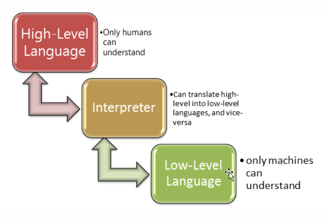

# 1 编程基础
&nbsp;&nbsp;&nbsp;&nbsp;&nbsp;&nbsp;&nbsp;&nbsp;计算机技术及编程技术可以追溯到好几十年前，心路历程并不丰顺，我们现在使用if就可以进行的条件判断也是经过了很久的演变，具体过程和详细概念这里不会全部覆盖，只表述一些需要的知识，更深层的知识，需要自行搜索。
## 1.1 基本概念
&nbsp;&nbsp;&nbsp;&nbsp;&nbsp;&nbsp;&nbsp;&nbsp;程序：是一组能让计算机识别和执行的指令。    
&nbsp;&nbsp;&nbsp;&nbsp;&nbsp;&nbsp;&nbsp;&nbsp;计算机五大部件：`输入设备`、`输出设备`、`运算器`、`控制器`、`存储器`，各部分主要作用：
- `运算器`：完成各种算数运算、逻辑运算、数据传输等数据加工处理
- `控制器`：控制程序的执行
- `存储器`：用于记忆程序和数据，例如内存
- `输入设备`：将数据或者程序输入到计算机中，例如鼠标、键盘
- `输出设备`：将数据或程序的处理结果展示给用户，例如显示器、打印机等    

&nbsp;&nbsp;&nbsp;&nbsp;&nbsp;&nbsp;&nbsp;&nbsp;__注：CPU有运算器和控制器组成，其中还有寄存器以及多级缓存，其中我们所熟知的L1、L2缓存是每个CPU核心独占的，而L3缓存则是所有核心共享的，缓存的速度依次降低，新版的CPU还会把北桥芯片集成在CPU中。__  
&nbsp;&nbsp;&nbsp;&nbsp;&nbsp;&nbsp;&nbsp;&nbsp;计算机语言:人与计算机之间交互的语言，机器语言、汇编语言等属于早期语言的代表，机器语言由一定位数组成的二进制0和1的序列组成，这中语言非常晦涩，难以理解，难以记录，而汇编语言则借助了一些助记符来替代机器指令，虽然好记了一点，但还是难以学习，后来经过时代的变迁，各大伟人的突出贡献，慢慢的针对不同场景的编程语言共同绽放。
## 1.2 语言分类
&nbsp;&nbsp;&nbsp;&nbsp;&nbsp;&nbsp;&nbsp;&nbsp;从距离机器和人类可读的两种方向，主要分为`低级语言`和`高级语言`。  
&nbsp;&nbsp;&nbsp;&nbsp;&nbsp;&nbsp;&nbsp;&nbsp;从运行方式来看又分为`编译型语言`和`解释型语言`。
- `低级语言`：面向的机器的语言，比如机器语言、汇编语言，不同的及其不能通用。
- `高级语言`：接近人类可读的自然和数字结合的计算机语言,由编译程序转换成机器指令来进行执行，我们只需要关注如何书写源程序，剩下编译的事情就交给编译器进行处理。
- `编译语言`：把代码转换成目标及其的CPU指令
- `解释语言`：解释后转换成字节码，运行在虚拟机上，解释器执行中间代码  

&nbsp;&nbsp;&nbsp;&nbsp;&nbsp;&nbsp;&nbsp;&nbsp;__语言越高级，越接近人类的自然语言和数学语言，越低级则越能让及其理解，高级语言和低级语言之间需要的一个转换的工具：编译器、解释器，例如C、C++等语言的源代码需要本地编译，而Java、Python、C#的源代码需要被解释器编译成中间代码，在虚拟机上运行__
 <div align="center"></div> 
## 1.3 高级语言的发展
&nbsp;&nbsp;&nbsp;&nbsp;&nbsp;&nbsp;&nbsp;&nbsp;高级语言根据发展历程主要分为四个阶段或者说是四种类型：`非结构化`、`结构化`、`面向对象`、`函数式`。
- `非结构化语言`:编号或标签、GOTO、子程序可以有多个入口和出口，有分支、循环。
- `结构化语言`：任何基本语句只允许是唯一入口和出口，有顺序、分支、循环、废弃GOTO
- `面向对象的语言`：更加接近人类认知世界的方式，万事万物抽象成对象，对象间关系抽象成类和继承。而类具有封装、继承、多态等特性
- `函数式语言`：属于一种古老的编程范式，应用在数据计算、并行处理等场景，在这种语言中，函数是'一等公民'，利用函数的特性，还有更高级的比如高阶函数等。
# 2 程序
&nbsp;&nbsp;&nbsp;&nbsp;&nbsp;&nbsp;&nbsp;&nbsp;什么是程序呢？一般我们所说的程序是：算法+数据结构。可以总结出如下特点：
1. 数据是一切程序的核心
2. 数据结构是数据在计算机中的类型和组织方式
3. 算法是处理数据的方式，算法有优劣之分  
# 3 python的语言介绍
&nbsp;&nbsp;&nbsp;&nbsp;&nbsp;&nbsp;&nbsp;&nbsp;Python是著名的“龟叔”Guido van Rossum在1989年圣诞节期间，为了打发无聊的圣诞节而编写的一个编程语言。  
&nbsp;&nbsp;&nbsp;&nbsp;&nbsp;&nbsp;&nbsp;&nbsp;和C语言相比：C语言适合开发那些追求运行速度、充分发挥硬件性能的程序。而Python是用来编写应用程序的高级编程语言。  
Python的优点：
- 为我们提供了非常完善的基础代码库，覆盖了网络、文件、GUI、数据库、文本等大量内容，被形象地称作“内置电池（batteries included）”。用Python开发，许多功能不必从零编写，直接使用现成的即可，除了内置的库外，Python还有大量的第三方库，也就是别人开发的，供你直接使用的东西。当然，如果你开发的代码通过很好的封装，也可以作为第三方库给别人使用。  

Python的缺点：
- 运行速度慢，和C程序相比非常慢，因为Python是解释型语言，你的代码在执行时会一行一行地翻译成CPU能理解的机器码，这个翻译过程非常耗时，所以很慢。而C程序是运行前直接编译成CPU能执行的机器码，所以非常快，但是大量的应用程序不需要这么快的运行速度，因为用户根本感觉不出来。
- 代码不能加密。如果要发布你的Python程序，实际上就是发布源代码，这一点跟C语言不同，C语言不用发布源代码，只需要把编译后的机器码（也就是你在Windows上常见的xxx.exe文件）发布出去。要从机器码反推出C代码是不可能的，所以，凡是编译型的语言，都没有这个问题，而解释型的语言，则必须把源码发布出去。  

另外`Python还是一种动态编译的、强类型的语言`，那么什么是动态语言，什么是强类型语言呢？
- `静态编译语言`：实现声明变量类型，类型不能再改变，编译时检查
- `动态编译语言`：不用事先声明类型，随时可以赋值为其他类型，但编程时不能准确确定是什么类型，很难推断
- `强类型语言`：不同类型之间操作，必须先强制类型转换为同一类 比如print(1+'a'),这种是无法执行的
- `弱类型语言`：不同类型间可以操作，自动隐士转换，比如javascript中Console
.log(1+'a')  


# 4 Python的解释器
&nbsp;&nbsp;&nbsp;&nbsp;&nbsp;&nbsp;&nbsp;&nbsp;Python这种高级语言需要编译成字节码然后由Python虚拟机(解释器)去执行的，针对解释器，有多种不同的版本。
- `官方的CPython`: C语言开发，最广泛的Python解释器
- `IPython`：一个交互式、功能增强的CPython
- `PyPy`：Python语言写的Python解释器，并且针对性的进行了优化，比如JIT技术，动态编译Python代码
- `Jpython`：Python的源码编译成Java的字节码，跑在JVM上
- `IronPython`：与Jpython类似运行再.Net平台上的解释器，Python代码被编译成.Net的字节码  

__&nbsp;&nbsp;&nbsp;&nbsp;&nbsp;&nbsp;&nbsp;&nbsp;虽然列举了这么多编译器，但是目前主流的还是官方提供的Cpython，但pypi由于使用Python语言编写，针对性的进行了许多优化，据说速度可以达到Cpython的10倍以上，建议后期可以研究一下__

# 5 Python版本区别
&nbsp;&nbsp;&nbsp;&nbsp;&nbsp;&nbsp;&nbsp;&nbsp;Python是很多Linux系统默认安装的语言，以Centos为例由于其yum包管理工具使用的是Python开发，所以其内置了Python2.x版本，但是Python目前已经发展到了3.7版本了，并且Python官方对2.x的支持也快到期，所以建议学习ython的3.x版本。  
&nbsp;&nbsp;&nbsp;&nbsp;&nbsp;&nbsp;&nbsp;&nbsp;Python 3.x的在本质上和Python 2.x有很大的变化，2.x的程序是不能直接在3.x的版本上运行的，它们的主要区别有：
- 语句函数化。例如`print`的打印，在3.x中是个函数，要打印的内容会被当作参数传递进入，而2.x中的含义是`print`语句打印元祖
- 整除。在3.x中，/为自然除，//为整除。2.x中/和//都为整除。
- `input`函数。3.x中把2.x中的`raw_input`舍去，功能合并到`input`函数中去。
- `round`函数。在3.x中的取整变为距离最近的偶数
- 字符串统一使用unicode。2.x中如果想要输入中文，还需要在文件头显示声明(`_*_coding:utf-8 _*_`)
- 异常的捕获、抛出的语法改变  
# 6 Python安装
&nbsp;&nbsp;&nbsp;&nbsp;&nbsp;&nbsp;&nbsp;&nbsp;windows安装，只需要访问 `https://www.python.org/` 
在`Downloads`标签页下选择windows，然后根据自己需求，下载对应的 `Windows x86-64 executable installer` 版本，一路`next`安装即可。注意：在安装程序中选择 `add to PATH` 哦。  
&nbsp;&nbsp;&nbsp;&nbsp;&nbsp;&nbsp;&nbsp;&nbsp;Linux的安装有yum和编译安装两种方式：
1. yum方式
```bash
[20:08:40 python@centos7 ~]$yum install -y python36
```
2. 编译安装
```bash
## 安装Python命令行退格键、HTTPS等依赖包(自由选择可以不装)
[20:10:12 root@centos7 Python-3.6.7rc2]#yum install -y readline readline-devel openssl-devel


# 下载Python源码包
[20:11:49 python@centos7 ~]$wget https://www.python.org/ftp/python/3.6.7/Python-3.6.7rc2.tgz -P /tmp
--2018-12-31 20:12:31--  https://www.python.org/ftp/python/3.6.7/Python-3.6.7rc2.tgz
Resolving www.python.org (www.python.org)... 151.101.72.223, 2a04:4e42:11::223
Connecting to www.python.org (www.python.org)|151.101.72.223|:443... connected.
HTTP request sent, awaiting response... 200 OK
Length: 22969389 (22M) [application/octet-stream]
Saving to: ‘/tmp/Python-3.6.7rc2.tgz’

100%[===========================================================================================================================================================================================>] 22,969,389   365KB/s   in 33s    

2018-12-31 20:13:04 (678 KB/s) - ‘/tmp/Python-3.6.7rc2.tgz’ saved [22969389/22969389]

[20:13:04 python@centos7 ~]$

# 解压文件
[20:14:17 root@centos7 tmp]#tar xf /tmp/Python-3.6.7rc2.tgz -C /usr/local/
[20:14:24 root@centos7 tmp]#cd /usr/local/
[20:14:27 root@centos7 local]#ls
bin  etc  games  include  lib  lib64  libexec  Python-3.6.7rc2  sbin  share  src
[20:16:28 root@centos7 local]#cd Python-3.6.7rc2/


# 执行编译配置检查
[20:17:20 root@centos7 local]#./configure  --with-ssl --prefix=/usr/local/python3

# 编译
[20:19:28 root@centos7 Python-3.6.7rc2]#make
 
# 安装
[20:20:28 root@centos7 Python-3.6.7rc2]#make install

# 环境变量配置(添加/usr/local/python3/bin 到 PATH 路径中)
[20:22:23 root@centos7 bin]#vim ~/.bash_profile 
  1 # .bash_profile
  2 
  3 # Get the aliases and functions
  4 if [ -f ~/.bashrc ]; then
  5         . ~/.bashrc
  6 fi
  7 
  8 # User specific environment and startup programs
  9 
 10 PATH=$PATH:$HOME/bin:/usr/local/python3/bin                                
 11 
 12 export PATH

 # 测试
[20:24:28 root@centos7 ~]#source .bash_profile 
[20:24:36 root@centos7 ~]#python36
bash: python36: command not found...
[20:24:40 root@centos7 ~]#python3
Python 3.6.7rc2 (default, Dec 31 2018, 20:20:36) 
[GCC 4.8.5 20150623 (Red Hat 4.8.5-36)] on linux
Type "help", "copyright", "credits" or "license" for more information.
>>> 

```
# 7 pyenv多版本管理
&nbsp;&nbsp;&nbsp;&nbsp;&nbsp;&nbsp;&nbsp;&nbsp;在很多工作的情况下，由于每个项目用的可能不是一个版本的Python，并且不同应用程序所以来的第三方程序包都不同，如何让多版本Python进行共存，并且保证每个项目依赖的第三方包
想要让多个Python版本共存，我们想到的方法有如下两种：
- 编译安装新版本至某一个路径
- 多版本python管理工具  

&nbsp;&nbsp;&nbsp;&nbsp;&nbsp;&nbsp;&nbsp;&nbsp;__如果每添加一个新的Python版本就编译一次的话，大大增加了环境切换的成本，并且还需要区分命令(python3.5, python 2.7)等等，所以就凸显出了多版本管理工具的优点__
## 7.1 pyenv介绍及安装
&nbsp;&nbsp;&nbsp;&nbsp;&nbsp;&nbsp;&nbsp;&nbsp;pyenv是一个多版本Python管理工具，它可以帮我们安装想要的Python版本，并且可以一键切换，属于现在比较流行的工具。pyenv是一个开源的项目，其代码托管在github上，我们可以访问它的github站点来根据install的步骤进行安装。pyenv的github地址：`https://github.com/pyenv/pyenv`
__pyenv官方还提供了便捷的安装方式，它的项目地址是：`https://github.com/pyenv/pyenv-installer`，仅需要简单几步就可以完成安装，下面以这种方式进行说明。__

__下面的步骤已在CentOS 6.7上测试，并安装成功__
1. 安装依赖的包(由于pyenv默认使用编译的方式安装Python，所以它需要的依赖包需要提前安装)
```bash
[root@Python ~]# yum install -y gcc make patch gdbm-devel openssl-devel sqlite-devel readline-devel zlib-devel bzip2-devel
```
2. 安装GIT(由于pyenv-installer中调用git使用clone的方式拉拉取pyenv的代码，所以这里需要进行安装)
```bash
[root@Python ~]# yum install -y git
```
3. 安装Pyenv
```bash
# 执行如下命令安装pyenv
[root@Python ~]# curl -L https://github.com/pyenv/pyenv-installer/raw/master/bin/pyenv-installer | bash

# 这里建议使用普通用户进行安装
# 如果遇到 curl: (35) SSL connect error ，尝试更新nss，如果问题依旧，尝试更新curl
[python@Python ~]# yum update nss
[python@Python ~]# yum update curl
```
4. 修改环境变量
```bash
[root@Python ~]# vim /etc/profile.d/pyenv.sh
#!/bin/bash
# Define environment variable
export PYENV_ROOT="$HOME/.pyenv"
export PATH="$PYENV_ROOT/bin:$PATH"
eval "$(pyenv init -)"
  
[root@Python~]# source /etc/profile.d/pyenv.sh
# PS：这里直接更新了/etc/profile.d，如果是单个用户安装并使用，建议添加到用户家目录中的profile文件中去
```
5. 验证
```bash
[root@Python ~]# pyenv version
system (set by /root/.pyenv/version)  # 表示当前使用的是系统的Python版本
```
6. pyenv命令
```bash
pyenv -h                # 即可列出命令信息
pyenv install -l        # 列出安装的版本信息
pyenv install 3.3.5     # 即可安装
pyenv versions          # 查看系统python版本（pyenv install 安装的版本都可以在这里看到）
pyenv global 3.3.5      # 切换Python默认版本为3.3.5
pyenv local 3.3.5       # 切换当前目录下的Python版本为3.3.5(和目录绑定,子目录继承环境设定)
pyenv shell 3.3.5       # 仅仅针对当前shell环境(会话级别)
```
7. 离线安装python版本  
&nbsp;&nbsp;&nbsp;&nbsp;&nbsp;&nbsp;&nbsp;&nbsp;通过 `pyenv install 3.5.3` 进行安装时，它会联网下载 `Python 3.5.3` 的源码包，如果机器不能上网的话，可以采用离线的方式,预先下载号Python 要安装的Python的版本包（注意需要`gz,xz,bz`，三种格式都需要) 在pyenv的安装目录下，一般在用户的家目录下`.pyenv`目录中，进入后新建子目录cache，然后把三个包考进去即可，然后再次执行 `pyenv install 3.5.3` 即可
```bash
[root@Python ~]$ cd .pyenv
[root@Python ~]$ mkdir cache
[root@Python ~]$ rz    # 上传三个下载好的Python包
[root@Python ~]$ pyenv install 3.5.3
```
## 7.2 virtualenv
&nbsp;&nbsp;&nbsp;&nbsp;&nbsp;&nbsp;&nbsp;&nbsp;当多个项目公用一台主机的时候，就会产生很多问题，当你的项目和其他人的项目共用python 3.5.3时，假如每个项目都安装了很多依赖包，你如何区分哪些包是你的项目需要的？这时virtualenv就很重要了，它可以在pyenv的环境中，再造一个虚拟环境，这个环境是基于pyenv中管理的某个主环境，派生出来的独立子环境，你对virtualenv进行的操作，和其他的virtualenv没有任何关联。
```bash
 # 创建一个virtualenv环境，名字为daxin，基于pyenv管理的3.5.3版本
[python@localhost .pip]$ pyenv virtualenv 3.5.3 daxin     
[python@localhost .pip]$ pyenv versions
* system (set by /home/python/.pyenv/version)
3.5.3
3.5.3/envs/daxin
daxin

# 这时，我们再对某个项目进行切换时，如下
[python@localhost .pip]$ pyenv versions
* system (set by /home/python/.pyenv/version)
  3.5.3
  3.5.3/envs/dachenzi
  3.5.3/envs/daxin
  dachenzi
  daxin
 
[python@localhost ~]$ mkdir cmdb
[python@localhost ~]$ cd cmdb
[python@localhost cmdb]$ pyenv local daxin
(daxin) [python@localhost cmdb]$ ls                # 最前面多了个virtualenv环境的名称
# 这样我们就可以放心的安装和下载依赖包了，
```
## 7.3 导出项目依赖包
&nbsp;&nbsp;&nbsp;&nbsp;&nbsp;&nbsp;&nbsp;&nbsp;如果某一天我要导出我当前环境安装的所有依赖包，该怎么办呢？Python已经提供了一个工具，供我们导出当前Python版本安装的所有依赖包及名称，它就是pip命令(python 3.x中已经内置该命令),使用它的`freeze`参数即可。
```bash
# 使用freeze可以直接导出当前安装的依赖包以及
(daxin) [python@localhost cmdb]$ pip freeze > requirement.txt    对应的版本
(daxin) [python@localhost cmdb]$ cat requirement.txt
backcall==0.1.0
decorator==4.3.0
ipython==7.1.1
ipython-genutils==0.2.0
jedi==0.13.1
parso==0.3.1
pexpect==4.6.0
pickleshare==0.7.5
prompt-toolkit==2.0.7
ptyprocess==0.6.0
Pygments==2.2.0
six==1.11.0
traitlets==4.3.2
wcwidth==0.1.7
```
&nbsp;&nbsp;&nbsp;&nbsp;&nbsp;&nbsp;&nbsp;&nbsp;__注意：再新的项目中，只需要使用` pip install -r requirement.txt` 即可，让pip按照requirement.txt文件中标识的包和版本进行安装了。__
## 7.4 pyenv安装位置　
&nbsp;&nbsp;&nbsp;&nbsp;&nbsp;&nbsp;&nbsp;&nbsp;virtualenv创建的虚拟环境都存放在`pyenv`安装目录的`versions`下
```bash
[python@localhost versions]$ pwd
/home/python/.pyenv/versions
[python@localhost versions]$ ll
total 4
drwxr-xr-x. 7 python python 4096 Nov  3 18:07 3.5.3
lrwxrwxrwx. 1 python python   48 Nov  3 18:12 dachenzi -> /home/python/.pyenv/versions/3.5.3/envs/dachenzi
lrwxrwxrwx. 1 python python   45 Nov  3 18:07 daxin -> /home/python/.pyenv/versions/3.5.3/envs/daxin
[python@localhost versions]$
```
&nbsp;&nbsp;&nbsp;&nbsp;&nbsp;&nbsp;&nbsp;&nbsp;而你在`virtualenv`中安装的包，则存放在`virtualenv`环境中对应的`situ-package`目录下
```bash
[python@localhost site-packages]$ pwd
/home/python/.pyenv/versions/3.5.3/envs/daxin/lib/python3.5/site-packages
[python@localhost site-packages]$ ls
backcall                          parso-0.3.1.dist-info           __pycache__
backcall-0.1.0-py3.5.egg-info     pexpect                         pygments
decorator-4.3.0.dist-info         pexpect-4.6.0.dist-info         Pygments-2.2.0.dist-info
decorator.py                      pickleshare-0.7.5.dist-info     setuptools
easy_install.py                   pickleshare.py                  setuptools-28.8.0.dist-info
IPython                           pip                             six-1.11.0.dist-info
ipython-7.1.1.dist-info           pip-18.1.dist-info              six.py
ipython_genutils                  pkg_resources                   traitlets
ipython_genutils-0.2.0.dist-info  prompt_toolkit                  traitlets-4.3.2.dist-info
jedi                              prompt_toolkit-2.0.7.dist-info  wcwidth
jedi-0.13.1.dist-info             ptyprocess                      wcwidth-0.1.7.dist-info
parso                             ptyprocess-0.6.0.dist-info
[python@localhost site-packages]$
```
# 8 pip命令
&nbsp;&nbsp;&nbsp;&nbsp;&nbsp;&nbsp;&nbsp;&nbsp;pip命令对应Python来说，就像Yum和CentOS的关系，它是Python的包管理工具，我们可以使用pip命令安装几乎所有的Python第三方包。
## 8.1 命令说明
```bash
(daxin353) [21:01:10 python@centos7 cmdb]$pip -h

Usage:   
  pip <command> [options]

Commands:
  install                    # 安装第三方包
  download                   # 下载第三方包
  uninstall                  # 卸载第三方包
  freeze                     # 输出包的名称还版本信息，可以重定向到文件中去
  list                       # 显示已安装的第三方包
  show                       # 显示安装包信息
  search                     # 在Pypi库中查找第三方包
  help                       # 查看帮助信息

General Options:
  -h, --help                 # 显示帮助
  -v, --verbose              # 显示详细信息
  -V, --version              # 显示版本信息
  -q, --quiet                # 安静模式,不输出任何提示信息
  --log <path>               # 把输出信息追加log文件中
  --proxy <proxy>            # 使用代理，格式为： [user:passwd@]proxy.server:port.
  --retries <retries>        # 最大连接失败重试次数，默认5次
  --timeout <sec>            # 设置最大超时时间，默认是15秒
  --cache-dir <dir>          # 指定缓存目录
  --no-cache-dir             # 禁用缓存
(daxin353) [21:01:16 python@centos7 cmdb]$

```
## 8.2 配置说明
&nbsp;&nbsp;&nbsp;&nbsp;&nbsp;&nbsp;&nbsp;&nbsp;pip命名默认是从Python官方提供的Pypi仓库进行第三方软件包，由于官方源在国外，访问速度可能会很慢，我们可以把Pypi源换成国内的阿里源，来增加访问速度。 配置起来也很简单，只需要新增pip的配置文件，指定源为阿里源即可。 
- 创建pip配置文件
```bash
[21:14:53 python@centos7 ~]$mkdir ~/.pip
[21:15:21 python@centos7 ~]$cd .pip
[21:15:23 python@centos7 .pip]$vim pip.conf 
   [global]                  # 全局配置段
   index-url=https://mirrors.aliyun.com/pypi/simple/     # pypi仓库地址
   trusted-host=mirrors.aliyun.com            # 信任主机(防止https输出烦人的信息)
```
# 9 pycharm安装及基本使用
请参考博文: http://www.cnblogs.com/dachenzi/articles/7684064.html , 安装过程中遇到的问题，欢迎邮件咨询 beyondlee2011@126.com 
