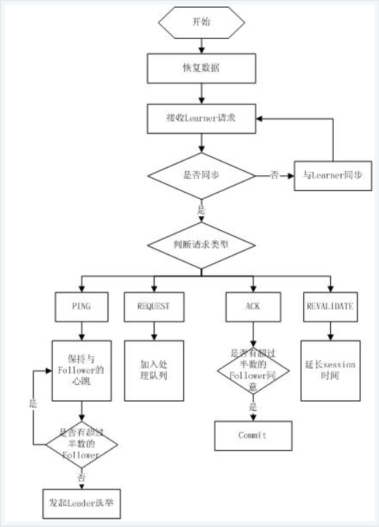

# 1 zookeeper
&nbsp;&nbsp;&nbsp;&nbsp;&nbsp;&nbsp;&nbsp;&nbsp;zookeeper分布式服务框架是apache hadoop的一个子项目，主要是用来解决分布式应用中经常遇到的一些数据管理问题，如集群管理、统一命名服务、分布式配置管理、分布式消息队列、分布式锁、分布式协调通知等。

# 2 应用场景
&nbsp;&nbsp;&nbsp;&nbsp;&nbsp;&nbsp;&nbsp;&nbsp;越来越多的分布式计算开始强依赖zookeeper 比如 storm（流计算），Hbase。zookeeper对分布式开发带来了许多便利，利用zookeeper的独有得特性巧妙的解决了很多难题，很多分布式技术用到了zookeeper或多或少的特性，尤其是新生代分布式技术都会依赖zookeeper特性，如Hbase，storm。

# 3 zookeeper的体系架构
&nbsp;&nbsp;&nbsp;&nbsp;&nbsp;&nbsp;&nbsp;&nbsp;server端集群架构（leader及follower）每个集群仅选出一个leader，其他zk节点均为follower，具有fast fail特性（leader失效，快速在剩下的follower中竞选leader），非常健壮，无单点，不超过半数Server挂掉不影响提供服务（所以建议zookeeper的节点个数为奇数个，比如zk节点为4个，那么挂两个节点，整个集群就会失效，而5个的话，挂3个才会失效），采用master/Slave模式


# 4 zookeeper的工作原理
&nbsp;&nbsp;&nbsp;&nbsp;&nbsp;&nbsp;&nbsp;&nbsp;zookeeper和核心是原子广播，这个机制保证了各个server之间的同步。实现这个机制的协议叫做zab协议。zab协议有两种模式，分别使用的是`恢复模式（选主）`和`广播模式（同步）`。当服务启动或者在领导者崩溃后，zab就进入了恢复模式，当领导者被选举出来，且大多数Server完成了和leader的状态同步以后，恢复模式就结束了。状态同步保证了leader和Server具有相同的系统状态。  
&nbsp;&nbsp;&nbsp;&nbsp;&nbsp;&nbsp;&nbsp;&nbsp;为保证事务的顺序一致性，zookeeper采用了递增的事务id号(zxid)来标识事务。所有的协议(请求)都在被提出的时候加上了zxid。zxid是一个64位的数字，它的高32位是epoch用来表示leader关系是否改变，每次一个leader被选举出来，它都会有一个新的epoch，标识当前属于那个leader的统治时期。低32位用于递增计数。简单来说：高32位就是标识当前系统的leader的，低32位就是当前环境下zxid的计数
每个Server在工作过程中有三种状态：
1. LOOKING：当前Server不知道leader是谁，正在搜寻
2. LEADING：当前Server即为选举出来的leader
3. FOLLOWING：leader已经选举出来，当前Server与之同步

## 4.1 选主流程
&nbsp;&nbsp;&nbsp;&nbsp;&nbsp;&nbsp;&nbsp;&nbsp;当leader崩溃或者服务刚刚启动时，这时zk进入恢复模式，恢复模式需要重新选举出一个新的leader，让所有的Server都恢复到一个正确的状态。zk的选举算法有两种：一种是基于basic paxos实现的，另外一种是基于fast paxos算法实现的。系统默认的选举算法为fast paxos。流程如下；


1. 选举线程由当前Server发起选举的线程担任，其主要功能是对投票结果进行统计，并选出推荐的Server；
2. 选举线程首先向所有Server节点发起一次询问（包括自己）；
3. 选举线程收到回复后，验证是否是自己发起的讯问（验证zxid是否一致），然后获取对方的id（myid），并存储到当前询问对象列表中，最后堆取对方提出的leader相关信息（id，zxid）并将这些信息存储到当次选举的投票记录表中；
4. 收到所有Server回复后，就计算出zxid最大的那个Server，并将这个Server相关信息设置成下一次要投票的Server；
5. 线程将当前zxid最大的Server设置为当前Server要推荐的Leader，如果此时获胜的Server获得n/2+1的Server票数，就设置当前推荐的leader为获胜的Server，将根据获胜的Server相关信息设置自己的状态，否则，继续这个过程，直到leader被选举出来。
6. 要使Leader获得多数Server的支持，则Server的总数必须是奇数（2n+1），且存活的Server数目不得少于n+1

每个Server启动都会重复以上流程。在恢复模式下，如果是刚存崩溃状态恢复的或者刚启动的Server还会从磁盘快照中恢复数据和会话消息，zk会记录事务日志并定期进行快照，方便在恢复时期进行状态恢复。选主流程图如下：

>原理简单来说，就是要选举leader，会生成一个zxid，然后分发给所有的server（所以这里一台server可以接受多台server给他发送要选举leader的请求），然后各个server根据发送给自己的zxid，选择一个值最大的，然后将这个选择返回给发送这个zxid的server，只要这个server收到的答复大于等于2/n+1个（也就是超过半数的同意票），则表明自己当选为leader，然后会向所有server广播自己已经成为leader。

## 4.2 同步流程
选举完leader以后，zk就进入了状态同步过程。
1. leader等待server链接
2. follower链接leader，将最大的zxid发送给leader
3. leader根据follower的zxid确定同步点
4. 完成同步后通知follower已经成为`up to date`状态
5. follower收到uptodate消息后，就可以接受client的请求进行服务了。


## 4.3 角色与工作流程

角色|功能
---|---|
Leader|负责投票的发起和决议，更新系统状态。Leader数据是最新的、最权威的。
Follower|接受客户端读请求并返回结果，写请求转给Leader。参与选主投票
Observer|接受客户端读请求并返回结果，写请求发给Leader。不参与投票。扩展节点，减轻读压力
Client|读写请求的发起方

### 4.3.1 leader的工作流程
leader主要有三个功能
1. 恢复数据
2. 维持与Learner的心跳，
3. learner的消息类型主要有ping消息、request消息、ack消息、revalidate消息.



根据不同的消息类型进行不同的处理
- `ping消息`：指learner的心跳消息。
- `request消息`：是follower发送的提议消息。（包括写请求与同步请求）
- `ack消息`：是follower对提议的回复，超过半数的follower通过，则commit该提议。
- `revalidate消息`：是用来延长session有效时间的。

### 4.3.2 follower工作流程
follower主要有四个功能
1. 向leader发送请求(ping消息、request消息、ack消息、revalidate消息）
2. 接受leader的消息并处理
3. 接受client的请求，如果为写请求，发送给leader进行投票
4. 返回client结果

follower的消息循环处理如下集成来自leader的消息
- ping消息：心跳消息
- proposal消息：leader发起的提案，要求follower投票；
- commit消息：服务器端最新一次提案的消息：
- uptodate消息：表明同步完成；
- revalidate消息：根据leader的revalidate结果，关闭带revalidate的session还是允许其接收消息；
- sync消息：返回sync结果到客户端，这个消息最初由客户端发起，用来强制道德最新的更新；

follower的工作流程简图如下所示，在实际实现中，follower是通过5个线程来实现的


对于observer的流程不再叙述，observer流程和Follower的唯一不同的地方就是observer不会参加leader发起的投票。
资料来源：http://cailin.iteye.com/blog/2014486/
http://www.ibm.com/developerworks/cn/opensource/os-cn-zookeeper/

# 5 安装
(建议在Linux/Mac下运行)

软件需求：需要安装jdk，1.8+ 以上。

下载zookeeper软件包：http://zookeeper.apache.org/releases.htm

安装方式：解压就可以使用，建议配置一下JAVA_HOME变量

yum安装的jdk一般存放在/usr/java下
```python
# vim /etc/profile.d/jdk.sh 
export JAVA_HOME=/usr/java/default 
export PATH=$JAVA_HOME/bin:$PATH
```

# 6 配置文件
conf目录下为zookeeper的配置文件，默认zookeeper提供了一个simple文件，我们可以根据它来定制我们自己的配置文件.
```bash
cp zoo_simple.cfg zoo.cfg
```
一个基本的zoo.cfg文件为：
```python
tickTime=2000
initLimit=10
syncLimit=5
dataDir=/tmp/zookeeper
dataLogDir=/tmp/zookeeper/log
clientPort=2181

# 集群配置部分
server.1=10.0.0.10:2887:3887
server.2=10.0.0.10:2888:3888
server.3=10.0.0.10:2889:3889
```

配置项目|含义|
|------|-----|
clientPort|客户端通信端口
dataDir|zk的数据目录，持久化内存数据的目录，快照
dataLogDir|顺序日志存储目录
tickTime|滴答声，以后凡是用到时间都是以这个时间间隔tick为单位，本例中，设定时 间1个tick是2000毫秒
initLimit=10|Follower到Leader初始化连接的忍受的最长时间间隔，2000ms*10=20s 
syncLimit=5|Follower和Leader之间通信，请求和应答的时间上限为5个tick间隔
server.1=nodex:2887:3887|server.x，x是每一个server的myid nodex必须是每一个主机都能解析的主机名，可以用ip <br>2887，Follower和Leader之间通信端口 <br>3887，选举用端口

## 6.1 myid
集群模式下，需要配置myid文件，它存放在对应节点的data目录下，名字为myid，如果集群无法启动，请确认该文件是否存在


## 6.2 启动模式
主要分为两种模式：
- 单机模式：单节点单进程跑
- 集群模式
    - 伪集群：单节点跑多个进程
    - 真集群：多节点跑

建议使用多节点，可靠性更高

# 7 基本操作
配置zookeeper目录下的bin目录，到PATH中，可以方便的直接使用bin下面的命令，否则只能使用绝对路径了。
使用zkCli.sh连接zookeeper，常用参数
- `timeout`：当前会话的超时时间，zookeper依靠与客户端的心跳来判断会话是否有效，单位是毫秒
- `r`： 只读模式，zookeeper的只读模式指一个服务器与集群中过半机器失去连接以后，这个服务器就不在不处理客户端的请求，但我们仍然希望该服务器可以提供读服务。
- `server`：zookeeper服务器ip地址和端口号

## 7.1 结构
Zk是一种树型层次目录结构数据模型。每个节点称作ZNode。每一个节点ZNode可以包含数据和子节点(Ephemeral类型节点不能有子节点)。
ZNode有2种类型:
- Ephemeral临时的:临时节点是会话级的，会话结束时节点会被自动删除，不能有子节点。
- Persistent持久的:持久节点可以长期保存数据。 
    - Sequential节点：这种节点是顺序节点

组合使用生成4种形式节点：

类型|说明
---|----|
PERSISTENT|create 持久节点
EPHEMERAL|create -e /test/epath e，客户端断开，节点就消失了
PERSISTENT_SEQUENTIAL|create -s /test/spath s，连续执行几次看看效果
EPHEMERAL_SEQUENTIAL|create -e -s /test/spath s


## 7.2 命令行操作
下面是常用操作：
```python
ls 查看节点
    ls path [watch]
ls2 查看节点和信息 
    ls2 path [watch]
get 获取节点的信息 
    get path [watch]
create 创建path，设置数据
    create [-s] [-e] path data acl 
delete 删除path
    delete path [version]
```
- -s 表示数据类型为序列
- -e 表示数据为临时数据(绑定owner节点，当owner断开时，对应配置消失)

> create的时候必须指定节点属性，当节点没有属性时，可以使用create /data []

下面是基础命令操作：
```bash
[zk: 127.0.0.1:2182(CONNECTED) 16] create /name data
Created /name
[zk: 127.0.0.1:2182(CONNECTED) 17] ls /name
[]
[zk: 127.0.0.1:2182(CONNECTED) 18] get /name
data
cZxid = 0x30000003c
ctime = Sun Apr 14 18:41:47 CST 2019
mZxid = 0x30000003c
mtime = Sun Apr 14 18:41:47 CST 2019
pZxid = 0x30000003c
cversion = 0
dataVersion = 0
aclVersion = 0
ephemeralOwner = 0x0
dataLength = 4
numChildren = 0
[zk: 127.0.0.1:2182(CONNECTED) 20] create -s /name/habby lanqiu
Created /name/habby0000000000
[zk: 127.0.0.1:2182(CONNECTED) 21] create -s /name/habby zuqiu
Created /name/habby0000000001
[zk: 127.0.0.1:2182(CONNECTED) 24] ls /name
[habby0000000001, habby0000000000]  # 序列类型
[zk: 127.0.0.1:2182(CONNECTED) 25] get /name/habby0000000001
zuqiu
cZxid = 0x30000003e
ctime = Sun Apr 14 18:43:04 CST 2019
mZxid = 0x30000003e
mtime = Sun Apr 14 18:43:04 CST 2019
pZxid = 0x30000003e
cversion = 0
dataVersion = 0
aclVersion = 0
ephemeralOwner = 0x0
dataLength = 5
numChildren = 0
[zk: 127.0.0.1:2182(CONNECTED) 26]

[zk: 127.0.0.1:2182(CONNECTED) 44] create -e -s /data/agent 10.0.0.10
Created /data/agent0000000000
[zk: 127.0.0.1:2182(CONNECTED) 45] get /data/agent0000000000
10.0.0.10
cZxid = 0x300000048
ctime = Sun Apr 14 18:55:05 CST 2019
mZxid = 0x300000048
mtime = Sun Apr 14 18:55:05 CST 2019
pZxid = 0x300000048
cversion = 0
dataVersion = 0
aclVersion = 0
ephemeralOwner = 0x2000b1cd6260006   # 当前session id，退出时，当前配置失效
dataLength = 9
numChildren = 0
```

PS：利用zookeeper的这种特性，我们的分布式应用心跳可以通过zookeeper来做，agent可以使用-e的方式来zookeeper中注册，当agent失效时，那么zookeeper中的相关配置就会被剔除，此时agent失效。

# 8 Python操作zookeeper
利用kazoo库，来操作zookeeper，使用pip安装即可。
```python
from kazoo.client import KazooClient

zk = KazooClient(hosts='10.0.0.10:2181')
zk.start()

## 新增
zk.create('/name', 'daxin'.encode('utf-8'))  # create /name daxin
zk.ensure_path('/name1')  # 确保/name1存在，不存在创建(递归创建)
zk.create('/cmdb/agent/10.0.0.10', 'nginx'.encode('utf-8'), sequence=True, ephemeral=True)  # create -e -s /cmdb/agent/10.0.0.10 nginx

## 获取
data = zk.get('/name')  # get /name
datas = zk.get_children('/name') # ls /name

## 修改
zk.set('/name','helloworld'.encode('utf-8'))  # 修改数据

## 删除
zk.delete('/name')  # delete /name , 不存在，异常

## 其他判断
zk.exists('/name')   # 判断/name 是否存在，不存在返回None，存在返回对应的ZnodeStat对象

zk.close()
```

## 8.1 watcher
可以在get、get_children、exists方法上。当这些get、exists方法调用时，将watcher挂在节点上，如果节点改变或被删除，触发watcher。注意，`该节点事件触发一次`

```python
from kazoo.client import KazooClient

zk = KazooClient(hosts='10.0.0.10:2181')
zk.start()

def watcher(event):
    print('-->',event)  # (WatchedEvent(type='CHANGED', state='CONNECTED', path='/name'),)


data = zk.get('/name',watch=watcher)
print(data)
data = zk.set('/name','daxin'.encode('utf-8'))
print(data)
data = zk.set('/name','dachenzi'.encode('utf-8'))
print(data)


########
from kazoo.client import KazooClient
from kazoo.protocol.states import ZnodeStat
zk = KazooClient(hosts='10.0.0.10:2181')
zk.start()

def watcher(*args):
    print('-->',args)  # (WatchedEvent(type='CHANGED', state='CONNECTED', path='/name'),)

zk.create('/names')
data = zk.exists('/names',watch=watcher)
print(data)
data = zk.delete('/names')  # 触发一次
print(data)
```
仅仅在第一次执行set的时，触发了watcher函数

## 8.2 高级API
一般情况下watcher只在该节点上触发一次，kazoo提供了装饰器实现多次触发
- DataWatch()
- ChildrenWatch()

```python
from kazoo.client import KazooClient
from kazoo.protocol.states import ZnodeStat

zk = KazooClient(hosts='10.0.0.10:2181')
zk.start()


@zk.DataWatch('/name')
def watcher(*args):
    print(args)
    print('-'*30)


zk.set('/name','123'.encode('utf-8'))  每次触发都会执行
zk.set('/name','123'.encode('utf-8'))
zk.set('/name','123'.encode('utf-8'))
zk.set('/name','123'.encode('utf-8'))
zk.set('/name','123'.encode('utf-8'))
```
