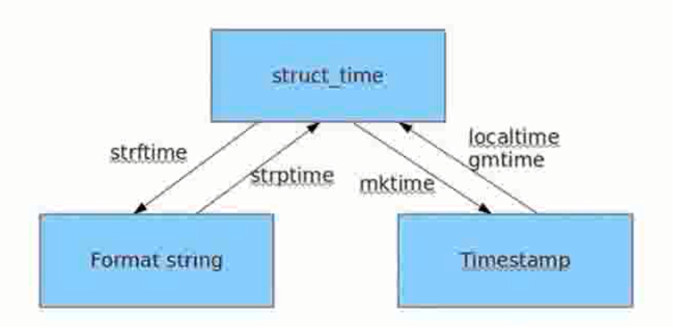

<font size=5 face='微软雅黑'>__文章目录__</font>
<!-- TOC -->

- [1 时间](#1-时间)
- [2 datetime模块](#2-datetime模块)
    - [2.1 获取当前日期和时间](#21-获取当前日期和时间)
    - [2.2 获取指定日期和时间](#22-获取指定日期和时间)
    - [2.3 datetime转换为timestamp](#23-datetime转换为timestamp)
    - [2.4 timestamp转换为datetime](#24-timestamp转换为datetime)
    - [2.5 str转换为datetime](#25-str转换为datetime)
    - [2.6 datetime转换为str](#26-datetime转换为str)
    - [2.7 datetime加减](#27-datetime加减)
- [3 time模块](#3-time模块)

<!-- /TOC -->

---
# 1 时间
&nbsp;&nbsp;&nbsp;&nbsp;&nbsp;&nbsp;&nbsp;&nbsp;在我们日常写代码的过程中很多时候会用到时间，比如：输出当前时间，计算程序的运行时间，让程序休息一定的时间然后再做某些事情等等，Python内置了不少用于计算和输出时间的模块，最常用的是`time`模块和`datetime`模块。在Python 3中建议使用`datetime模块`。
# 2 datetime模块
&nbsp;&nbsp;&nbsp;&nbsp;&nbsp;&nbsp;&nbsp;&nbsp;datetime是Python标准库中用于处理时间的模块，是date模块和time模块的合集。它在内部提供了多种类，用于处理不同场景下的时间需求。
```python
class datetime.date : 日期类，包含year，month 和 day等
class datetime.time : 时间类，包含hour，minute，second，microsecound 和 tzinfo等
class datetime.datetime : 日期和时间的组合
class datetime.timedelta : 表示两个日期、时间或日期时间实例到微秒分辨率之间的差异。
class datetime.tzinfo : 时区信息对象的抽象基类
class datetime.timezone : 根据tzinfo组合UTC时间的类(UTC时间基类)
```
> 常用的是`datetime.datetime`类和`datetime.timedelta`类，其他类可以不关注
## 2.1 获取当前日期和时间
通过datetime模块我们可以方便的获取当前的时间
```python
In [100]: import datetime    # 导入时间模块                  
In [101]: now = datetime.datetime.now()       # 创建一个基于当前时间的datetime.datetime对象 
In [102]: print(now)          # 打印出了当前时间，类的__str__方法用于实现在打印这个对象时要进行的操作                 
2019-01-10 08:37:30.272250
In [103]: print(type(now))                    
<class 'datetime.datetime'>
In [104]:  
```
## 2.2 获取指定日期和时间
要指定某个日期和时间，我们直接用参数构造一个datetime
```python
In [104]: import datetime                      
In [105]: dt = datetime.datetime(2019,1,10,17,50,20)                                                                                   
In [106]: dt                                   
Out[106]: datetime.datetime(2019, 1, 10, 17, 50, 20)
In [107]: print(dt)                            
2019-01-10 17:50:20
```
## 2.3 datetime转换为timestamp
&nbsp;&nbsp;&nbsp;&nbsp;&nbsp;&nbsp;&nbsp;&nbsp;在计算机中，时间并不是以我们平时看到的某年某月那种形式存储的，实际上是用一串纯数字表示的。我们把这一串数字叫做时间戳(timestamp)，时间戳是指格林威治时间1970年01月01日00时00分00秒(北京时间1970年01月01日08时00分00秒)起至现在的总秒数(1970年以前的时间timestamp为负数)。

> 格林威治时间: timestamp = 0 = 1970-1-1 00:00:00 UTC+0:00  
> 北京时间(东八区): timestamp = 0 = 1970-1-1 08:00:00 UTC+8:00  

&nbsp;&nbsp;&nbsp;&nbsp;&nbsp;&nbsp;&nbsp;&nbsp;可见timestamp的值与时区毫无关系，因为timestamp一旦确定，其UTC时间就确定了，转换到任意时区的时间也是完全确定的，这就是为什么计算机存储的当前时间是以timestamp表示的，因为全球各地的计算机在任意时刻的timestamp都是完全相同的(假定时间已校准),把一个datetime类型转换为timestamp只需要简单调用`datetime对象`的`timestamp()`方法：
```python
In [108]: dt                                   
Out[108]: datetime.datetime(2019, 1, 10, 17, 50, 20)    
In [109]: dt.timestamp()                       # 已知的datetime.datetime对象                                                                               
Out[109]: 1547113820.0
In [111]: datetime.datetime.now().timestamp()       # 当前时间的timestamp                                                                                   
Out[111]: 1547086655.785918
```
>注意:Python的timestamp是一个浮点数。如果有小数位，小数位表示毫秒数。（某些编程语言（如Java和JavaScript）的timestamp使用整数表示毫秒数，这种情况下只需要把timestamp除以1000就得到Python的浮点表示方法。）
## 2.4 timestamp转换为datetime
要把timestamp转换为datetime，使用`datetime对象`提供的`fromtimestamp()`方法：
```python
In [112]: now = datetime.datetime.now().timestamp()                                                                                    
In [113]: now                                  
Out[113]: 1547086789.775884
In [114]: datetime.datetime.fromtimestamp(now) 
Out[114]: datetime.datetime(2019, 1, 10, 10, 19, 49, 775884) 
```
> 注意到timestamp是一个浮点数，它没有时区的概念，而datetime是有时区的。上述转换是在timestamp和本地时间做转换。  

&nbsp;&nbsp;&nbsp;&nbsp;&nbsp;&nbsp;&nbsp;&nbsp;本地时间是指当前操作系统设定的时区。例如北京时区是东8区，则本地时间：2018-07-09 16:43:15.430684,实际上就是UTC+8:00时区的时间：2018-07-09 16:43:15.430684,而此刻的格林威治标准时间与北京时间差了8小时，也就是UTC+0:00时区的时间应该是：2018-07-09 08:43:15.430684。timestamp也可以直接被转换到UTC标准时区的时间：
```python
In [1]: import datetime                        
In [2]: now = datetime.datetime.now()          
In [3]: now = datetime.datetime.now().timestamp()                                                                                      
In [4]: datetime.datetime.utcfromtimestamp(now)     # 本地时间转换为UTC时间                                                                                   
Out[4]: datetime.datetime(2019, 1, 10, 11, 26, 53, 174167)
In [5]: datetime.datetime.fromtimestamp(now)        # 本地时间，北京为东八区，所以快8小时                                                                                   
Out[5]: datetime.datetime(2019, 1, 10, 19, 26, 53, 174167)
```
## 2.5 str转换为datetime
&nbsp;&nbsp;&nbsp;&nbsp;&nbsp;&nbsp;&nbsp;&nbsp;很多时候，用户输入的日期和时间是字符串，要处理日期和时间，首先必须把str转换为datetime。转换方法是通过`datetime对象`的`strptime()`实现，需要一个日期和时间的格式化字符串：
```python
In [7]: datetime.datetime.strptime('2018-07-09 16:43:15','%Y-%m-%d %H:%M:%S')    # 第一个参数为时间的字符串格式，二个参数告诉strptime按照那种对照方式进行解析                                                      
Out[7]: datetime.datetime(2018, 7, 9, 16, 43, 15)

字符串'%Y-%m-%d %H:%M:%S'规定了日期和时间部分的格式。
```
- %Y: 表示4位的年份
- %y: 表示2位的年份
- %m：表示月份
- %d：表示几号
- %H: 表示小时
- %M: 表示分钟
- %S：表示秒  

__在字符串的format方法中，这些标识符是通用的，代表一个含义。__
>注意转换后的datetime是没有时区信息的。
```python
In [8]: now = datetime.datetime.now()                                                    
In [9]: '{:%Y-%m-%d %H:%M:%S}'.format(now)     
Out[9]: '2019-01-10 19:33:55'
```
## 2.6 datetime转换为str
&nbsp;&nbsp;&nbsp;&nbsp;&nbsp;&nbsp;&nbsp;&nbsp;如果已经有了datetime对象，要把它格式化为字符串显示给用户，就需要转换为str，转换方法是通过`datetime对象`的`strftime()`实现的，同样需要一个日期和时间的格式化字符串：
```python
In [10]: now                                   
Out[10]: datetime.datetime(2019, 1, 10, 19, 33, 55, 792489)
In [11]: now.strftime('%Y-%m-%d %H:%M:%S')       # 指定显示时间的格式                                                                                      
Out[11]: '2019-01-10 19:33:55'
```
> 这种转换为字符串的方法，可以使用字符串的format代替，或者选你喜欢的就行。
## 2.7 datetime加减
&nbsp;&nbsp;&nbsp;&nbsp;&nbsp;&nbsp;&nbsp;&nbsp;对日期和时间进行加减实际上就是把datetime往后或往前计算，得到新的datetime。加减可以直接用+和-运算符，需要使用`timedelta`对象，来进行包装
```python
In [19]: import datetime                       
In [20]: start = datetime.datetime.now()       
In [21]: end = datetime.datetime.now()         
In [22]: total_time = end - start         # datetime对象相减返回timedelta对象     
In [23]: type(total_time)                     
Out[23]: datetime.timedelta
In [24]: total_time                            
Out[24]: datetime.timedelta(0, 6, 924720)
In [25]: total_time.total_seconds()      # timedelta对象的total_seconds返回以秒显示的结果        
Out[25]: 6.92472
In [28]: delta = datetime.timedelta(days=1)         # 创建一个1天的timedelta对象，                                                                                  
In [29]: datetime.datetime.now()               
Out[29]: datetime.datetime(2019, 1, 10, 19, 55, 12, 592136)
In [30]: datetime.datetime.now() - delta               # 当前时间减1天                                                                                
Out[30]: datetime.datetime(2019, 1, 9, 19, 55, 15, 202816)
In [31]: datetime.datetime.now() + delta               # 当前时间加1天                                                                                
Out[31]: datetime.datetime(2019, 1, 11, 19, 55, 19, 765126)
```
__注意：datetime对象无法直接减去某个数字，必须包装成timedelta对象，使用timedelta你可以很容易地算出前几天和后几天的时刻，加星***。__

# 3 time模块
&nbsp;&nbsp;&nbsp;&nbsp;&nbsp;&nbsp;&nbsp;&nbsp;time模块已经不常用了，但是还是在这里简单说明一下：
```python
time.timezone:	获取当前标准时区和UTC时间的差值，单位是秒

time.altzone: 获取当前DST（夏令时）时区和UTC时间的差值，单位是秒

time.daylight: 判断当前是否使用了DST时间，0表示未启动

time.time(): 获取当前时间戳

time.sleep(x): 沉睡几秒

time.gmtime()：获取时间戳对应的元祖格式，如果不跟时间戳，那么获取的是当前时间，对应到标准时区的时间（UTC）时间

time.localtime(): 获取时间戳对应的元祖格式，如果不跟时间戳，那么获取的是当前时间，对应到本地时区的时间

time.mktime(): 把元祖（结构化的时间）转换为时间戳

time.strftime('%Y%m%d',tuple_time)：把元组时间转化为字符串时间
%Y表示年，%m表示月份，%d表示日，%H表示时间，%M表示分钟，%S表示秒

time.strptime('字符串时间'，'字符串格式'): 把字符串时间以字符串格式转换为对应的元组时间

time.asctime(): 转换元组为固定的字符串格式。-->  'Wed Mar 29 21:50:44 2017'  默认为当前时间
%a  %b  %d  %H:%M:%S %Y

time.ctime(): 转换时间戳为固定的字符串格式。默认为当前时间
```
三者的转换关系：  
