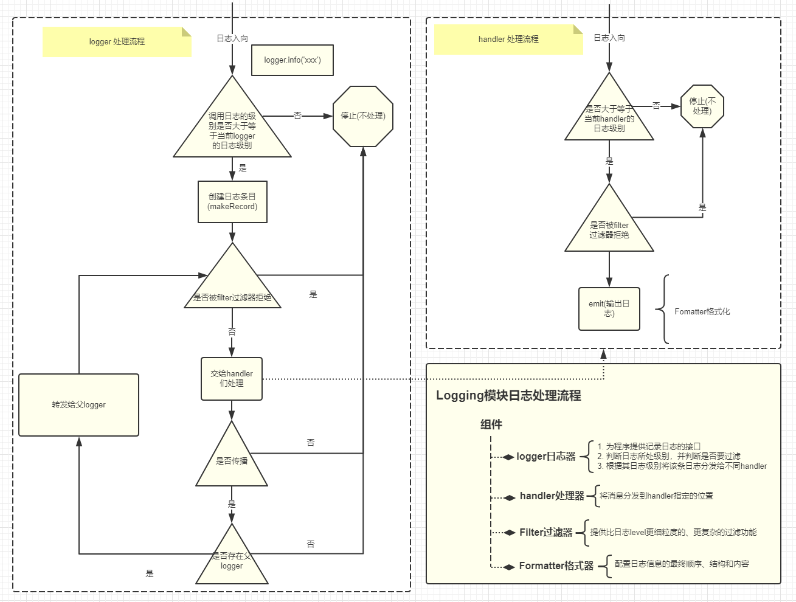

<font size=5 face='微软雅黑'>__文章目录__</font>

<!-- TOC -->

- [1 logging模块](#1-logging模块)
    - [1.1 日志级别](#11-日志级别)
    - [1.2 日志格式字符串](#12-日志格式字符串)
    - [1.3 快速使用](#13-快速使用)
        - [1.3.1 修改日期格式](#131-修改日期格式)
        - [1.3.2 输出到文件中](#132-输出到文件中)
        - [1.3.3 构建消息](#133-构建消息)
- [2 层次结构](#2-层次结构)
- [3 logger类](#3-logger类)

<!-- /TOC -->

# 1 logging模块
这个模块定义了一些函数和类，它们为应用程序和库实现了一个灵活的事件日志系统。下面先来了解下日志的级别分类。

## 1.1 日志级别
下面是日志级别以及对应的数字值表：
|Level|Numeric value|
|-----|----------|
|CRITICAL|50| 
|ERROR|40| 
|WARNING|30| 
|INFO|20| 
|DEBUG|10|
|NOTSET|0|  

之所以设置级别是为了控制输出信息，以及针对日志进行了分类：
- Error一般为程序的错误信息
- Warning为程序的告警信息
- info和debug则可以是提示或者调试信息  

当我们需要对我们的程序运行时输出的日志进行分类打印时，可以使用这种简便而快速的方法。
> 基本上所以的软件程序日志输出都分为上述级别。

## 1.2 日志格式字符串
logging模块中定义好的可以用于format格式字符串常用的如下：
字段/属性名称|使用格式|描述|
|--------|-----|----|
asctime|%(asctime)s|日志事件发生的时间--人类可读时间，如：2003-07-08 16:49:45,896
created|%(created)f|日志事件发生的时间--时间戳，就是当时调用datetime.datetime.now()函数返回的值
relativeCreated|%(relativeCreated)d|日志事件发生的时间相对于logging模块加载时间的相对毫秒数（目前还不知道干嘛用的）
msecs|%(msecs)d|日志事件发生事件的毫秒部分
levelname|%(levelname)s|该日志记录的文字形式的日志级别（'DEBUG', 'INFO', 'WARNING', 'ERROR', 'CRITICAL'）
levelno|%(levelno)s|该日志记录的数字形式的日志级别（10, 20, 30, 40, 50）
name|%(name)s|所使用的日志器名称，默认是'root'，因为默认使用的是 rootLogger
message|%(message)s|日志记录的文本内容，通过 msg % args计算得到的
pathname|%(pathname)s|调用日志记录函数的源码文件的全路径
filename|%(filename)s|pathname的文件名部分，包含文件后缀
module|%(module)s|filename的名称部分，不包含后缀
lineno|%(lineno)d|调用日志记录函数的源代码所在的行号
funcName|%(funcName)s|调用日志记录函数的函数名
process|%(process)d|进程ID
processName|%(processName)s|进程名称，Python 3.1新增
thread|%(thread)d|线程ID
threadName|%(thread)s|线程名称

## 1.3 快速使用
了解了级别和格式，我们就可以按照如下方式定义日志然后输出了。
```python
import logging

FORMAT = "%(asctime)s loggerName:%(name)s logLevel:%(levelname)s logNum:%(levelno)s Line:%(lineno)s message:%(message)s"
logging.basicConfig(level=logging.INFO, format=FORMAT)

logging.info("hello world")
# 2019-03-05 21:42:01,952 loggerName:root logLevel:INFO logNum:20 Line:6 message:hello world
```
注意：
- basicConfig中的level表示日志的级别，也可以直接使用等价数字即可。这里INFO对应的是20，填写数字20，也可以。（使用字符串时，必须为大写)
- format表示按照上面定义的格式来输出日志信息。
- 指定了level=logging.INFO，那么下面输入日志时就要大于等于logging.info(调用方法时为小写)  

> 日志格式，这里使用了空格进行分段，便于收集处理，当然分割符是自己指定的，但最好不要用00分割，会产生意想不到的问题
### 1.3.1 修改日期格式
basicConfig提供了一个参数datefmt用来便捷的修改日志为指定格式
```python
import logging

FORMAT = "%(asctime)s %(name)s %(levelname)s %(levelno)s %(lineno)s %(message)s"
logging.basicConfig(level=logging.INFO, format=FORMAT, datefmt='%Y-%m')

logging.error("hello world")
# 2019-03 root ERROR 40 6 hello world
```
格式采用c风格的标准的时间占位符，比如:`"%Y/%m/%d %H:%M:%S"`。

### 1.3.2 输出到文件中
basicConfig的filename参数用于指定输出的文件名称以及文件的位置。
```python
import logging

FORMAT = "%(asctime)s %(name)s %(levelname)s %(levelno)s %(lineno)s %(message)s"
logging.basicConfig(level=logging.INFO, format=FORMAT, datefmt='%Y-%m', filename='log.txt')

logging.error("hello world")
```

### 1.3.3 构建消息
如果需要自定义format中关键字占位符，动态的传递消息，可以使用extra来传递
```python
import logging

FORMAT = "%(asctime)s %(helloworld)s %(message)s"
logging.basicConfig(level=logging.INFO, format=FORMAT, datefmt='%Y/%m/%d %H:%M:%S')

logging.error("hello world", extra={'helloworld':'daxin'})
# 2019/03/05 22:04:03 daxin hello world
```
在调用时通过extra传递字典来为自定义关键字传值。(很少用)

# 2 层次结构
logging模块要输出一个日志要经过以下工序：
  
看起来相对比较复杂，那么先从四大组件开始了解

# 3 logger类
&nbsp;&nbsp;&nbsp;&nbsp;&nbsp;&nbsp;&nbsp;&nbsp;logger类被称为日志记录器，但从来不直接实例化，总是通过`logging.getLogger(name)`来实例化。对于具有相同名称的getLogger()的多次调用总是返回对同一个Logger对象的引用。