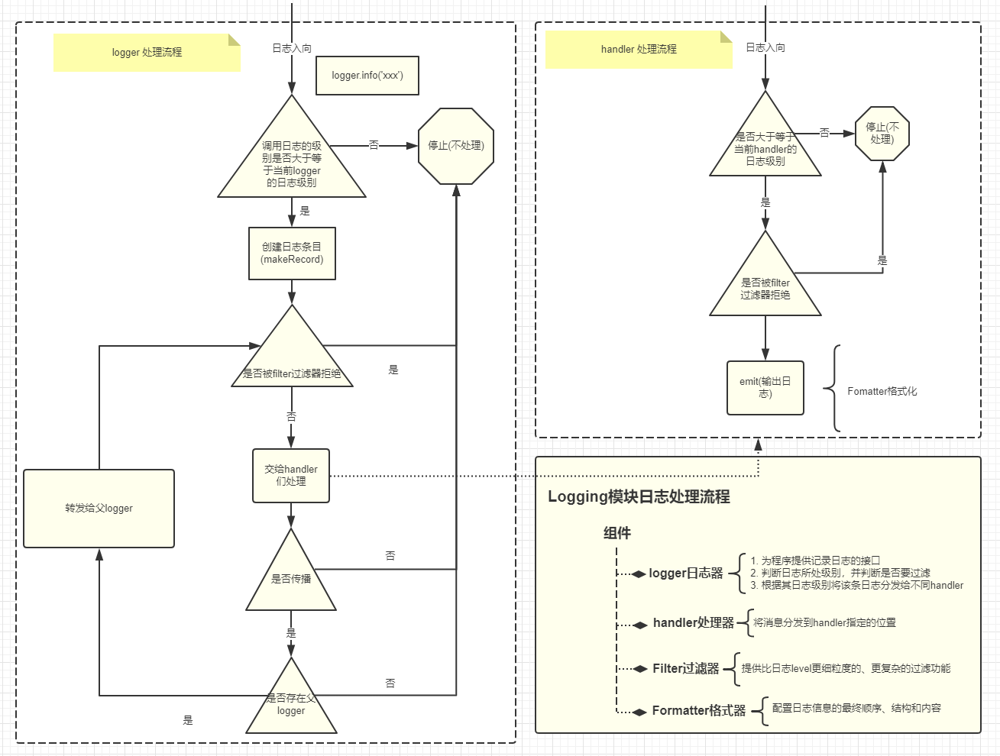

<font size=5 face='微软雅黑'>__文章目录__</font>

<!-- TOC -->

- [1 logging模块](#1-logging模块)
    - [1.1 日志级别](#11-日志级别)
    - [1.2 日志格式字符串](#12-日志格式字符串)
    - [1.3 快速使用](#13-快速使用)
        - [1.3.1 修改日期格式](#131-修改日期格式)
        - [1.3.2 输出到文件中](#132-输出到文件中)
        - [1.3.3 构建消息](#133-构建消息)
- [2 处理流程](#2-处理流程)
- [3 logger类](#3-logger类)
    - [3.1 getLogger工厂方法](#31-getlogger工厂方法)
    - [3.2 实例常用方法](#32-实例常用方法)
    - [3.3 层次结构](#33-层次结构)
    - [3.4 为什么是root logger](#34-为什么是root-logger)
    - [3.5 root logger是啥？](#35-root-logger是啥)
        - [3.5.1 basicConfig常用参数](#351-basicconfig常用参数)
    - [3.6 继承关系](#36-继承关系)
- [4 handler类](#4-handler类)
    - [4.1 StreamHandler](#41-streamhandler)
    - [4.2 FileHandler](#42-filehandler)
    - [4.3 多个Handler](#43-多个handler)
    - [4.4 handler的常用方法](#44-handler的常用方法)
- [5 Formatter类](#5-formatter类)
- [6 Filter类](#6-filter类)
- [7 信息传递](#7-信息传递)
- [8 过程分析](#8-过程分析)
- [9 日志切割](#9-日志切割)
    - [9.1 按照大小切割日志](#91-按照大小切割日志)
    - [9.2 按照时间切割日志](#92-按照时间切割日志)

<!-- /TOC -->

# 1 logging模块
这个模块定义了一些函数和类，它们为应用程序和库实现了一个灵活的事件日志系统。下面先来了解下日志的级别分类。

## 1.1 日志级别
下面是日志级别以及对应的数字值表：

|Level|Numeric value|
|-----|----------|
|CRITICAL|50| 
|ERROR|40| 
|WARNING|30| 
|INFO|20| 
|DEBUG|10|
|NOTSET|0|  

之所以设置级别是为了控制输出信息，以及针对日志进行了分类：
- Error一般为程序的错误信息
- Warning为程序的告警信息
- info和debug则可以是提示或者调试信息  

当我们需要对我们的程序运行时输出的日志进行分类打印时，可以使用这种简便而快速的方法。
> 基本上所以的软件程序日志输出都分为上述级别。

## 1.2 日志格式字符串
logging模块中定义好的可以用于format格式字符串常用的如下：

字段/属性名称|使用格式|描述|
|--------|-----|----|
asctime|%(asctime)s|日志事件发生的时间--人类可读时间，如：2003-07-08 16:49:45,896
created|%(created)f|日志事件发生的时间--时间戳，就是当时调用datetime.datetime.now()函数返回的值
relativeCreated|%(relativeCreated)d|日志事件发生的时间相对于logging模块加载时间的相对毫秒数（目前还不知道干嘛用的）
msecs|%(msecs)d|日志事件发生事件的毫秒部分
levelname|%(levelname)s|该日志记录的文字形式的日志级别（'DEBUG', 'INFO', 'WARNING', 'ERROR', 'CRITICAL'）
levelno|%(levelno)s|该日志记录的数字形式的日志级别（10, 20, 30, 40, 50）
name|%(name)s|所使用的日志器名称，默认是'root'，因为默认使用的是 rootLogger
message|%(message)s|日志记录的文本内容，通过 msg % args计算得到的
pathname|%(pathname)s|调用日志记录函数的源码文件的全路径
filename|%(filename)s|pathname的文件名部分，包含文件后缀
module|%(module)s|filename的名称部分，不包含后缀
lineno|%(lineno)d|调用日志记录函数的源代码所在的行号
funcName|%(funcName)s|调用日志记录函数的函数名
process|%(process)d|进程ID
processName|%(processName)s|进程名称，Python 3.1新增
thread|%(thread)d|线程ID
threadName|%(thread)s|线程名称

## 1.3 快速使用
了解了级别和格式，我们就可以按照如下方式定义日志然后输出了。
```python
import logging

FORMAT = "%(asctime)s loggerName:%(name)s logLevel:%(levelname)s logNum:%(levelno)s Line:%(lineno)s message:%(message)s"
logging.basicConfig(level=logging.INFO, format=FORMAT)

logging.info("hello world")
# 2019-03-05 21:42:01,952 loggerName:root logLevel:INFO logNum:20 Line:6 message:hello world
```
注意：
- basicConfig中的level表示日志的级别，也可以直接使用等价数字即可。这里INFO对应的是20，填写数字20，也可以。（使用字符串时，必须为大写)
- format表示按照上面定义的格式来输出日志信息。
- 指定了level=logging.INFO，那么下面输入日志时就要大于等于logging.info(调用方法时为小写)  

> 日志格式，这里使用了空格进行分段，便于收集处理，当然分割符是自己指定的，但最好不要用00分割，会产生意想不到的问题
### 1.3.1 修改日期格式
basicConfig提供了一个参数datefmt用来便捷的修改日志为指定格式
```python
import logging

FORMAT = "%(asctime)s %(name)s %(levelname)s %(levelno)s %(lineno)s %(message)s"
logging.basicConfig(level=logging.INFO, format=FORMAT, datefmt='%Y-%m')

logging.error("hello world")
# 2019-03 root ERROR 40 6 hello world
```
格式采用c风格的标准的时间占位符，比如:`"%Y/%m/%d %H:%M:%S"`。

### 1.3.2 输出到文件中
basicConfig的filename参数用于指定输出的文件名称以及文件的位置。
```python
import logging

FORMAT = "%(asctime)s %(name)s %(levelname)s %(levelno)s %(lineno)s %(message)s"
logging.basicConfig(level=logging.INFO, format=FORMAT, datefmt='%Y-%m', filename='log.txt')

logging.error("hello world")
```

### 1.3.3 构建消息
如果需要自定义format中关键字占位符，动态的传递消息，可以使用extra来传递
```python
import logging

FORMAT = "%(asctime)s %(helloworld)s %(message)s"
logging.basicConfig(level=logging.INFO, format=FORMAT, datefmt='%Y/%m/%d %H:%M:%S')

logging.error("hello world", extra={'helloworld':'daxin'})
# 2019/03/05 22:04:03 daxin hello world
```
在调用时通过extra传递字典来为自定义关键字传值。(很少用)

# 2 处理流程
logging模块要输出一个日志要经过以下工序：
  
看起来相对比较复杂，那么先从四大组件开始了解

# 3 logger类
&nbsp;&nbsp;&nbsp;&nbsp;&nbsp;&nbsp;&nbsp;&nbsp;logger类被称为日志记录器，但从来不直接实例化，总是通过`logging.getLogger(name)`来实例化。对于具有相同名称的getLogger()的多次调用总是返回对同一个Logger对象的引用。它的主要功能有：
1. 基于日志严重等级（默认的过滤设施）或filter对象(过滤器)来决定要对哪些日志进行后续处理；
2. 将日志消息传送给所有绑定的日志handlers。  
> 消息的级别会通过getEffectiveLevel()转换为数字和logger设置的级别想比较，只有大于等于，才会被logger转发至所有绑定的handler

## 3.1 getLogger工厂方法
&nbsp;&nbsp;&nbsp;&nbsp;&nbsp;&nbsp;&nbsp;&nbsp;logging模块建议使用getlogger方法，来构建一个新的logger实例，并且当传入的name相同时，多次执行返回的是相同的logger，为什么这样做呢？因为logger本身是跨线程的，并且是线程安全的，我们没必要为每一个线程创建一个用于输出日志的logger，而且这样很浪费内存空间。
> 习惯上称getLogger为工厂方法

```python
import logging

mylogger = logging.getLogger('daxin')        # logger的名称必须为str
print(mylogger)  # <Logger daxin (WARNING)>  
```
这样就构建了一个logger，级别为warning，那为什么是warning呢，和logger的父系结构有关。

## 3.2 实例常用方法
logger类包含如下常用方法：

|方法|功能|
|---|----|
|setLevel(level)|设置logger的日志级别，可以设置为数字或者logging对应的级别|
|getEffectiveLevel()|获取对应的数字级别显示|
|addHandler(hdlr)|为logger添加一个Handler，可以添加多个|
|removeHandler(hdlr)|为logger删除一个Handler|
|addFilter(filter)|为logger添加一个Filter，可以添加多个|
|removeFilter(filter)|为logger删除一个Filter|
|getChild(suffix)|为logger创建一个子logger|
|

以及对应分类的触发日志的方法:

|方法|功能|
|---|----|
|debug(msg, *args, **kwargs)|标识消息为 `debug/10` 级别|
|info(msg, *args, **kwargs)|标识消息为 `info/20` 级别|
|warning(msg, *args, **kwargs)|标识消息为 `warning/30` 级别|
|error(msg, *args, **kwargs)|标识消息为 `error/40` 级别|
|critical(msg, *args, **kwargs)|标识消息为 `critical/50` 级别|

logger对象具有的属性：

|属性|含义|
|----|----|
|handlers|所有绑定的handler列表|
|level|当前logger的级别|
|name|当前logger的名称|
|parent|当前logger的父logger，根节点为root|
|filters|所有绑定的filter列表|
|propagate|是否进行消息传递(默认为True，表示传递) -- 后面会说|

举个栗子：
```python
import logging

FORMAT = '%(asctime)s %(name)s [%(message)s]'
logging.basicConfig(level=logging.INFO, format=FORMAT)

# 构建一个logger
mylogger = logging.getLogger('daxin')
mylogger.info("from mylogger level is info")  # 2019-03-06 11:10:47,000 daxin [from mylogger level is info]
print(mylogger.getEffectiveLevel())  # 20(和继承关系有关)

# 设置logger的级别
mylogger.setLevel(logging.CRITICAL)
mylogger.info("from mylogger level is Critical")  # 没办法输出，因为logger的级别是50，而我们输入的是级别为10的日志。
print(mylogger.getEffectiveLevel())  # 50
```

## 3.3 层次结构
logger是层次结构的，使用.号分割，如'a','a.b'或'a.b.c'。
- a.b: a是b的parent，b是a的child
- 对于a来说，a.main和a.main.one，都是a的后代。

```python
import logging

FORMAT = '%(asctime)s %(name)s [%(message)s]'
logging.basicConfig(level=logging.INFO, format=FORMAT)

# 构建一个logger
mylogger = logging.getLogger('daxin')
mylogger.setLevel(40)

# 构建一个子的logger
newlogger = logging.getLogger('daxin.new')
print(newlogger.parent)  # <Logger daxin (ERROR)>

# 再构建一个子logger
endlogger = logging.getLogger('daxin.new.end')
print(endlogger.parent)         # <Logger daxin.new (ERROR)>
print(endlogger.parent.parent)  # <Logger daxin (ERROR)>
print(endlogger.parent.parent.parent)  # <RootLogger root (INFO)> 为什么？
```

明明没有为mylogger指定parent，那么为什么他的parent会是root logger？ root logger是啥？

## 3.4 为什么是root logger
我们没有定义过，那么肯定是logging模块中定义的，那么来看一下logging的源码。大约在logging的1731行有如下代码:
```python
root = RootLogger(WARNING)
Logger.root = root
Logger.manager = Manager(Logger.root)
```
我们发现logging帮我们实例化了一个logger，名字叫root，接下来查看RootLogger发现(1585行)
```python
class RootLogger(Logger):
    def __init__(self, level):
        Logger.__init__(self, "root", level)
```
RootLogger继承自Logger类，它为我们创建了一个logger，且级别为Warning(20)，那为什么我们创建的logger会关联root logger呢？继续来看源码
```python
# 1837行
def getLogger(name=None):
    if name:
        # 如果指定了logger名称
        return Logger.manager.getLogger(name)   
    else:
        # 如果没有指定logger名称，默认返回构建好的root logger
        return root    

# 1160行，Logger.manager.getLogger
def getLogger(self, name):

    rv = None
    if not isinstance(name, str):
        raise TypeError('A logger name must be a string')
    _acquireLock()
    try:
        # 非初次创建，这里先省略
        if name in self.loggerDict:    
            ... ... 
        # 初次创建，主要看下面的
        else:   
            rv = (self.loggerClass or _loggerClass)(name)   # logger(name)
            rv.manager = self   # 为logger的实例，构建manager属性
            self.loggerDict[name] = rv  # 在manager属性的字典中，新增{name:loggerobj},通过key来获取对应的logger，所以当传入的name相同时，多次执行返回的是相同的logger。
            self._fixupParents(rv)  # 看看这里做了什么？
    finally:
        _releaseLock()
    return rv

# 1211行  _fixupParents()
def _fixupParents(self, alogger):
    name = alogger.name
    i = name.rfind(".")
    rv = None
    ... ... 
    if not rv:
         # 这里定义了：如果名字中，没有点(没有parent)，那么他的parent就是root
        rv = self.root   
    alogger.parent = rv
```
## 3.5 root logger是啥？
&nbsp;&nbsp;&nbsp;&nbsp;&nbsp;&nbsp;&nbsp;&nbsp;现在想一想为什么我们一开始可以直接使用logging.basicConfig来设置日志的输出格式？根据我们上面的日志处理流程图，我们知道：没有logger，没有handler，没有format，它是怎么输出的呢。那么下面来看一下basicConfig的原码
```python
def basicConfig(**kwargs):
    _acquireLock()
    try:  
        # 我们发现这里其实是针对root logger 的定义及操作
        if len(root.handlers) == 0:
            handlers = kwargs.pop("handlers", None)
            ... ...
            if handlers is None:
                filename = kwargs.pop("filename", None)
                mode = kwargs.pop("filemode", 'a')
                if filename:
                    h = FileHandler(filename, mode)
                else:
                    stream = kwargs.pop("stream", None)
                    # 这里会为root logger创建一个Handler，这里stream为None，在StreamHandler中，会设置为stderr
                    h = StreamHandler(stream)    
                 # 在handlers中添加 这个新的 handler
                handlers = [h]  
            dfs = kwargs.pop("datefmt", None)
            style = kwargs.pop("style", '%')
            if style not in _STYLES:
                raise ValueError('Style must be one of: %s' % ','.join(
                                 _STYLES.keys()))
            # 如果没有给定format，这里定义了默认的格式，在 _STYLES[style][1]中，我们发现默认格式为 {levelname}:{name}:{message}
            fs = kwargs.pop("format", _STYLES[style][1])  
            # 构建Formatter
            fmt = Formatter(fs, dfs, style)  
            for h in handlers:
                if h.formatter is None:
                    h.setFormatter(fmt)  # 把formatter绑定在了handler上
                
                # 把上面创建的handler，绑定到root logger上
                root.addHandler(h)
            level = kwargs.pop("level", None)
            if level is not None:
                root.setLevel(level)
            if kwargs:
                keys = ', '.join(kwargs.keys())
                raise ValueError('Unrecognised argument(s): %s' % keys)
    finally:
        _releaseLock()
```
&nbsp;&nbsp;&nbsp;&nbsp;&nbsp;&nbsp;&nbsp;&nbsp;看到这，我们知道logging模块在导入时，就为我们创建了一个root logger，为的是让我们方便的直接进行日志输出，当然root logger也符合日志处理逻辑，只不过它的handler和Formatter是有默认值的，如果没有特殊需求，我们可以直接使用logging.basicConfig，来定制root logger的handler和Formatter等。

### 3.5.1 basicConfig常用参数
|参数|描述|
:-------:|-----|
filename|指定日志输出目标文件的文件名，指定该设置项后日志信心就不会被输出到控制台了
filemode|指定日志文件的打开模式，默认为'a'。需要注意的是，该选项要在filename指定时才有效
format|指定日志格式字符串，即指定日志输出时所包含的字段信息以及它们的顺序。logging模块定义的格式字段下面会列出。
datefmt|指定日期/时间格式。需要注意的是，该选项要在format中包含时间字段%(asctime)s时才有效
level|指定日志器的日志级别
stream|指定日志输出目标stream，如sys.stdout、sys.stderr以及网络stream。需要说明的是，stream和filename不能同时提供，否则会引发 ValueError异常
style|Python 3.2中新添加的配置项。指定format格式字符串的风格，可取值为'%'、'{'和'$'，默认为'%'
handlers|Python 3.3中新添加的配置项。该选项如果被指定，它应该是一个创建了多个Handler的可迭代对象，这些handler将会被添加到root logger。需要说明的是：filename、stream和handlers这三个配置项只能有一个存在，不能同时出现2个或3个，否则会引发ValueError异常。

## 3.6 继承关系
logger是层级结构，不同的logger实例存在继承和传递关系。看下面的例子：
```python
import logging

# 构建一个logger
mylogger = logging.getLogger('daxin')
print(mylogger.getEffectiveLevel())  # 20
```
明明没有定义logger的级别，为什么会打印20？
- `如果设置了level，就先使用自己的level`。
- `如果不设置level，继承最近的祖先的level`。

```python
import logging

# 构建一个logger
mylogger = logging.getLogger('daxin')
print(mylogger.getEffectiveLevel())   # 30(root logger 是30)

# 构建一个子logger
mylogger.setLevel(50)
newlogger = logging.getLogger('daxin.new')
print(newlogger.getEffectiveLevel())  # 50,未设置时，继承最近的父类。
```
如果所有的父logger则，直接继承root logger，则级别为20.

# 4 handler类
&nbsp;&nbsp;&nbsp;&nbsp;&nbsp;&nbsp;&nbsp;&nbsp;handler类一般称为日志分发器，它是一个基类，用于控制日志信息输出的目的地，可以是控制台、文件。不要直接对它进行实例化，可以使用它提供的几个子类，可以实现不同的输出功能：
1. StreamHandler类：
2. NullHandler类：
3. FileHandler类：

可以对它进行如下功能的定制：
1. 可以单独设置level
2. 可以单独设置formattrt格式
3. 可以单独设置filter过滤器

__`需要注意的是，我们创建的handler是需要通过绑定在logger上，才可以被触发的。`__

## 4.1 StreamHandler
流式handler，一般用于输出到屏幕上。它的使用方法为：
```python
StreamHandler(stream=None)
```
当stream不指定时，默认输出位置为sys.stderr(标准错误输出)
```python
import logging
import sys

# 构建一个logger
mylogger = logging.getLogger('daxin')
print(mylogger.getEffectiveLevel())   # 30(root logger 是30)

# 构建一个handler
myhandler = logging.StreamHandler(stream=sys.stdout)

# 将handler绑定在logger上
mylogger.addHandler(myhandler) 

mylogger.error('hello world ') # hello world
# 由于没有定义格式，默认情况下只输出日志内容
```

## 4.2 FileHandler
故名思议，用于输出到文件中去。它的使用方法为：
```python
FileHandler(filename, mode='a', encoding=None, delay=False)
```
- filename：表示日志文件的名称(文件可以不存在)
- mode：日志文件的打开方式(默认为`追加`模式)
- encoding: 打开文件的编码格式，不访问的话可以设置为UTF-8
- delay：是否在保存时额外执行一次flush
```python
import logging

# 构建一个logger
mylogger = logging.getLogger('daxin')
mylogger.setLevel(10)

# 构建一个handler
myhandler = logging.FileHandler(filename=r'C:\Users\Dahl\Desktop\access.log')

# 将handler绑定在logger上
mylogger.addHandler(myhandler)

mylogger.warning('hello world ') # 输出到文件中
```

## 4.3 多个Handler
一个logger是可以被添加多个handler的，多个Handler也是按照level进行比较输出的。
```python
import logging
import sys

# 构建一个logger
mylogger = logging.getLogger('daxin')
mylogger.setLevel(10)

# 构建一个handler
myhandler = logging.FileHandler(filename=r'C:\Users\Dahl\Desktop\access.log')
print(myhandler.level)

# 构建两个handler
newhandler = logging.StreamHandler(stream=sys.stdout)
newhandler.setLevel(30)
print(newhandler.level)

# 将handler绑定在logger上
mylogger.addHandler(myhandler)
mylogger.addHandler(newhandler)

mylogger.info('hello world ') 
```
上面代码只会输出到文件中去，因为newhandler的级别为30，要高于写入日志的级别20，所以newhandler不会输出这条日志，另外，新建的handler如果不设置Level，那么它的level是0，即只要logger转发过来一条匹配的日志消息，所有为0的handler都会处理。

## 4.4 handler的常用方法

方法|描述
---|----
Handler.setLevel()|设置handler将会处理的日志消息的最低严重级别
Handler.setFormatter()|为handler设置一个格式器对象
Handler.addFilter()<br>Handler.removeFilter()|为handler添加 和 删除一个过滤器对象

# 5 Formatter类
Formater对象用于配置日志信息的最终顺序、结构和内容。与logger以及Handler基类不同的是，我们可以直接实例化Formatter类，来构造自己的输出格式。Formatter类的构造方法定义如下：
```python
Formatter(fmt=None, datefmt=None, style='%')
```
- fmt：表示日志格式字符串
- datefmt：表示时间格式
- style：表示风格（%一般为C风格）

```python
import logging
import sys

# 构建一个logger
mylogger = logging.getLogger('daxin')

# 构建一个handler
myhandler = logging.StreamHandler(stream=sys.stdout)

# 将handler绑定在logger上
mylogger.addHandler(myhandler)

# 构建一个Formatter
myformatter = logging.Formatter(fmt='%(asctime)s %(message)s',datefmt="%Y/%m/%d %H:%M:%S")

# 将formatter绑定在handler上
myhandler.setFormatter(myformatter)

mylogger.warning('hello world ')  # 2019/03/06 22:16:58 hello world 
```
需要注意的是：`一个handler只能绑定一个Formatter`，如果不指定Formatter的格式，那么默认为:`%(message)s`

# 6 Filter类
&nbsp;&nbsp;&nbsp;&nbsp;&nbsp;&nbsp;&nbsp;&nbsp;Filter可以被Handler和Logger用来做比level更细粒度的、更复杂的过滤功能。Filter是一个过滤器基类，它只允许某个logger层级下的日志事件通过过滤。比如指定了过滤器fliter('daxin')，那么当这个过滤器绑定在logger或者handler上时，会只允许'daxin','daxin.A','daxin.B','daxin.A.B'这种name的日志信息通过，而'daxindaxin.a'就不行。
```python
import logging

# 构建logger
mylogger = logging.getLogger('daxin')
newlogger = logging.getLogger('daxin.new')

# 构建filter
myfilter = logging.Filter('daxin.new')

# 绑定fliter
mylogger.addFilter(myfilter)
newlogger.addFilter(myfilter)

mylogger.warning('mylogger  ~~~ hello world')
newlogger.warning('newlogger ~~~ hello world')

# newlogger ~~~ hello world
```
我们看到只有newlogger输出了，因为mylogger的name为daxin，不匹配filter的daxin.new的过滤，所以被阻塞了。

在logging.Filter类的filter方法中，我们看到

```python
def filter(self, record):
    if self.nlen == 0:
        return True
    elif self.name == record.name:
        return True
    elif record.name.find(self.name, 0, self.nlen) != 0:
        return False
    return (record.name[self.nlen] == ".")
```
其本质上其实就等于name.startswith(filter.name)

# 7 信息传递
当我们使用子定义的logger时，我们会发现很好玩的事情，请看如下代码：
```python
import logging
import sys

FORMAT = '%(asctime)s %(message)s'
logging.basicConfig(level=logging.INFO, format=FORMAT)

# 构建logger
mylogger = logging.getLogger('daxin')

# 构建handler
myhandler = logging.StreamHandler(stream=sys.stdout)

# 绑定handler
mylogger.addHandler(myhandler)

mylogger.info('mylogger  ~~~ hello world')

# mylogger  ~~~ hello world
# 2019-03-07 19:42:57,556 mylogger  ~~~ hello world
```
为什么会出现两一个条记录？这是因为logger的`propagate属性`。
- 在logger初始化时，propagate属性的`默认值为True`
- 为True时，当logger收到日志消息后通过level和fliter后，发送给所有绑定的handlers，还会继续传递给自己的父logger。
- 父logger重复这个过程。

# 8 过程分析
&nbsp;&nbsp;&nbsp;&nbsp;&nbsp;&nbsp;&nbsp;&nbsp;根据上面的的四大类，那么我们再来看一下流程图，下面以一个logger为参照，当一个日志消息需要进行输出，那么它会经过以下步骤：
1. 如果消息在某一个logger对象上产生，这个logger就是当前logger，首先消息level要和当前logger的Effectivelevel比较，如果低于当前logger的EffectiveLevel，则流程结束；否则生成log记录。
2. 日志记录会交给当前logger的所有handler处理，记录还要和每一个handler的级别分别比较，低的不处理，否则按照handler输出日志记录
3. 当前logger的所有handler处理完毕后，查看自己的propagate属性，如果是True表示向父logger传递这个日志记录，否则到此流程结束
4. 如果日志记录传递到父logger，`不需要和父logger的level比较`，而是直接交给父的所有handler，父logger成为当前logger，重复2、3步骤，直到当前logger的父logger是None退出，也就是说当前logger最后一般是root logger(是否能到root logger要看中间的logger是否允许propagate)
> logger实例初始的propagate属性为True，即允许向父logger传递消息

PS：如果root没有handler，就默认创建一个StreamHandler，如果设置了filename，就创建一个FileHandler。如果设置了format参数，就会用它生成一个Formatter对象，否则会生成缺省的Formattrt，并把这个Formatter加入到刚才创建的handler上，然后把这些handler加入到root.handlers列表上，level是设置给root logger的，如果root.handlers列表不为空，logging.basicConfig的调用什么都不做。

# 9 日志切割
在生产上，我们不会向上面那样只是定义出日志的格式，就好了，还要考虑很多其他问题
- 日志可以无限大吗
- 日志都要存放在一个文件中么

logging.handlers主要包含两个类，用于对日志进行分割处理
- `RotatingFileHandler`：按照大小来切割日志
- `TimedRotatingFileHandler`：按照时间来切割日志

## 9.1 按照大小切割日志
下面是一个例子,其中：
- maxBytes: 表示单个文件的大小
- backupCount: 表示切割文件的总个数(超过时，依次覆盖)
```python
from logging.handlers import RotatingFileHandler
import logging
import time

logger = logging.getLogger('hello')
logger.setLevel(logging.INFO)

handler = RotatingFileHandler('/Users/lixin/test.log', maxBytes=10 * 1024,backupCount=5, encoding='UTF-8')
handler.setLevel(logging.INFO)
formatter = logging.Formatter(fmt='%(asctime)s [ %(levelname)s %(funcName)s ] %(message)s')
handler.setFormatter(formatter)
logger.addHandler(handler)

#################

for i in range(10000):
    time.sleep(0.01)
    logger.error('msg = {}'.format(i))
```
注意：当maxBytes和backupCount中任意一个参数为0时，切割方式不生效

## 9.2 按照时间切割日志
下面时一个例子，其中
- when: 按照什么来切割。
- interval：间隔多久。
- backupCount: 切分几个
```python
import logging
from logging.handlers import TimedRotatingFileHandler
import time

logger = logging.getLogger('hello')
logger.setLevel(logging.INFO)

handler = TimedRotatingFileHandler('/Users/lixin/text.log',when='S',interval=10,backupCount=5,encoding='UTF-8')
handler.setLevel(logging.INFO)

formatter = logging.Formatter(fmt='%(asctime)s [ %(levelname)s %(funcName)s ] %(message)s')
handler.setFormatter(formatter)

logger.addHandler(handler)


for i in range(1000000):
    time.sleep(1)
    logger.error('msg = {}'.format(i))
```

when可以指定的类型有：

值|间隔的单位|当atTime参数设定时
--|-----|------|
'S'|Seconds|Ignored
'M'|Minutes|Ignored
'H'|Hours|Ignored
'D'|Days|Ignored
'W0'-'W6'|Weekday (0=Monday)|Used to compute initial rollover time
'midnight'|Roll over at midnight, if atTime not specified, else at time atTime|Used to compute initial rollover time|