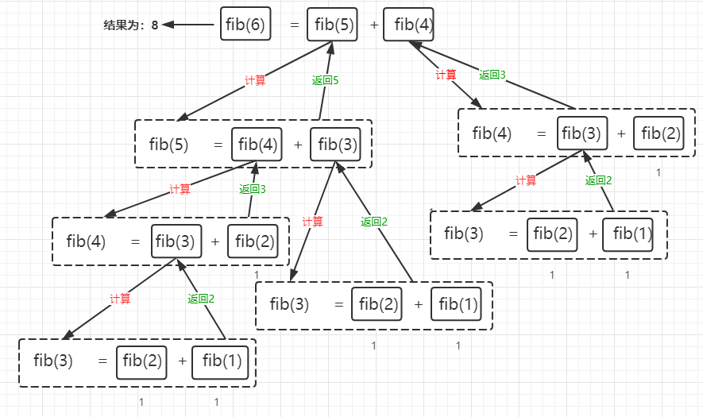

<font size=5 face='微软雅黑'>__文章目录__</font>
<!-- TOC -->

- [1 函数的执行流程](#1-函数的执行流程)
    - [1.1 字节码了解压栈过程](#11-字节码了解压栈过程)
    - [1.2 嵌套函数的压栈](#12-嵌套函数的压栈)
- [2 递归](#2-递归)
    - [2.1 递归函数](#21-递归函数)
    - [2.2 递归的性能](#22-递归的性能)
    - [2.3 递归的优化](#23-递归的优化)
    - [2.4 间接递归](#24-间接递归)
    - [2.5 递归总结](#25-递归总结)
- [3 匿名函数](#3-匿名函数)
- [4 Python生成器](#4-python生成器)
    - [4.1 基本结构](#41-基本结构)
    - [4.2 使用场景](#42-使用场景)
    - [4.3 协程coriutine](#43-协程coriutine)
    - [4.4 yield from](#44-yield-from)

<!-- /TOC -->
# 1 函数的执行流程
函数的执行需要对函数进行压栈的，什么是压栈呢，简而言之就是在函数执行时在栈中创建栈帧存放需要变量以及指针的意思。具体涉及的知识非常多，这里就已一个Python脚本简单进行分析。
```python
def foo1(b, b1=3):
    print('call foo1', b, b1)

def foo2(c):
    foo3(c)
    print('call foo2', c)

def foo3(d):
    print('call foo3', d)

def main():
    print('call main')
    foo1(100, 101)
    foo2(20)
    print('main ending')

main()
```
当我们运行上面代码时，它的执行流程如下：
1. 全局栈帧中生成foo1、foo2、foo3、main函数对象
2. main函数调用
3. main中查找内建函数print压栈，将常量字符串压栈，调用函数，弹出栈顶
4. main中全局查找函数foo1压栈，将常量100、101压栈，调用函数foo1，创建栈帧。print函数压栈，字符串和变量b、b1压栈，调用函数，弹出栈顶，返回值。
5. main中全局查找foo2函数压栈，将常量200压栈，调用foo2，创建栈帧。foo3函数压栈，变量c引用压栈，调用foo3，创建栈帧。foo3完成print函数调用返回。foo2恢复调用，执行print语句后，返回值。main中foo2调用结束后弹出栈顶，main继续执行print函数调用，弹出栈顶，main函数返回
## 1.1 字节码了解压栈过程
&nbsp;&nbsp;&nbsp;&nbsp;&nbsp;&nbsp;&nbsp;&nbsp;Python 代码先被编译为字节码后，再由Python虚拟机来执行字节码， Python的字节码是一种类似汇编指令的中间语言， 一个Python语句会对应若干字节码指令，虚拟机一条一条执行字节码指令， 从而完成程序执行。Python `dis 模块`支持对Python代码进行反汇编， 生成字节码指令。下面针对上面的例子通过字节码理解函数调用时的过程。
```python
import dis
print(dis.dis(main))

# ======> result
 53           0 LOAD_GLOBAL              0 (print)
              2 LOAD_CONST               1 ('call main')
              4 CALL_FUNCTION            1
              6 POP_TOP

 54           8 LOAD_GLOBAL              1 (foo1)
             10 LOAD_CONST               2 (100)
             12 LOAD_CONST               3 (101)
             14 CALL_FUNCTION            2
             16 POP_TOP

 55          18 LOAD_GLOBAL              2 (foo2)
             20 LOAD_CONST               4 (20)
             22 CALL_FUNCTION            1
             24 POP_TOP

 56          26 LOAD_GLOBAL              0 (print)
             28 LOAD_CONST               5 ('main ending')
             30 CALL_FUNCTION            1
             32 POP_TOP
             34 LOAD_CONST               0 (None)
             36 RETURN_VALUE
```
字节码含义：
1. `LOAD_GLOBAL`：加载全局函数(print)
2. `LOAD_CONST`: 加载常量
3. `CALL_FUNCTION`: 函数调用
4. `POP_TOP`：弹出栈顶
5. `RETURN_VALUE`： 返回值
## 1.2 嵌套函数的压栈
```python 
def outer():
    c = 100
    def inner():
        nonlocal c
        c += 200
        return c
    return inner

a = outer()
a()
```
1. 函数只有在执行的时候才会压栈，所以在outer执行时，会开辟栈空间压栈(c,inner)
2. 执行完后，删除栈空间，但是由于outer返回了内部函数inner，但并没有执行，所以不会继续压栈，当执行a的时候，会重新压栈，而此时内部函数已经记住了外部自由变量
c，并且每次调用outer都会重新生成一个inner。    
> 注意：这种情况叫做闭包，自由变量c会被当成内部函数inner的一个属性，被调用。  

PS：内存两大区域(栈，堆)。垃圾回收，清理的是堆中的空间。函数的调用就是压栈的过程，而变量的创建都是在堆中完成的。 栈中存储的都是堆中的内存地址的指向，栈清空，并不会使堆中的对象被清除，只是指向已经被删除。__`函数，变量都是在堆内创建的，函数调用需要压栈`__ 
    
# 2 递归
&nbsp;&nbsp;&nbsp;&nbsp;&nbsp;&nbsp;&nbsp;&nbsp;函数直接或者间接的调用自身就叫递归，递归需要有边界条件、递归前进段、递归返回段，当边界条件不满足的时候，递归前进，当边界条件满足时，递归返回。__注意：递归一定要有边界条件，否则可能会造成内存溢出。__ 
## 2.1 递归函数
&nbsp;&nbsp;&nbsp;&nbsp;&nbsp;&nbsp;&nbsp;&nbsp;前面我们学过斐波那契序列，利用递归函数，我们可以更简洁的编写一个计算斐波那契序列第N项，或者前N项的代码：
>在数学上，斐波纳契数列以如下被以递推的方法定义：`F(1)=1，F(2)=1, F(n)=F(n-1)+F(n-2)（n>=3，n∈N*）`
```python
# 公式版本  
def fib(n):
    if n < 3:
        return 1
    return fib(n-1) + fib(n-2)

# 公式版本之简洁版
def fib(n):
    return 1 if n < 3 else fib(n-1) + fib(n-2)
```
很多人可能不明白其中原理，这里简要说明一下,以fib(6)为例子:
1. fib(6) 返回 fib(5) + fib(4)
2. fib(5) 返回 fib(4) + fib(3)
3. fib(4) 返回 fib(3) + fib(2)
4. fib(3) 返回 fib(2) + fib(1)
3. fib(2),fib(1) 是边界，return 1，然后逐级调用返回  

  

递归的要求：
- 递归一定要有退出条件，递归调用一定要执行到这个退出条件。没有退出条件的递归调用，就是无限调用
- 递归调用的深度不宜过深,Python对递归的深度做了限制，以保护解释器，超过递归深度限制，则抛出`RecursionError`异常。
> 使用`sys.getrecursionlimit()`获取当前解释器限制的最大递归深度
## 2.2 递归的性能
&nbsp;&nbsp;&nbsp;&nbsp;&nbsp;&nbsp;&nbsp;&nbsp;由于Python是预先计算等式右边的，所以我们发现，上图中，重复计算了`fib(4)`和`fib(3)`那么效率呢？由于只是计算了fib(6)，如果`fib(35)`呢？可以预想，它要重复计算多少次啊。这里我们来测试一下它执行的时间。
```python

# 递归版本
import datetime

def fib(n):
    return 1 if n < 3 else fib(n - 2) + fib(n - 1)

start = datetime.datetime.now()
fib(35)
total_seconds = (datetime.datetime.now() - start).total_seconds()
print(total_seconds)   # 1.628643


# 循环版本
def fib(n):
    a = 1
    b = 1
    count = 2
    while count < n:
        a, b = b, a + b
        count += 1
    return b

start = datetime.datetime.now()
print(fib(35))
total_seconds = (datetime.datetime.now() - start).total_seconds()
print(total_seconds)  # 0.0 
```
&nbsp;&nbsp;&nbsp;&nbsp;&nbsp;&nbsp;&nbsp;&nbsp;经过对比，我们发现使用递归虽然代码更优美了，但是运行时间还不如我们的普通循环的版本，这是因为递归重复计算了很多次，当规模到达一定程度时，那么这个时间是成指数递增的的。  

总结一下现在的问题：
1. 循环稍微复杂一点，但是只要不是死循环，可以多次迭代直至算出结果
2. fib函数代码极简易懂，但是只要获取到最外层的函数调用，内部跌过结果都是中间结果。而且给定一个n都要进行近2n次递归，深度越深，效率越低。为了获取斐波那契数量需要在外面套一个n次的循环，效率就更低了。
3. 递归还有深度限制，如果`递归复杂`，`函数反复压栈`，栈内存就很快溢出了。
## 2.3 递归的优化
&nbsp;&nbsp;&nbsp;&nbsp;&nbsp;&nbsp;&nbsp;&nbsp;如何优化呢？前面的版本使用递归函数时会重复计算一些相同的数据，那么我们来改进一下，在代码层面对递归的特性进行优化。
```python
def fib(n, a=1, b=1):
    a, b = b, a + b
    if n < 3:
        return b
    return fib(n - 1, a, b)
```
&nbsp;&nbsp;&nbsp;&nbsp;&nbsp;&nbsp;&nbsp;&nbsp;代码优化后，发现运行时间很快，因为计算的是`fib(n),fib(n-1)..fib(1)`并没有进行重复计算，所以要使用递归，必须要考虑重复计算以及函数递归调用时产生的内存浪费等。
## 2.4 间接递归
间接递归，就是通过别的函数，来调用函数本身，下面来看一个例子，来理解间接递归的概念：
```python
def foo1():
    foo2()

def foo2():
    foo1()

foo1()
```
&nbsp;&nbsp;&nbsp;&nbsp;&nbsp;&nbsp;&nbsp;&nbsp;我们可以看到，这种递归调用是非常危险的，但是往往这种情况在代码复杂的情况下，还是可能发生这种调用。要用代码规范来避免这种递归调用的发生。
## 2.5 递归总结
递归是一种很自然的表达，符合逻辑思维：
- 运行效率低，每一次调用函数都要开辟栈帧。
- 有深度限制，如果递归层次太深，函数反复压栈，栈内存很快就溢出了。
- 如果是有限次数的递归，可以使用递归调用，或者使用循环代替，虽然代码稍微复杂一点，但是只要不是死循环，可以多次叠代直至算出结果。
- 绝大多数递归，都可以使用循环实现，`能不用递归则不用递归`。
# 3 匿名函数
&nbsp;&nbsp;&nbsp;&nbsp;&nbsp;&nbsp;&nbsp;&nbsp;没有名字的函数，在Python中被称为匿名函数，考虑一下，我们之前都是通过def语句定义函数的名字开始定义一个函数的，那么没有名字改如何定义?没有名字该如何调用呢？  
&nbsp;&nbsp;&nbsp;&nbsp;&nbsp;&nbsp;&nbsp;&nbsp;Python中借助lambda表达式构建匿名函数。它的格式为：
```python
lambda '参数列表'：'返回值'

# 等于:
def xxx(参数列表):
    return 返回值 
```
需要注意的是：
1. 冒号左边是参数裂变，但不要括号。
2. 冒号右边是函数体，但不能出现等号。
3. 函数体只能写一行，不能使用分号分隔多个语句。(也被称为单行函数)
4. return语句，不写return关键字 

下面来看一下各种匿名函数的写法
```python
(lambda x,y: x + y)(4,5)    # 9
(lambda x,y=10: x+y)(10)    # 20
(lambda x,y=10: x+y)(x=10)  # 20
(lambda x,y=10: x+y)(10,y=10)  # 20
(lambda x,y=10,*args: x+y)(10,y=10)  # 20    
(lambda x,y=10,*args,m,n,**kwargs: x+y)(10,y=10)   # 20  
(lambda *args:(i for i in args)(1,2,3,4,5)    # generate<1,2,3,4,5>
(lambda *args:(i for i i in args))(*range(5))  # generate<1,2,3,4,5>
[ x for x in (lambda *args: (i for i in args))(*range(5)) ] # [1,2,3,4,5]
[ x for x in (lambda *args: map(lambda x:x+1,(i for i in args)))(*range(5))] # [2,3,4,5,6]
```
- lambda是一匿名函数，我们在它后面加括号就表示函数调用
- 在高阶函数传参时，使用lambda表达式，往往能简化代码

> 还记得，我们之前的默认值字典吗，这里的：`d = defaultdict(lambda :0)`，其实就等于`(lambda :0)()`，即当我们传入任意值时都返回0
# 4 Python生成器
&nbsp;&nbsp;&nbsp;&nbsp;&nbsp;&nbsp;&nbsp;&nbsp;生成器指的生成器对象，可以由生成器表达式得到，也可以使用yield关键字得到一个生成器函数，调用这个函数返回一个生成器对象。  
&nbsp;&nbsp;&nbsp;&nbsp;&nbsp;&nbsp;&nbsp;&nbsp;生成器函数，函数体中包含yield关键字的函数，就是生成器函数，调用后返回生成器对象。关于生成器对象，我们可以理解它就是`一个可迭代对象`，是`一个迭代器`，只不过它是`延迟计算`的，`惰性求值`的。
## 4.1 基本结构
&nbsp;&nbsp;&nbsp;&nbsp;&nbsp;&nbsp;&nbsp;&nbsp;我们说在函数中使用yield关键字来返回数据的函数，叫做生成器函数，那么我们来写一个生成器函数，看看和return函数有什么区别
```python
In [87]: def func():
    ...:     for i in range(2):
    ...:         yield i
    ...:
In [90]: g = func()

In [91]: next(g)
Out[91]: 0

In [92]: next(g)
Out[92]: 1

In [93]: next(g)
---------------------------------------------------------------------------
StopIteration                             Traceback (most recent call last)
<ipython-input-93-e734f8aca5ac> in <module>
----> 1 next(g)

StopIteration:
```
&nbsp;&nbsp;&nbsp;&nbsp;&nbsp;&nbsp;&nbsp;&nbsp;这个报错看起来是不是很熟悉？没错，和生成器表达式的结果是相同的，只不过生成器函数可以写的更加的复杂，现在我们来看下生成器函数的执行过程。
1. 当函数执行过程中遇到yield函数时，会暂停，并把yield表达式的值返回。
2. 再次执行时会执行到下一个yield语句
> `yield关键字``，和return关键字`在生成器场景下，`不能一起使用`。因为return语句会导致当前函数立即返回，无法继续执行，也无法继续获取下一个值，并且return语句的返回值也不能被获取到，还会产生StopIteration的异常.  

再来总结一下生成器的特点：
1. 包含yield语句的生成器函数调用生成生成器对象的时候，生成器函数的函数体不会立即执行。
2. next(genreator) 会从函数的当前位置向后执行到之后碰到的一个yield语句，会弹出值，并暂停函数执行。
3. 再次调用next函数，和上一条一样的处理结果
4. 继续调用哪个next函数，生成器函数如果结束执行了（显示或隐式调用了return语句），会抛出StopIteration异常
## 4.2 使用场景
我们想要生成一个无限自然数的序列时，生成器就是一个很好的方式
```python
def counter():
    c = 0
    while True:
        c += 1
        yield c 
c = counter()

In [95]: next(c)
Out[95]: 1

In [96]: next(c)
Out[96]: 2

In [97]: next(c)
Out[97]: 3
```
又或者前面的斐波那契序列，我们也可以利用生成器的特点，惰性计算。
```python
def fib(n, a=0, b=1):
    for i in range(n):
        yield b
        a, b = b, a + b

print(list(fib(5)))
```
或者包含所有斐波那契序列的生成器
```python
def fib():
    a = 0
    b = 1
    while True:
        yield b
        a, b = b, a + b

g = fib()
for i in range(101):
    print(next(g))
```
## 4.3 协程coriutine
&nbsp;&nbsp;&nbsp;&nbsp;&nbsp;&nbsp;&nbsp;&nbsp;协程是生成器的一种高级方法，比进程、线程更轻量级，是在用户空间调度函数的一种实现，Python 3 的asyncio就是协程实现，已经加入到了标准库中，Python 3.5 使用async、await关键字直接原生支持写成。协程在现阶段来说比较复杂，后面会详细进行说明，这里提一下实现思路：
- 有两个生成器A、B
- next(A)后，A执行到了yield语句后暂停，然后去执行next(B),B执行到yield语句也暂停，然后再次调用next(A)，再次调用next(B)
- 周而复始，就实现了调度的效果
- 还可以引入调度的策略来实现切换的方式
> 协程是一种非抢占式调度
## 4.4 yield from
在Python 3.3以后，出现了yield from语法糖。它的用法是
```python
def counter():
    yield from range(10)
```
- yield from 后面需要一个可迭代对象
- `yield from iterable` 实际上等同于 `for item in iterable: yield item`  

当然yield from也可以结合生成器来使用，因为生成器也是一个可迭代对象啊。
```python
def fib(n):
    a = 0
    b = 1
    for i in range(n):
        yield b
        a,b = b,a+b

def counter():
    yield from fib(10)

g = counter()
print(list(g))
```
> 生成器包生成器，真的是有够懒的了！