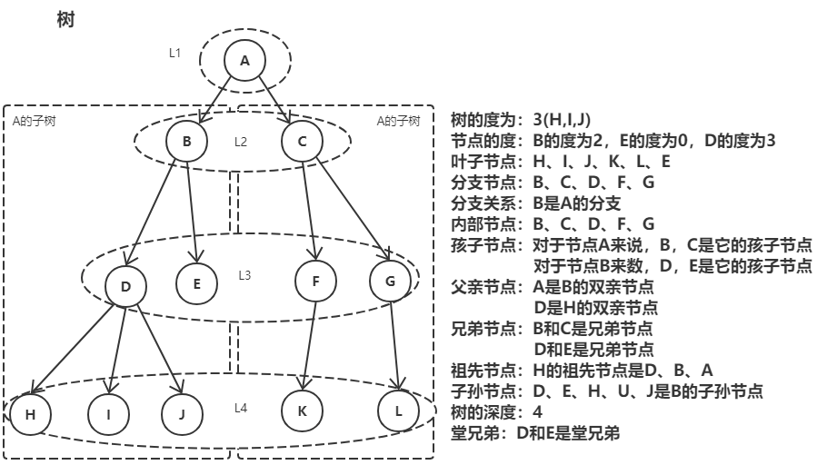

__文章目录__
<!-- TOC -->

- [1 树](#1-树)
- [2 树的概念](#2-树的概念)
- [3 树的特点](#3-树的特点)
- [4 二叉树](#4-二叉树)

<!-- /TOC -->
# 1 树
&nbsp;&nbsp;&nbsp;&nbsp;&nbsp;&nbsp;&nbsp;&nbsp;树在数据结构中属于一种非线性结构，每个元素可以有多个前驱和后继，它有如下定义：  
树是n(n≥0)个元素的集合：
- n = 0 时，成为空树
- 树只有一个特殊的没有前驱的元素，称为数的根Root
- 树中除了根节点外，其余元素只能有一个前驱，可以有零个或者多个后继  

递归定义：
- 树T是n(n≥0)个元素的集合。n = 0 时，成为空树
- 有且只有一个特殊元素根，剩余元素都可以被划分为m个互不相交的集合T1，T2，...，Tm，而每一个集合都是树，成为T的子树Subtree
- 子树也有自己的根
# 2 树的概念
树是一个中非常抽象的概念，下面主要介绍树中各种名词的含义：
|名称|含义|
|---|---|
节点|数中的数据元素
数的度|树内各节点的度的最大值
节点的度(degree)|节点拥有的子树的数目成为度，记作d(v)
叶子节点|节点的度数为0，成为叶子节点leaf、终端节点、末端节点
分支节点|节点度数不为0，成为非终端节点或分支节点
分支|节点之间的关系
内部节点|除根节点外的分支节点，当然也不包括叶子节点
孩子(儿子Child)节点|节点的子树的根节点成为该节点的孩子
双亲(父Parent)节点|一个节点是它各个树的根节点的双亲
兄弟(Sibling)节点|具有相同双亲节点的节点
祖先节点|从根节点到该节点所经分支上所有的节点。
子孙节点|节点的所有子树上的节点都成为该节点的子孙。
节点的层次(Level)|根节点为第一层，根的孩子为第二层，依次类推记作(Lv)
树的深度(高度Depth)|树的层次的最大值
堂兄弟|双亲在同一层的节点
有序树|结点的子树是有顺序的(兄弟有大小，有先后次序)，不能交换
无序数|结点的子树是无序的，可以交换
路径|树中的k个节点n1、n2、...nk，满足ni是n(i+1)的双亲，成为n1到nk的一条路径。就是一条线串下来的，前一个都是后一个父(前驱)节点。
森林|m(m≥0)课不相交的树的集合，对于节点而言，其子树的集合就是森林。

# 3 树的特点
下面我们来总结一下书的特点：
1. 唯一的根
2. 子树不相交
3. 除了根以外，每个元素只能有一个前驱，可以有零个或多个后继
4. 根节点没有双亲节点(前驱)，叶子节点没有孩子节点(后继)
5. vi是vj的双亲，则L(vi) = L(vj) - 1 ，也就是说双亲比孩子节点的层测小1  

堂兄弟的双亲是兄弟关系吗？
1. 堂兄弟定义是：双亲节点在同一层的节点
2. 右图G和J是堂兄弟，因为它们的双亲节点D和E在第三层，依然是堂兄弟
3. 因此，堂兄弟的双亲不一定是兄弟关系
# 4 二叉树
二叉树是一种特别的数，它有如下特点：
- 每个节点最多2课子树