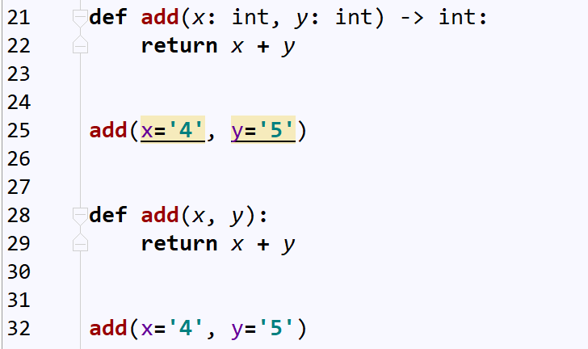

<font size=5 face='微软雅黑'>__文章目录__</font>
<!-- TOC -->

- [1 python类型注解](#1-python类型注解)
    - [1.1 函数定义的弊端](#11-函数定义的弊端)
    - [1.2 函数文档](#12-函数文档)
    - [1.3 函数注解](#13-函数注解)
    - [1.4 inspect模块](#14-inspect模块)
    - [1.5 业务应用](#15-业务应用)

<!-- /TOC -->
# 1 python类型注解
&nbsp;&nbsp;&nbsp;&nbsp;&nbsp;&nbsp;&nbsp;&nbsp;类型注解，即对变量的类型，进行标注或者说明，因为Python是一门动态编译型语言，我们无法在赋值时就定义它的变量类型，所以在`Python3.5`以上版本新增了类型注解，但仅仅是提示作用，并不能严格控制，这是动态编译型语言的通病，下面来仔细看一下什么是Python的类型注解。
## 1.1 函数定义的弊端
&nbsp;&nbsp;&nbsp;&nbsp;&nbsp;&nbsp;&nbsp;&nbsp;Python是动态语言，变量随时可以被赋值，且赋值为不同的类型，这就与静态语言不同了，变量的类型是在运行期决定的，而静态语言事先就已经定义好了变量的类型了。这是动态语言方便之处，但也是一种弊端，我们无法控制变量的类型，也就无法控制异常的产生。举个栗子
```python
def add(x,y):
    return x + y 
print(add(1,2))
print(add('s','b'))
print(add(1,'a'))
```
&nbsp;&nbsp;&nbsp;&nbsp;&nbsp;&nbsp;&nbsp;&nbsp;当用户传入两个数字时，返回它们的和，但是如果我们传递其他变量呢？比如字符串，因为Python中实现了+号的类型重载，所以说两个字符串的确可以加，但是如果是数字和字符串呢？在Python这种强类型语言中来说，属于非法操作(javascript会隐式转换)，而这时，我们就需要对用户传入的数据进行类型判断，不符合本函数的需求，那么就抛个异常，或者提示等等操作，这样就不会引起后续代码在执行期崩溃。如何解决呢？其实主要有两种方式。
- 函数文档
- 函数注解
## 1.2 函数文档
&nbsp;&nbsp;&nbsp;&nbsp;&nbsp;&nbsp;&nbsp;&nbsp;在函数中插入说明性文档的方式成为函数文档。
```python
def add(x, y):
    """
    This function used to add something
    :param x: int object
    :param y: int object
    :return: int object
    """
    return x + y
```
在函数中，一般是定义语句后的首行使用三对双引号表示。通常存储在函数的__doc__属性中。当用户使用help(函数)时，会被打印在屏幕上。
```python
In [68]: def add(x, y):
    ...:     """
    ...:     This function used to add something
    ...:     :param x: int object
    ...:     :param y: int object
    ...:     :return: int object
    ...:     """
    ...:     return x + y
    ...:

In [69]: help(add)
Help on function add in module __main__:

add(x, y)
    This function used to add something
    :param x: int object
    :param y: int object
    :return: int object


In [70]: print(add.__doc__)

    This function used to add something
    :param x: int object
    :param y: int object
    :return: int object

In [71]:
```
>每次都要使用help来查看函数的说明，的确可以让使用者了解函数的参数以及返回值的类型，但并不是所有人都愿意写doc的，在这个所谓的敏捷开发时代，人们大多会以敏捷开发为借口没时间写，所以这种方法不是很用。
## 1.3 函数注解
&nbsp;&nbsp;&nbsp;&nbsp;&nbsp;&nbsp;&nbsp;&nbsp;Python的函数注解是什么呢？首先来看一下如下代码：
```python
def add(x: int, y: int) -> int:
    return x + y
```
- 函数的位置形参，和默认值形参后使用冒号分隔，后面用于标识变量期望的类型。
- 在def语句末尾，使用->符号后 指定用于标识函数执行后的返回值类型。  

完成以上定义后，，主要的差别如下图：  
  
>当我们在IDE中准备传入非注释类型变量时，IDE会帮我们进行颜色提示，用于表示这里传入的变量有点问题。在编写时我们尚且可以使用这种方式，对我们产生一点'警示'，但是当我们写的函数被其他人调用的时候，那么就无法进行'提示'了，这个时候，我们就需要对传入的参数进行类型检查了。
## 1.4 inspect模块

## 1.5 业务应用
