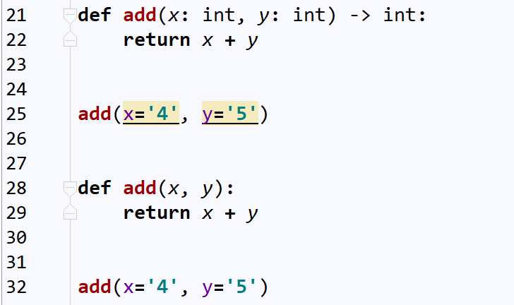

<font size=5 face='微软雅黑'>__文章目录__</font>
<!-- TOC -->

- [1 python类型注解](#1-python类型注解)
- [2 函数定义的弊端](#2-函数定义的弊端)
- [3 函数文档](#3-函数文档)
- [4 函数注解](#4-函数注解)
    - [4.1 annotation属性](#41-annotation属性)
- [5 inspect模块](#5-inspect模块)
    - [5.1 常用方法](#51-常用方法)
    - [5.2 signature类](#52-signature类)
    - [5.3 parameters属性](#53-parameters属性)
    - [5.4 获取对象的参数签名](#54-获取对象的参数签名)
- [6 检查参数](#6-检查参数)

<!-- /TOC -->
# 1 python类型注解
&nbsp;&nbsp;&nbsp;&nbsp;&nbsp;&nbsp;&nbsp;&nbsp;类型注解，即对变量的类型，进行标注或者说明，因为Python是一门动态编译型语言，我们无法在赋值时就定义它的变量类型，所以在`Python3.5`以上版本新增了类型注解，但仅仅是提示作用，并不能严格控制，这是动态编译型语言的通病，下面来仔细看一下什么是Python的类型注解。
# 2 函数定义的弊端
&nbsp;&nbsp;&nbsp;&nbsp;&nbsp;&nbsp;&nbsp;&nbsp;Python是动态语言，变量随时可以被赋值，且赋值为不同的类型，这就与静态语言不同了，变量的类型是在运行期决定的，而静态语言事先就已经定义好了变量的类型了。这是动态语言方便之处，但也是一种弊端，我们无法控制变量的类型，也就无法控制异常的产生。举个栗子
```python
def add(x,y):
    return x + y 
print(add(1,2))
print(add('s','b'))
print(add(1,'a'))
```
&nbsp;&nbsp;&nbsp;&nbsp;&nbsp;&nbsp;&nbsp;&nbsp;当用户传入两个数字时，返回它们的和，但是如果我们传递其他变量呢？比如字符串，因为Python中实现了+号的类型重载，所以说两个字符串的确可以加，但是如果是数字和字符串呢？在Python这种强类型语言中来说，属于非法操作(javascript会隐式转换)，而这时，我们就需要对用户传入的数据进行类型判断，不符合本函数的需求，那么就抛个异常，或者提示等等操作，这样就不会引起后续代码在执行期崩溃。如何解决呢？其实主要有两种方式。
- 函数文档
- 函数注解
# 3 函数文档
&nbsp;&nbsp;&nbsp;&nbsp;&nbsp;&nbsp;&nbsp;&nbsp;在函数中插入说明性文档的方式成为函数文档。
```python
def add(x, y):
    """
    This function used to add something
    :param x: int object
    :param y: int object
    :return: int object
    """
    return x + y
```
在函数中，一般是定义语句后的首行使用三对双引号表示。通常存储在函数的__doc__属性中。当用户使用help(函数)时，会被打印在屏幕上。
```python
In [68]: def add(x, y):
    ...:     """
    ...:     This function used to add something
    ...:     :param x: int object
    ...:     :param y: int object
    ...:     :return: int object
    ...:     """
    ...:     return x + y
    ...:

In [69]: help(add)
Help on function add in module __main__:

add(x, y)
    This function used to add something
    :param x: int object
    :param y: int object
    :return: int object


In [70]: print(add.__doc__)

    This function used to add something
    :param x: int object
    :param y: int object
    :return: int object

In [71]:
```
>每次都要使用help来查看函数的说明，的确可以让使用者了解函数的参数以及返回值的类型，但并不是所有人都愿意写doc的，在这个所谓的敏捷开发时代，人们大多会以敏捷开发为借口没时间写，所以这种方法不是很用。
# 4 函数注解
&nbsp;&nbsp;&nbsp;&nbsp;&nbsp;&nbsp;&nbsp;&nbsp;Python的函数注解是什么呢？首先来看一下如下代码：
```python
def add(x: int, y: int) -> int:
    return x + y
```
- 函数的位置形参，和默认值形参后使用冒号分隔，后面用于标识变量期望的类型。
- 在def语句末尾，使用->符号后 指定用于标识函数执行后的返回值类型。  

完成以上定义后，，主要的差别如下图：  
  
>当我们在IDE中准备传入非注释类型变量时，IDE会帮我们进行颜色提示，用于表示这里传入的变量有点问题。在编写时我们尚且可以使用这种方式，对我们产生一点'警示'，但是当我们写的函数被其他人调用的时候，那么就无法进行'提示'了，这个时候，我们就需要对传入的参数进行类型检查了。    

我们来总结一下：
- 函数注解在Python3.5中引入
- 对函数的参数、返回值进行类型注解
- 只对函数的参数做一个辅助的说明，并不对函数参数进行类型检查
- 提供给第三方工具，做代码分析，发现隐藏的BUG
- 函数注解的信息，保存在函数的`__annotation__`属性中。
> `python3.6` 以上还添加了变量的注解：`i:int = 10`,当然也只是提示的作用。
## 4.1 annotation属性
在Python中使用__开头的表示符一般被用特殊属性，`__annotation__`存储的就是函数的签名信息
```python
In [71]: def add(x: int, y: int) -> int:
    ...:     return x + y
    ...:

In [73]: add.__annotations__
Out[73]: {'x': int, 'y': int, 'return': int}
```
&nbsp;&nbsp;&nbsp;&nbsp;&nbsp;&nbsp;&nbsp;&nbsp;当我们使用变量注释时，变量名和类型就会存放在函数的__annotations__属性中。那么即然有变量存储，那么我们是不是只需要获取传入的参数，然后和annotations中存储的变量类型进行比较是不是就达到目的了呢？仔细思考一下：
1. 参数检查势必要在函数执行前，想要在add执行前添加参数判断那么就需要使用装饰器了
2. __annotations__的值是一个字典，字典是无序的，用户按照位置传进来参数是有序的，如何让它们形成对应关系方便我们检测呢？  

下面我们来了解一下inspect模块，它可以帮我们完成这个事情。
# 5 inspect模块
&nbsp;&nbsp;&nbsp;&nbsp;&nbsp;&nbsp;&nbsp;&nbsp;官方解释如下：inspect模块提供了几个有用的函数来帮助获取关于活动对象的信息，例如模块、类、方法、函数、回溯、框架对象和代码对象。例如，它可以帮助您检查类的内容、检索方法的源代码、提取并格式化函数的参数列表，或者获取显示详细回溯所需的所有信息。
## 5.1 常用方法
|分类|方法名称|功能|
|:--|:--|:--|
|判断|inspect.getmodulename(path)|获取模块名称
||inspect.ismodule(object)|是不是个模块
||inspect.isclass(object)|是不是个类
||inspect.ismethod(object)|是不是一个方法
||inspect.isfunction(object)|是不是一个函数
||inspect.isgeneratorfunction(object)|是不是一个生成器函数
||inspect.isgenerator(object)|是不是一个生成器
||inspect.iscoroutinefunction(object)|是不是一个协程函数
|获取信息|inspect.getmodulename(path)|获取模块名称
||inspect.getsource(object)|获取对象的原码(并不会解析装饰器原码)
## 5.2 signature类
&nbsp;&nbsp;&nbsp;&nbsp;&nbsp;&nbsp;&nbsp;&nbsp;首先我们要说的是函数的签名信息：它包含了了函数的函数名、它的参数类型，它所在的类和名称空间及其他信息，签名对象(signature object)表示可调用对象的调用签名信息和它的注解信息，当我们使用signature()时，它会重新返回一个包含可调用对象信息的签名对象。
## 5.3 parameters属性
&nbsp;&nbsp;&nbsp;&nbsp;&nbsp;&nbsp;&nbsp;&nbsp;signature类的`parameters`属性，它里面存放的是函数的参数注解和返回值注解，组成的有序字典，其中参数注解的格式为：参数名称，使用inspect.Parameters类包装的参数注解，这个参数注解很强大，它包含如下常用的方法：
|方法名称|含义|
|:--|:--|
empty|等同于inspect._empty表示一个参数没有被类型注释
name|参数的名称
default|参数的默认值，如果一个参数没有默认值，这个属性的值为inspect.empty
annotation|参数的注解类型，如果参数没有定义注解，这个属性的值为inspect.empty
kind|参数的类型  
这里的参数类型表示的是inspect内置参数类型(其实就是几个常用的函数参数定义类型而已，只是换个名字而已)
```python
_POSITIONAL_ONLY         = _ParameterKind.POSITIONAL_ONLY       # 位置参数_only
_POSITIONAL_OR_KEYWORD   = _ParameterKind.POSITIONAL_OR_KEYWORD # 位置或关键字参数
_VAR_POSITIONAL          = _ParameterKind.VAR_POSITIONAL        # 可变位置参数
_KEYWORD_ONLY            = _ParameterKind.KEYWORD_ONLY          # keyword-only参数
_VAR_KEYWORD             = _ParameterKind.VAR_KEYWORD           # 可变关键字参数
```
> 其中POSITIONAL_ONLY，Python中没有被实现。  
## 5.4 获取对象的参数签名
根据上面讲的方法，我们可以通过如下方式，简单的获取参数的签名：
```python
In [11]: import inspect
    ...:
    ...: def add(x: int, y: int) -> int:
    ...:     return x + y
    ...:
    ...: sig = inspect.signature(add)
    ...: params = sig.parameters
    ...: print(params)
OrderedDict([('x', <Parameter "x:int">), ('y', <Parameter "y:int">)])

In [21]: params['x'].annotation
Out[21]: int    # 如果没有定义x的参数注解，那么这里就是inspect._empty
```
通过它的属性，搭配`有序字典`这个特性,有没有很兴奋？参数有序，传入的实参有序，还能获取参数注解的类型，那么就可以开工进行参数检查了！
# 6 检查参数
以上面函数为例子，当给add函数传入的x，y时进行参数检查，如果x，y不是int类型，那么返回异常，并退出函数
```python
import inspect
import functools

def check(fn):
    @functools.wraps(fn)   # 等于 wrapper.__annotation__ = fn.__annotation__ 还有其他的属性比如__doc__，__module__等
    def wrapper(*args, **kwargs):
        sig = inspect.signature(fn)   # 获取add函数签名信息
        params = sig.parameters     # 获取add函数的参数信息
        values = list(params.values())   # 由于params是个有序字典，那么values也是有序的，只需根据索一一对应判断即可
        for i, k in enumerate(args):   # 遍历用户传入的位置参数
            if values[i].annotation != inspect._empty:   # 如果定义了参数注解，则开始检查
                if not isinstance(k, values[i].annotation):   # 如果检查不通过，曝出异常
                    raise('Key Error')
        for k,v in kwargs.items():
            if params[k].annotation != inspect._empty:
                if not isinstance(v,params[k].annotation):
                    raise('Key Error')
        return fn(*args, **kwargs)
    return wrapper

@check
def add(x: int, y: int) -> int:
    return x + y
    
add(4,y=5)
```
