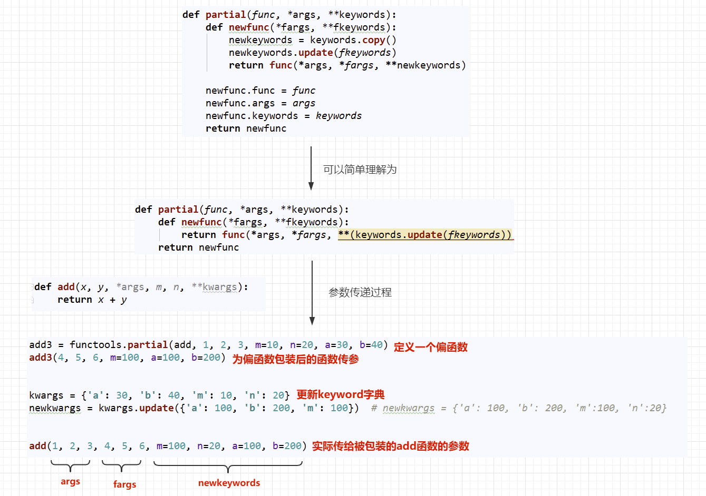

<font size=5 face='微软雅黑'>__文章目录__</font>
<!-- TOC -->

- [介绍](#介绍)
- [1 reduce方法](#1-reduce方法)
- [2 partial方法(偏函数)](#2-partial方法偏函数)
    - [2.1 partial方法基本使用](#21-partial方法基本使用)
    - [2.2 partial原码分析](#22-partial原码分析)
    - [2.3 functools.warps实现分析](#23-functoolswarps实现分析)
- [3 lsu_cache方法](#3-lsu_cache方法)
    - [3.1 基本使用](#31-基本使用)
    - [3.2 lru_cache原码分析](#32-lru_cache原码分析)
    - [3.3 斐波那契序列的lru改造](#33-斐波那契序列的lru改造)
    - [3.4 lsu_cache的总结](#34-lsu_cache的总结)

<!-- /TOC -->
# 介绍
&nbsp;&nbsp;&nbsp;&nbsp;&nbsp;&nbsp;&nbsp;&nbsp;functools模块存放着很多工具函数，大部分都是高阶函数，其作用于或返回其他函数的函数。一般来说，对于这个模块，任何可调用的对象都可以被视为函数。
# 1 reduce方法
&nbsp;&nbsp;&nbsp;&nbsp;&nbsp;&nbsp;&nbsp;&nbsp;其含义是减少，它接受一个两个参数的函数，初始时从可迭代对象中取两个元素交给函数，下一次会将本次函数返回值和下一个元素传入函数进行计算，直到将可迭代对象减少为一个值，然后返回：`reduce(lambda x, y: x+y, [1, 2, 3, 4, 5]) calculates ((((1+2)+3)+4)+5)`,
```python
reduce(function, sequence[, initial]) -> value
```
- function: 两个参数的函数
- sequence：可迭代对象(不能为空)
- initital：初始值(可以理解为给函数的第一个参数指定默认值)，否则第一次会在可迭代对象中再取一个元素    

下面是一个求1到100累加的栗子
```python
# 普通版
In [24]: sum = 0
In [25]: for i in range(1,101):
    ...:     sum += i
    ...:
In [26]: print(sum)
5050

# 利用reduce版
In [22]: import functools
In [23]: functools.reduce(lambda x,y:x+y,range(101))
Out[23]: 5050
```
# 2 partial方法(偏函数)
&nbsp;&nbsp;&nbsp;&nbsp;&nbsp;&nbsp;&nbsp;&nbsp;在前面学习函数参数的时候，通过设定参数的默认值，可以降低函数调用的难度。而偏函数也可以做到这一点，funtools模块中的partial方法就是将函数的`部分参数固定下来`，相当于为部分的参数添加了一个固定的默认值，形成一个`新的函数并返回`。从partial方法返回的函数，是对原函数的封装，是一个全新的函数。
>注意：这里的偏函数和数学意义上的偏函数不一样。
```python
partial(func, *args, **keywords) - 返回一个新的被partial函数包装过的func，并带有默认值的新函数
```
## 2.1 partial方法基本使用
```python
In [27]: import functools
    ...: import inspect
    ...:
    ...:
    ...: def add(x, y):
    ...:     return x + y
    ...:
    ...:
    ...: new_add = functools.partial(add,1)
    ...: print(new_add)
    ...:
functools.partial(<function add at 0x000002798C757840>, 1)

In [28]:
In [28]: new_add(1,2)
---------------------------------------------------------------------------
TypeError                                 Traceback (most recent call last)
<ipython-input-28-2d6520b7602a> in <module>
----> 1 new_add(1,2)

TypeError: add() takes 2 positional arguments but 3 were given

In [29]: new_add(1)
Out[29]: 2
```
- 由于我们包装了函数add，并指定了一个默认参数1，这个参数会按照位置参数，当作默认值赋给x了
- 所以当我们再次调用new_add,只需要传入y的值就行了。
- 如果再传递两个，那么连同包装前传入的1，一起传给add函数，而add函数只接受两个参数，所以会报异常。
> 获取一个函数的参数列表，可以使用前面学习的inspect模块
```python
In [30]: inspect.signature(new_add)
Out[30]: <Signature (y)>
```
- 查看new_add的签名信息，发现，它的确只需要传入一个y就可以了。  

根据前面我们所学的函数知识，我们知道函数传参的方式有很多种，利用偏函数包装后产生的新函数的传参会有所不同，下面会列举不同传参方式被偏函数包装后的签名信息。
```python
# 最复杂的函数的形参定义方式
def add(x, y, *args, m, n, **kwargs):
    return x + y
```
- add1 = `functools.partial(add,x=1)`：包装后的签名信息(*, x=1, y, m, n, **kwargs)，只接受keyword-only的方式赋值了
- add2 = `functools.partial(add,1,y=20)`：包装后的签名信息(*, y=20, m, n, **kwargs)，1已经被包装给x了其他参数只接受keyword-only的方式赋值了
- add3 = `functools.partial(add,1,2,3,m=10,n=20,a=30,b=40)`：包装后的签名信息(*args, m=10, n=20, **kwargs),1给了x，2给了y， 3给了args，可以直接调用add3，而不用传递任何参数
- add4 = `functools.partial(add,m=10,n=20,a='10')`：包装后的签名信息(x, y, *args, m=10, n=20, **kwargs),a='10'已被kwargs收集，依旧可以使用位置加关键字传递实参。
## 2.2 partial原码分析
上面我们已经了解了partial的基本使用，下面我们来学习一下partial的原码，看它到底是怎么实现的，partial的原码存在于documentation中，下面是原码：
```python
def partial(func, *args, **keywords):
    def newfunc(*fargs, **fkeywords):
        newkeywords = keywords.copy()    # 偏函数包装时指定的位置位置参数进行拷贝
        newkeywords.update(fkeywords)    # 将包装完后，传递给偏函数的关键字参数更新到keyword字典中去（key相同的被替换）
        return func(*args, *fargs, **newkeywords)  # 把偏函数包装的位置参数优先传递给被包装函数，然后是偏函数的位置参数，然后是关键字参数
    newfunc.func = func    # 新增函数属性，将被包装的函数绑定在了偏函数上，可以直接通过偏函数的func属性来调用原函数
    newfunc.args = args    # 记录包装指定的位置参数
    newfunc.keywords = keywords # 记录包装指定的关键字参数
    return newfunc
```
上面是偏函数的原码注释，如果不是很理解，请看下图

## 2.3 functools.warps实现分析
现在我们在来看一下functools.warps函数的原码实现，前面我们已经说明了，它是用来拷贝函数签名信息的装饰器，它在内部是使用了偏函数实现的。
```python
def wraps(wrapped,
          assigned = WRAPPER_ASSIGNMENTS,
          updated = WRAPPER_UPDATES):

    return partial(update_wrapper, wrapped=wrapped,
                   assigned=assigned, updated=updated)  
```
使用偏函数包装了update_wrapper函数，并设置了下面参数的默认值：
- wrapped=wrapped：将传入给wraps的函数，使用偏函数，当作update_wrapper的默认值。
- assigned=assigned：要拷贝的信息`'__module__', '__name__', '__qualname__', '__doc__','__annotations__'`
- updated=updated: 这里使用的是`'__dict__'`,用来拷贝函数的属性信息
>__dict__是用来存储对象属性的一个字典，其键为属性名，值为属性的值    

下面来看一下update_wrapper函数，因为真正执行的就是它:
```python
def update_wrapper(wrapper,
                   wrapped,
                   assigned = WRAPPER_ASSIGNMENTS,
                   updated = WRAPPER_UPDATES):
    for attr in assigned:
        try:
            value = getattr(wrapped, attr)
        except AttributeError:
            pass
        else:
            setattr(wrapper, attr, value)
    for attr in updated:
        getattr(wrapper, attr).update(getattr(wrapped, attr, {}))
    wrapper.__wrapped__ = wrapped   # 将被包装的函数，绑定在__wrapped__属性上。
    return wrapper
```
- update_wrapper在外层被wraps包装，实际上只需要传入wrapper即可
- 后面的代码可以理解为是通过反射获取wrapped的属性值，然后update到wrapper中(拷贝属性的过程)
- 最后返回包装好的函数wrapper
> 这里之所以使用偏函数实现，是因为对于拷贝这个过程来说，要拷贝的属性一般是不会改变的，那么针对这些不长改变的东西进行偏函数包装，那么在使用起来会非常方便，我觉得这就是偏函数的精髓吧。  

结合前面参数检查的例子，来加深functools.wraps的实现过程理解。
```python
def check(fn):
    @functools.wraps(fn) 
    def wrapper(*args, **kwargs):
        sig = inspect.signature(fn) 
        params = sig.parameters  
        values = list(params.values()) 
        for i, k in enumerate(args): 
            if values[i].annotation != inspect._empty: 
                if not isinstance(k, values[i].annotation): 
                    raise ('Key Error')
        for k, v in kwargs.items():
            if params[k].annotation != inspect._empty:
                if not isinstance(v, params[k].annotation):
                    raise ('Key Error')
        return fn(*args, **kwargs)

    return wrapper
```
-  `@functools.wraps(fn)` 表示一个有参装饰器，在这里实际上等于：`wrapper = functools.wraps(fn)(wrapper)`
- `functools.wraps(fn)` 的返回值就是偏函数`update_wrapper` , 所以也可以理解为这里实际上：`update_wrapper(wrapper)` 
- `update_wrapper` 在这里将wrapped的属性(也就是fn)，拷贝到了wrapper上，并返回了wrapper。  

经过上述数说明 `@functools.wraps(fn)` 就等价于 `wrapper = update_wrapper(wrapper)`，那么再来看拷贝的过程，就很好理解了。
# 3 lsu_cache方法
&nbsp;&nbsp;&nbsp;&nbsp;&nbsp;&nbsp;&nbsp;&nbsp;学习lsu_cache方法，那么不得不提cache，那什么是cache呢？我们说数据是存放在磁盘上的，CPU如果需要提取数据那么需要从磁盘上拿，磁盘速度很慢，直接拿的话，就很耗时间，所以操作系统会把一些数据提前存储到内存中，当CPU需要时，直接从内存中读取即可，但是内存毕竟是有限的，不是所有空间都用来存这些数据，所以内存中的一小部分用来存储磁盘上读写频繁的数据的空间，就可以简单的理解为cache(这里就不提CPU的L1,L2,L3 cache了).  
&nbsp;&nbsp;&nbsp;&nbsp;&nbsp;&nbsp;&nbsp;&nbsp;lsu_cache方法简单来说，就是当执行某一个函数时，把它的计算结果缓存到cache中，当下次调用时，就直接从缓存中拿就可以了，不用再次进行计算。这种特性对于那种计算非常耗时的场景时非常友好的。
> 把函数的计算结果缓存，需要的时候直接调用，这种模式该如何实现呢？简单来讲就是通过一个东西来获取它对应的值，是不是和字典的元素很像？通过一个key获取它对应的value！实际上大多数缓存软件都是这种key-value结构！！！
## 3.1 基本使用
它作为装饰器作用于需要缓存的函数，用法格式如下：
```python
functools.lru_cache(maxsize=128, typed=False)
```
- `maxsize`:限制不同参数和结果缓存的总量，如果设置为`None`，则`禁用LRU功能`，并且缓存可以无限制增长，当maxsize是二的幂时，LRU功能执行的最好，当超过maxsize设置的总数量时，LRU会把最近最少用的缓存弹出的。
- `typed`:如果设置为True，则不同类型的函数参数将单独缓存，例如f(3)和f(3.0)将被视为具有不同结果的不同调用
> 使用`被装饰的函数.cache_info()`来查看缓存命中的次数，以及结果缓存的数量。
```python
In [33]: import functools

In [34]: @functools.lru_cache()
    ...: def add(x: int, y: int) -> int:
    ...:     time.sleep(2)
    ...:     return x + y
    ...:

In [35]: import time

In [36]: add.cache_info()   # 没有执行，没有缓存，也就没有命中了
Out[36]: CacheInfo(hits=0, misses=0, maxsize=128, currsize=0)

In [37]: add(4,5)    # 执行一次，缓存中不存在，所以miss1次，本次结果将会被缓存
Out[37]: 9

In [38]: add.cache_info()   # 验证缓存信息，currsize表示当前缓存1个，misses表示错过1次
Out[38]: CacheInfo(hits=0, misses=1, maxsize=128, currsize=1)

In [39]: add(4,5)  # 本次执行速度很快，因为读取的是缓存，被命中一次，所以瞬间返回
Out[39]: 9

In [40]: add.cache_info()  # 命中加1次
Out[40]: CacheInfo(hits=1, misses=1, maxsize=128, currsize=1)
```
cache_info各参数含义：
- hits: 缓存命中次数。当次传入计算的参数，如果在缓存中存在，则表示命中
- misses: 未命中次数。当次传入计算的参数，如果在缓存中存在，则表示未命中
- maxsize：表示缓存的key最大数量
- currsize：已经缓存的key的数量
## 3.2 lru_cache原码分析
```python

def lru_cache(maxsize=128, typed=False):
    if maxsize is not None and not isinstance(maxsize, int):
        raise TypeError('Expected maxsize to be an integer or None')

    def decorating_function(user_function):
        wrapper = _lru_cache_wrapper(user_function, maxsize, typed, _CacheInfo)
        return update_wrapper(wrapper, user_function)

    return decorating_function
```
&nbsp;&nbsp;&nbsp;&nbsp;&nbsp;&nbsp;&nbsp;&nbsp;这里的返回的 `decorating_function` 函数中返回的 `update_wrapper` 是不是看起来很熟悉，没错，这里同样利用了偏函数对被包装函数的属性签名信息进行了拷贝，而传入的wrapper是才是缓存的结果，所以我们进一步查看_lru_cache_wrapper到底是怎么完成缓存的。
```python
def _lru_cache_wrapper(user_function, maxsize, typed, _CacheInfo):
    ... ...

    cache = {}
    hits = misses = 0
    full = False

    ... ...

    def wrapper(*args, **kwds):
        # Size limited caching that tracks accesses by recency
        nonlocal root, hits, misses, full
        key = make_key(args, kwds, typed)
        with lock:
       
    ... ...
```
&nbsp;&nbsp;&nbsp;&nbsp;&nbsp;&nbsp;&nbsp;&nbsp;这里截取部分代码进行简要说明：cache是个字典，那么就印证了之前我们的设想，的确是使用字典key-value的形式进行缓存的。字典的key是来自于make_key函数的，那么我们接下来看一看这个函数都做了哪些事
```python
def _make_key(args, kwds, typed,
             kwd_mark = (object(),),
             fasttypes = {int, str, frozenset, type(None)},
             tuple=tuple, type=type, len=len):
    key = args
    if kwds:     # 在使用关键字传参时，遍历kwds
        key += kwd_mark  # 使用一个特殊的对象obkect() 来 作为位置传参和关键字传参的'分隔符'
        for item in kwds.items():
            key += item
    if typed:
        key += tuple(type(v) for v in args)
        if kwds:
            key += tuple(type(v) for v in kwds.values())
    elif len(key) == 1 and type(key[0]) in fasttypes:
        return key[0]
    return _HashedSeq(key)
```
- args: 是我们给函数进行的位置传参，这里是元组类型（因为不希望被修改）。
- kwargs: 关键字传参的字典。
- _HashedSeq: 可以理解为对hash()函数的封装，仅仅是计算构建好的key的hash值，并将这个值作为key进行存储的。
>注意，这里的函数_make_key是以_开头的函数，目的仅仅是告诉你，不要擅自使用，但是为了学习cache的key是怎么生成的，我们可以直接调用它，来查看生成key的样子(这里只模拟参数的传递，理解过程即可)
```python
In [41]: functools._make_key((1,2,3),{'a':1,'b':2},typed=False)  # 不限制类型
Out[41]: [1, 2, 3, <object at 0x2798734b0b0>, 'a', 1, 'b', 2]    # 缓存的key不带类型

In [49]: functools._HashedSeq(functools._make_key((1,2,3),{'a':1,'b':2},typed=True))     # 限制类型
Out[49]: [1, 2, 3, <object at 0x2798734b0b0>, 'a', 1, 'b', 2, int, int, int, int, int]  # 缓存的key带类型
```
key构建完毕了，_HashedSeq是如何对一个列表进行hash的呢？下面来阅读以下_HashedSeq原码
```python
class _HashedSeq(list):
    __slots__ = 'hashvalue'

    def __init__(self, tup, hash=hash):
        self[:] = tup
        self.hashvalue = hash(tup)

    def __hash__(self):
        return self.hashvalue
```
这里发现_HashedSeq，是一个类，当对其进行hash时，实际上调用的就是它的__hash__方法，返回的是hashvalue这个值，而这个值在__init__函数中赋值时，又来自于hash函数(这不是多此一举吗，哈哈)，这里为了测试，我们使用_HashedSeq对象的hashvalue属性和hash函数来对比生成的hash值
```python
In [54]: value = functools._HashedSeq(functools._make_key((1,2,3),{'a':1,'b':2},typed=True))
In [55]: value
Out[55]: [1, 2, 3, <object at 0x2798734b0b0>, 'a', 1, 'b', 2, int, int, int, int, int]

In [56]: value.hashvalue
Out[56]: 3337684084446775700
In [57]: hash(value)
Out[57]: 3337684084446775700    # 这里两次执行的结果是相同的！
```
小结：
1. 通过对原码分析我们知道，lru_cache是通过构建字典来完成key到value的映射的
2. 构建字典的key来源于在_make_key函数中处理过得args，kwargs参数列表
3. 最后对列表进行`hash`，得到key，然后在字典中作为key对应函数的计算机结果
>由于_make_key在内部是通过args和kwargs拼接来完成key的构建的，也就是说args参数位置不同或者kwargs位置不同，构建出来的key都不相同，那么对应的hash值也就不同了！！！，这一点要特别注意
```python
In [60]: add.cache_info()
Out[60]: CacheInfo(hits=1, misses=1, maxsize=128, currsize=1)

In [61]: add(4,5)
Out[61]: 9

In [62]: add.cache_info()
Out[62]: CacheInfo(hits=2, misses=1, maxsize=128, currsize=1)

In [63]: add(4.0,5.0)
Out[63]: 9

In [64]: add.cache_info()   # 由于我们没有对类型的限制，所以int和float构建的key是相同的，这里就命中了！
Out[64]: CacheInfo(hits=3, misses=1, maxsize=128, currsize=1)

In [65]: add(5,4) 
Out[65]: 9

In [66]: add.cache_info()    # 当5，4调换时，key不同，那么就要重新缓存了！
Out[66]: CacheInfo(hits=3, misses=2, maxsize=128, currsize=2)
```
## 3.3 斐波那契序列的lru改造
前面我们讲递归的时候，使用递归的方法编写fib序列，是非常优美的但是由于每次要重新计很多值，效率非常低，如果把计算过后的值进行缓存，那么会有什么不同的呢？
```python
普通版：
import datetime


def fib(n):
    return 1 if n < 3 else fib(n - 1) + fib(n - 2)


start = datetime.datetime.now()
print(fib(40))
times = (datetime.datetime.now() - start).total_seconds()
print(times)  # 31.652353


lru_cache加成版本：
import datetime
import functools


@functools.lru_cache()
def fib(n):
    return 1 if n < 3 else fib(n - 1) + fib(n - 2)


start = datetime.datetime.now()
print(fib(40))
times = (datetime.datetime.now() - start).total_seconds()
print(times)  # 0.0
```
> 速度简直要起飞了！
## 3.4 lsu_cache的总结
lru_cache使用的前提是：
- 同样函数参数一定得到同样的结果
- 函数执行时间很长，且要多次执行
- 其本质就是函数调用的参数到函数返回值的映射  

缺点：
- 不支持缓存过期，key无法过期、失效。
- 不支持清楚操作
- 不支持分布式，是一个单机缓存  

适用场景：单机上需要空间换时间的地方，可以用缓存来将计算变成快速查询。