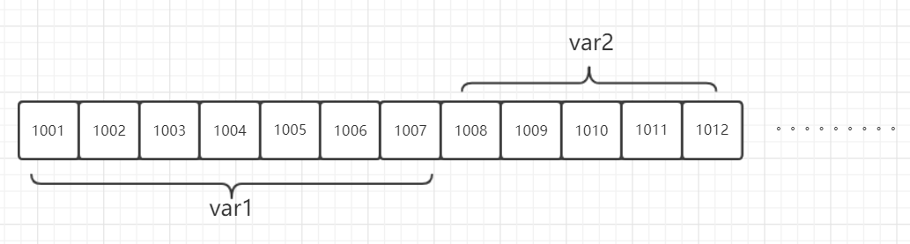
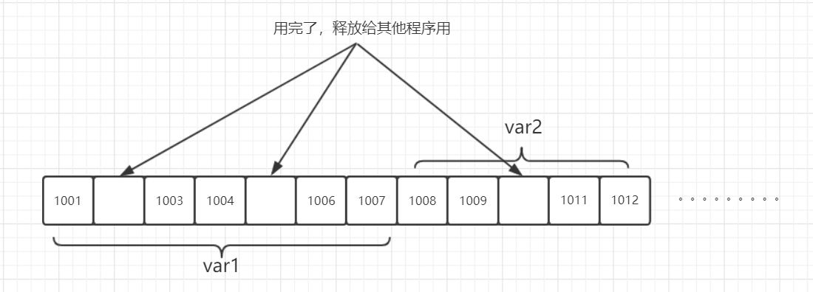
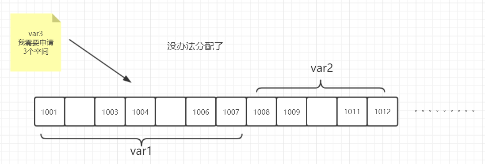
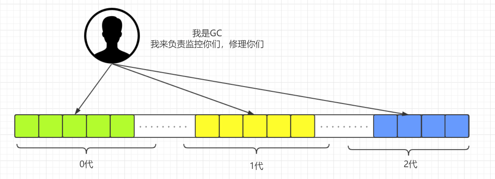

<!-- TOC -->

- [1 Python 基础语法](#1-python-基础语法)
    - [1.1 注释](#11-注释)
    - [1.2 缩进](#12-缩进)
    - [1.3 续行](#13-续行)
    - [1.4 标识符](#14-标识符)
    - [1.5 转义序列](#15-转义序列)
    - [1.6 数字](#16-数字)
    - [1.7 字符串](#17-字符串)
    - [1.8 其他](#18-其他)
- [2 Python 运算符](#2-python-运算符)
    - [2.1 赋值运算符](#21-赋值运算符)
    - [2.2 算数运算符](#22-算数运算符)
    - [2.3 关系运算符](#23-关系运算符)
    - [2.4 逻辑运算符](#24-逻辑运算符)
    - [2.5 位运算符](#25-位运算符)
        - [2.5.1 原码、反码、补码、负数表示法](#251-原码反码补码负数表示法)
        - [2.5.2 位运算符](#252-位运算符)
    - [2.6 成员、身份运算符](#26-成员身份运算符)
    - [2.7 运算符优先级](#27-运算符优先级)
- [3 Python 内存管理](#3-python-内存管理)
    - [3.1 Python的内存特性](#31-python的内存特性)
    - [3.2 Python的GC管理](#32-python的gc管理)
- [4 程序控制](#4-程序控制)
    - [4.1 分支结构](#41-分支结构)
        - [4.1.1 单分支](#411-单分支)
        - [4.1.2 多分支](#412-多分支)
        - [4.1.3 分支嵌套](#413-分支嵌套)
        - [4.1.4 小结](#414-小结)
    - [4.2 循环](#42-循环)
    - [4.2.1 for 循环](#421-for-循环)

<!-- /TOC -->

---

# 1 Python 基础语法

&nbsp;&nbsp;&nbsp;&nbsp;&nbsp;&nbsp;&nbsp;&nbsp;所有语言都有它自己规定的格式，Python也不例外，下面从几个方面来了解。
## 1.1 注释
&nbsp;&nbsp;&nbsp;&nbsp;&nbsp;&nbsp;&nbsp;&nbsp;在Python中主要的使用的注释方式是#号，当然在某些情况下三对单引号也是可以的，比如在函数中可以作为函数的说明。
```python
num =int(input('>>>: '))    # 输入一个数字
if num >= 1000:             # 条件判断
	if num >= 10000:        # 大于10000
	    print('5')          # 打印5位
	else:                   '''否则'''
	    print('4')          '''打印4'''
else:
    if num >= 100:
	    print('3')
	elif num >= 10:
		print('2')
	else:
		print('1')
```
## 1.2 缩进
&nbsp;&nbsp;&nbsp;&nbsp;&nbsp;&nbsp;&nbsp;&nbsp;C语言使用的是花括号来表示层级关系，但是看起来不简洁，`挺难看`,而Python使用的是缩进的方式表示层级关系，并且约定`4个空格`为一个层级。
## 1.3 续行
&nbsp;&nbsp;&nbsp;&nbsp;&nbsp;&nbsp;&nbsp;&nbsp;当我们一行的代码超过了一屏显示的长度以后，多数情况下为了直观，我们会另起一行，接着些，在Python中在行尾使用 `\` 标识续行，但如果在表达式或者某一段代码中使用了括号，那么Python认为括号内是一个整体，内部跨行不需要使用`\`。
## 1.4 标识符
&nbsp;&nbsp;&nbsp;&nbsp;&nbsp;&nbsp;&nbsp;&nbsp;很多时候，我们写代码的过程中会对我们需要的数据进行存储并命名，方便后续使用，这个命名被称为标识符，针对标识符Python进行了如下要求：
1. 一个名字，用来指代一个值
2. 只能是字母、数字下划线的组合
3. 只能以字母或者下划线开头
4. 不能是Python的关键字，例如def、class就不能作为标识符
5. Python是大小写敏感的  

&nbsp;&nbsp;&nbsp;&nbsp;&nbsp;&nbsp;&nbsp;&nbsp;在我们写代码的过程中最好遵循下列约定：
1. 不允许使用中文
2. 不允许使用歧义单词，例如class_
3. 在Python中不要随便使用下划线开头的标识符
## 1.5 转义序列
&nbsp;&nbsp;&nbsp;&nbsp;&nbsp;&nbsp;&nbsp;&nbsp;python中内置了很多特殊的符号，比如换行、制表符什么的，部分含义如下：
-  `\\`：单个`\`表示转义，`\\` 就指代 `\` 这个符号。表示把\后面的字符进行转义，不用特殊方式进行转换。
- `\t`：制表符，一般用来进行输出格式调整，比如对齐等  
- `\r`：回车符
- `\n`: 换行符
## 1.6 数字
&nbsp;&nbsp;&nbsp;&nbsp;&nbsp;&nbsp;&nbsp;&nbsp;在Python中数字主要分为三种类型：`整型`，`浮点数`,`复数`。
- `整型`：在Python3中，不区分long和int，所有整型均为int类型，当然还包括了不同进制，比如2进制，8进制，16进制等，都为int类型。需要注意的是Python中的`bool型`属于整型的子类,所以bool的两个值，用整型可以表示为，`0：False,非0：True`。
- `浮点数`：即带小数点的float型
- `复数`：用于科学计算，比如1+2j等
## 1.7 字符串
&nbsp;&nbsp;&nbsp;&nbsp;&nbsp;&nbsp;&nbsp;&nbsp;在Python中,使用`'`(单引号),`"`(双引号)括起来表示引用字符的序列，使用`'''`，`"""`，则可以跨行，并且自由的使用单双引号。除此之外还可以在字符串前加一定的符号来确切的表示字符串。
- r: 字符串前加r或者R，表示该字符串不做任何处理，所见即所得
- f: 3.6版本开始新增的前缀，表示格式化字符串，例如变量引用
```python
str1 = r'hello\nworld'   # 由于使用了r前缀，所以并不会把\n解释为换行
str2 = f'nihao {str1}'   # 类似于 'nihao{}'.format(str1)
print(str1)   # hello\nworld
print(str2)   # nihao hello\nworld
```
## 1.8 其他
&nbsp;&nbsp;&nbsp;&nbsp;&nbsp;&nbsp;&nbsp;&nbsp;在Python中还有一些地方和其他语言有很大区别，比如：
1. `常量`：本身指代一旦赋值就不能被改变的标识符，但是Python中是没有这个概念的，换句话说就是，Python中，只要你看的到的东西，是都可以进行修改的。
2. 字面常量：一个单独的量，看字面意思就知其含义，比如12，就表示数字12
3. 变量：赋值后，可以改变值的标识符。  

__注意：在Python中是不需要提前申明变量的类型的，所以变量的赋值即定义__
```python
total = 2500   # 定义了一个total变量，它的值是2500。 赋值即定义
```
# 2 Python 运算符
&nbsp;&nbsp;&nbsp;&nbsp;&nbsp;&nbsp;&nbsp;&nbsp;在Python中，运算符是比较重要的知识了，因为很多地方都需要知道多个数据的大小关系、逻辑关系，当然赋值也是需要用到运算符的，根据类型的不同，主要分为`赋值运算符`、`算数运算符`、`关系运算符`、`逻辑运算符`以及`位运算符`。
## 2.1 赋值运算符
&nbsp;&nbsp;&nbsp;&nbsp;&nbsp;&nbsp;&nbsp;&nbsp;我们日常使用的`=号`就属于赋值运算符的一种，在Python还有如下算数运算符：
- `=`：赋值，例如：x=3,y='abc'
- `+=` ：自加，例如：x+=2，则表示x=x+2
- `-=`：自减，例如：x-=2，表示x=x-2
- `*=`：自乘，例如：x*=2,表示x=x*2
- `/=`：自除，例如：x/=2，表示x=x/2
- `%=`：自取余，例如：x%=2，表示x=x%2。 x对2取余数，假如x=6，那么取余为0  

__当把数字赋值给一个变量的时候不用加引号，而赋值字符串给变量的时候就需要加引号了，否则python认为你赋值的是另一个变量。__
## 2.2 算数运算符
&nbsp;&nbsp;&nbsp;&nbsp;&nbsp;&nbsp;&nbsp;&nbsp;数学计算中的+，-，* 等都属于算数运算符的一种，其他的运算符如下：
- `+`：加，用来计算数字，如果字符串、列表等相加，等于是把两个对象拼到一起
- `-`：减，同数学减
- `*`：乘，同数学乘
- `/`：除，4/3,默认是整除，为了得到小数，可以把其中一个变量变成浮点型，4.0/3或4/3.0
- `//`：表示只取整数，4.0/3 答案是1.33333，如果用4.0//，因为取整则，答案是1
- `%`：表示取余数，10%2余0，10%3余1
- `**`：表示乘方 2**3 表示2的3次方      
## 2.3 关系运算符
&nbsp;&nbsp;&nbsp;&nbsp;&nbsp;&nbsp;&nbsp;&nbsp;关系运算符顾名思义就是判断关系的，比如大于，小于啊，等等，需要注意的是返回值为布尔值：即True或者False。更多的符号有：
- `>`：大于，例如1>2，值是False
- `<`：小于，例如1<2，值是True
- `>=`：大于等于，例如1>=2，值是False
- `<=`: 小于等于，例如1<=2，值是True
- `==`：是否等于，例如1==2，值是False
- `!=`：不等于,例如 1!=2，值是True
## 2.4 逻辑运算符
&nbsp;&nbsp;&nbsp;&nbsp;&nbsp;&nbsp;&nbsp;&nbsp;逻辑运算符主要包含了三个:`and`,`or`,`not`
- `and`：逻辑与，只要有1个是false那么值就是False，1==2 and 1<2 ，值是False，1!=2 and 1<2，值是Frue
- `or`：逻辑或,只要有一个是true那么值就是true，1=2 and 1<2 ，值是true
- `not`：逻辑非，取反 not 1<2，值是true  

__逻辑运算符又被称为短路运算符：__
1. and 如果第一个表达式为False，后面就没必要计算了，这个逻辑表达式一定为False
2. or如果第一个表达式为True，后面就没必要计算了，这个逻辑表达式一定为True

## 2.5 位运算符
&nbsp;&nbsp;&nbsp;&nbsp;&nbsp;&nbsp;&nbsp;&nbsp;故名思议，位运算符主要是针对位进行的计算的，它比加减运算略快，通常也比乘除法运算要快很多。说到位就不得不提补码了，因为计算机存储负数时使用的都是补码。
### 2.5.1 原码、反码、补码、负数表示法
&nbsp;&nbsp;&nbsp;&nbsp;&nbsp;&nbsp;&nbsp;&nbsp;计算机当初因为成本、复杂等各种原因，在进行加减法计算的时候，会把减法变为加法进行计算，如何理解呢？例如5-1，在计算机中进行计算的时候实际上用的是5+(-1),而负数在内存中并不会直接写个-0b1,负数在计算机中使用的是补码进行存储和运算的，计算机中有关数字的都有什么玛？什么是补码？
- 原码：即人类可读的二进制位(0b101,0b1)
- 反码：正数的反码与原码相同；负数的反码符号位不变其余按位取反
- 补码：正数的补码与原码相同；负数的补码符号位不变其余按位取反后+1  

__需要注意的是：负数在计算机中使用补码进行存储，比如`-1`在计算机存储的是`1111 1111`，负数补码的补码就表示负数本身。正数的原码反码补码都是相同的，计算机存储内存中的数字都为二进制位，当我们想要查看具体代表的值时，计算机会转换为人类可读的原码进行显示，即：如果最高的符号位是0，那么认为它是正数，不进行去补，而最高的符号位如果是1，那么它会认为它是负数，会按照负数的取补的规则进行计算后展示。__  

例题：计算机,计算 5 - 1 的过程 
```bash
# 计算机中计算的是
5 + -1

# 推导方法：

 0000 0101   # 5的原码
 1111 1110   # -1的补码
 1111 1111   # -1的反码   
10000 0100   # 溢出位舍去
 0000 0100   # 5-1 的结果为 4
```
例题：计算～12
```bash
# ~12 表示取反
# 先将初始数转换为二进制，取反，的道德是补码，再对补码去补码才是取反的结果

0000 1100 # 12的原码
1111 0011 # 取反，得到补码
1000 1100 # 再次取反，得到反码
1000 1101 # +1 得到原码

转换为10进制就是-13了
```
### 2.5.2 位运算符
&nbsp;&nbsp;&nbsp;&nbsp;&nbsp;&nbsp;&nbsp;&nbsp;针对位的运算符主要有:& | ~ ^ << >>.
- `&`：按位与，即按位相乘(1101 & 0001 , 与出来是0001)
- `|`：按位或，即按位相加,不进位(1101 | 0001，或出来是1101) __0乘任何数是0，1+任何数是1__
- `^`：按位异或
- `~`：取反
- `<<`：左移(位)
- `>>`：右移(位)，例如32 >> 3 等于32//8 , 结果是4  

__位运算符，日常使用的不多，但是如果你想做一个高级程序员，那么位运算是你必备的技能哦__

## 2.6 成员、身份运算符
- in/not in 成员测试，测试一个元素是否在一个序列中
- is /is not 统一性的测试
## 2.7 运算符优先级
|运算符|描述|
|:--:|:--|
|**|指数 (最高优先级)|
|~ + -|按位翻转, 一元加号和减号 (最后两个的方法名为 +@ 和 -@)|
||* / % //|乘，除，取模和取整除|
|+ -|加法减法|
|>> <<|右移，左移运算符|
|&|位 'AND'|
|^ \||位运算符|
|<= < > >=|比较运算符|
|<> == !=	|等于运算符|
|= %= /= //= -= += *= **=|	赋值运算符|
|is is not	|身份运算符|
|in not in	|成员运算符|
|not and or	|逻辑运算符|

小结：
1. `算数运算符` > `位运算符` > `身份运算符` > `成员运算符` > `逻辑运算符`
2. 记不住的话，记得用括号
3. 长表达式，多用括号。

__注意：在Python中，赋值即定义，如果一个变量已经定义，赋值相当于重新定义__
# 3 Python 内存管理
&nbsp;&nbsp;&nbsp;&nbsp;&nbsp;&nbsp;&nbsp;&nbsp;计算机的内存大多是线性编址的(1001,1002,1003门牌号，挨着排列的)，现在有一个变量var1需要1001～1007空间，var2需要1008～1012空间，如下图  
  
&nbsp;&nbsp;&nbsp;&nbsp;&nbsp;&nbsp;&nbsp;&nbsp;过了一段时间以后，var1中的1002，和1005不用了，var2的1010也不用了，内存就变成了如下的情况：  

&nbsp;&nbsp;&nbsp;&nbsp;&nbsp;&nbsp;&nbsp;&nbsp;这时又来了一个 var3 需要申请 3个空间，在当前情况下就没办法进行分配了  
  
__&nbsp;&nbsp;&nbsp;&nbsp;&nbsp;&nbsp;&nbsp;&nbsp;这种情况就是我们常说的内存空洞了，也叫内存碎片化，如果没办法进行碎片整理，那么这些分散的内存空间将没有办法被重新使用__
## 3.1 Python的内存特性
1. 变量无需事先声明，也不需要指定类型，这是动态语言的特性
2. Python使用引用计数记录所有对象的引用数。
3. 当对象的引用数变为0，它就可以被垃圾回收GC
    * 当对变量进行赋值时，同时会增加该对象的引用计数
    * 函数或代码块运行完毕，变量会消亡，那么引用计数会减少
## 3.2 Python的GC管理
&nbsp;&nbsp;&nbsp;&nbsp;&nbsp;&nbsp;&nbsp;&nbsp;Python在对内存进行管理时会像Java那样对内存进行分类，Java中将内存分为了老生代，新生代，持久化代,而Python中则分成了0，1，2三代,其中0代可以理解为临时存储，1代为短期存储，2代为长期存储，当应用申请内存时，会根据内存情况先分配0带给程序使用，然后定期检查各个区的使用情况，如果某个程序在0区待的够久，那么在 Python 启动GC的时候，就会把它从0区移动到1区，同理在1区时间够久的，移动到2区。当然在启动GC的时候还会检查引用计数为0的对象，然后清理掉。
&nbsp;&nbsp;&nbsp;&nbsp;&nbsp;&nbsp;&nbsp;&nbsp;需要注意的是，Python启动GC的同时，__不能进行其它的任务__。频繁的垃圾回收将大大降低Python的工作效率。如果内存中的对象不多，就没有必要总启动垃圾回收。所以，Python只会在特定条件下，自动启动垃圾回收。当Python运行时，会记录其中分配对象(object allocation)和取消分配对象(object deallocation)的次数。当两者的差值高于某个阈值时，垃圾回收才会启动。    
  
所以：
1. Python编程中一般无需关心变量的存亡，一般也不用关心内存的管理，由Python的GC统一进行垃圾回收
2. 当有关Python性能问题的时候，就需要考虑变量引用的问题，尽量不要释放内存，交由Python GC来操作，除非你更懂它。
```python
# 查看引用计数
# 由于1，2，15等这种常数，同时被Python语言解释器本身等引用，所以直接打印计数器它的引用计数并不会是1。
>>> import sys
>>> x = []
>>> print(sys.getrefcount(x))    # 函数在执行时会进行参数传递操作，会使引用计数+1
2
>>> print(sys.getrefcount([])) 
1
>>> 
```
# 4 程序控制
&nbsp;&nbsp;&nbsp;&nbsp;&nbsp;&nbsp;&nbsp;&nbsp;Python的程序控制主要分为顺序，分支，循环，这也和大多数语言是相同的。
- `顺序结构`：按照先后顺序一条一条执行，比如：先起床，再刷牙，再吃饭
- `分支结构`：根据不同的情况判断，条件满足后执行相应的操作，比如你去买个西红柿，如果看见西瓜，就买两个(真正的程序员会买回来两个西红柿的，别问我为什么，哈哈)
- `循环结构`：条件满足就反复执行，不满足就不执行或者不再执行(循环完毕)
## 4.1 分支结构
&nbsp;&nbsp;&nbsp;&nbsp;&nbsp;&nbsp;&nbsp;&nbsp;计算机之所以能做很多自动化的任务，因为它可以自己做条件判断。在Python中主要通过if以及else的搭配来完成条件判断的工作。条件判断主要有三种基本用法。

### 4.1.1 单分支
&nbsp;&nbsp;&nbsp;&nbsp;&nbsp;&nbsp;&nbsp;&nbsp;顾名思义即如果怎么样，就怎么样。(if)
```python
if expression:
    statement(s)
 
注意：python使用缩进作为其语句分组的方法，请使用4个空格
expression 表示条件表达式（比如：a>b）
statement 表示要执行的代码
```
__表达式：是将不同的数据（包括变量、函数）用运算符号按一定规则连接起来的一种式子。__
### 4.1.2 多分支
多分支有分为两种情况：
1. 如果怎么样，就怎么样，否则，怎么样。(if、else)
2. 如果1怎么样，就怎么样，如果2怎么样，就怎么样...，否则，怎么样（if、elif、else）
```python
if expression:
    statement(s)
else:
    statement(s)
 
# else、elif,if都属于同级
  
if expression:
    statement(s)
elif expression:
    statement(s)
else:
    statement(s)

注意：python使用缩进作为其语句分组的方法，请使用4个空格
expression 表示条件表达式，必须是一个bool类型，因为这里会隐式的使用bool(expression)进行转换
statement 表示要执行的代码
```
### 4.1.3 分支嵌套
&nbsp;&nbsp;&nbsp;&nbsp;&nbsp;&nbsp;&nbsp;&nbsp;分支嵌套，就是将多个两个或多个if判断进行层级嵌套，完成更精确的判断。
```python
if expression:
    statement(s)           # 非必须，看情况
    if expression:
        statement(s)
    else:                  # 非必须，看情况
        statement(s)       # 非必须，看情况
else:
    statement(s)
 
```
### 4.1.4 小结
1. 条件的写法非常多，可以写一个表达式或者多个表达式都可以，表达式的值为0，就表示false。
2. if就是判断，主要就是对表达式的逻辑值进行判断
3. __逻辑值（bool）包含了两个值：__
    - `True`：__表示非空的量（比如：string、tuple、list、set、dictionary），所有非零数。__　　
    - `False`：__表示0，None，空的量(空字符串，空字典，空列表，空即可，空元祖)等。这些对象又可以成为`False等价`__		
## 4.2 循环
&nbsp;&nbsp;&nbsp;&nbsp;&nbsp;&nbsp;&nbsp;&nbsp;为了让计算机能反复执行某一操作，我们需要循环语句来完成。Python中的循环主要有两种：for循环和while循环。
## 4.2.1 for 循环
&nbsp;&nbsp;&nbsp;&nbsp;&nbsp;&nbsp;&nbsp;&nbsp;基本所有语言都有for关键字，它的曝光率远远超过其它关键字，但每个语言有它自己的格式，在Python中它的格式为
```python
for element in iteratable:
    statemen(s)
 
# element 在循环时表示元素的变量（自行指定）
# iteratable：这里表示一个可迭代对象,比如字符串，列表
# statemen(s) 表示要执行的代码段
```
&nbsp;&nbsp;&nbsp;&nbsp;&nbsp;&nbsp;&nbsp;&nbsp;在很多情况下，我们需要循环一定次数，我们一般使用range函数来构建可迭代对象。
```python
# range 用法说明：
range(stop) -> range object
range(start, stop[, step]) -> range object
```
__&nbsp;&nbsp;&nbsp;&nbsp;&nbsp;&nbsp;&nbsp;&nbsp;range函数，接受一个变量，做为停止位，从0到stop开始依次循环，但是不包含停止位本身，所以我们称它为前包后不包__
	
	
	
	
	
	
	