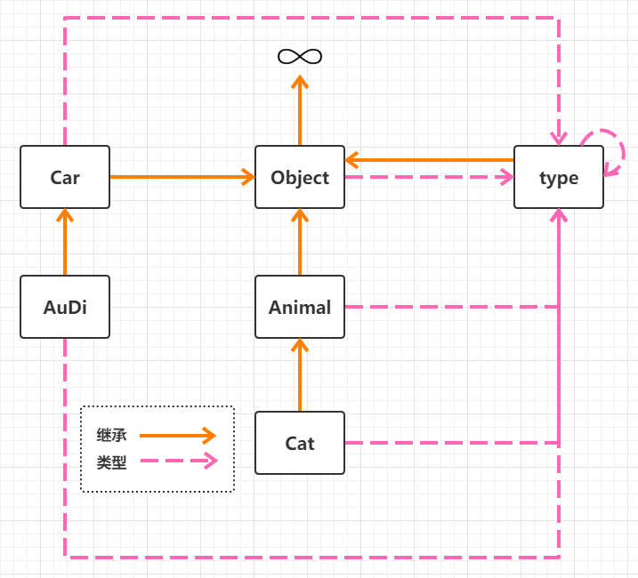

<font size=5 face='微软雅黑'>__文章目录__</font>
<!-- TOC -->

- [1 生成器交互](#1-生成器交互)
- [2 __slots__](#2-__slots__)
- [3 未实现和未实现异常](#3-未实现和未实现异常)
- [4 Python的对象模型](#4-python的对象模型)

<!-- /TOC -->
# 1 生成器交互
生成器提供了一个send方法用于动态的和生成器对象进行交互。怎么理解的呢？看下面的例子：
```python
def generator():
    a = 0
    while True:
        position = yield a   # 格式
        if position:
            a = position
        a += 1

g = generator()
print(next(g))
g.send(10)
print(next(g))
print(next(g))
```
&nbsp;&nbsp;&nbsp;&nbsp;&nbsp;&nbsp;&nbsp;&nbsp;上面的 变量 = yield 返回值，是生成器提供的交互格式，当我们使用生成器对象的send方法时，实参就会被传递给这里的position变量，从而在函数外部来控制函数内部的运行，同时send和next一样可以推动生成器的运行。
```python
import time
import random
class Person:

    def __init__(self, name):
        self.name = name

    def eat(self):
        while True:
            something = yield
            print('{} is eating {}'.format(self.name, something))


daxin = Person('daxin')
g = daxin.eat()
next(g)

count = 0
while True:
    time.sleep(random.randrange(3))
    g.send('包子-{}'.format(count))
    count += 1
```
这个例子看起来很鸡肋，但是想一下，如果count以上的代码在另一个线程中，是不是就实现了不同线程之间的切换？
# 2 __slots__
&nbsp;&nbsp;&nbsp;&nbsp;&nbsp;&nbsp;&nbsp;&nbsp;字典为了提升查询效率，必须用空间换时间。一般来说一个实例，属性多一点，都存储在字典中便于查询，问题不大，但是如果数百万个实例，那么字典占用的空间就很大了，那么是否可以把类的__dict__属性省了？__slots__就是干这个事情的。
```python
class A:
    def __init__(self):
        self.name = 'daxin'
        self.age  = 20
        self.country = 'China'
        self.language = 'Chinese'
        ... ...
a = A()
```
&nbsp;&nbsp;&nbsp;&nbsp;&nbsp;&nbsp;&nbsp;&nbsp;实例化对象时，它的属性信息都会存放在实例自己的__dict__字典中去，由于没办法固定实例的属性个数，所以这个字典就会很大。比如__dict__申请了300间客房，而只有4个客人住，并且每个实例都是这样。当使用了__slots__时
```python
class A:

    __slots__ = ['name','age']

    def __init__(self):
        self.name = 'daxin'
        self.age  = 20

    def say(self):
        pass

    def hello(self):
        pass


a = A()
a.name = 'tom'
a.sex = 'Man'  # 无法设置，因为__slots__没有允许
print(a.__class__.__dict__)  # {'__module__': '__main__', '__slots__': ['name', 'age'], '__init__': <function A.__init__ at 0x0000022422379950>, 'say': <function A.say at 0x00000224223799D8>, 'hello': <function A.hello at 0x0000022422379A60>, 'age': <member 'age' of 'A' objects>, 'name': <member 'name' of 'A' objects>, '__doc__': None}
```
当类使用了__slots__属性时：
1. 实例的属性被__slots__约束，包括在__init__函数中使用self设置的属性。
2. 实例的__dict__是在实例化时由__new__方法构建的，当设置了__slots__属性时，__new__方法不会为实例创建__dict__属性字典
3. 父类的__slots__对应着子类属性名称(列表或元组)。
4. 另外还存在属性名称对应的<member descriptor>对象，可以理解为类描述器东西。
5. __slots__只约束实例的属性，并不约束实例的方法（实例没有方法，实例是被绑定在类中定义的方法上的）。
6. 访问实例属性时，会被映射到对应的类的描述器上(数据描述器)，其内部为每个实例构建了专门的对象存储。(具体实现是用偏移地址来记录描述器，通过公式可以直接计算出其在内存中的实际地址,通过直接访问内存获得。)
> 定义了__slots__时，指定的属性都变为了描述器。  

&nbsp;&nbsp;&nbsp;&nbsp;&nbsp;&nbsp;&nbsp;&nbsp;换句话说：__slots__告诉解释器，实例的属性都叫什么，一般来说，既然要节约内存，最好还是使用元组比较好，一旦类提供了__slots__，就阻止实例产生__dict__来保存实例的属性。__slots__不影响子类，不会被继承，但如果父类没有实现__slots__方法，那么子类的就无法生效.  

&nbsp;&nbsp;&nbsp;&nbsp;&nbsp;&nbsp;&nbsp;&nbsp;使用建议：为了正确使用__slots__，最好直接继承object。如有需要用到其他父类，则父类和子类都要定义__slots__，还要记得子类的__slots__会覆盖父类的__slots__。除非所有父类的__slots__都为空，否则不要使用多继承。

以上参考自：
```python
https://stackoverflow.com/questions/472000/usage-of-slots
http://code.activestate.com/recipes/532903-how-__slots__-are-implemented/
https://www.cnblogs.com/rainfd/p/slots.html
```
# 3 未实现和未实现异常
未实现和未实现的异常是两个东西他们的含义是：
- NotImplementedError:未实现异常类，是一个类。
- NotImplemented：未实现实例，是一个单值。  

具体的区别看下面的例子：
```python
class A:

    def __init__(self,x):
        self.data = x

    def __add__(self, other):
        return self.data + other.data

    def __radd__(self, other):
        return other + self.data


a = A(2)
print(1+a)  
```
为什么是3呢。看下面的例子
```python
class A:
    def __init__(self,x):
        self.data = x

    def __add__(self, other):
        try:
            return self.data + other.data
        except:
            return NotImplemented

class B:
    def __init__(self,name):
        self.name = name

    def __radd__(self, other):
        return 'Handsome'

b = A(10)
daxin = B('daxin')

print(b+daxin)  # Handsome
```
明白了吗？
1. b+daxin，其实调用的是b.__add__(daxin)。
2. 由于daxin没有data属性，所以一定会报异常。但是我们做了异常捕捉，最后会抛出NotImplemented(未实现)。
3. 解释器不找到该值，并不会出发异常，而会转而调用daxin的__radd__方法。  

所以：
- NotImplementedError一般和raise连用，定义在抽象基类中，用于告诉实例，该方法没有实现。
- NotImplemented是个单值，一般在算数方法中告诉解释器，没有实现。解释器转而执行右边操作对象的radd方法。
# 4 Python的对象模型
&nbsp;&nbsp;&nbsp;&nbsp;&nbsp;&nbsp;&nbsp;&nbsp;在Python中，任何对象都有类型，可以使用type()或者__class__查看。但是类型也是对象及类对象，它也有自己的类型。下图为Python中的类型与继承关系：  
  
所以新类型的缺省类型都是type(可以使用元类来改变)
- 特殊类型type是所有对象的缺省类型，也包括type自己。但它又是一个对象，因此从object继承。
- 特殊类型object是继承树的顶层，它是Python所有类型的最终基类。  

也就是说：__`继承都来自object,类型都看type，type也是对象继承自object，object也有类型，是type，这俩又很特殊，type的类型是它自己，object没有基类。`__