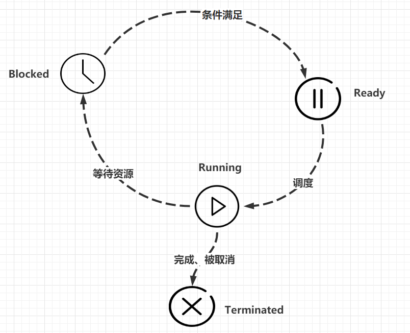

# 1 概述
&nbsp;&nbsp;&nbsp;&nbsp;&nbsp;&nbsp;&nbsp;&nbsp;我们都知道windows是支持多任务的操作系统。  
&nbsp;&nbsp;&nbsp;&nbsp;&nbsp;&nbsp;&nbsp;&nbsp;什么叫'多任务'呢？简单地说，就是操作系统可以同时运行多个任务。打个比方，你一边在用浏览器上网，一边在听MP3，一边在用Word赶作业，这就是多任务，至少同时有3个任务正在运行。还有很多任务悄悄地在后台同时运行着，只是桌面上没有显示而已。  
&nbsp;&nbsp;&nbsp;&nbsp;&nbsp;&nbsp;&nbsp;&nbsp;现在，多核CPU已经非常普及了，但是，即使过去的单核CPU，也可以执行多任务。由于CPU执行代码都是顺序执行的，那么，单核CPU是怎么执行多任务的呢？  
&nbsp;&nbsp;&nbsp;&nbsp;&nbsp;&nbsp;&nbsp;&nbsp;答案就是操作系统轮流让各个任务交替执行，任务1执行0.01秒，切换到任务2，任务2执行0.01秒，再切换到任务3，执行0.01秒……这样反复执行下去。表面上看，每个任务都是交替执行的，但是，由于CPU的执行速度实在是太快了，我们感觉就像所有任务都在同时执行一样。  
> 这里的执行时间，一般被称为时间片，即操作系统把CPU的时间划分为一个一个的时间片，在一个时间片内，线程可以可劲儿的运行，时间一到，当前线程就被挂起了。  

&nbsp;&nbsp;&nbsp;&nbsp;&nbsp;&nbsp;&nbsp;&nbsp;真正的并行执行多任务只能在多核CPU上实现，但是，由于任务数量远远多于CPU的核心数量，所以，操作系统也会自动把很多任务轮流调度到每个核心上执行。  
&nbsp;&nbsp;&nbsp;&nbsp;&nbsp;&nbsp;&nbsp;&nbsp;对于操作系统来说，一个任务就是一个进程（Process），比如打开一个浏览器就是启动一个浏览器进程，打开一个记事本就启动了一个记事本进程，打开两个记事本就启动了两个记事本进程，打开一个Word就启动了一个Word进程。  
&nbsp;&nbsp;&nbsp;&nbsp;&nbsp;&nbsp;&nbsp;&nbsp;有些进程还不止同时干一件事，比如Word，它可以同时进行打字、拼写检查、打印等事情。在一个进程内部，要同时干多件事，就需要同时运行多个'子任务'，我们把进程内的这些'子任务'称为线程（Thread）。  
&nbsp;&nbsp;&nbsp;&nbsp;&nbsp;&nbsp;&nbsp;&nbsp;由于每个进程至少要干一件事，所以，一个进程至少有一个线程。当然，像Word这种复杂的进程可以有多个线程，多个线程可以同时执行，多线程的执行方式和多进程是一样的，也是由操作系统在多个线程之间快速切换，让每个线程都短暂地交替运行，看起来就像同时执行一样。当然，真正地同时执行多线程需要多核CPU才可能实现。  
&nbsp;&nbsp;&nbsp;&nbsp;&nbsp;&nbsp;&nbsp;&nbsp;我们前面编写的所有的Python程序，都是执行单任务的进程，也就是只有一个线程。如果我们要同时执行多个任务怎么办？有两种解决方案：
- 一种是启动多个进程，每个进程虽然只有一个线程，但多个进程可以一块执行多个任务。
- 一种方法是启动一个进程，在一个进程内启动多个线程，这样，多个线程也可以一块执行多个任务。  

&nbsp;&nbsp;&nbsp;&nbsp;&nbsp;&nbsp;&nbsp;&nbsp;当然还有第三种方法，就是启动多个进程，每个进程再启动多个线程，这样同时执行的任务就更多了，当然这种模型更复杂，实际很少采用。总结一下就是，多任务的实现有3种方式：
1. 多进程模式；
2. 多线程模式；
3. 多进程+多线程模式  

&nbsp;&nbsp;&nbsp;&nbsp;&nbsp;&nbsp;&nbsp;&nbsp;同时执行多个任务通常各个任务之间并不是没有关联的，而是需要相互通信和协调，有时，任务1必须暂停等待任务2完成后才能继续执行，有时，任务3和任务4又不能同时执行，所以，多进程和多线程的程序的复杂度要远远高于我们前面写的单进程单线程的程序。
> Python既支持多进程，又支持多线程。
# 2 进程和线程
&nbsp;&nbsp;&nbsp;&nbsp;&nbsp;&nbsp;&nbsp;&nbsp;进程(Process)是计算机中的程序关于某数据集合上的一次运行活动，是系统进行资源分配和调度的基本单位，是操作系统结构的基础。线程(Thread)是操作系统能够进行运算调度的最小单位，它被包含在进程中，是进程中的实际运作单位。
> 一个程序的执行实例就是一个进程
## 2.1 进程和线程的关系
&nbsp;&nbsp;&nbsp;&nbsp;&nbsp;&nbsp;&nbsp;&nbsp;程序是源代码编译后的文件，而这些文件存放在磁盘上。当程序被操作系统加载到内存中，就是进程，进程中存放着指令和数据(资源)，它也是线程的容器。
> Linux进程有父进程、子进程，而Windows中的进程都是平等关系。
&nbsp;&nbsp;&nbsp;&nbsp;&nbsp;&nbsp;&nbsp;&nbsp;线程，有时被称为轻量级进程(Lightweight Process,LWP)，是程序执行流的最小单元。一个标准的线程由线程ID，当前指令指针(PC)，寄存器集合和堆栈组成。在许多系统中，创建一个线程比创建一个进程快10-100倍。
## 2.2 进程和线程的特点
现在操作系统提出进程的概念，每一个进程都认为自己独占所以计算机硬件资源：
1. 进程就是独立的王国，进程间不可以随便的共享数据(IPC)
2. 线程就是省份，同一个进程内的线程可以共享进程资源，每一个线程拥有自己独立的堆栈。
## 2.3 线程与进程的区别
1. 线程共享创建它的进程的地址空间，进程拥有自己的地址空间
2. 线程可以直接访问进程的数据，进程拥有它父进程内存空间的拷贝
3. 线程可以和同一进程内其他的线程直接通信，进程必须interprocess communicateion(IPC机制)进行通信
4. 线程可以被很容易的创建，而进程依赖于父进程内存空间的拷贝
5. 线程可以直接控制同一进程内的其他线程，进程只能控制自己的子进程
6. 改变主线程(控制)可能会影响其他线程，改变主进程不会影响它的子进程
## 2.3 线程的状态
线程的状态如下表:

|状态|含义|
----|-----|
就绪(Ready)|线程能够运行，但在等待被调度。可能线程刚刚创建启动，或者刚刚从阻塞中恢复，或者被其他线程抢占
运行(Running)|线程正在运行
阻塞(Blocked)|线程等待外部事件发生而无法运行，如磁盘I/O，网络I/O等。
终止(Terminated)|线程完成，或退出，或被取消

  

# 3 Python线程
Python 标准库提供了 `thread` 和 `threading` 两个模块来对多线程进行支持。其中， thread 模块以低级、原始的方式来处理和控制线程，而 threading 模块通过对 thread 进行二次封装，提供了更方便的 api 来处理线程。编写多线程代码之前还需要知道:
1. 进程靠线程执行代码，至少有一个主线程，其他线程是工作线程。
2. 主线程是第一个启动的线程
3. 父线程：如果线程A启动了一个线程B，A就是B的父线程。
4. 子线程：B就是A的子线程。
## 3.1 Thread类
Thread 是threading模块中最重要的类之一，可以使用它来创建线程。Thread类的格式如下：
```python
class Thread:
    def __init__(self, group=None, target=None,name=None,args=(), kwargs=None, *, daemon=None):
```
各参数含义如下：
|参数名|含义|
----|-----|
group|预留参数|
traget|线程要干的事情，通常是一个函数|
name|线程的名字|
args|为函数传递的位置参数(元组)|
kwargs|为函数传递的关键字参数(字典)|
daemon|当它的值为True时使子线程变为守护线程，主线程退出后，子线程一同退出|
### 3.1.1 运行线程
创建完子线程，那么就可以启动了，通常我们使用`start`方法来启动一个线程
```python
import threading

def worker(name):
    print('hello, {}'.format(name))

t = threading.Thread(target=worker,args=('daxin',),name='daxin_thread')
t.start()

print('End')

# hello, daxin
# End
```
### 3.1.2 线程退出
Python没有提供线程退出的方法，线程在以下两种情况时退出：
1. 线程函数内语句执行完毕
2. 线程函数中抛出未处理的异常
```python
import threading
import time

def worker(name):
    count = 0
    while True:
        time.sleep(1)
        if count == 5:
            raise Exception('Bye Bye')   # 异常退出(线程关闭)
        if count == 10:
            break                        # 执行完毕后退出(线程关闭)
        print('hello, {}'.format(name))
        count += 1

t = threading.Thread(target=worker,args=('daxin',),name='daxin_thread')
t.start()

print('End')

# hello, daxin
# End
```
### 3.1.3 属性方法
threading模块还提供了许多用于查看线程相关属性的方法：
名称|方法|
---|----|
current_thread()|返回当前线程对象
main_thread()|返回主线程对象
active_count()|当前处于alive状态的线程个数
enumerate()|返回所以或者的线程的列表，不包括已经终止的线程和未开始的线程
get_ident()|返回当前线程的ID，非0整数
name|返回线程的名字(属性)
ident|线程的ID(属性)
is_alive()|返回线程是否还或者
start()|启动线程，每个线程只能启动一次
run()|运行线程函数

```python
import threading
import time

def worker(name):
    current_thread = threading.current_thread()
    print('我的名字：{}  我的ID：{}  我的状态：{}'.format(current_thread.name,current_thread.ident,current_thread.is_alive()))
    time.sleep(1)   # 执行完会立即退出，这里为了掩饰，让它停顿一秒

t = threading.Thread(target=worker,args=('daxin',),name='daxin_thread')
t.start()

print('主线程：{}'.format(threading.main_thread()))
print('存活的线程数量：{}'.format(threading.active_count()))
print('存活的线程: {}'.format(threading.enumerate()))
print('End')

# 我的名字：daxin_thread  我的ID：6820  我的状态：True
# 主线程：<_MainThread(MainThread, started 22980)>
# 存活的线程数量：2
# 存活的线程: [<_MainThread(MainThread, started 22980)>, <Thread(daxin_thread, started 6820)>]
# End
```
> 线程的ID是会重复利用的，所以说一个线程消亡，那么下一个新建的线程可能还会服用之前线程的ID。所以不要以为这个线程执行完毕还在存活。
### 3.1.4 start方法和run方法
&nbsp;&nbsp;&nbsp;&nbsp;&nbsp;&nbsp;&nbsp;&nbsp;start和run方法看起来都是启动一个线程用的，他们的主要区别时，start方法执行后会开启一个新的线程，然后在新的线程中调用run方法运行我们指定的函数，而run方法只会在当前线程中调用我们指定的函数，实际上就是在主线程调用了一个普通的函数而已。
```python
import threading

class MyThread(threading.Thread):

    def start(self):
        print('{} , start ～～～'.format(self.__class__))
        super().start()

    def run(self):
        print('{} , run ~~~~'.format(self.__class__))
        super().run()

def worker():
    print('I am worker')

t = MyThread(target=worker, name='daxin')
t.start()

# <class '__main__.MyThread'> , start ～～～
# <class '__main__.MyThread'> , run ~~~~
# I am worker
```
先执行了start方法，然后调用了run方法。观察start方法的原码
```python
# 查看start干了啥
_start_new_thread(self._bootstrap, ())

# 查看self._bootstrap干了啥
self._bootstrap_inner()

# 操作了一个属性
self._started.set()

# 设置为True了
self._flag = True
```
这么做是为什么呢？，来看一下start方法的运行条件
```python
if self._started.is_set():
    raise RuntimeError("threads can only be started once")
```
总结一下就是说：当我们使用start方法运行一个子进程的时候，它会检测_started属性，它的初始值是False，当运行以后，它被置为True，下次再运行时，就会异常提示，所以线程只能被运行一次。
## 3.2 多线程
多线程故名思议，多个线程运行
```python
import threading
import time

def worker():
    time.sleep(1)
    print('I am worker')


t1 = threading.Thread(target=worker, name='daxin1')
t2 = threading.Thread(target=worker, name='daxin2')
t1.start()
t2.start()
print(threading.enumerate())  # [<_MainThread(MainThread, started 15012)>, <Thread(daxin1, started 20808)>, <Thread(daxin2, started 21328)>]
print(threading.active_count())  # 3
time.sleep(2)
```
同时运行了t1，t2和当前主线程。所以打印当前活动线程的数量为3.
> 一个进程中至少有一个线程，并作为程序的入口，这个线程就是主线程，一个进程至少有一个主线程。其他线程称为工作线程。
## 3.3 线程安全
&nbsp;&nbsp;&nbsp;&nbsp;&nbsp;&nbsp;&nbsp;&nbsp;多个线程访问同一个对象时，如果不用考虑这些线程在运行时环境下的调度和交替执行，也不需要进行额外的同步，或者在调用方进行任何其他操作，调用这个对象的行为都可以获得正确的结果，那么这个对象就是线程安全的。  
&nbsp;&nbsp;&nbsp;&nbsp;&nbsp;&nbsp;&nbsp;&nbsp;换句话说就是线程执行的结果(显示)不会因为其他因素(时间片用完被交换、网络I/O被等待等待其他因素)而改变。那么这个线程就是安全的，典型的print函数，就是一个线程不安全的。
```python
import threading

def work():
    for i in range(100):
        print('Thread: {} start~~~'.format(threading.current_thread().ident))

count = 10
while count < 20:
    t = threading.Thread(target=work)
    t.start()
    count += 1

# 输出结果
# Thread: 11276 start~~~
# Thread: 11276 start~~~Thread: 5056 start~~~
# 
# Thread: 11276 start~~~
# Thread: 5056 start~~~Thread: 23320 start~~~
# Thread: 20652 start~~~
# Thread: 11276 start~~~Thread: 23320 start~~~Thread: 12016 start~~~Thread: 12356 start~~~Thread: 21532 start~~~Thread: 16908 start~~~
# 
# 
# 
# Thread: 12672 start~~~
# Thread: 19372 start~~~
# 
# Thread: 11276 start~~~Thread: 12016 start~~~
# Thread: 5056 start~~~
# Thread: 19372 start~~~
# 
# Thread: 20652 start~~~

# 上面代码需要在ipython环境下执行才会有类似的效果
```
&nbsp;&nbsp;&nbsp;&nbsp;&nbsp;&nbsp;&nbsp;&nbsp;我们看到上面的输出信息，有很多都打在了一起，这是因为print函数在执行打印完毕，然后换行的时候，时间片用完被暂停运行，其他线程的print函数开始运行，向输出终端开始打印信息，而此时光标在还在上一行的末尾，所以就连续输出了，等到再次切换回来，只剩换行符了，所以会看到有一些空行是输出。
> print函数的输出信息是原子的，即组成一句话整体被打印，而打印换行符的时候是可以被中断的，所以也可以在print函数打印的字符串中手动添加\n,然后指定sep=''即可。这里只讨论线程安全问题。  

&nbsp;&nbsp;&nbsp;&nbsp;&nbsp;&nbsp;&nbsp;&nbsp;相对于print函数来说，logging模块都是线程安全的。将上面的例子换成logging就可以完美打印了。
```python
import threading
import logging

def work():
    for i in range(100):
        logging.warning('Thread: {} start~~~'.format(threading.current_thread().ident))

count = 10
while count < 20:
    t = threading.Thread(target=work)
    t.start()
    count += 1
```
## 3.4 daemon和non-daemon线程
&nbsp;&nbsp;&nbsp;&nbsp;&nbsp;&nbsp;&nbsp;&nbsp;daemon,守护进程。用于告诉子线程要追随主线程的状态，即主线程退出，子线程不管有没有执行完毕，都要跟着退出。Python中，构建线程的时候，可以设置线程是否是守护线程，需要注意的是这个属性必须在start方法前设置。(线程都已经运行起来了，你还设置，有毛用啊。)
```python
import threading
import time

def work():
    print('I am Worked')
    time.sleep(10)
    print('I am Finished')

t = threading.Thread(target=work,daemon=True)
t.start()

time.sleep(2)
print('运行完毕，主线程关闭')

# I am Worked
# 运行完毕，主线程关闭
```
设置线程t的属性为守护进程，当主线程执行完print后，虽然子线程还在睡眠中，但是也会被强制关闭，所以'I am Finished'不会被打印。__`默认情况下，主线程是non-daemon的。如果没有指定子线程的daemon属性，那么它会取当前线程的daemon的值`__
```python
import threading
import time

def work2():
    # time.sleep(10)
    current = threading.current_thread()
    print(current.daemon)   # 继承work线程的daemon属性，这里是True
    print('I am Work2')

def work():
    print('I am Worked')
    t = threading.Thread(target=work2)
    t.start()
    print('I am Finished')

t = threading.Thread(target=work,daemon=True)
t.start()


time.sleep(3)
```
## 3.5 join方法