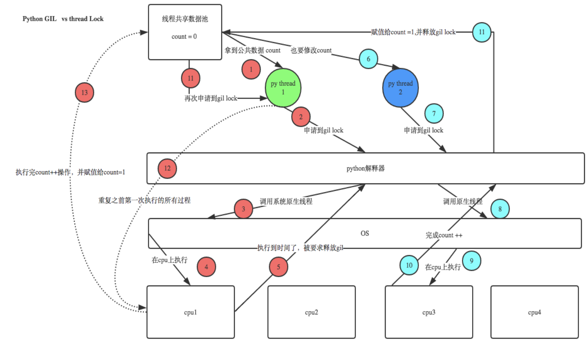

# 1 GIL
&nbsp;&nbsp;&nbsp;&nbsp;&nbsp;&nbsp;&nbsp;&nbsp;GIL：`Global Interpreter Lock` 全局解释器锁，它的含义是：__`在同一时间在某一个进程内，只有一个线程可以运行。即便是在多CPU下`__ 。GIL并不是Python的特性，它是在实现Python解析器(CPython)时所引入的一个概念。就好比C++是一套语言（语法）标准，但是可以用不同的编译器来编译成可执行代码。有名的编译器例如GCC，INTEL C++，Visual C++等。Python也一样，同样一段代码可以通过CPython，PyPy，Psyco等不同的Python执行环境来执行。像其中的JPython就没有GIL。然而因为CPython是大部分环境下默认的Python执行环境。所以在很多人的概念里CPython就是Python，也就想当然的把GIL归结为Python语言的缺陷。所以这里要先明确一点：GIL并不是Python的特性，Python完全可以不依赖于GIL。  

官方是这样解释GIL的：
```bash
In CPython, the global interpreter lock, or GIL, is a mutex that prevents multiple native threads from executing Python bytecodes at once.
This lock is necessary mainly because CPython’s memory management is not thread-safe.
(However, since the GIL exists, other features have grown to depend on the guarantees that it enforces.)
 
# 在CPython中，全局解释器锁或者简称GIL，
# 是一个用来阻止多线程程序在一次运行时多次执行Python字节码程序的锁，
# 在CPython中这个锁是必须的，因为CPython的内存管理不是线程安全的
# (然而，自从GIL存在，其他特性已经发展到依赖于GIL的强制执行)
```
PS：为了防止多线程并发执行机器码。
## 1.1 为什么会有GIL
&nbsp;&nbsp;&nbsp;&nbsp;&nbsp;&nbsp;&nbsp;&nbsp;由于物理上得限制，各CPU厂商在核心频率上的比赛已经被多核所取代。为了更有效的利用多核处理器的性能，就出现了多线程的编程方式，而随之带来的就是线程间数据一致性和状态同步的困难。即使在CPU内部的Cache也不例外，为了有效解决多份缓存之间的数据同步时各厂商花费了不少心思，也不可避免的带来了一定的性能损失。  
&nbsp;&nbsp;&nbsp;&nbsp;&nbsp;&nbsp;&nbsp;&nbsp;GIL本质就是一把互斥锁，所有互斥锁的本质都一样，都是将并发运行变成串行，以此来控制同一时间内共享数据只能被一个任务所修改，进而保证数据安全。
> 可以肯定的一点是：保护不同的数据的安全，就应该加不同的锁。
## 1.2 GIL与thread lock  
&nbsp;&nbsp;&nbsp;&nbsp;&nbsp;&nbsp;&nbsp;&nbsp;GIL保护的是解释器级的数据，保护用户自己的数据则需要自己加锁处理，如下图举例：
  
首先：在一个进程内的所有线程数据是共享的，由于GIL的存在，统一时刻只能一个线程在运行。
1. 线程1拿到GIL锁，加载count数据，准备修改的时候，被CPU进行调度
2. 线程2拿到GIL锁，加载count数据(此时没有被修改),然后修改，保存，这时count的数据已经被修改了
3. 线程1重新获取GIL锁，继续修改count的值，这时由于count的值已经变了，所以，就造成两个线程同时修改共享数据，并没有产生正确得结果。  
所以GIL是解释器级别的锁，用户数据，那么需要用户自行加锁处理。
### 1.3 个人总结
&nbsp;&nbsp;&nbsp;&nbsp;&nbsp;&nbsp;&nbsp;&nbsp;多个线程先访问到解释器的代码，即拿到执行权限，然后将target的代码交给解释器的代码去执行  
&nbsp;&nbsp;&nbsp;&nbsp;&nbsp;&nbsp;&nbsp;&nbsp;在一个python的进程内，不仅有应用的主线程或者由该主线程开启的其他线程，还有解释器开启的垃圾回收等解释器级别的线程，总之，所有线程都运行在这一个进程内，毫无疑问解释器的代码是所有线程共享的，所以垃圾回收线程也可能访问到解释器的代码而去执行，这就导致了一个问题:Python的垃圾回收线程在执行时，会扫描当前进程所在的内存空间中，引用计数为0的变量等信息，然后进行回收。如果没有GIL,那么在执行清理的动作，其他线程又对该变量进行赋值，那么当垃圾回收线程获取CPU执行权限后，会继续进行清理，那么就可能造成数据的混乱，所以当GIL锁存在时，当垃圾回收线程检测到引用计数为0的数据后，对数据进行加锁处理，这样即便是其他线程再次访问也不会造成数据的混乱。  
&nbsp;&nbsp;&nbsp;&nbsp;&nbsp;&nbsp;&nbsp;&nbsp;由于GIL的存在，同一个进程下的线程，无法进行并发，并行也不行。 但是由于GIL是基于进程的，所以可以有多核多个进程并发，而每个进程下同时只能有一个线程运行。
# 2 multiprocessing模块
&nbsp;&nbsp;&nbsp;&nbsp;&nbsp;&nbsp;&nbsp;&nbsp;python中的多线程无法利用多核优势，如果想要充分地使用多核CPU的资源（CPU的数量可以用os.cpu_count()查看），在python中大部分情况需要使用多进程。Python提供了multiprocessing模块来开启多进程，并在某些子进程中执行定制的任务（比如函数）。
> 该模块与多线程模块threading的编程接口类似.用起来也很相似  

&nbsp;&nbsp;&nbsp;&nbsp;&nbsp;&nbsp;&nbsp;&nbsp;multiprocessing模块的功能众多：支持子进程、通信和共享数据、执行不同形式的同步，提供了Process、Queue、Pipe、Lock等组件。  
需要再次强调的一点是：__`与线程不同，进程没有任何共享状态，进程修改的数据，改动仅限于该进程内。`__
## 2.1 Process类
__`注意：在windows中Process()必须放到# if __name__ == '__main__':下`__

利用Process创建进程的类：
```bash
Process([group [, target [, name [, args [, kwargs]]]]])  # 由该类实例化得到的对象，表示一个子进程中的任务（尚未启动）
 ```
强调：
1. 需要使用关键字的方式来指定参数
2. args指定的为传给target函数的位置参数，是一个元组形式，必须有逗号  

参数：
- `group`：参数未使用，值始终为None
- `target`：表示调用对象，即子进程要执行的任务
- `args`：表示调用对象的位置参数元组，args=(1,2,'egon',)
- `kwargs`：表示调用对象的字典,kwargs={'name':'egon','age':18}
- `name`：为子进程的名称
## 2.2 Process类的方法　　
Process类与Thread类相同，提供了很多操作进程的方法，这里列举一些常用的。
- `p.start()`：启动进程，并调用该子进程中的p.run() --> 和直接调用run方法是不同的，因为它会初始化部分其他参数。
- `p.run()`：进程启动时运行的方法，正是它去调用target指定的函数，我们自定义类的类中一定要实现该方法
- `p.terminate()`：强制终止进程p，不会进行任何清理操作，如果p创建了子进程，该子进程就成了僵尸进程，使用该方法需要特别小心这种情况。如果p还保存了一个锁那么也将不会被释放，进而导致死锁
- `p.is_alive()`：如果p仍然运行，返回True，否则返回False
- `p.join([timeout])`：主线程等待p终止（强调：是主线程处于等的状态，而p是处于运行的状态）。timeout是可选的超时时间，需要强调的是：p.join只能join住start开启的进程，而不能join住run开启的进程
## 2.3 Process的其他属性　
- `p.daemon`：默认值为False，如果设为True，代表p为后台运行的守护进程，当p的父进程终止时，p也随之终止，并且设定为True后，p不能创建自己的新进程；必须在p.start()之前设置
- `p.name`：进程的名称
- `p.pid`：进程的pid
- `p.exitcode`：进程在运行时为None、如果为–N，表示被信号N结束(了解即可)，就像Linux下的命令执行返回值一样，0表示正常执行完毕
- `p.authkey`：进程的身份验证键，默认是由os.urandom()随机生成的32字符的字符串。这个键的用途是为涉及网络连接的底层进程间通信提供安全性，这类连接只有在具有相同的身份验证键时才能成功
> 特别强调：设置 p.daemon=True 是会随着主进程执行完毕而被回收，不管子进程是否完成任务。

## 2.3 基本使用
使用Process创建进程的类有两种方法：
- 通过实例化Process类完成进程的创建
- 继承Process类，定制自己需要的功能后实例化创建进程类
```python
#  --------------------------- 方法1 ---------------------------
import random
import time
from multiprocessing import Process
  
def hello(name):
    print('Welcome to my Home')
    time.sleep(random.randint(1,3))
    print('Bye Bye')

if __name__ == '__main__':
    p = Process(target=hello,args=('daxin',))    # 创建子进程p
    p.start()      # 启动子进程
    print('主进程结束')
 
 
#  --------------------------- 方法2 ---------------------------
import random
import time
from multiprocessing import Process
 
class MyProcess(Process):
 
    def __init__(self,name):
        super(MyProcess, self).__init__()    # 必须继承父类的构造函数
        self.name = name
 
    def run(self):     # 必须叫run方法，和thread一样，start方法开辟进程空间后执行run方法。
        print('Welcome to {0} Home'.format(self.name))
        time.sleep(random.randint(1,3))
        print('Bye Bye')

if __name__ == '__main__':
    p = MyProcess('daxin')
    p.start()
    print('主进程结束')
```
## 2.4 进程同步锁
&nbsp;&nbsp;&nbsp;&nbsp;&nbsp;&nbsp;&nbsp;&nbsp;进程之间数据不共享,但是共享同一套文件系统,所以访问同一个文件,或同一个打印终端,是没有问题的,竞争带来的结果就是错乱，如何控制，就是加锁处理。  
<h4>争抢资源造成的顺序问题</h4>  

```python
import multiprocessing

def fileinput(filename,str):

    with open(filename,'a',encoding='UTF-8') as f:
        f.write(str)

if __name__ == '__main__':
    for i in range(10):
        p = multiprocessing.Process(target=fileinput,args=('a.txt','进程 %s\n' % i))
        p.start()
```
打印的顺序：是谁抢到谁写，那么顺序可能不是1,2,3...9。__锁的目的就是：当程序1在使用的时候，申请锁，并且锁住共享资源，待使用完毕后，释放锁资源，其他程序获取锁后，重复这个过程。__  

Multiprocessing模块提供了Lock对象用来完成进程同步锁的功能
```python
from multiprocessing import Lock
lock = Lock()
 
# 对象没有参数
# 通过使用lock对象的acquire/release方法来进行 锁/释放 的需求。
```
利用进程同步锁模拟抢票软件的需求：
1. 创建票文件，内容为json，设置余票数量
2. 并发100个进程抢票
3. 利用random + time 模块模拟网络延迟
```python
import random
import time
import json
from multiprocessing import Process,Lock
 
def gettickles(filename,str,lock):

    lock.acquire()      # 对要修改的部分加锁
    try:
        with open(filename, encoding='utf-8') as f:
            dic = json.loads(f.read())
    except:
        dic = {'count':100}

    if dic['count'] > 0 :
        dic['count'] -= 1
        time.sleep(random.random())
        with open(filename,'w',encoding='utf-8') as f:
            f.write(json.dumps(dic))
        print('\033[33m{0}抢票成功\033[0m'.format(str))
    else:
        print('\033[35m{0}抢票失败\033[0m'.format(str))
 
    lock.release()     # 修改完毕后解锁
 
if __name__ == '__main__':
    lock = Lock()   # 创建一个锁文件
 
    p_l = []
    for i in range(1000):
        p = Process(target=gettickles,args=('a.txt','用户%s' % i,lock))
        p_l.append(p)
        p.start()  
```
&nbsp;&nbsp;&nbsp;&nbsp;&nbsp;&nbsp;&nbsp;&nbsp;加锁可以保证多个进程修改同一块数据时，同一时间只能有一个任务可以进行修改，即串行的修改，没错，速度是慢了，但牺牲了速度却保证了数据安全。
## 2.5 进程池
&nbsp;&nbsp;&nbsp;&nbsp;&nbsp;&nbsp;&nbsp;&nbsp;在利用Python进行系统管理的时候，特别是同时操作多个文件目录，或者远程控制多台主机，并行操作可以节约大量的时间。多进程是实现并发的手段之一，需要注意的问题是：
1. 很明显需要并发执行的任务通常要远大于核数
2. 一个操作系统不可能无限开启进程，通常有几个核就开几个进程
3. 进程开启过多，效率反而会下降（开启进程是需要占用系统资源的，而且开启多余核数目的进程也无法做到并行）  

&nbsp;&nbsp;&nbsp;&nbsp;&nbsp;&nbsp;&nbsp;&nbsp;例如当被操作对象数目不大时，可以直接利用multiprocessing中的Process动态成生多个进程，十几个还好，但如果是上百个，上千个。。。手动的去限制进程数量却又太过繁琐，此时可以发挥进程池的功效。我们就可以通过维护一个进程池来控制进程数目，比如httpd的进程模式，规定最小进程数和最大进程数... 
> 对于远程过程调用的高级应用程序而言，应该使用进程池，Pool可以提供指定数量的进程，供用户调用，当有新的请求提交到pool中时，如果池还没有满，那么就会创建一个新的进程用来执行该请求；但如果池中的进程数已经达到规定最大值，那么该请求就会等待，直到池中有进程结束，就重用进程池中的进程。

&nbsp;&nbsp;&nbsp;&nbsp;&nbsp;&nbsp;&nbsp;&nbsp;创建进程池的类：如果指定numprocess为3，则进程池会从无到有创建三个进程，然后自始至终使用这三个进程去执行所有任务，不会开启其他进程
```python
from multiprocessing import Pool
pool = Pool(processes=None, initializer=None, initargs=())   # 进程在这一句执行完毕后就创建好了。
```
参数：
- `processes`：进程池的最大进程数量
- `initiallizer`：初始化完毕后要执行的函数
- `initargs`：要传递给函数的参数
### 2.5.1 常用方法
- `p.apply(func [, args [, kwargs]])`：调用进程池中的一个进程执行函数func，args/kwargs为传递的参数，注意apply是阻塞式的，既串行执行。
- `p.apply_async(func [, args [, kwargs]])`：功能同apply，区别是非阻塞的，既异步执行。(`常用`)
- `p.close()`：关闭进程池，防止进一步操作。如果所有操作持续挂起，它们将在工作进程终止前完成
- `p.join()`：等待所有工作进程退出。此方法只能在close()或teminate()之后调用  

注意：apply_async 会返回AsyncResul对象
### 2.5.2 AsyncResul对象常用方法
- `obj.get()`：获取返回结果，默认等待结果到达。timeout为等待时间，默认为None(永久阻塞等待)。如果在指定时间内还没有到达，将引发multiprocessing.context.TimeoutError异常。如果远程操作中引发了异常，它将在调用此方法时再次被引发。
- `obj.ready()`：如果进程执行完成，返回True
- `obj.successful()`：如果进程执行完成且没有引发异常，返回True，如果在结果就绪之前调用此方法，引发AssertionError异常
- `obj.wait([timeout])`：等待进程执行完毕(内部也是基于event.wait()来做的)。
- `obj.terminate()`：立即终止所有工作进程，同时不执行任何清理或结束任何挂起工作。如果p被垃圾回收，将自动调用此函数
```python
import multiprocessing

def calc(count=1000):
    sum = 0
    for i in range(count):
        sum += 1
    return sum

if __name__ == '__main__':
    pool = multiprocessing.Pool(3)
    for i in range(3):
        res = pool.apply_async(func=calc,args=(100000000,))
        print(res.ready())     # False
        # res.wait(2)          # 阻塞2秒等待进程执行完毕，否则跳过等待
        # print(res.get(2))    # 获取执行结果，阻塞等待2秒
        print(res.successful())
    pool.close()
    pool.join()
```
### 2.5.3 回调函数
&nbsp;&nbsp;&nbsp;&nbsp;&nbsp;&nbsp;&nbsp;&nbsp;需要回调函数的场景：进程池中任何一个任务一旦处理完了，就立即告知主进程：我好了额，你可以处理我的结果了。主进程则调用一个函数去处理该结果，该函数即回调函数。我们可以把耗时间（阻塞）的任务放到进程池中，然后指定回调函数（主进程负责执行），这样主进程在执行回调函数时就省去了I/O的过程，直接拿到的是任务的结果。
```
apply_async(self, func, args=(), kwds={}, callback=None）
```
> func的结果会交给指定的callback函数处理,callback为单参函数，参数即为func的返回值。  

callback函数由主进程执行。
```python

import multiprocessing
import logging

FORMAT = '%(asctime)s %(process)s %(threadName)s %(message)s'
logging.basicConfig(level=logging.INFO,format=FORMAT)

def worker(count=10000):
    sum = 0
    for i in range(count):
        sum += 1
    logging.info('I am worker')
    return sum

def result(res):
    logging.info(res)


if __name__ == '__main__':
    pool = multiprocessing.Pool(3)
    for i in range(3):
        pool.apply_async(worker,args=(1000000,),callback=result)

    pool.close()
    pool.join()
    logging.info('I am Main')

# 2019-03-04 20:10:49,097 24400 MainThread I am worker
# 2019-03-04 20:10:49,097 2916 Thread-3 1000000
# 2019-03-04 20:10:49,115 19364 MainThread I am worker
# 2019-03-04 20:10:49,115 2916 Thread-3 1000000
# 2019-03-04 20:10:49,117 37836 MainThread I am worker
# 2019-03-04 20:10:49,117 2916 Thread-3 1000000        # process ID 为主进程，所以回调函数，由主进程完成
# 2019-03-04 20:10:49,175 2916 MainThread I am Main    # 主进程 ID 2916
```


一个爬虫的小例子：
```python
from multiprocessing import Pool
import requests
import os
 
 
def geturl(url):
    print('我的进程号为： %s' % os.getpid())
    print('我处理的url为： %s ' % url )
    response = requests.get(url)    # 请求网页
    return response.text     # 返回网页源码
 
 
def urlparser(htmlcode):
    print('我的进程号是: %s ' % os.getpid())
    datalength = len(htmlcode)      # 计算源码的长度
    print('解析到的html大小为： %s' % datalength)
 
 
 
if __name__ == '__main__':
    pool = Pool()
    url = [
        'http://www.baidu.com',
        'http://www.sina.com',
        'http://www.qq.com',
        'http://www.163.com'
    ]
 
    res_l = []
    for i in url:
        res = pool.apply_async(geturl,args=(i,),callback=urlparser)    # res 是 geturl执行的结果，因为已经交给urlparser处理了，所以这里不用拿
        res_l.append(res)
 
    pool.close()
    pool.join()
    for res in res_l:
        print(res.get())    # 这里拿到的就是网页的源码
```
## 2.6 进程间通讯 
&nbsp;&nbsp;&nbsp;&nbsp;&nbsp;&nbsp;&nbsp;&nbsp;进程彼此之间互相隔离，要实现进程间通信（IPC），multiprocessing模块提供的两种形式：队列和管道，这两种方式都是使用消息传递的。但是还有一种基于共享数据的方式，现在已经不推荐使用，建议使用队列的方式进行进程间通讯。
> 展望未来，基于消息传递的并发编程是大势所趋，即便是使用线程，推荐做法也是将程序设计为大量独立的线程集合，通过消息队列交换数据。这样极大地减少了对使用锁定和其他同步手段的需求，还可以扩展到分布式系统中。
### 2.6.1 队列
&nbsp;&nbsp;&nbsp;&nbsp;&nbsp;&nbsp;&nbsp;&nbsp;底层就是以管道和锁定的方式实现。
```python
multiprocessing.Queue([maxsize])
```
创建共享的进程队列，Queue是多进程安全的队列，可以使用Queue实现多进程之间的数据传递。  
参数:
- `maxsize`: 队列能承载的最大数量，省略的话则不限制队列大小  

<h4>基本使用</h4>

```python
from multiprocessing import Queue
 
q = Queue(3)
q.put('a')          # 数据存入Queue
print(q.get())      # 从Queue中取出数据
```
注意：队列（Queue）是FIFO模式，既先进先出。

<h4>队列的方法</h4>  

- `q.put(obj, block=True, timeout=None)`：用于插入数据到队列中。  
参数：
    - timeout：等待时间。
    - blocked：如果blocked为True（默认值），并且timeout为正值，该方法会阻塞timeout指定的时间，直到该队列有剩余的空间。如果超时，会抛出Queue.Full异常。如果blocked为False，但该Queue已满，会立即抛出Queue.Full异常。
> q.put_nowait() 等同于 q.put(block=False)
- `q.get(block=True,timeout=None)`：用于从队列中获取数据。
参数：
    - timeout：等待时间。
    - blocked：如果blocked为True（默认值），并且timeout为正值，那么在等待时间内没有取到任何元素，会抛出Queue.Empty异常。如果blocked为False，有两种情况存在，如果Queue有一个值可用，则立即返回该值，否则，如果队列为空，则立即抛出Queue.Empty异常.
> q.get_nowait() 等同于 q.get(block=False)
- `q.empty()`：调用此方法时q为空则返回True，该结果不可靠，比如在返回True的过程中，如果队列中又加入了项目。
- `q.full()`：调用此方法时q已满则返回True，该结果不可靠，比如在返回True的过程中，如果队列中的项目被取走。
- `q.qsize()`：返回队列中目前项目的正确数量，结果也不可靠，理由同q.empty()和q.full()一样

### 2.6.2 共享数据
&nbsp;&nbsp;&nbsp;&nbsp;&nbsp;&nbsp;&nbsp;&nbsp;进程间数据是独立的，可以借助于队列或管道实现通信，二者都是基于消息传递的，虽然进程间数据独立，但也可以通过Manager实现数据共享，事实上Manager的功能远不止于此。
```python
multiprocessing.Manager() 
# 没有参数
```
>利用Manager创建数据，完成进程共享

使用Manager对象创建共享数据类型

```python
import os
from multiprocessing import Manager,Process
 
def worker(d,l):
 
    d[os.getpid()]=os.getpid()   # 对共享数据进行修改
    l.append(os.getpid())

if __name__ == '__main__':
    m = Manager()
    d = m.dict()    # 创建共享字典
    l = m.list()    # 创建共享列表
 
    p_l = []
    for i in range(10):
        p= Process(target=worker,args=(d,l))
        p_l.append(p)
        p.start()
 
    for p in p_l:
        p.join()
 
    print(d)
    print(l)
```