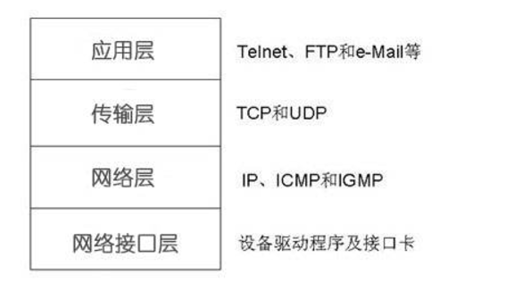

<font size=5 face='微软雅黑'>__文章目录__</font>
<!-- TOC -->

- [1 概述](#1-概述)
- [2 TCP/IP协议基础](#2-tcpip协议基础)
- [3 TCP编程](#3-tcp编程)
    - [3.1 服务端基本使用](#31-服务端基本使用)
    - [3.2 客户端基本使用](#32-客户端基本使用)
    - [3.3 通信流程](#33-通信流程)

<!-- /TOC -->

# 1 概述
&nbsp;&nbsp;&nbsp;&nbsp;&nbsp;&nbsp;&nbsp;&nbsp;自从互联网诞生以来，现在基本上所有的程序都是网络程序，很少有单机版的程序了。  
&nbsp;&nbsp;&nbsp;&nbsp;&nbsp;&nbsp;&nbsp;&nbsp;计算机网络就是把各个计算机连接到一起，让网络中的计算机可以互相通信。网络编程就是如何在程序中实现两台计算机的通信。  
&nbsp;&nbsp;&nbsp;&nbsp;&nbsp;&nbsp;&nbsp;&nbsp;举个例子，当你使用浏览器访问新浪网时，你的计算机就和新浪的某台服务器通过互联网连接起来了，然后，新浪的服务器把网页内容作为数据通过互联网传输到你的电脑上。  
&nbsp;&nbsp;&nbsp;&nbsp;&nbsp;&nbsp;&nbsp;&nbsp;由于你的电脑上可能不止浏览器，还有QQ、微信、邮件客户端等，不同的程序连接的别的计算机也会不同，所以，更确切地说，网络通信是两台计算机上的两个进程之间的通信。比如，浏览器进程和新浪服务器上的某个Web服务进程在通信，而QQ进程是和腾讯的某个服务器上的某个进程在通信。  
&nbsp;&nbsp;&nbsp;&nbsp;&nbsp;&nbsp;&nbsp;&nbsp;网络编程对所有开发语言都是一样的，Python也不例外。用Python进行网络编程，就是在Python程序本身这个进程内，连接别的服务器进程的通信端口进行通信。

# 2 TCP/IP协议基础  
&nbsp;&nbsp;&nbsp;&nbsp;&nbsp;&nbsp;&nbsp;&nbsp;计算机为了联网，就必须规定通信协议，早期的计算机网络，都是由各厂商自己规定一套协议，IBM、Apple和Microsoft都有各自的网络协议，互不兼容，这就好比一群人有的说英语，有的说中文，有的说德语，说同一种语言的人可以交流，不同的语言之间就不行了。  
&nbsp;&nbsp;&nbsp;&nbsp;&nbsp;&nbsp;&nbsp;&nbsp;后来为了打破这个局面，出现了一套全球通用协议族，叫做互联网协议，互联网协议包含了上百种协议标准，但是最重要的两个协议是TCP和IP协议，所以，大家把互联网的协议简称TCP/IP协议。  
&nbsp;&nbsp;&nbsp;&nbsp;&nbsp;&nbsp;&nbsp;&nbsp;通信的时候，双方必须知道对方的标识，好比发邮件必须知道对方的邮件地址。互联网上每个计算机的唯一标识就是IP地址，是由4个点分十进制数组成（例如：12.21.21.41）。  
&nbsp;&nbsp;&nbsp;&nbsp;&nbsp;&nbsp;&nbsp;&nbsp;下面是TCP/IP协议分层：  
  
&nbsp;&nbsp;&nbsp;&nbsp;&nbsp;&nbsp;&nbsp;&nbsp;TCP/UDP协议则是建立在IP协议之上的。TCP协议负责在两台计算机之间建立可靠连接，保证数据包按顺序到达。TCP协议会通过握手建立连接，然后，对每个IP包编号，确保对方按顺序收到，如果包丢掉了，就自动重发。相对于TCP(面向连接)来说，UDP则是面向无连接的协议，使用UDP协议时，不需要建立连接，只需要知道对方的IP地址和端口号，就可以直接发数据包。但是，能不能到达就不知道了。虽然用UDP传输数据不可靠，但它的优点是和TCP比，速度快，对于不要求可靠到达的数据，就可以使用UDP协议。  
&nbsp;&nbsp;&nbsp;&nbsp;&nbsp;&nbsp;&nbsp;&nbsp;许多常用的更高级的协议都是建立在TCP协议基础上的，比如用于浏览器的HTTP协议、发送邮件的SMTP协议等。  
&nbsp;&nbsp;&nbsp;&nbsp;&nbsp;&nbsp;&nbsp;&nbsp;一个IP包除了包含要传输的数据外，还包含源IP地址和目标IP地址，源端口和目标端口。那么端口有什么作用呢？在两台计算机通信时，只发IP地址是不够的，因为同一台计算机上跑着多个网络程序。一个IP包来了之后，到底是交给浏览器还是QQ，就需要端口号来区分。每个网络程序都向操作系统申请唯一的端口号，这样，两个进程在两台计算机之间建立网络连接就需要各自的IP地址和各自的端口号。

# 3 TCP编程
&nbsp;&nbsp;&nbsp;&nbsp;&nbsp;&nbsp;&nbsp;&nbsp;Socket称为安全套接字，是网络编程的一个抽象概念。通常我们用一个Socket表示'打开了一个网络链接'，而打开一个Socket需要知道目标计算机的IP地址和端口号，再指定协议类型即可。  
&nbsp;&nbsp;&nbsp;&nbsp;&nbsp;&nbsp;&nbsp;&nbsp;大多数连接都是可靠的TCP连接。创建TCP连接时，主动发起连接的叫客户端，被动响应连接的叫服务器。  
&nbsp;&nbsp;&nbsp;&nbsp;&nbsp;&nbsp;&nbsp;&nbsp;socket库是一个底层的用于网络通信的库，使用它我们可以便捷的进行网络交互的开发，下面以socket库为例，想要使用需要先引入`import socket`

## 3.1 服务端基本使用
根据TCP建立连接的三次握手机制，我们知道服务端想要提供服务，首先需要绑定IP地址，然后启动服务，监听端口等待客户端的连接，一旦有客户端连接访问，那么接下来就可以接受客户端发送的数据了。下面我来捋一下逻辑到代码的步骤：
1. 创建服务端
```python
socket = socket.socket(socket.AF_INET,socket.SOCK_STREAM)
```
2. 绑定IP地址和端口。
```python
socket.bind(('127.0.0.1',999))
```
3. 开始监听端口
```python
socket.listen()
```
4. 客户端连接
```python
sock, client_addr = socket.accept()
```
5. 接受数据
```python
sock.recv(1024)
```
6. 发送数据
```python
sock.send('data')
```
7. 关闭连接
```python
sock.close()
```

完成的代码：

```python
import socket
socket = socket.socket(socket.AF_INET,socket.SOCK_STREAM)
socket.bind(('127.0.0.1',999))
socket.listen()
sock, client_info = socket.accept()
data = sock.recv(1024)
sock.send(data)
sock.close()    # 关闭客户端socket连接
socket.close()  # 关闭服务器
```

## 3.2 客户端基本使用
根据TCP建立连接的三次握手机制，我们知道客户端想要连接服务端，首先创建TCP连接，使用某个端口号，连接服务端，然后发送/接受数据，然后关闭连接。下面我们来捋一下客户端的逻辑到代码的步骤:
1. 创建客户端
```python
socket = socket.socket(socket.AF_INET,socket.SOCK_STREAM)
```
2. 连接服务的
```python
socket.connect('127.0.0.1',999)
```
3. 发送数据
```python
socket.send('data')
```
4. 接受数据
```python
socket.recv(1024)
```
5. 关闭连接
```python
socket.close()
```

完整的代码:
```python
import socket

socket = socket.socket(socket.AF_INET, socket.SOCK_STREAM)
socket.connect(('127.0.0.1', 999))
socket.send(b'data')
data = socket.recv(1024)
print(data)
socket.close()   # 关闭客户端socket连接
```

## 3.3 通信流程
运行上面的代码我们就可以创建一个TCP服务端，和一个TCP客户端了，下面我们来了解一下，python哦socket的通讯流程:  


import  socket
client = socket.socket(socke.AF_INET，socket.SOCK_STREAM)  #指定这个socket链接的协议，以及指定数据流的类型
client.connect(('127.0.0.1',8080)) 　#连接server端,需要知道服务端的IP和PORT(元组的形式)
client.send('hello'.encode='UTF-8')  #发送消息，注意Python3中，传输的数据都是bytes格式的
server_msg = client.recv(1024)  #接收1024个字节的数据
print(server_msg)
socke.AF_INET 指的是使用 IPv4

socket.SOCK_STREAM 指定使用面向流的TCP协议
服务端：

&nbsp;&nbsp;&nbsp;&nbsp;&nbsp;&nbsp;&nbsp;&nbsp;和客户端编程相比，服务器编程就要复杂一些。

1
2
3
4
5
6
7
8
9
10
import socket
server = socket.socket(socket.AF_INET,socket.SOCK_STREAM) # 实例化一个链接
server.bind(('127.0.0.1',8080)) #server端监听一个地址，等待client连接
server.listen(5)  # 指定TCP连接池的可用连接个数，Linux中的backlog概念
conn,addr = server.accept() # 接收客户端连接，获取客户端的信息，会返回两个元素，连接标识符，和客户端的地址/端口（元组的形式）
client_msg = conn.recv(1024)   #接收1024个字节的数据
print(client_msg)
conn.send(client_msg.upper())   #通过连接标识符发送数据给客户端
conn.close()  # 关闭连接
server.close()  # 服务端关闭端口
小于1024的端口只有管理员才可以指定