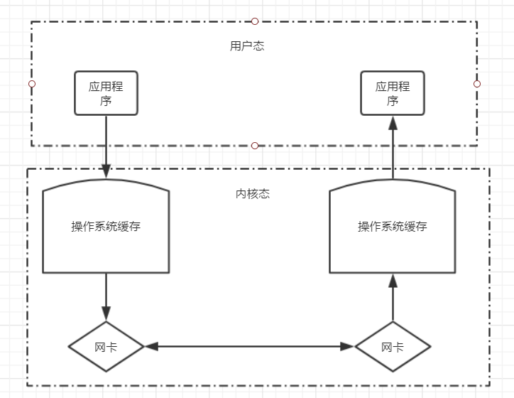

<font size=5 face='微软雅黑'>__文章目录__</font>
<!-- TOC -->

- [1 概述](#1-概述)
- [2 TCP/IP协议基础](#2-tcpip协议基础)
- [3 TCP编程](#3-tcp编程)
    - [3.1 通信流程](#31-通信流程)
    - [3.2 构建服务端](#32-构建服务端)
    - [3.3 构建客户端](#33-构建客户端)
    - [3.4 常用方法](#34-常用方法)
        - [3.4.1 makefile方法](#341-makefile方法)
    - [3.5 socket交互](#35-socket交互)
        - [3.4.1 通讯循环及客户端发空消息时的问题](#341-通讯循环及客户端发空消息时的问题)
        - [3.4.2 链接循环及客户端强制退出时的问题](#342-链接循环及客户端强制退出时的问题)
        - [3.4.3 模拟远程执行命令](#343-模拟远程执行命令)
    - [3.6 粘包问题](#36-粘包问题)
        - [3.6.1 struct模块](#361-struct模块)
        - [3.6.2 通过struct传递包头解决粘包问题](#362-通过struct传递包头解决粘包问题)
        - [3.6.3 大并发时的问题](#363-大并发时的问题)
    - [3.6 聊天室](#36-聊天室)
        - [3.6.1 聊天室之函数实现](#361-聊天室之函数实现)
        - [3.6.2 聊天室之类实现](#362-聊天室之类实现)

<!-- /TOC -->

# 1 概述
&nbsp;&nbsp;&nbsp;&nbsp;&nbsp;&nbsp;&nbsp;&nbsp;自从互联网诞生以来，现在基本上所有的程序都是网络程序，很少有单机版的程序了。  
&nbsp;&nbsp;&nbsp;&nbsp;&nbsp;&nbsp;&nbsp;&nbsp;计算机网络就是把各个计算机连接到一起，让网络中的计算机可以互相通信。网络编程就是如何在程序中实现两台计算机的通信。  
&nbsp;&nbsp;&nbsp;&nbsp;&nbsp;&nbsp;&nbsp;&nbsp;举个例子，当你使用浏览器访问新浪网时，你的计算机就和新浪的某台服务器通过互联网连接起来了，然后，新浪的服务器把网页内容作为数据通过互联网传输到你的电脑上。  
&nbsp;&nbsp;&nbsp;&nbsp;&nbsp;&nbsp;&nbsp;&nbsp;由于你的电脑上可能不止浏览器，还有QQ、微信、邮件客户端等，不同的程序连接的别的计算机也会不同，所以，更确切地说，网络通信是两台计算机上的两个进程之间的通信。比如，浏览器进程和新浪服务器上的某个Web服务进程在通信，而QQ进程是和腾讯的某个服务器上的某个进程在通信。  
&nbsp;&nbsp;&nbsp;&nbsp;&nbsp;&nbsp;&nbsp;&nbsp;网络编程对所有开发语言都是一样的，Python也不例外。用Python进行网络编程，就是在Python程序本身这个进程内，连接别的服务器进程的通信端口进行通信。

# 2 TCP/IP协议基础  
&nbsp;&nbsp;&nbsp;&nbsp;&nbsp;&nbsp;&nbsp;&nbsp;计算机为了联网，就必须规定通信协议，早期的计算机网络，都是由各厂商自己规定一套协议，IBM、Apple和Microsoft都有各自的网络协议，互不兼容，这就好比一群人有的说英语，有的说中文，有的说德语，说同一种语言的人可以交流，不同的语言之间就不行了。  
&nbsp;&nbsp;&nbsp;&nbsp;&nbsp;&nbsp;&nbsp;&nbsp;后来为了打破这个局面，出现了一套全球通用协议族，叫做互联网协议，互联网协议包含了上百种协议标准，但是最重要的两个协议是TCP和IP协议，所以，大家把互联网的协议简称TCP/IP协议。  
&nbsp;&nbsp;&nbsp;&nbsp;&nbsp;&nbsp;&nbsp;&nbsp;通信的时候，双方必须知道对方的标识，好比发邮件必须知道对方的邮件地址。互联网上每个计算机的唯一标识就是IP地址，是由4个点分十进制数组成（例如：12.21.21.41）。  
&nbsp;&nbsp;&nbsp;&nbsp;&nbsp;&nbsp;&nbsp;&nbsp;下面是TCP/IP协议分层：  
  
&nbsp;&nbsp;&nbsp;&nbsp;&nbsp;&nbsp;&nbsp;&nbsp;TCP/UDP协议则是建立在IP协议之上的。TCP协议负责在两台计算机之间建立可靠连接，保证数据包按顺序到达。TCP协议会`通过握手建立连接，然后，对每个IP包编号，确保对方按顺序收到，如果包丢掉了，就自动重发`。相对于TCP(面向连接)来说，UDP则是面向无连接的协议，`使用UDP协议时，不需要建立连接，只需要知道对方的IP地址和端口号，就可以直接发数据包`。但是，能不能到达就不知道了。虽然用UDP传输数据不可靠，但它的优点是和TCP比，速度快，对于不要求可靠到达的数据，就可以使用UDP协议。  
&nbsp;&nbsp;&nbsp;&nbsp;&nbsp;&nbsp;&nbsp;&nbsp;许多常用的更高级的协议都是建立在TCP协议基础上的，比如用于浏览器的HTTP协议、发送邮件的SMTP协议等。  
&nbsp;&nbsp;&nbsp;&nbsp;&nbsp;&nbsp;&nbsp;&nbsp;一个IP包除了包含要传输的数据外，还包含源IP地址和目标IP地址，源端口和目标端口。那么端口有什么作用呢？在两台计算机通信时，只发IP地址是不够的，因为同一台计算机上跑着多个网络程序。一个IP包来了之后，到底是交给浏览器还是QQ，就需要端口号来区分。每个网络程序都向操作系统申请唯一的端口号，这样，两个进程在两台计算机之间建立网络连接就需要各自的IP地址和各自的端口号。

# 3 TCP编程
&nbsp;&nbsp;&nbsp;&nbsp;&nbsp;&nbsp;&nbsp;&nbsp;Socket称为安全套接字，是网络编程的一个抽象概念。通常我们用一个Socket表示'打开了一个网络链接'，而打开一个Socket需要知道目标计算机的IP地址和端口号，再指定协议类型即可。  
&nbsp;&nbsp;&nbsp;&nbsp;&nbsp;&nbsp;&nbsp;&nbsp;大多数连接都是可靠的TCP连接。创建TCP连接时，主动发起连接的叫客户端，被动响应连接的叫服务器。  
&nbsp;&nbsp;&nbsp;&nbsp;&nbsp;&nbsp;&nbsp;&nbsp;socket库是一个底层的用于网络通信的库，使用它我们可以便捷的进行网络交互的开发，下面以socket库为例，想要使用需要先引入`import socket`


## 3.1 通信流程
我们先来了解一下，python的socket的通讯流程:  
  

服务端：
1. 创建Socket对象
2. 绑定IP地址Address和端口Port，使用bind方法，IPv4地址为一个二元组('IP',Port)，`一个TCP端口只能被绑定一次`
3. 开始监听，将在指定的IP的端口上监听。listen方法
4. 获取用于传输数据的Socket对象，accept方法。
5. 接受数据，recv方法，使用缓冲区接受数据
6. 发送数据，send方法，类型为bytes
7. 关闭连接
> 客户端关闭连接时，服务端只需要关闭与之相连的socket即可，服务端不用关闭，因为还有其他客户端会连接

客户端：
1. 创建Socket对象
2. 连接服务端。connect方法
3. 发送数据，send方法，类型为bytes
4. 接受数据，recv方法，使用缓冲区接受数据
5. 关闭连接


## 3.2 构建服务端
&nbsp;&nbsp;&nbsp;&nbsp;&nbsp;&nbsp;&nbsp;&nbsp;服务端想要提供服务，首先需要绑定IP地址，然后启动服务，监听端口等待客户端的连接，一旦有客户端连接访问，那么接下来就可以接受客户端发送的数据了。根据上图，以及建立服务端的流程，我门来捋一下服务端的逻辑到代码的步骤：
1. 创建服务端
```python
socket = socket.socket(socket.AF_INET,socket.SOCK_STREAM)
# socke.AF_INET 指的是使用 IPv4
# socket.SOCK_STREAM 指定使用面向流的TCP协议
```
2. 绑定IP地址和端口。
```python
socket.bind(('127.0.0.1',999))  
# 小于1024的端口只有管理员才可以指定
```
3. 开始监听端口
```python
socket.listen()
```
4. 客户端连接(阻塞)
```python
sock, client_addr = socket.accept() 
# 返回二元组，socket连接和客户端的IP及Port元祖
```
5. 接受数据(阻塞)
```python
data = sock.recv(1024) 
# 接收1024个字节的数据，一般是2的倍数,bytes格式
```
6. 发送数据
```python
sock.send('data'.encode()) # bytes格式
```
7. 关闭连接
```python
sock.close()
```

完成的代码：

```python
import socket
socket = socket.socket(socket.AF_INET,socket.SOCK_STREAM)
socket.bind(('127.0.0.1',999))
socket.listen()
sock, client_info = socket.accept()
data = sock.recv(1024)
sock.send(data)
sock.close()    # 关闭客户端socket连接
socket.close()  # 关闭服务器
```

## 3.3 构建客户端
&nbsp;&nbsp;&nbsp;&nbsp;&nbsp;&nbsp;&nbsp;&nbsp;根据TCP建立连接的三次握手机制，我们知道客户端想要连接服务端，首先创建TCP连接，使用某个端口号，连接服务端，然后发送/接受数据，然后关闭连接。根据上图，以及建立客户端的流程，我们来捋一下客户端的逻辑到代码的步骤:
1. 创建客户端
```python
socket = socket.socket(socket.AF_INET,socket.SOCK_STREAM) 
# 默认就是socket.AF_INET,socket.SOCK_STREAM，所以TCP时，可以直接socket.socket()
```
2. 连接服务的
```python
socket.connect('127.0.0.1',999)
```
3. 发送数据
```python
socket.send('data'.encode())
```
4. 接受数据
```python
data = socket.recv(1024)
```
5. 关闭连接
```python
socket.close()
```

完整的代码:
```python
import socket

socket = socket.socket(socket.AF_INET, socket.SOCK_STREAM)
socket.connect(('127.0.0.1', 999))
socket.send(b'data')
data = socket.recv(1024)
print(data)
socket.close()   # 关闭客户端socket连接
```

## 3.4 常用方法
在初始化时，socket方法提供了不同的参数，用于指定不同的链接类型以及不同的IP地址类型。  
IP协议相关：
1. `AF_INET`：IPV4
2. `AF_INET`: IPV6
3. `AF_UNIX`: Unix Domain Socket(windows没有)

Socket类型：
1. `SOCK_STREM`: 面向连接的套接字。TCP协议
2. `SOCK_DGRAM`: 无连接的数据报文套接字。UDP协议

> 默认情况下 socket.socket()的参数为AF_INET，SOCK_STREM，所以如果需要的是IPv4的TCP连接，可以直接实例化即可

服务器端套接字:  

|函数|描述|
|-----|-----|
`s.bind()`|绑定地址（host,port）到套接字， 在AF_INET下,以元组（host,port）的形式表示地址。
`s.listen()`|开始TCP监听。backlog指定在拒绝连接之前，操作系统可以挂起的最大连接数量。该值至少为1，大部分应用程序设为5就可以了。
`s.accept()`|被动接受TCP客户端连接,(阻塞式)等待连接的到来

客户端套接字:  

|函数|描述|
|-----|-----|
`s.connect()`|主动初始化TCP服务器连接，。一般address的格式为元组（hostname,port），如果连接出错，返回socket.error错误。
s.connect_ex()|connect()函数的扩展版本,出错时返回出错码,而不是抛出异常

公共用途的套接字函数:  

|函数|描述|
|-----|-----|
`s.recv()`|接收TCP数据，数据以字符串形式返回，bufsize指定要接收的最大数据量。flag提供有关消息的其他信息，通常可以忽略。
`s.send()`|发送TCP数据，将string中的数据发送到连接的套接字。返回值是要发送的字节数量，该数量可能小于string的字节大小。
s.sendall()|完整发送TCP数据，完整发送TCP数据。将string中的数据发送到连接的套接字，但在返回之前会尝试发送所有数据。成功返回None，失败则抛出异常。
`s.recvfrom()`|接收UDP数据，与recv()类似，但返回值是（data,address）。其中data是包含接收数据的字符串，address是发送数据的套接字地址。
`s.sendto()`|发送UDP数据，将数据发送到套接字，address是形式为（ipaddr，port）的元组，指定远程地址。返回值是发送的字节数。
`s.close()`|关闭套接字
s.getpeername()|返回连接套接字的远程地址。返回值通常是元组（ipaddr,port）。
s.getsockname()|返回套接字自己的地址。通常是一个元组(ipaddr,port)
s.setsockopt(level,optname,value)|设置给定套接字选项的值。
s.getsockopt(level,optname[.buflen])|返回套接字选项的值。
s.settimeout(timeout)|设置套接字操作的超时期，timeout是一个浮点数，单位是秒。值为None表示没有超时期。一般，超时期应该在刚创建套接字时设置，因为它们可能用于连接的操作（如connect()）
s.gettimeout()|返回当前超时期的值，单位是秒，如果没有设置超时期，则返回None。
s.fileno()|返回套接字的文件描述符。
`s.setblocking(flag)`|如果flag为0，则将套接字设为非阻塞模式，否则将套接字设为阻塞模式（默认值）。非阻塞模式下，如果调用recv()没有发现任何数据，或send()调用无法立即发送数据，那么将引起socket.error异常。
`s.makefile()`|创建一个与该套接字相关连的文件

### 3.4.1 makefile方法
这里单独把makefile方法抽出来，是因为它可以让我们用操作文件的方式来操作socket。makefile的用法如下：
```python
makefile(self, mode="r", buffering=None, *,encoding=None, errors=None, newline=None):
```
&nbsp;&nbsp;&nbsp;&nbsp;&nbsp;&nbsp;&nbsp;&nbsp;看这些参数是不是很眼熟？没错，和open函数的参数差不多是相同的，默认情况下模式为r，如果是socket的话，我们知道可以接受数据，也可以发送数据，对应的文件上的话，就是可以读取也可以写入，所以模式应该为`'rw'`。
> makefile的mode模式，只有'rw'，没有'r+'，这点和文件打开方式不同。
```python
import socket

server = socket.socket(socket.AF_INET, socket.SOCK_STREAM)
server.bind(('127.0.0.1', 8080))
server.listen(5)
while True:  # 链接循环
    print('wait for connect')
    conn, addr = server.accept()
    print('client connect', addr)
    f = conn.makefile(mode='rw')   # 创建一个 类file对象
    while True:
        try:  # Windows下捕捉客户端异常关闭连接
            print('~~~~~~~~~')
            client_msg = f.readline()   # 从缓冲区中读取数据
            print(client_msg)
            if not client_msg: break  # Linux下处理客户端异常退出问题
            print('client msg :', client_msg)
            f.write(client_msg.upper())  # 向缓冲区写入数据
            f.flush()
        except (ConnectionResetError, Exception):  # except可以同时指定多个异常
            print('1')
            break
    conn.close()
server.close()
```
> 直接用不太好用，使用read方法时，由于无法知道要读取多少字节，所以会有各种问题，可以引用封装，将要发送的数据总大小，按照固定4个字节发到服务端，告诉服务端后面的数据有多少，然后服务端动态指定read的字节数即可。


## 3.5 socket交互
上面写的代码只能通讯一次，就结束连接了。正经的socket交互是那种有来有往的，并不是这样这种，所以我们需要进行修改。
### 3.4.1 通讯循环及客户端发空消息时的问题
抛出问题：
1. 通讯不应该是单次的，应该至少是多次的
2. 如果我们发送的消息为空的时候，就会卡住，服务端无法接受，客户端无法继续发送  

针对问题做如下改进：

服务端：增加循环，完成通信循环，并且把客户端发来的消息转换成大写的并返回。
```python
import socket

server = socket.socket(socket.AF_INET,socket.SOCK_STREAM)
server.bind(('127.0.0.1',8080))
server.listen(5)
print('wait for connect')
conn,addr = server.accept()
print('client connect',addr)
while True:    #循环的接受消息
    client_msg = conn.recv(1024)
    print('client msg :', client_msg)
    conn.send(client_msg.upper())

conn.close()
server.close()
```
客户端：增加循环，完成通信循环，并且发送的消息由用户来输入，当输入为空的时候，继续循环。
```ython
import socket

client = socket.socket(socket.AF_INET,socket.SOCK_STREAM)
client.connect(('127.0.0.1',8080))
while True:    # 通信循环
    msg = input('>>:').strip()
    if not msg:continue        # 当用户输入为空的时候，继续循环
    client.send(msg.encode('utf-8'))
    server_msg = client.recv(1024)
    print(server_msg.decode('utf-8'))
client.close()
```
### 3.4.2 链接循环及客户端强制退出时的问题
抛出问题:  
1. 当客户端异常关闭一个链接的时候，服务端也会产生异常
    - windows下会异常退出（由于tcp是双向链接的，客户端异常退出，那么服务端就不能继续循环的收发消息了）
    - Linux下会进入死循环（收到了空消息）  
2. 当一个客户端连接断开，服务端应该可以继续接受其它客户端发来的消息  

由于问题集中在服务端，所以对服务端做如下改进：
1. 添加链接循环，当一个链关闭时，可以继续接受其他链接。
2. 添加异常处理，当客户端异常关闭时，主动的关闭服务端的链接。
```python
import socket

server = socket.socket(socket.AF_INET,socket.SOCK_STREAM)
server.bind(('127.0.0.1',8080))
server.listen(5)
while True:     #链接循环
    print('wait for connect')
    conn,addr = server.accept()
    print('client connect',addr)
    while True:
        try:       #Windows下捕捉客户端异常关闭连接
            client_msg = conn.recv(1024)
            if not client_msg:break     #Linux下处理客户端异常退出问题
            print('client msg :', client_msg)
            conn.send(client_msg.upper())
        except (ConnectionResetError,Exception):   #except可以同时指定多个异常
            break
    conn.close()
server.close()
```
客户端异常关闭时，服务端的异常为：ConnectionResetError，我们可以通过捕捉其，来控制服务端的推出，也可以使用 Exception(通用)异常来捕捉。
### 3.4.3 模拟远程执行命令
利用socket，远程执行命令，并返回，模拟ssh的效果
1. 执行命令使用subprocess模块的Popen和PIPE
2. 注意subprocess的Popen模块执行结果就是bytes格式的str，所以不用转换即可直接发送  

以上需求都针对服务端，那么对服务端做如下修改
```python
import socket
from subprocess import Popen,PIPE

server = socket.socket(socket.AF_INET,socket.SOCK_STREAM)
# server.bind(('192.168.56.200',8080))
server.bind(('127.0.0.1',8080))
server.listen(5)
while True:
    print('wait for connect')
    conn,addr = server.accept()
    print('client connect',addr)
    while True:
        try:
            cmd = conn.recv(1024).strip()
            if not cmd:break
            p = Popen(cmd.decode('utf-8'),shell=True,stdout=PIPE,stderr=PIPE)
            stdout,stderr = p.communicate() 　　#执行的结果就是bytes格式的string
            if stderr:
                conn.send(stderr)
            else:
                conn.send(stdout)
        except (ConnectionResetError,Exception):
            break
    conn.close()
server.close()
```

## 3.6 粘包问题
&nbsp;&nbsp;&nbsp;&nbsp;&nbsp;&nbsp;&nbsp;&nbsp;由于我们在接受和发送数据的时候，都指定了每次接收1024个字节的数据，而发送的数据我们是不可估量的，如果发送的时候超过1024字节，那么在接收端就无法一次收取完毕，这些数据会存放在操作系统缓存中，那么下次再接收1024字节的数据的时候，会从缓存中继续读取，那么就会发生粘包现象。  
&nbsp;&nbsp;&nbsp;&nbsp;&nbsp;&nbsp;&nbsp;&nbsp;所谓粘包问题主要还是因为接收方不知道消息之间的界限，不知道一次性提取多少字节的数据所造成的。  
__只有TCP有粘包现象，UDP永远不会粘包__
1. UDP是面向报文的，发送方的UDP对应用层交下来的报文，不合并，不拆分，只是在其上面加上首部后就交给了下面的网络层，也就是说无论应用层交给UDP多长的报文，它统统发送，一次发送一个。而对接收方，接到后直接去除首部，交给上面的应用层就完成任务了。因此，它需要应用层控制报文的大小
2. TCP是面向字节流的，它把上面应用层交下来的数据看成无结构的字节流来发送，可以想象成流水形式的，发送方TCP会将数据放入“蓄水池”（缓存区），等到可以发送的时候就发送，不能发送就等着，TCP会根据当前网络的拥塞状态来确定每个报文段的大小。  

__不是server端直接发送，client端直接接收__  
1. 服务端  
    - 应用程序是运行在用户态的，发送数据的时候，需要去调用物理网卡，而这个操作是不许允许的，必须预先将运行状态切换为内核态才可以操作网卡发送数据，所以引入操作系统缓存的概念。
    - 应用程序把需要进行系统调用（用户态-->内核态的切换）的指令放入操作系统缓存，然后由操作系统统一去执行。  
2. 客户端  
    - 操作系统把从网卡接收到的数据存入操作系统缓存中去，供应用程序读取
    - 应用程序直接从操作系统缓存中将数据读出，然后进行处理  
    
整个过程如图：  
  

__`发生黏包的本质问题是对端不知道我们发送数据的总长度，如果能否让对方提前知道，那么就不会发生粘包现象`__。根据TCP报文的格式得到启发：
1. 发送真正的数据前，需要预先发送本次传送的报文大小（增加报头）
2. 报头的长度必须是固定的

### 3.6.1 struct模块
&nbsp;&nbsp;&nbsp;&nbsp;&nbsp;&nbsp;&nbsp;&nbsp;如果我们要预先传递数据的大小（int型），那么就需要把它当作数据传输，当服务端收到以后，就知道后续的数据大小了，那么一次传输的数据到底占多少字节呢，Python的struct模块可以帮助我们实现这个过程，当传递诸如int、char之类的基本数据的时候，struct提供了一种机制将这些特定的结构体类型打包成二进制流的字符串然后再网络传输，接收端也应该可以通过struct模块进行解包还原出原始的结构体数据。
- struct.pack()  打包
```python
struct.pack('i'，int)
# i表示把数字用4个字节进行表示，这样的话就可以表示2的32次方的数字，已经满足需求
# 后面的int表示要打包的数字（要发送的报文长度）
# 通过struct.pack 会得到bytes格式的数据，可以直接进行发送
```
- struct.unpack() 解包
```python
struct.unpack('i',obj)
# obj表示收取到数据
# 会返回一个元组，元组的第一个元素为对方传过来的报文长度
# 可以复制给一个变量来指定接收的报文长度
```
> 更多的用法需自行查找struct模块的官方文档。
### 3.6.2 通过struct传递包头解决粘包问题
```python
# 服务端 
#!/usr/bin/env python
# Author:Lee Sir 
#_*_ coding:utf-8 _*_ 

import socket 
from subprocess import Popen,PIPE 
import struct 

server = socket.socket(socket.AF_INET,socket.SOCK_STREAM) 
server.bind(('127.0.0.1',8000)) 
server.listen(5) 

while True: 
    print('等待连接......') 
    conn,addr = server.accept() 
    print('客户端地址为：',addr) 
        while True: 
            try: 
                cmd_bytes = conn.recv(1024) 
                if not cmd_bytes:continue 
                cmd_str = cmd_bytes.decode('utf-8') 
                print('执行的命令是：',cmd_str) 

                #执行命令 
                p = Popen(cmd_str,shell=True,stdout=PIPE,stderr=PIPE) 
                stdout,stderr = p.communicate() 

                #返回的数据 
                if stderr: 
                    send_data = stderr 
                else: 
                    send_data = stdout 

                #构建报头并发送报头 
                conn.send(struct.pack('i',len(send_data))) 

                #发送数据 
                conn.send(send_data) 
            except Exception: 
                break 
```
客户端 
```python
#!/usr/bin/env python 
# Author:Lee Sir 
#_*_ coding:utf-8 _*_ 

import socket 
import struct 

client = socket.socket(socket.AF_INET,socket.SOCK_STREAM) client.connect(('127.0.0.1',8000)) 

while True: 
    msg = input('Please input msg: ') 
    if not msg:continue 
    client.send(msg.encode('utf-8')) 

    #接收报头,服务端使用i模式,所以固定是4个字节 
    server_data_head = client.recv(4) 
    server_data_len = struct.unpack('i',server_data_head)[0] 

    #根据传递的报头长度接收报文 
    server_data = client.recv(server_data_len) 
    print(server_data.decode('gbk'))
```
### 3.6.3 大并发时的问题
当数据量比较大以及需要额外其他数据的场合下，以上的解决方案就有问题
1. 数据量非常大，上百T，在打包的时候有可能struct.pack的i模式无法满足需求，因为只能打长度为2的32次方的数据，虽然可以使用Q模式，支持2的64次方，但是也不能准确的预测是否满足数据的最大长度，另外客户端直接接受那么大的数据就显得非常笨拙，也很吃力
2. 在下载的场景下，我们可能需要的数据还有文件名、以及hash值  

针对上面的问题有以下解决方案：
1. 客户端接收的时候分段接收
2. 定义字典记录报文的长度，以及其他需求：比如filename，hash值等其他信息  

服务端
```python
#!/usr/bin/env python
# Author:Lee Sir
#_*_ coding:utf-8 _*_

import socket
from subprocess import Popen,PIPE
import struct
import json

server = socket.socket(socket.AF_INET,socket.SOCK_STREAM)
server.setsockopt(socket.SOL_SOCKET,socket.SO_REUSEADDR,1)
server.bind(('127.0.0.1',8080))
server.listen(5)

while True:
    print('等待连接......')
    conn,addr = server.accept()
    print('客户端地址为：',addr)
    while True:
        try:
            cmd_bytes = conn.recv(1024)
            if not cmd_bytes:continue
            cmd_str = cmd_bytes.decode('utf-8')
            print('执行的命令是：',cmd_str)

            #执行命令
            p = Popen(cmd_str,shell=True,stdout=PIPE,stderr=PIPE)
            stdout,stderr = p.communicate()

            #返回的数据
            if stderr:
                send_data = stderr
            else:
                send_data = stdout

            #创建报头内容及获取包头长度
            file_dict = {'filename':None,'hash':None,'size':len(send_data)}
            file_json = json.dumps(file_dict).encode('utf-8')
            file_json_len = len(file_json)

            #构建报头
            file_head = struct.pack('i',file_json_len)

            #发送报头长度
            conn.send(file_head)

            #发送报头
            conn.send(file_json)

            #发送数据
            conn.send(send_data)

        except Exception:
            break
```
客户端:
```python
#!/usr/bin/env python
# Author:Lee Sir

import socket
import struct
import json

client = socket.socket(socket.AF_INET,socket.SOCK_STREAM)
client.connect(('127.0.0.1',8080))

while True:
    msg = input('Please input msg: ')
    if not msg:continue
    client.send(msg.encode('utf-8'))

    #接收报头,服务端使用i模式,所以固定是4个字节
    server_file_head = client.recv(4)
    server_file_len = struct.unpack('i',server_file_head)[0]

    #接收报文头部信息
    server_head_file = client.recv(server_file_len)

    #报文头部信息
    server_head =  json.loads(server_head_file.decode('gbk'))

    #获取报文的头部信息
    server_file_name = server_head['filename']
    server_file_hash = server_head['hash']
    server_file_size = server_head['size']

    #根据传递的报头长度分段接收报文
    recv_len = 0
    server_data = b''
    while recv_len < server_file_size:
        recv_data = client.recv(1024)
        server_data += recv_data
        recv_len += len(recv_data)

    print(server_data.decode('gbk'))
```
## 3.6 聊天室
下面我们来写一个小项目，聊天室，客户端发送的消息需要转发给所有已在线的客户端，下面是实现方法：
### 3.6.1 聊天室之函数实现
服务端代码：
```python
import socket
import threading


def recv(s: socket.socket, clients, lock):
    addr = s.getpeername()   # 获取对端IP地址

    # 通信循环
    while True:
        try:
            data = s.recv(1024)
            print(data)
            if not data: break

            # 群发消息，需要加锁，防止在遍历的同时，客户端断开连接时，触发字典修改操作
            with lock:
                for conn in clients.values():    
                    conn.send('{}:{} {}'.format(*addr,data.decode()).encode()) 
        except (ConnectionResetError, OSError):   # 当客户端断开连接时
            s.close()

            # 在已连接列表中删除关闭的连接
            with lock:
                clients.pop(addr)  
            break

def accept(server: socket.socket, clients, lock):
     # 连接循环等待客户端连接
    while True:
        conn, addr = server.accept() 
        print('{} is comming'.format(addr))
        with lock:
            clients[addr] = conn
        threading.Thread(target=recv, name='recv', args=(conn, clients, lock)).start()  # 启动连接线程


if __name__ == '__main__':

    # 存放所有client列表，用于消息群发
    clients = {}  

    # 创建锁文件，在修改clients时加锁
    lock = threading.Lock()   

    server = socket.socket()
    server.bind(('127.0.0.1', 9999))
    server.listen()

    print('start Server!!!')
    
    # 启动accept线程
    threading.Thread(target=accept, name='accept', args=(server, clients, lock), daemon=True).start()   
    while True:
        cmd = input('>>>>').strip().lower()
        if cmd == 'quit':
            break
        else:
            print(threading.enumerate())

    server.close()
```

客户端代码：
```python
import socket
import threading

def recvdata(s: socket.socket, event: threading.Event):
    while True:
        try:
            data = s.recv(1024)
            print(data.decode())
       except (ConnectionResetError, OSError):
            event.set()   # 如果服务端断开连接，触发事件
            break

if __name__ == '__main__':
    event = threading.Event()
    client = socket.socket(socket.AF_INET, socket.SOCK_STREAM)
    client.connect(('127.0.0.1', 9999))

    # 启动接受线程
    threading.Thread(target=recvdata, name='recv', args=(client, event)).start()

    # 通讯循环，当服务端断开连接时，结束
    while not event.is_set():  

        msg = input('>>:').strip()
        if not msg: continue 
        if msg.upper() == 'quit':
            break
        client.send(msg.encode('utf-8'))
    print('服务端断开')
    client.close()
```

### 3.6.2 聊天室之类实现
服务端:
```python
import socket
import threading
import datetime
import logging

FORMAT = '%(asctime)s %(message)s'
logging.basicConfig(level=logging.INFO, format=FORMAT)


class ChatTcpServer:

    """
    self.ip: 服务端地址
    self.port：服务端端口
    self.socket：创建一个socket对象，用于socket通信
    self.event：创建一个事件对象，用于控制链接循环
    self.clients：记录当前已连接的客户端
    self.lock：用于多线程添加修改clients对象时的锁
    """

    def __init__(self, ip, port):
        self.ip = ip
        self.port = port
        self.socket = socket.socket()
        self.event = threading.Event()
        self.clients = {}
        self.lock = threading.Lock()

    def start(self):
        self.socket.bind((self.ip, self.port))
        self.socket.listen()
        threading.Thread(target=self.accept, name='accept', daemon=True).start()
        logging.info('ChatServer Starting!!!')

    def accept(self):
        while not self.event.is_set():
            conn, client_addr = self.socket.accept()

            # 把连接的客户端保存，用于广播消息
            with self.lock:
                self.clients[client_addr] = conn
            logging.info('{}:{} is comming'.format(*client_addr))
            threading.Thread(target=self.recv, name='recv', args=(conn, client_addr), daemon=True).start()

    def recv(self, sock, client_addr):
        while True:
            try:
                data = sock.recv(1024)

            # windows 代码客户端主动关闭时，不会发送b'',服务端会直接异常。这里添加异常捕捉，当客户端强制关闭时，删除socket
            except (ConnectionResetError, OSError):
                with self.lock:
                    self.clients.pop(client_addr)
                logging.info('{}:{} is down'.format(*client_addr, ))
                break

            # 某些客户端在强制关闭时会发送b''，这里添加相关判断
            if data == b'quit' or data == b'':
                with self.lock:
                    self.clients.pop(client_addr)
                logging.info('{}:{} is down'.format(*client_addr, ))
                break

            # 日志及消息信息
            logging.info('{}:{} {}'.format(*client_addr, data.decode()))
            msg = '{} {}:{} {}'.format(datetime.datetime.now(), *client_addr, data.decode()).encode()

            # 广播发送消息
            with self.lock:
                for client in self.clients.values():
                    client.send(msg)

    def stop(self):
        self.event.set()

        # 关闭所有还在存活的client连接
        with self.lock:
            for client in self.clients.values():
                client.close()
        self.socket.close()


def main():
    cts = ChatTcpServer('127.0.0.1', 9999)
    cts.start()

    while True:
        cmd = input('>>>').strip()
        if cmd.lower() == 'quit':
            cts.stop()
            break
        else:
            print(threading.enumerate())


if __name__ == '__main__':
    main()
```
客户端:
```python
import socket
import threading
import datetime
import logging

FORMAT = '%(asctime)s %(message)s'
logging.basicConfig(level=logging.INFO, format=FORMAT)


class ChatTCPClient:

    """
    self.ip: 服务端地址
    self.port：服务端端口
    self.socket：创建一个socket对象，用于socket通信
    self.event：创建一个事件对象，用于控制链接循环
    """

    def __init__(self, ip, port):
        self.ip = ip
        self.port = port
        self.socket = socket.socket()
        self.event = threading.Event()

    def connect(self):
        self.socket.connect((self.ip, self.port))
        threading.Thread(target=self.recv, name='recv',daemon=True).start()

    def recv(self):
        while not self.event.is_set():

            # 某些服务端强制关闭时，会出b''，这里进行判断
            try:
                data = self.socket.recv(1024)
                if data == b'':
                    self.event.set()
                    logging.info('{}:{} is down'.format(self.ip, self.port))
                    break
                logging.info(data.decode())

            # 有些服务端在关闭时不会触发b''，这里会直接提示异常，这里进行捕捉
            except (ConnectionResetError,OSError):
                self.event.set()
                logging.info('{}:{} is down'.format(self.ip, self.port))

    def send(self, msg):
        self.socket.send(msg.encode())

    def stop(self):
        self.socket.close()


if __name__ == '__main__':
    ctc = ChatTCPClient('127.0.0.1', 9999)
    ctc.connect()

    while True:
        info = input('>>>>:').strip()
        if not info: continue
        if info.lower() == 'quit':
            logging.info('bye bye')
            ctc.stop()
            break
        if not ctc.event.is_set():
            ctc.send(info)
        else:
            logging.info('Server is down...')
            break
```