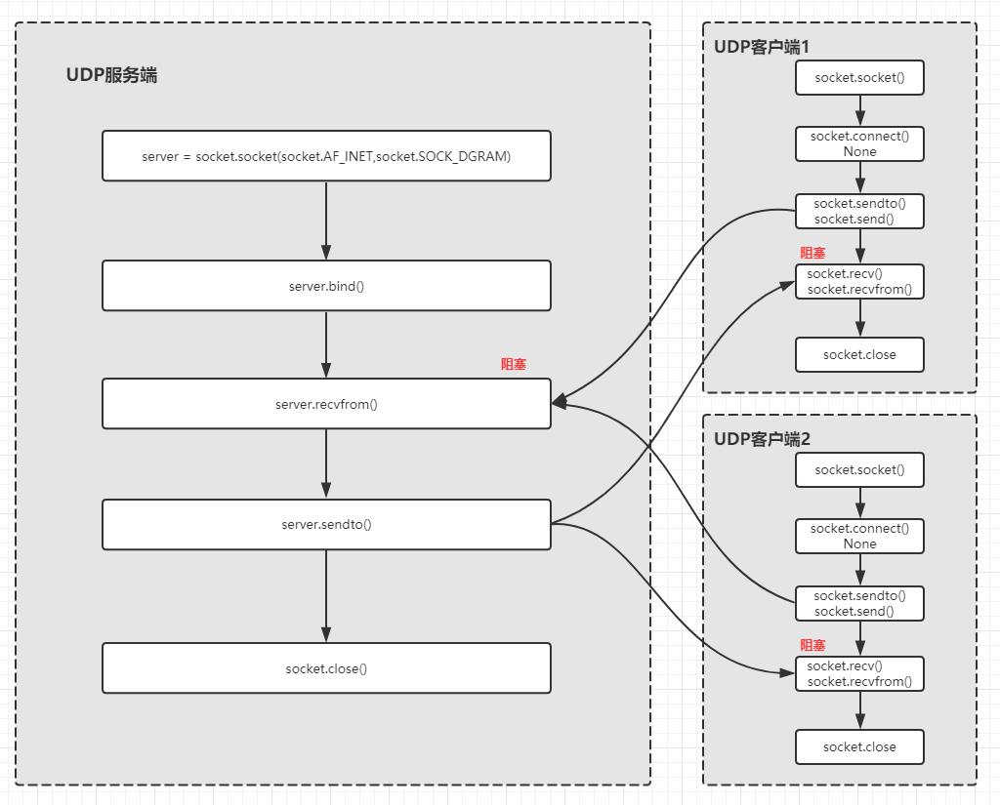

<font size=5 face='微软雅黑'>__文章目录__</font>
<!-- TOC -->

- [1 UDP协议](#1-udp协议)
- [2 UDP通信流程](#2-udp通信流程)
- [3 UDP编程](#3-udp编程)
    - [3.1 构建服务端](#31-构建服务端)
    - [3.2 构建客户端](#32-构建客户端)
    - [3.3 常用方法](#33-常用方法)
- [4 聊天室](#4-聊天室)

<!-- /TOC -->
# 1 UDP协议
UDP是面向无连接的协议，`使用UDP协议时，不需要建立连接，只需要知道对方的IP地址和端口号，就可以直接发数据包`。但是，能不能到达就不知道了。虽然用UDP传输数据不可靠，但它的优点是和TCP比，速度快，对于不要求可靠到达的数据，就可以使用UDP协议。

# 2 UDP通信流程
我们先来了解一下，python的socket的通讯流程:  
  

服务端：
1. 创建Socket对象
2. 绑定IP地址Address和端口Port，使用bind方法，IPv4地址为一个二元组('IP',Port)，`一个UDP端口只能被绑定一次`
3. 接受数据，recvfrom方法，使用缓冲区接受数据
4. 发送数据，sendto方法，类型为bytes
5. 关闭连接

客户端：
1. 创建Socket对象
2. 连接服务端。connect方法（可选）
3. 发送数据，sendto/send方法，类型为bytes
4. 接受数据，recvfrom/recv方法，使用缓冲区接受数据
5. 关闭连接

>我们可以看到UDP不需要维护一个连接，所以比较简单

# 3 UDP编程
&nbsp;&nbsp;&nbsp;&nbsp;&nbsp;&nbsp;&nbsp;&nbsp;使用udp编程和使用tcp编程用于相似的步骤，而因为udp的特性，它的服务端不需要监听端口，并且客户端也不需要事先连接服务端。根据上图，以及建立服务端的流程，我门来捋一下服务端的逻辑到代码的步骤：

## 3.1 构建服务端
1. 创建服务端
```python
socket = socket.socket(socket.AF_INET,socket.SOCK_DGRAM)
# socke.AF_INET 指的是使用 IPv4
# socket.SOCK_STREAM 指定使用面向数据报的UDP协议
```
2. 绑定IP地址和端口。
```python
socket.bind(('127.0.0.1',999))  
# 小于1024的端口只有管理员才可以指定
```
3. 接受数据(阻塞)
```python
data, client_info = sock.recvfrom(1024) 
# 返回一个元组，数据和客户端的地址，因为UDP没有连接，所以只能通过提取消息的发送的源地址，才能在应答时指定对方地址
```
6. 发送数据
```python
sock.sendto('data'.encode(),('127.0.0.1',999)) # bytes格式
# 第二个参数为客户端地址
```
7. 关闭连接
```python
sock.close()
```
完成的代码：
```python
import socket

server = socket.socket(socket.AF_INET, socket.SOCK_DGRAM)      # 指定socket的协议，UDP使用的是SOCK_DGRAM
server.bind(('127.0.0.1', 9999))                               # 绑定端口
 
print('UDP Server is Starting...')
data, addr = server.recvfrom(1024)                             # 接受(包含数据以及客户端的地址)
print('Received from {}'.format(addr))
server.sendto('hello,{}'.format(addr).encode('utf-8'), addr)   # 应答，格式为(应答的数据，客户端的IP和Port元组)
```
为什么要使用recvfrom/sendto?
1. UDP无连接的特性，当服务端收到一条消息时，不会为它维护一个socket的，那么如何应答呢？
2. UDP报文中包含对方的IP和Port信息，使用recvfrom，就会返回对方发送的数据和对方的地址
3. sendto由于没有socket的特性，所以应答时也需要传递client的地址和端口
## 3.2 构建客户端
1. 创建客户端
```python
socket = socket.socket(socket.AF_INET,socket.SOCK_DGRAM)
# socke.AF_INET 指的是使用 IPv4
# socket.SOCK_STREAM 指定使用面向数据报的UDP协议
```
2. 添加服务端地址信息（可选）。
```python
socket.connect(('127.0.0.1',999))  
# UDP不会创建连接，所以这里仅仅是在socket上添加了本段/对端的地址而已，并不会发起连接
```
3. 接受数据(阻塞)
```python
data, client_info = sock.recv(1024) 
# 返回一个元组，数据和客户端的地址，因为UDP没有连接，所以只能通过提取消息的发送的源地址，才能在应答时指定对方地址
```
4. 发送数据
```python
sock.sendto('data'.encode(),('127.0.0.1',999)) # bytes格式
# 第二个参数为客户端地址
```
5. 关闭连接
```python
sock.close()
```
为什么connect是可选的？
1. 当执行connect时，由于UDP的特性，并不会为我们创建连接，这里仅仅是在socket上添加了对端的地址而已，并不会发起连接
```python
import socket

client = socket.socket(socket.AF_INET, socket.SOCK_DGRAM)
print(client) # <socket.socket fd=140, family=AddressFamily.AF_INET, type=SocketKind.SOCK_DGRAM, proto=0>
client.connect(('127.0.0.1', 9999))
print(client) # <socket.socket fd=140, family=AddressFamily.AF_INET, type=SocketKind.SOCK_DGRAM, proto=0, laddr=('127.0.0.1', 51859), raddr=('127.0.0.1', 9999)>
```
2. 如果不执行connect，那么在使用send发生时，就无法知道对端的IP地址，那么只能使用sendto来指定了。
3. 为什么接收时使用recv，因为是client，只会有server应答消息，所以就不需要来区分了。
4. 如果指定了connect，sendto已久可以发给任意终端，但recv只能接受connect指定的对端，发来的消息。

完整的代码：
```python
import socket
 
client = socket.socket(socket.AF_INET, socket.SOCK_DGRAM)            # 指定socket的协议，UDP使用的是SOCK_DGRAM
client.sendto('hello world'.encode('utf-8'), ('127.0.0.1', 9999))    # 发送数据，格式为(发送的数据，服务端的IP和Port元组)
print(client.recv(1024).decode('utf-8'))                             # 同样使用recv来接受服务端的应答数据
```
> UDP的使用与TCP类似，但是不需要建立连接。此外，服务器绑定UDP端口和TCP端口互不冲突，也就是说，UDP的9999端口与TCP的9999端口可以各自绑定。　

## 3.3 常用方法
服务器端套接字:  

|函数|描述|
|-----|-----|
`s.bind()`|绑定地址（host,port）到套接字， 在AF_INET下,以元组（host,port）的形式表示地址。

客户端套接字:  

|函数|描述|
|-----|-----|
`s.connect()`| 初始化UDP连接对象的，本段/对端地址。
s.connect_ex()|connect()函数的扩展版本,出错时返回出错码,而不是抛出异常

公共用途的套接字函数:  

|函数|描述|
|-----|-----|
`s.recv()`|接收TCP/UDP数据，数据以字符串形式返回，bufsize指定要接收的最大数据量。flag提供有关消息的其他信息，通常可以忽略。
`s.send()`|发送TCP/UDP数据，将string中的数据发送到连接的套接字。返回值是要发送的字节数量，该数量可能小于string的字节大小。
`s.recvfrom()`|接收UDP数据，与recv()类似，但返回值是（data,address）。其中data是包含接收数据的字符串，address是发送数据的套接字地址。
`s.sendto()`|发送UDP数据，将数据发送到套接字，address是形式为（ipaddr，port）的元组，指定远程地址。返回值是发送的字节数。
`s.close()`|关闭套接字
s.fileno()|返回套接字的文件描述符。
`s.setblocking(flag)`|如果flag为0，则将套接字设为非阻塞模式，否则将套接字设为阻塞模式（默认值）。非阻塞模式下，如果调用recv()没有发现任何数据，或send()调用无法立即发送数据，那么将引起socket.error异常。
`s.makefile()`|创建一个与该套接字相关连的文件

# 4 聊天室
下面来模仿上一篇TCP版本的聊天室的结构来创建一个UDP版本的聊天室
服务端：
```python
import socket
import threading
import datetime
import logging

FORMAT = '%(asctime)s %(message)s'
logging.basicConfig(level=logging.INFO, format=FORMAT)


class ChatUDPServer:

    def __init__(self, ip, port):
        self.ip = ip
        self.port = port
        self.event = threading.Event()
        self.clients = {}
        self.sock = socket.socket(socket.AF_INET, socket.SOCK_DGRAM)

    def start(self):
        self.sock.bind((self.ip, self.port))
        threading.Thread(target=self.recv, name='start').start()

    def recv(self):
        while not self.event.is_set():
            # 待清理的列表
            clean = set()

            # 远程主机关闭连接时，这里会触发异常。不知道为啥
            try:
                data, client_addr = self.sock.recvfrom(1024)
            except ConnectionResetError:
                continue

            if data.upper() == 'quit' or data == b'':
                self.clients.pop(client_addr)
                logging.info(client_addr, 'is down')
                continue

            # 心跳包，内容越小越好
            if data.lower() == b'@im@':
                self.clients[client_addr] = datetime.datetime.now().timestamp()
                continue

            logging.info('{}:{} {}'.format(*client_addr, data.decode()))
            self.clients[client_addr] = datetime.datetime.now().timestamp()
            msg = "{}:{} {}".format(*client_addr, data.decode()).encode()
            current = datetime.datetime.now().timestamp()
            for client, date in self.clients.items():
                # 如果10s内没有发送心跳包，则进行清理
                if current - date > 10:
                    clean.add(client)
                else:
                    self.sock.sendto(msg, client)

            # 清理超时连接
            for client in clean:
                self.clients.pop(client)

    def stop(self):
        self.event.set()
        self.sock.close()


if __name__ == '__main__':
    cus = ChatUDPServer('127.0.0.1', 9999)
    cus.start()

    while True:
        cmd = input('>>>>: ').strip()
        if cmd.lower() == 'quit':
            cus.stop()
            break
        else:
            print(threading.enumerate())
```
客户端:
```python
import socket
import threading
import logging

FORMAT = '%(asctime)s %(message)s'
logging.basicConfig(level=logging.INFO, format=FORMAT)


class ChatUDPClient:

    """
    self.ip: 服务端地址
    self.port：服务端端口
    self.socket：创建一个socket对象，用于socket通信
    self.event：创建一个事件对象，用于控制链接循环
    """

    def __init__(self, ip, port):
        self.ip = ip
        self.port = port
        self.socket = socket.socket(socket.AF_INET,socket.SOCK_DGRAM)
        self.event = threading.Event()

    def connect(self):
        self.socket.connect((self.ip, self.port))
        threading.Thread(target=self.recv, name='recv',daemon=True).start()
        threading.Thread(target=self._heart,name='heart',daemon=True).start()

    def _heart(self):
        while not self.event.wait(5):
            data = '@im@'
            self.send(data)

    def recv(self):
        while not self.event.is_set():

            # 某些服务端强制关闭时，会出b''，这里进行判断
            try:
                data = self.socket.recv(1024)
                if data == b'':
                    self.event.set()
                    logging.info('{}:{} is down'.format(self.ip, self.port))
                    break
                logging.info(data.decode())

            # 有些服务端在关闭时不会触发b''，这里会直接提示异常，这里进行捕捉
            except (ConnectionResetError,OSError):
                self.event.set()
                logging.info('{}:{} is down'.format(self.ip, self.port))

    def send(self, msg):
        self.socket.send(msg.encode())

    def stop(self):
        self.send('quit')
        self.socket.close()


if __name__ == '__main__':
    ctc = ChatUDPClient('127.0.0.1', 9999)
    ctc.connect()

    while True:
        info = input('>>>>:').strip()
        if not info: continue
        if info.lower() == 'quit':
            logging.info('bye bye')
            ctc.stop()
            break
        if not ctc.event.is_set():
            ctc.send(info)
        else:
            logging.info('Server is down...')
            break
```

　　