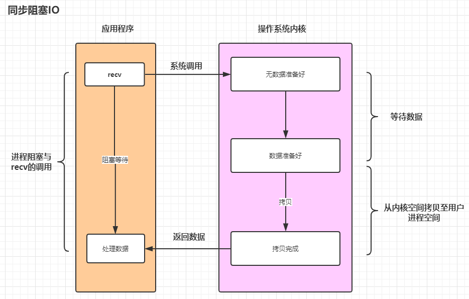
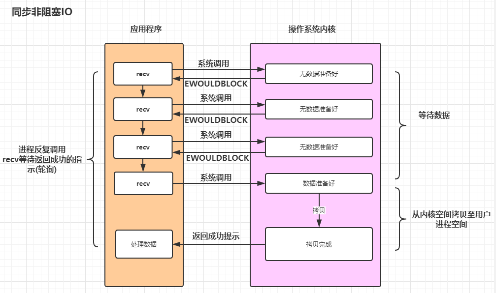
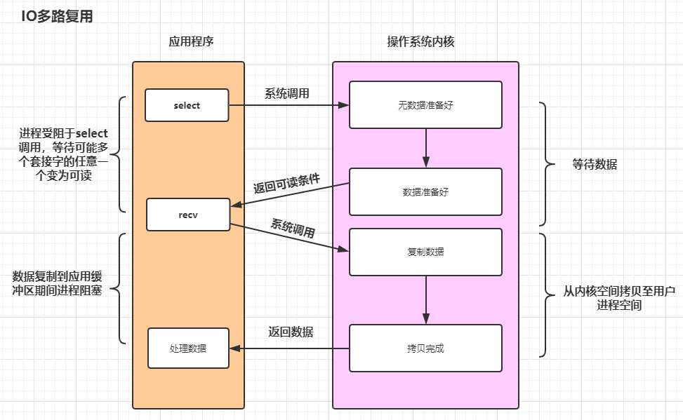
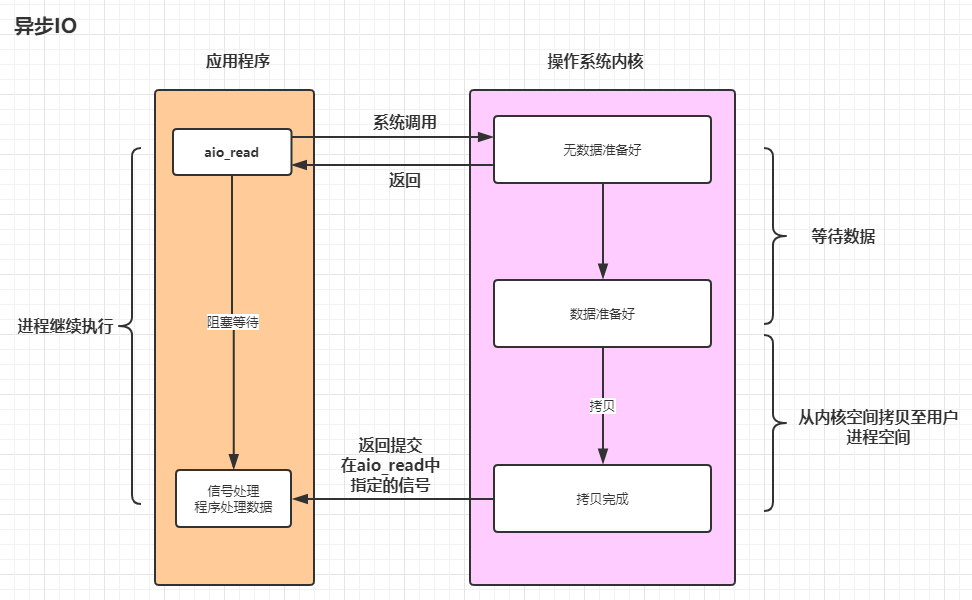

<font size=5 face='微软雅黑'>__文章目录__</font>
<!-- TOC -->

- [1 同步与异步](#1-同步与异步)
- [2 阻塞与非阻塞](#2-阻塞与非阻塞)
- [3 什么是IO](#3-什么是io)
    - [3.1 内核态用户态](#31-内核态用户态)
    - [3.2 IO两个阶段](#32-io两个阶段)
    - [3.3 IO模型](#33-io模型)
        - [3.3.1 同步阻塞IO](#331-同步阻塞io)
        - [3.3.2 同步非阻塞IO](#332-同步非阻塞io)
        - [3.3.3 IO多路复用](#333-io多路复用)
        - [3.3.4 异步IO](#334-异步io)
- [4 Python中的IO多路复用](#4-python中的io多路复用)
    - [4.1 selectors库](#41-selectors库)
    - [4.2 register方法](#42-register方法)
    - [4.3 利用selectors完成IO多路复用版本的EchoServer](#43-利用selectors完成io多路复用版本的echoserver)
    - [4.4 聊天室](#44-聊天室)

<!-- /TOC -->
# 1 同步与异步
同步和异步关注的是程序在执行时的状态：
- `同步`，可以理解为在执行完一个函数或方法之后，一直等待系统返回值或消息，这时程序是出于阻塞的，只有接收到返回的值或消息后才往下执行其他的命令。  
- `异步`，执行完函数或方法后，不必阻塞性地等待返回值或消息，只需要向系统委托一个异步过程，那么当系统接收到返回值或消息时，系统会自动触发委托的异步过程，从而完成一个完整的流程。  
<h4>例如:</h4>

- 同步如打电话，通信双方不能断（我们是同时进行，同步），你一句我一句，这样的好处是，对方想表达的信息我马上能收到，但是，我在打着电话，我无法做别的事情。
- 异步如收发收短信，对比打电话，打电话我一定要在电话的旁边听着，保证双方都在线，而收发短信，对方不用保证此刻我一定在手机旁，同时，我也不用时刻留意手机有没有来短信。这样的话，我看着视频，然后来了短信，我就处理短信（也可以不处理），接着再看视频。

&nbsp;&nbsp;&nbsp;&nbsp;&nbsp;&nbsp;&nbsp;&nbsp;对于写程序，同步往往会阻塞，没有数据过来，我就等着，异步则不会阻塞，没数据来我干别的事，有数据来去处理这些数据。一句话总结一下就是：`函数或方法被调用时，调用者是否得到最终结果的`。
- 直接得到最终结果的就是同步调用；
- 得到中间结果而非最终结果的，就是异步调用

# 2 阻塞与非阻塞
阻塞和非阻塞关注的是程序在等待调用结果（消息，返回值）时的状态.
- 阻塞调用是指调用结果返回之前，当前线程会被挂起。调用线程只有在得到结果之后才会返回。
- 非阻塞调用指在不能立刻得到结果之前，该调用不会阻塞当前线程。

一句话总结一下就是：`函数或方法被调用时，是否立刻返回`
- 立即返回就是非阻塞调用
- 不立即返回就是阻塞调用

# 3 什么是IO
linux系统中，所有的设备读写都可以看做文件的读写来操作，对文件的读写一般要经过内核态和用户态的切换，正因为有切换才导致了IO有同步和异步的说法。

## 3.1 内核态用户态
在i386之前，CPU工作在实模式下，之后开始支持保护模式，通常用保护环（ring）来描述特权级，分为四个运行级别：Ring0 ~ Ring3.
> 实模下，软件可以直接访问BIOS例程以及周边硬件，没有任何硬件等级的存储器保护观念或多任务。

CPU 在某个时刻运行在特定的特权级，等级约束了CPU了可以做什么，不可以做什么。x86(现在最流行的PC/Server CPU架构) CPU 只用了两个特权级：0 和 3：
- `Ring 0`: 可以执行特权指令，可以访问说有级别数据，可以访问IO设备等(__级别最高__)
- `Ring 3`：只能访问本级别数据(__级别最低__)

针对于Linux来说，
- ring0 就是`内核态`，运行内核代码
- ring3 就是`用户态`，运行用户代码

当用户的应用程序想访问某些硬件资源时，就需要通过操作系统提供的 __系统调用__ ，系统调用可以使用特权指令运行在内核空间，此时进程陷入内核态运行。系统调用完成，进程将回到用户态继续执行用户空间代码。

> 现代操作系统采用虚拟存储器，对于32位操作系统来说，进程对虚拟内存地址的内存寻址空间为4G(2^32)。操作系统中，内核程序独立且运行在较高的特权级别上，它们驻留在被保护的内存空间上，拥有访问硬件设备的权限，这部分内存称为内核空间(内核态，最高1G)。

## 3.2 IO两个阶段
通常来讲IO可以分成两种类型：
- 来自网络的IO
- 来自文件或者设备的IO

IO过程可以分为两个阶段：
- 数据准备阶段(内核从IO设备读写数据)
- 内核空间复制回用户空间进程缓冲区阶段(进程从内核复制数据)

## 3.3 IO模型
主要分为同步IO和异步IO，而同步IO又可以分为：同步阻塞IO、同步非阻塞IO、IO多路复用。

### 3.3.1 同步阻塞IO
进程等待(阻塞)，直到读写完成。(`全程等待`)  


### 3.3.2 同步非阻塞IO
进程调用read操作，如果IO设备没准备好，立即返回ERROR，进程不阻塞。用户可以再次发起系统调用，如果内核已经准备好，就阻塞，然后复制数据到用户空间
1. 第一阶段数据没有准备好，就先忙别的，等会再来看看。检查数据是否准备好了的过程是非阻塞的。
2. 第二阶段是阻塞的，即内核空间和用户空间之间复制数据是阻塞的。



### 3.3.3 IO多路复用
所谓IO多路复用，就是同时监控多个IO，有一个准备好了，就不需要等了立即开始处理，提高了同时处理IO的能力。主要的IO多路复用有：
- select: 几乎所有操作系统平台都支持，poll是对select的升级
- epoll：Linux系统内核2.5+开始支持，对select和poll的增强，在监视的基础上，增加回调机制。（BSD、Mac平台有kqueue，Windows有iocp）



<h4>例如:</h4>  

- select：食堂供应很多菜（众多IO），你需要吃某三菜一汤，大师傅（操作系统）说要现做，需要等。你只好等待大师傅叫，其中一样菜好了，大师傅叫你，说你点的菜有的好了，你得自己遍历找找看哪一样好了。请服务员打给你。
- epool:是有菜准备好了，大师傅喊你去几号窗口直接打菜，不用自己找菜了。

一般情况下，select最多能监听1024个fd(可以修改，但不建议)，但是由于select采用轮询的方式，当管理的IO多了，每次都要遍历全部fd，效率低下。epoll没有管理的fd的上限，且是回调机制，不需要遍历，效果很高。

### 3.3.4 异步IO
进程发起异步IO请求，立即返回。内核完成IO的两个阶段，后给进程发信号  

> Linux的aio的系统调用，内核从2.6版本开始支持。

# 4 Python中的IO多路复用
Python的select库实现了select、poll系统调用，这个基本上操作系统都支持，部分实现了epoll，它是底层的IO多路复用模块。  
- select维护一个文件描述符数据结构，单个进程使用于上限，通常是1024，线性扫描这个数据结构，效率低。
- pool和select的区别是内部数据结构使用链表，没有这个最大限制，但是依然是线性遍历才知道哪个设备就绪了。
- epoll使用事件通知机制，使用回调机制提高效率
> select/pool 还有从内核空间复制消息到用户空间，而epoll通过内核空间和用户空间共享一块内存来减少复制。

## 4.1 selectors库
Python 3.4 提供 selectors库，高级IO复用库。它的类层次结构如下
```python
BaseSelector
+-- SelectSelector
+-- PollSelector
+-- EpollSelector
+-- DevpollSelector
+-- KqueueSelector
```
观察模块原码`倒数几行`我们知道，selecors.DefaultSelector会返回当前平台最有效、性能最高的实现，但是由于没有实现 Windows下的IOCP，所以windows下只能退化为select。

## 4.2 register方法
selectorsobj.register为当前selectors实例注册一个文件对象，监视它的IO实现，返回一个selectKey对象。它的参数如下：
```python
register(self, fileobj, events, data=None):
```
- fileobj: 被监视的文件对象，比如socket对象
- events: 事件，该文件对象必须等待的事件
- data：可选的与此文件对象关联的不透明的属性，例如：关联用来存储每个客户端的会话ID，关联方法。通过这个参数在关注的事件产生后让selector干什么事。

常用的Event事件
- EVENT_READ: 可读0b01，内核已经准备好输入输出设备，可以开始读了。
- EVENT_WRITE: 可写0b10，内核准备好了，可以往里写了。

返回的selectKey对象对象具有以下方法：
- fileobj: 注册的文件对象(socket)
- fd：文件描述符
- events：等待fd标识的文件对象触发的事件类型
- data：注册时关联的数据(标识回调函数)

## 4.3 利用selectors完成IO多路复用版本的EchoServer
下面是代码:
```python
import socket
import selectors
import logging
import threading
import time

FORMAT = '%(asctime)s %(message)s'
logging.basicConfig(level=logging.INFO, format=FORMAT)

class EchoServer:

    def __init__(self, ip, port):
        self.ip = ip
        self.port = port
        self.sock = socket.socket()
        self.selector = selectors.DefaultSelector()
        self.evnet = threading.Event()

    def start(self):
        self.sock.bind((self.ip, self.port))
        self.sock.listen()
        self.sock.setblocking(False)   # 事件被触发，说明有链接进来，那么不需要阻塞等待
        self.selector.register(self.sock, selectors.EVENT_READ, data=self.accept)  # 注册accept函数
        threading.Thread(target=self.select, name='select', daemon=True).start()   # 启动监视进程


    # 启动selector，用于监视事件的发生
    def select(self):
        while not self.evnet.is_set():
            events = self.selector.select()
            for key, event in events:
                key.data(key.fileobj)


    def accept(self, sock: socket.socket):
        sock, client = sock.accept()
        # 将client的读写也加入到监事列表中
        self.selector.register(sock, selectors.EVENT_READ, self.recv)

    # 当对应的socket有写操作，会直接直接触发执行，所以这里根本不需要死循环
    def recv(self, sock: socket.socket):
        client_ip = sock.getpeername()
        data = sock.recv(1024)
        if data == b'quit' or data == b'':
            self.evnet.set()
            sock.close()
            return
        msg = '{}:{} {}'.format(*client_ip, data.decode()).encode()
        sock.send(msg)

    # 关闭进程时，将selectors中注册的事件取消掉，再关闭监视器
    def stop(self):
        self.evnet.set()
        event_list = set()
        for event in self.selector.get_map():
            event_list.add(event)
        for event in event_list:
            self.selector.unregister(event)
        self.selector.close()


if __name__ == '__main__':
    es = EchoServer('127.0.0.1', 9999)
    es.start()

    while True:
        cmd = input('>>>:').strip()
        if cmd == 'quit':
            es.stop()
            break
```

## 4.4 聊天室
这里是每次client进来时，通过记录client的socket来完成的。
```python
import socket
import selectors
import logging
import threading

FORMAT = '%(asctime)s %(message)s'
logging.basicConfig(level=logging.INFO, format=FORMAT)


class ChatSocketServer:

    def __init__(self, ip, port):
        self.ip = ip
        self.port = port
        self.sock = socket.socket()
        self.selector = selectors.DefaultSelector()
        self.event = threading.Event()
        self.clients = {}   # 用于记录连接的client

    def start(self):
        self.sock.bind((self.ip, self.port))
        self.sock.listen()
        self.sock.setblocking(False)  # 事件被触发，说明有链接进来，那么不需要阻塞等待
        self.selector.register(self.sock, selectors.EVENT_READ, data=self.accept)  # 注册accept函数
        threading.Thread(target=self.select, name='select', daemon=True).start()  # 启动监视进程

    # 启动selector，用于监视事件的发生
    def select(self):
        while not self.event.is_set():
            events = self.selector.select()
            for key, event in events:
                key.data(key.fileobj)

    def accept(self, sock: socket.socket):
        sock, client = sock.accept()

        # 添加已连接客户端列表
        self.clients[client] = sock

        # 将client的读写也加入到监事列表中
        self.selector.register(sock, selectors.EVENT_READ, self.recv)

    # 当对应的socket有写操作，会直接直接触发执行，所以这里根本不需要死循环
    def recv(self, sock: socket.socket):
        client_ip = sock.getpeername()
        data = sock.recv(1024)
        if data == b'quit' or data == b'':
            self.clients.pop(client_ip)   # 退出后弹出client地址
            self.event.set()
            sock.close()
            return
        msg = '{}:{} {}'.format(*client_ip, data.decode())
        logging.info(msg)
        for clients in self.clients.values():
            clients.send(msg.encode())

    # 关闭进程时，将selectors中注册的事件取消掉，再关闭监视器
    def stop(self):
        self.event.set()
        event_list = set()
        for event in self.selector.get_map():
            event_list.add(event)
        for event in event_list:
            self.selector.unregister(event)
        for client in self.clients.values():    # 关闭所以已连接的client的socket
            client.close()
        self.selector.close()


if __name__ == '__main__':
    es = ChatSocketServer('127.0.0.1', 9999)
    es.start()

    while True:
        cmd = input('>>>:').strip()
        if cmd == 'quit':
            es.stop()
            break
```
当然还可以通过selector来处理，为什么呢？因为每当有请求进来，selector都会监视当前连接的recv，那么我们只需要在selector中的recv拿出来，就知道到底有多少连接了。
```python
import socket
import selectors
import logging
import threading

FORMAT = '%(asctime)s %(message)s'
logging.basicConfig(level=logging.INFO, format=FORMAT)


class ChatSocketServer:

    def __init__(self, ip, port):
        self.ip = ip
        self.port = port
        self.sock = socket.socket()
        self.selector = selectors.DefaultSelector()
        self.event = threading.Event()

    def start(self):
        self.sock.bind((self.ip, self.port))
        self.sock.listen()
        self.sock.setblocking(False)  # 事件被触发，说明有链接进来，那么不需要阻塞等待
        self.selector.register(self.sock, selectors.EVENT_READ, data=self.accept)  # 注册accept函数
        threading.Thread(target=self.select, name='select', daemon=True).start()  # 启动监视进程

    # 启动selector，用于监视事件的发生
    def select(self):
        while not self.event.is_set():
            events = self.selector.select()
            for key, event in events:
                key.data(key.fileobj)

    def accept(self, sock: socket.socket):
        sock, client = sock.accept()

        # 将client的读写也加入到监事列表中
        self.selector.register(sock, selectors.EVENT_READ, self.recv)

    # 当对应的socket有写操作，会直接直接触发执行，所以这里根本不需要死循环
    def recv(self, sock: socket.socket):
        client_ip = sock.getpeername()
        data = sock.recv(1024)
        if data == b'quit' or data == b'':
            self.selector.unregister(sock)   # 客户端退出，则取消监控当前 socket 事件
            sock.close()
            return
        msg = '{}:{} {}'.format(*client_ip, data.decode())
        logging.info(msg)

        # 群发消息，如果data绑定的是recv(排除accept)，那么就通过socket群发消息
        for sock in self.selector.get_map().values():
            if sock.data == self.recv:
                sock.fileobj.send(msg.encode())

    # 关闭进程时，将selectors中注册的事件取消掉，再关闭监视器
    def stop(self):
        self.event.set()
        event_list = set()
        for event in self.selector.get_map():
            event_list.add(event)
        for event in event_list:
            self.selector.unregister(event)
        self.selector.close()


if __name__ == '__main__':
    es = ChatSocketServer('127.0.0.1', 9999)
    es.start()

    while True:
        cmd = input('>>>:').strip()
        if cmd == 'quit':
            es.stop()
            break
```