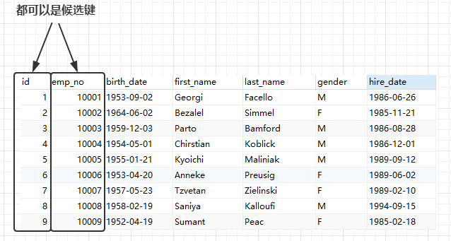
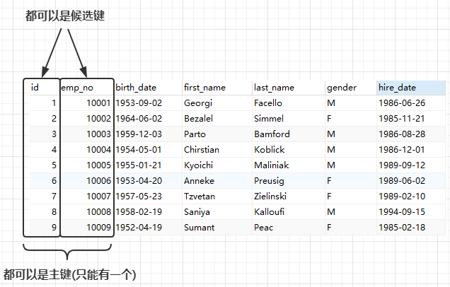
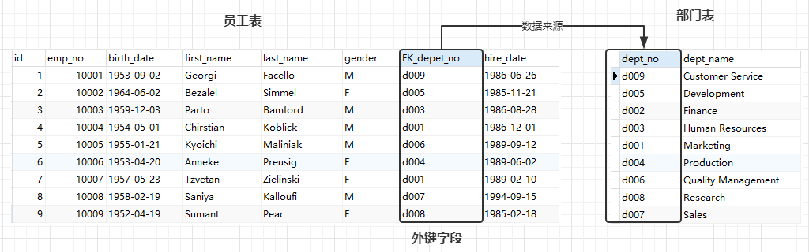

<font size=5 face='微软雅黑'>__文章目录__</font>

<!-- TOC -->

- [1 数据库概述](#1-数据库概述)
    - [1.1 关系数据库之ACID理论](#11-关系数据库之acid理论)
    - [1.2 关系数据库之概念](#12-关系数据库之概念)
        - [1.2.1 候选键](#121-候选键)
        - [1.2.2 主键](#122-主键)
        - [1.2.3 外键](#123-外键)
        - [1.2.4 约束Constraint](#124-约束constraint)
        - [1.2.5 索引](#125-索引)
    - [1.3 实体联系](#13-实体联系)
    - [1.4 视图](#14-视图)
- [2 SQL](#2-sql)
    - [2.1 分类](#21-分类)
    - [2.2 规范](#22-规范)
- [3 MySQL](#3-mysql)
    - [3.1 安装MySQL](#31-安装mysql)
    - [3.2 数据类型](#32-数据类型)
    - [3.4 库操作](#34-库操作)
        - [3.4.1 创建数据库](#341-创建数据库)
        - [3.4.2 删除数据库](#342-删除数据库)
        - [3.4.3 其他操作](#343-其他操作)
    - [3.5 表操作](#35-表操作)
        - [3.5.1 创建单表](#351-创建单表)
        - [3.5.2 创建多表外键关联](#352-创建多表外键关联)
        - [3.5.3 删除表](#353-删除表)
        - [3.5.4 其他操作](#354-其他操作)
    - [3.6 操作表数据(DML语句)](#36-操作表数据dml语句)
        - [3.6.1 insert语句](#361-insert语句)

<!-- /TOC -->
# 1 数据库概述
&nbsp;&nbsp;&nbsp;&nbsp;&nbsp;&nbsp;&nbsp;&nbsp;数据库指的是按照数据结构来组织、存储、管理数据的仓库，常用的数据库种类为关系型数据库和非关系型数据库。关系型数据库模型是把复杂的数据归结为简单的二元关系(即二维表格形式——)。  
&nbsp;&nbsp;&nbsp;&nbsp;&nbsp;&nbsp;&nbsp;&nbsp;在关系数据库中，对数据的操作几乎全部建立在一个或多个关系表格上，通过对这些关联的表格分类、合并、连接或选取等运算实现数据的管理。
__常见的数据库有MySQL__。

## 1.1 关系数据库之ACID理论
&nbsp;&nbsp;&nbsp;&nbsp;&nbsp;&nbsp;&nbsp;&nbsp;ACID，指数据库事务正确执行的四个基本要素的缩写。包含：`原子性（Atomicity）`、`一致性（Consistency）`、`隔离性（Isolation）`、`持久性（Durability）`。一个支持事务（Transaction）的数据库，必须要具有这四种特性，否则在事务过程（Transaction processing）当中无法保证数据的正确性，交易过程极可能达不到交易方的要求。MySQL的Innode支持事务，所以它遵守ACID原则。

特性|描述
---|----|
原子性(atomicity)| 一个事务是一个不可分割的工作单位，事务中包括的所有操作要么全部做完，要么什么都不做
一致性(consistency)|事务必须是使数据库从一个一致性状态变到另一个一致性状态。一致性与原子性是密切相关的
隔离性(isolation)|一个事务的执行不能被其他事务干扰。即一个事务内部的操作及使用的数据对并发的其他事务是隔离的，并发执行的各个事务之间不能互相干扰
持久性(durability)|持久性也称永久性（permanence），指一个事务一旦提交，它对数据库中数据的改变就应该是永久性的。接下来的其他操作或故障不应该对其有任何影响

## 1.2 关系数据库之概念
在关系数据库中，关系就是二维表，由行和列组成。
- `行row`，也称为记录Record、元组。
- `列Column`，也称为字段Filed、属性。
- `域Domain`，叫做字段的取值范围 。例如gender字段的取值就是M或者F两个值。

其他概念性的东西：
- 维数：关系的维数指关系中属性的个数
- 基数：元组的个数

> 注意在关系中，属性的顺序并不重要。理论上，元组顺序也不重要，但是由于元组顺序与存储相关，会影响查询效率。

### 1.2.1 候选键
关系中，能唯一标识一条元组(记录)的属性或属性集合，成为候选键可以是多个字段的组合。  

    
### 1.2.2 主键
表示一列或者多列组成唯一的key，也就是通过这一个或者多个列能唯一的标识一条记录。即被选择的候选键。
- 主键的列不能包含空值null。主键往往设置为整型、长整型，且自增AUTO_INCREMENT。
- 表中可以没有主键，但是一般表设计中，往往都会有主键，以免记录重复
- 功能主要在于查数据、定位数据  


### 1.2.3 外键
严格来说，当一个关系中的某个属性或属性的集合与另一个关系（也可以是自身）的候选键匹配时，就称作这个属性或属性集合的外键。
- 简单来说，就是A表的某个字段数据来源于B表的主键(候选键)。
- 外键约束，和外键不约束。 约束时，字段数据必须来源于关联表的主键(候选键)
> 虽然可以关联自己，但是并不常用



员工表的FK_depet_no字段就是员工表的外键。

### 1.2.4 约束Constraint
为了保证数据的完整正确，数据模型还必须有完整性约束。必须有值约束，某些列的值必须有值，不许为空null。
- `域约束Domain Constraint`：限定了表中字段的取值范围 -- (一般在代码中判断)
- `实体完整性Entity Integrity`：PRIMARY KEY约束定义了主键，就定义了主键约束。主键不重复且唯一，不能为空。
- `引用完整性Referential Integrity`：外键定义中，可以不是引用另一张表的主键(可以是任意字段)，但往往实际只会关注引用主键。
    - 插入规则：如果在表B插入一条记录，B的外键列的数据，必须是表A中存在的主键值。（自动生效，不需要指定）
    - 更新规则：定义外键约束时指定该规则。
    - 删除规则：定义外键约束时指定该规则。
    
更新规则和删除规则，可选项如下：
- `CASCADE`:级联删除，删除被关联数据时，从表关联的数据全部删除。
- `SET NULL`:从父表删除或更新行，会设置子表中的外键列为NULL，但必须保证子表没有指定 NOT NULL，也就是说子表的字段可以为NULL才行。
- `RESTRICT`:如果从父表删除主键，如果子表引用了，则拒绝对父表的删除或更新操作。(保护数据)
- `NO ACTION`:表中SQL的关键字，在MySQL中与RESTRICT相同。拒绝对父表的删除或更新操作。  

外键约束，是为了保证数据完整性、一致性、杜绝数据冗余、数据错误。
> 建议先使用，等到连接的非常深入时，再使用代码逻辑来解决外键约束关系。

### 1.2.5 索引
可以看作是一本字典的目录，为了快速检索用的。空间换时间，显著提高查询效率。可以对一列或者多列字段设定索引。(B+树)
- `主键索引(PRIMARY)`：主键会自动建立主键索引，主键本身就是为了快速定位唯一记录。
- `唯一索引(UNIQUE)`：表中的索引列组成的索引必须唯一，但可以为空，非控制必须唯一。
- `普通索引(KEY)`：没有唯一性的要求，就是建了一个字典的目录而已。

## 1.3 实体联系
首先来看一下实体和联系：
- 实体Entity：现实世界中具有相同属性的一组对象，可以是物理存在的事物或抽象的事物。
- 联系Relationship：实体之间的关联集合。

总结一下：
- 实体在数据库中就是一个一个表
- 联系在数据库中就是记录与记录的对应关系

在关系型数据库中实体主要有以下三种联系:

|类型|描述|解决方法|
|----|---|------|
`一对多联系`<br>1:n|一个员工属于一个部门，一个部门有多个员工|员工外键<br>部门主键|
`多对多联系`<br>m:n|一个员工属于多个部门，一个部门有多个员工|建立第三表|
一对一联系<br>1:1|假设有实体管理者，一个管理者管理一个部门，一个部门只有一个管理者|字段建在哪张表都行|
> 一对一很少用。

## 1.4 视图
视图、也称虚表、开起来很像表。它是由查询语句生成的。可以通过视图进行CRUD操作。  
作用：
1. 简化操作，将复杂查询SQL语句定义为视图，可以简化查询。
2. 数据安全，视图可以只显示真实表的部分列，或计算后的记过，从而隐藏真实表的数据 

# 2 SQL
&nbsp;&nbsp;&nbsp;&nbsp;&nbsp;&nbsp;&nbsp;&nbsp;Structured Query Language,是一种对关系数据库中的数据进行定义和操作的语言方法,是大多数关系数据库管理系统所支持的工业标准。

## 2.1 分类
- `数据查询语言(DQL)`:data query language,也成为数据检索语句，作用是从表格中获取数据，确定数据怎么样在应用程序给出。关键字select是SQL用的最多的动词，其他DQL常用的保留字段有where、order by、group by和having
- `数据操作语言(DML)`:data manipulation language,其中包括动词insert、update和delete，他们用于添加、修改、删除表中的行，也称动作查询语句。
- `数据处理语言(TPL)`:它的语句能确保被DML语句影响的表的所有行及时得以更新。TPL语句包括，begin、transaction、commit和rollback
- `数据控制语言(DCL)`:data control languag,它的语句通过grant或revoke 获得许可，确定 单个用户和用户组对数据库对象的访问。某些RDBMS可用GRANT或revoke控制对单个列的访问。
- `指针控制语言(CCL)`:它的语句，像 declare cursor、fetch into、update where current用于对一个或多个表单独执行的操作
- `数据定义语言(DDL)`:data definition language,其语句包括create和drop、alter。在数据库中创建新表或删除表（create table 或者 drop table），为表加入索引等。是动作查询的一部分

我们日常开发会用到的SQL语言类型为：`DML、DQL以及DDL`
>RDBMS的数据库、表的概念其实就相当于目录，文件，及内容

## 2.2 规范
编写SQL语句时，我们要遵顼如下规范：
1. SQL语句大小写不敏感(一般建议，SQL的关键字、函数等大写)
2. SQL语句末尾应该使用分号结束
3. 注释
    - 多行注释 /\*注释内容*/
    - 单行注释 --注释内容
    - MySQL 注释可以使用 #
4. 使用空格或缩进来提高可读性
5. 命名规范
    - 必须以字母开头
    - 可以使用数字、#、$和_
    - 不可使用关键字

# 3 MySQL
MySQL是Web世界中使用最广泛的数据库服务器，访问及管理mysql数据库的最常用标准化语言为SQL结构化查询语句。早先的MySQL使用的是MyISAM引擎，它是一种利用索引顺序存取数据的软件。从MySQL 4.0版本开始支持InnoDB引擎。
- MyISAM，不支持事物，插入、查询速度快
- InnoDB：支持事务，行级锁，MySQL 5.5起的默认引擎

## 3.1 安装MySQL
这里仅列出在Linux下的安装：

- 通过yum进行安装
```bash
1、安装MySQL
yum install -y mysql-server (centos 7以下)
yum install -y mariadb-server (centos 7及以上)

2、启动服务
/etc/init.d/mysqld start (centos 7以下)
systemctl start maridab (centos 7及以上)

3、关闭服务
/etc/init.d/mysqld stop (centos 7以下)
systemctl stop maridab (centos 7及以上)
```

- 编译安装
```python
1.安装依赖包
yum install -y ncurses-devel libaio-devel
rpm -qa ncurses-devel libaio-devel

2.安装cmake编译工具
yum install -y cmake

3.上传源码包
rz -y mysql-5.5.49.tar.gz

4.解压并安装
tar xf mysql-5.5.49.tar.gz
cd mysql-5.5.49
 
cmake . -DCMAKE_INSTALL_PREFIX=/application/mysql-5.5.49 \
-DMYSQL_DATADIR=/application/mysql-5.5.49/data \
-DMYSQL_UNIX_ADDR=/application/mysql-5.5.49/tmp/mysql.sock \
-DDEFAULT_CHARSET=utf8 \
-DDEFAULT_COLLATION=utf8_general_ci \
-DEXTRA_CHARSETS=gbk,gb2312,utf8,ascii \
-DENABLED_LOCAL_INFILE=ON \
-DWITH_INNOBASE_STORAGE_ENAINE=1 \
-DWITH_FEDERATED_STORAGE_ENGINE=1 \
-DWITH_BLACKHOLE_STORAGE_ENGINE=1 \
-DWITHOUT_EXAMPLE_STORAGE_ENGINE=1 \
-DWITHOUT_PARTITION_STORAGE_ENGINE=1 \
-DWITH_FAST_MUTEXES=1 \
-DWITH_ZLIB=bundled \
-DENABLED_LOCAL_INFILE=1 \
-DWITH_EMBEDDED_SERVER=1 \
-DWITH_DEBUG=0
 
make && make install && cd ..
5.创建链接文件
ln -s /application/mysql-5.5.49/ /application/mysql

6.创建数据库用户及配置文件
useradd -M -s /sbin/nologin mysql

7.初始化数据库
/application/mysql/scripts/mysql_install_db --user=mysql --basedir=/application/mysql --datadir=/application/mysql/data

8.定义环境变量
cp /application/mysql/bin/* /usr/local/sbin
或者
PATH=/application/mysql/bin:$PATH

9.开启数据库
/application/mysql/bin/mysql start

10.登录数据库
mysql
如果设置了用户密码
mysql -uroot -p123456

11.关闭数据库
/application/mysql/bin/mysql stop

12.设置密码
mysqladmin password 123456 -S /data/3306/mysql.sock
```

## 3.2 数据类型
MySQL的数据类型：

类型|含义|
----|----|
tinyint|1字节，带符号的范围是-128到127。无符号的范围是0到255。bool或boolean，就是tinyint，0表示假，非0表示真|
smallint|2字节，带符号的范围是-32768到32767。无符号的范围是0到65535
int|整型，4字节，同Integer，带符号的范围是-2147483648到2147483647。无符号的范围是0到4294967295
bigint|长整型，8字节，带符号的范围是-9223372036854775808到9223372036854775807。无符号的范围是0到18446744073709551615
float|单精度浮点数精确到大约7位小数位
double|双精度浮点数精确到大约15位小数位
DATE|日期。支持的范围为'1000-01-01'到'9999-12-31'
DATETIME|支持的范围是'1000-01-01 00:00:00'到'9999-12-31 23:59:59'
TIMESTAMP|时间戳。范围是'1970-01-01 00:00:00'到2037年
char(M)|固定长度，右边填充空格以达到长度要求。M为长度，范围为0~255。M指的是字符个数
varchar(M)|变长字符串。M 表示最大列长度。M的范围是0到65,535。但不能突破行最大字节数65535
text|大文本。最大长度为65535(2^16-1)个字符
BLOB|大字节。最大长度为65535(2^16–1)字节的BLOB列

> BLOG：字节类型，存图片，存二进制文件，能不用则不用，只会用一个字符串来存图片的位置
 
## 3.4 库操作
数据库在文件系统上就是用目录体现的，所以对库的操作，可以理解为对目录的操作。创建数据库,会在MySQL的data目录下创建同名文件夹

### 3.4.1 创建数据库
语法格式：create database  数据库名称
```sql
create database db_name;
create database db_name default charset utf8;
```
建议同时指定数据库的字符集　

### 3.4.2 删除数据库
语法格式：drop database 数据库名称
```sql
drop database db_name;
```
删除数据库目录，注意会删除库下的所有表文件

### 3.4.3 其他操作
查看数据库中存在的数据库
```sql
show databases;
```
使用(切换)当前使用的数据库(激活show tables语句)
```sql
use db_name;
```
查看创建库的信息
```sql
show create database test;
```

## 3.5 表操作
表在文件系统上是用文件体现的，所以对表的操作，可以理解为对文件的操作。
>创建表,会在对应的库目录下创建表空间文件

### 3.5.1 创建单表
```python
create table user_info(
    id int not null auto_increment primary key,
    name char(20),
    age int,
    gender char(1),
    deparment_id int,
    constraint 约束名称 foreign key(deparment_id) references dep_info(id)
)engine = innodb default charset=utf8;
 
--> 语法格式：
--> create table 表名(
-->      列名  类型  [是否为空] [是否默认值] [自增] [主键]  ,
-->      列名2  类型
-->      .... ....
-->      [ constraint 外键名称 foreign key(本表的被约束字段) reference 目标表名(字段) ]      
--> ) engine = 存储引擎名称 default charset = utf8;
```
各字段含义：
- 列名
- 数据类型
- 是否可以为空(null/not null)
- 是否默认值(default value)
- 是否自增(auto_icrement)：一个表只能存在一个自增列并且必须有索引(普通索引或主键索引),类型必须是数值型。
- 主键(primarr key)：数据不能为空、不能重复，可以加速查找(数据库的B树结构)
- 外键(constraint) ：对表内某字段的内容进行约束,必须是某个表的某个字段已有的值,含外键的表可以理解为1对多，注意外键关联的两个字段数据类型要一致　

### 3.5.2 创建多表外键关联
- 一对多：一个表的某个字段的数据来自于另一个表已存在的数据。
- 多对多：一个表的某几个字段的数据来自于另一个或几个表已存在的数据。

一对多：
```sql
CREATE TABLE user_info (
	id INT NOT NULL auto_increment PRIMARY KEY,
	NAME CHAR (20),
	age INT,
	gender CHAR (1),
	deparment_id INT,
	CONSTRAINT 约束名称 FOREIGN KEY (deparment_id) REFERENCES dep_info (id)
) ENGINE = INNODB DEFAULT charset = utf8;

CREATE TABLE dep_info (
	id INT NOT NULL auto_increment PRIMARY KEY,
	title CHAR (32),
) ENGINE = innode DEFAULT charset = utf8;
```
多对多：需要关系表来表明多对多关系
```sql
CREATE TABLE `boy` (
  `id` int(11) NOT NULL AUTO_INCREMENT,
  `name` char(32) DEFAULT NULL,
  PRIMARY KEY (`id`)
) ENGINE=InnoDB DEFAULT CHARSET=utf8;
    
CREATE TABLE `girl` (
  `id` int(11) NOT NULL AUTO_INCREMENT,
  `name` char(32) DEFAULT NULL,
  PRIMARY KEY (`id`)
) ENGINE=InnoDB DEFAULT CHARSET=utf8;
    
CREATE TABLE `b2g` (
  `id` int(11) NOT NULL AUTO_INCREMENT,
  `b_id` int(11) DEFAULT NULL,
  `g_id` int(11) DEFAULT NULL,
  PRIMARY KEY (`id`),
  KEY `FK_b` (`b_id`),
  KEY `FK_G` (`g_id`),
  CONSTRAINT 约束名称1 FOREIGN KEY (`b_id`) REFERENCES `boy` (`id`),
  CONSTRAINT 约束名称2 FOREIGN KEY (`g_id`) REFERENCES `girl` (`id`)
) ENGINE=InnoDB DEFAULT CHARSET=utf8;
```

### 3.5.3 删除表
```sql
drop table tb_name;
```

### 3.5.4 其他操作
查看创建表的语句
```sql
show create table table_name;
``` 
查看表结构
```sql
desc table_name;
```
查看当前库的所有表
```sql
show tables;
```

## 3.6 操作表数据(DML语句)
针对表的数据进行操作，主要涉及4类：
- 增加 insert
- 删除 delete
- 修改 update
- 查找 select

> 插入内容就相当于在表文件中按照MySQL的格式写数据

### 3.6.1 insert语句
`语法格式1：insert into  表名(字段1，字段2)  values(值1,值2)`  
含义：
- field和value是一一对应的。
- 当字段名省略时,表示插入字段所有数据，values后面的值需要列出所有字段
```sql
INSERT INTO `test`.`employees_copy` (
	`id`,
	`emp_no`,
	`birth_date`,
	`first_name`,
	`last_name`,
	`gender`,
	`FK_depet_no`,
	`hire_date`
)
VALUES
	(
    '10',
    '10010',
    '1990-08-02',
    'Dahl',
    'Lee',
    'F',
    'd001',
    '1990-08-02'
);
```

`语法格式2：insert into  table_name(cname) select field from table_name`  
含义：
- 把select查到的结果,当作数据来赋值给value
- 查询到的数据字段要和插入的字段数量一致
```sql
INSERT INTO boy (id) SELECT
	id
FROM
	employees;
```
