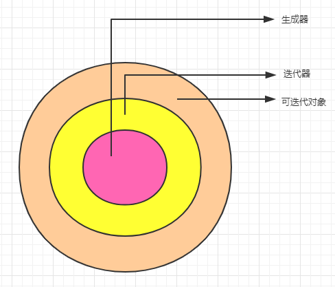

<font size=5 face='微软雅黑'>__文章目录__</font>
<!-- TOC -->

- [1 解析式](#1-解析式)
- [2 列表解析式](#2-列表解析式)
    - [2.1 列表解析式进阶](#21-列表解析式进阶)
- [3 其他解析式](#3-其他解析式)
    - [3.1 集合表达式](#31-集合表达式)
    - [3.2 字典解析式](#32-字典解析式)
- [4 生成器表达式](#4-生成器表达式)
    - [4.1 特点](#41-特点)
    - [4.2 next函数](#42-next函数)
- [5 总结](#5-总结)

<!-- /TOC -->
# 1 解析式
&nbsp;&nbsp;&nbsp;&nbsp;&nbsp;&nbsp;&nbsp;&nbsp;从一个问题来看解析式，现有如下需求：生成一个列表，元素0-9，对每一个元素自增1后求平方返回新列表。
```python
lst = list(range(10))
lst2 = []
for value in lst:
    lst2.append((value + 1) ** 2)
print(lst2)
```
&nbsp;&nbsp;&nbsp;&nbsp;&nbsp;&nbsp;&nbsp;&nbsp;看起来很容易理解，但是这种需求竟然用了5行代码！下面来看一下列表解析式的写法。
```python
[ (x+1)**2 for x in range(10)]
```
> 看起来非常简洁，属于Python的风格！哈哈  

&nbsp;&nbsp;&nbsp;&nbsp;&nbsp;&nbsp;&nbsp;&nbsp;再来看一下，什么是列表解析式？在Python中列表解析式是一种语法糖，虽然对看似复杂的代码进行了简写，但是编译器会进行优化，不会因为简写而影响效率，反而因为优化提高了效率。另外还介绍了代码量，减少了出错的机会，还简化了代码，增加了代码可读性。
# 2 列表解析式
&nbsp;&nbsp;&nbsp;&nbsp;&nbsp;&nbsp;&nbsp;&nbsp;列表解析式的基本语法是如下
```python
[ 返回值 for 元素 in 可迭代对象 if 条件]
```
- 使用`中括号`将表达式(推导式)括起来
- 内部是for循环，if条件可选，可以是多个但是不支持`elif语句`
- 返回一个新的列表  

有这样的赋值语句 `newlist = [ print(i) for i in range(10) ] `，请问newlist打印出来是什么？
```python
In [6]: newlist = [ print(i) for i in range(10) ]           
0
1
2
3
4
5
6
7
8
9

In [7]: newlist 
Out[7]: [None, None, None, None, None, None, None, None, None, None]
```
>为什么是None？因为表达式只会将函数的返回值作为结果，进行添加，所以当返回值是一个函数操作的对象时，一定要注意函数的返回值！
## 2.1 列表解析式进阶
&nbsp;&nbsp;&nbsp;&nbsp;&nbsp;&nbsp;&nbsp;&nbsp;有的时候我们的代码需要进行两个或多个循环，列表解析式进阶版本可以满足这种需求哦。它的语法是：
```python
[ 返回值 for 元素 in 可迭代对象 if 条件表达式1 if 条件表达式2 ... ]
等同于:
for 元素 in 可迭代对象:
    if 条件表达式1：
        if 条件表达式2：
返回值

[ 返回值 for 元素 in 可迭代对象1 for 元素 in 可迭代对象2 ... ]
等同于：
for 元素1 in 可迭代对象1：
    for 元素2 in 可迭代对象2：
        # if 也可以加条件判断
        返回值[1个或多个]
```
- 条件表达式可以是多个，但是不能是elif，多个if是并且的关系
- 多个循环条件等同于循环嵌套，时间复杂度是O(n*内层循环个数)  

例子：
```python
20以内，既能被2整除，又能被3整除的列表
[ i for i in range(20) if i % 2 == 0 if i % 3 == 0]


[(i,j) for i in range(10) for j in range(20) if i < 3 if j > 18]
表示当i小于3时，j大于18时，组成一个元素返回
```
# 3 其他解析式
&nbsp;&nbsp;&nbsp;&nbsp;&nbsp;&nbsp;&nbsp;&nbsp;除了列表解析式以外，Python中还存在`集合解析式`、`字典解析式`、`'元组解析式'`。
> 可不是什么元组解析式，这行小字你看不到，可不怪我哦。
## 3.1 集合表达式
- 语法：`{ 返回值 for 元素 in 可迭代对象 if 条件 }`
- 列表解析式的中括号换成大括号`{}`即可
- 同样是立即返回一个集合
```python
20以内，既能被2整除，又能被3整除的集合
{ i for i in range(20) if i % 2 == 0 if i % 3 == 0}
```
> 注意集合的特性，如果生成了不可hash的元素比如list，那么是不能生成集合的哦，如果元素重复，集合会去重的哦
## 3.2 字典解析式
- 语法：`{ 返回值(key:value) for 元素 in 可迭代对象 if 条件 }`
- 列表解析式的中括号换成大括号`{}`即可
- 请使用key：value格式
- 立即返回一个字典
```python
生成一个key为abcded的字典
{x:y for x in 'abcdef' for y in range(10)} 
```
> 注意字典的key相同时，后面的赋值会把之前的值覆盖哦，所以结果是`{'a': 9, 'b': 9, 'c': 9, 'd': 9, 'e': 9, 'f': 9}`
# 4 生成器表达式
&nbsp;&nbsp;&nbsp;&nbsp;&nbsp;&nbsp;&nbsp;&nbsp;如果你是从上倒下看的，那么你可能会奇怪，说好的元组表达式呢？如果你是直接跳转过来的，那么请忽略前面这句话。那什么是生成器表达式呢？  
&nbsp;&nbsp;&nbsp;&nbsp;&nbsp;&nbsp;&nbsp;&nbsp;生成器表达式是按需计算(或者惰性求值、延迟计算)的，只有需要的时候才计算值，而列表解析式是直接返回一个新的列表，生成器是一个`可迭代对象`，`迭代器`。在使用type命令判断对象类型时，`generator` 就表示一个生成器对象
- 语法：( 返回值 for 元素 in 可迭代对象 if 条件表达式 )
- 列表解析式的中括号换成大括号`()`即可
- __`延迟计算(惰性计算)`__
- __`只能迭代一次，不能回头`__
```python
g = ((i,j) for i in range(10) for j in range(20) if i < 3 if j > 18)
print(g)  # <generator object <genexpr> at 0x7fca2552b258>
for i in g:
    print(i) # 只能迭代一次，迭代完毕生成器就为空了哦，
```
## 4.1 特点
&nbsp;&nbsp;&nbsp;&nbsp;&nbsp;&nbsp;&nbsp;&nbsp;没错，用括号括起来的并不是元组表达式，而变成了`生成器表达式`，它本身由于惰性计算的特性和其他解析式有很多不同的特性
1. `计算方式`  
&nbsp;&nbsp;&nbsp;&nbsp;&nbsp;&nbsp;&nbsp;&nbsp;生成器表达式延迟计算(惰性计算)，只有你去向它要，它才会给你计算，而列表解析式在你执行后，会直接给你生成一个新的列表。
2. `内存占用`  
&nbsp;&nbsp;&nbsp;&nbsp;&nbsp;&nbsp;&nbsp;&nbsp;生成器没有数据，内存占用极少，它是使用时一个一个返回数据，如果将这些返回的数据合起来占用的空间也和列表解析式差不多，但是它不是立即需要这么多空间
3. `计算速度`  
&nbsp;&nbsp;&nbsp;&nbsp;&nbsp;&nbsp;&nbsp;&nbsp;单看计算时间来看，生成器表达式耗时非常短，列表解析式时长，因为生成器本身并没有任何返回值，只是返回了一个生成器对象，列表解析式构造并返回了一个新的列表，所以看起来更耗时了
4. `遍历`  
&nbsp;&nbsp;&nbsp;&nbsp;&nbsp;&nbsp;&nbsp;&nbsp;当我们需要对数据进行遍历时，由于生成器是遍历一次计算一个返给你，而列表解析式执行完毕后直接返回一个新的列表不需要计算，所以性能要优于生成器表达式。
## 4.2 next函数
>除了遍历我们还可以通过`next方法`来一次一次的获取生成器的数据
```python
In [8]: g = ((i,j) for i in range(10) for j in range(20) if i < 3 if j > 18)
In [9]: next(g) 
Out[9]: (0, 19)
In [10]: next(g)
Out[10]: (1, 19)
In [11]: next(g)
Out[11]: (2, 19)
In [12]: next(g)   
---------------------------------------------------------------------------
StopIteration     Traceback (most recent call last)
<ipython-input-12-e734f8aca5ac> in <module>
----> 1 next(g)

StopIteration: 
In [13]:
```
>next()可以理解为向生成器要一次数据(拨一下生成器)，当生成器为空时，就会提示`StopIteration`异常，for循环帮我们对StopIteration异常做了处理，还没有学习异常处理的我们，该怎么办呢？其实next方法为我们提供了`默认值参数`，即从生成器中拿不到数据，就返回指定的默认: `next(g[, default])`。
```python
In [13]: g = ((i,j) for i in range(10) for j in range(20) if i < 3 if j > 18)           
In [14]: next(g, 'None')    
Out[14]: (0, 19)
In [15]: next(g, 'None')    
Out[15]: (1, 19)
In [16]: next(g, 'None')    
Out[16]: (2, 19)
In [17]: next(g, 'None')     # 生成器空了，就返回default指定的默认值 
Out[17]: 'None'
In [18]: next(g, 'None')    
Out[18]: 'None'
```
# 5 总结
&nbsp;&nbsp;&nbsp;&nbsp;&nbsp;&nbsp;&nbsp;&nbsp;Python2 引入列表解析式,Python2.4引入生成器表达式,Python3 引入集合、字典解析式，并迁移到了Python 2.7，一般来说，应该多用解析式，简短、高效不过还需要注意的是：
- 如果一个解析式非常复杂，难以读懂，可以考虑拆成for循环，没必要非要网列表解析式上靠
- 生成器和迭代器是不同的对象，但都是可迭代对象
- 可迭代对象范围更大，都可以使用for循环遍历  

从是否可迭代来看生成器、迭代器、可迭代对象的关系是如下  
 