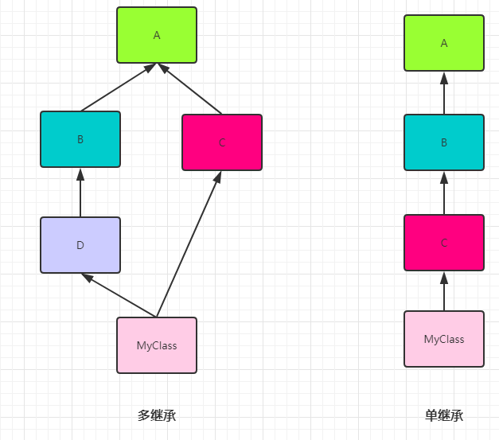

<font size=5 face='微软雅黑'>__文章目录__</font>
<!-- TOC -->

- [1 类的继承](#1-类的继承)
- [2 不同版本的类](#2-不同版本的类)
- [3 基本概念](#3-基本概念)
- [4 特殊属性和方法](#4-特殊属性和方法)
- [5 继承中的访问控制](#5-继承中的访问控制)
- [6 方法的重写(override)](#6-方法的重写override)
    - [6.1 super](#61-super)
    - [6.2 继承中的初始化](#62-继承中的初始化)
- [7 多继承](#7-多继承)
    - [7.1 多继承弊端](#71-多继承弊端)
    - [7.2 MRO](#72-mro)
    - [7.3 多继承的建议](#73-多继承的建议)
    - [7.4 Mixin](#74-mixin)

<!-- /TOC -->
# 1 类的继承
&nbsp;&nbsp;&nbsp;&nbsp;&nbsp;&nbsp;&nbsp;&nbsp;继承是面向对象的重要特性之一，是相对两个类而言的父子关系，子类继承了父类的所有的属性和方法，继承最大的好处是实现了代码的重用，可以重用已经存在的数据和行为，减少代码的重复编写。
# 2 不同版本的类
&nbsp;&nbsp;&nbsp;&nbsp;&nbsp;&nbsp;&nbsp;&nbsp;在Python2.2之前，类是没有共同的祖先的，之后，引入了object类，它是所有类的共同祖先类。Python2中为了兼容，分为古典类(旧式类)和新式类。而在Python 3中全部都为新式类，新式类都是继承object类的，并且可以使用super函数(后面会说)。下面是Python2.x中的代码
```python
class A:
    pass

class B(object):
    pass

>>> dir(A)  # 查看类的__dict__
['__doc__', '__module__']
>>> dir(B)
['__class__', '__delattr__', '__dict__', '__doc__', '__format__', '__getattribute__', '__hash__', '__init__', '__module__', '__new__', '__reduce__', '__reduce_ex__', '__repr__', '__setattr__', '__sizeof__', '__str__', '__subclasshook__', '__weakref__']
```
在Python2.x中 A和B是不同的两个类。A没有继承，被称为古典类，B继承自object，被称为新式类。不止少了很多方法，连实例对象的属性也是不太相同的。Python 3中的代码如下
```python
class A:
    pass

class B(object):
    pass
 
>>> dir(A)
['__class__', '__delattr__', '__dict__', '__dir__', '__doc__', '__eq__', '__format__', '__ge__', '__getattribute__', '__gt__', '__hash__', '__init__', '__init_subclass__', '__le__', '__lt__', '__module__', '__ne__', '__new__', '__reduce__', '__reduce_ex__', '__repr__', '__setattr__', '__sizeof__', '__str__', '__subclasshook__', '__weakref__']
>>> dir(B)
['__class__', '__delattr__', '__dict__', '__dir__', '__doc__', '__eq__', '__format__', '__ge__', '__getattribute__', '__gt__', '__hash__', '__init__', '__init_subclass__', '__le__', '__lt__', '__module__', '__ne__', '__new__', '__reduce__', '__reduce_ex__', '__repr__', '__setattr__', '__sizeof__', '__str__', '__subclasshook__', '__weakref__']
>>> 
```
在Python 3中，都为新式类，所以A和A(object)是两个结果相同的不同写法而已 `class A:pass  ==  class A(object):pass`。
> 更多的区别这里就不在详述，Python 3是未来，忘记旧式类吧。
# 3 基本概念
Python在类名后使用一对括号来表示继承关系，括号中的类即为父类。先来看看不用继承的例子：
```python
class Animal:

    def shout(self):
        print('{} shout'.format(self.__class__.__name__))

class Cat:
    def shout(self):
        print('{} shout'.format(self.__class__.__name__))

class Dog:
    def shout(self):
        print('{} shout'.format(self.__class__.__name__))

a = Animal()
c = Cat()
d = Dog()

a.shout()
c.shout()
d.shout()
```
从上面例子来看，虽然猫狗动物都可以叫，但是却分别实现了叫这个动作，那么下一步使用继承来优化
```python
class Animal:

    def shout(self):
        print('{} shout'.format(self.__class__.__name__))

class Cat(Animal): pass
class Dog(Animal): pass

a = Animal()
c = Cat()
d = Dog()

a.shout()
c.shout()
d.shout()
```
通过继承，猫类、狗类就不用写代码，直接继承了父类Animal类的叫方法了。所以，在上面的例子中：
- 父类：Animal是Cat和Dog的父类，也成为基类、超类
- 子类：Cat和Dog是Animal的子类，也成为派生类
# 4 特殊属性和方法
和继承相关的常用特殊属性和方法如下：
|特殊属性和方法|含义|示例|
|:------|:---|:---|
|`__base__`|类的基类||
|`__bases__`|类的基类们(元组)||
|`__mro__`|方法解析顺序(基类们的元组)||
|`mro()`|方法解析顺序(基类们的列表)|int.mro()|
|`__subclasses__()`|类的子类列表|`int.__subclasses__()`|
# 5 继承中的访问控制
通过一个例子来看继承中的访问控制
```python
class Animal:
    __COUNT = 100   # _Animal__COUNT = 100
    HEIGHT = 0

    def __init__(self, age,weight,height):
        self.__COUNT += 1  # self._Animal_COUNT = self._Animal_COUNT + 1
        self.age = age
        self.__weight = weight  # self._Animal__weight = weight
        self.HEIGHT = height

    def eat(self):
        print('{} eat'.format(self.__class__.__name__))

    def __getweight(self):    # def _Animal__getweight(self):
        print(self.__weight)  #     print(self._Animal__weight)

    @classmethod
    def showcount1(cls):
        print(cls)
        print(cls.__dict__)
        print(cls.__COUNT)    # print(cls._Animal__COUNT)

    @classmethod
    def __showcount2(cls):    # def _Animal__showcount2(cls):
        print(cls.__COUNT)    #     print(cls._Animal__COUNT)

    def showcount3(self):
        print(self.__COUNT)   # print(self._Animal__COUNT)

class Cat(Animal):
    NAME = 'CAT'
    __COUNT = 200   # _Cat__Count = 200

c = Cat(3,5,15)
c.eat()          # 1 
print(c.HEIGHT)  # 2 
print(c.__COUNT) # 3
print('c:',c.__dict__)
print('cat:',Cat.__dict__)
print('Animal:',Animal.__dict__)
c.showcount1()   # 4
c.showcount2()   # 5
c.showcount3()   # 6
print(c.NAME)    # 7 
```
分析：
1. 通过c调用eat方法，c没有eat方法，在类Cat中寻找，Cat中没有，在Cat的父类Animal中寻找，找到eat方法，把c绑定在eat上，执行是把c传入eat，在eat内部self是c，所以self.__class__就是Cat,所以会打印`'Cat eat'`。
2. 在查找属性时，优先在c.__dict__中寻找，因为c实例化时设置了HEIGHT属性，所以，这里是`15`。
3. __COUNT是私有属性，定义完毕后会被改名，所以在外部访问时，会提示`没有该属性`。
4. 使用c调用类方法时，@classmethod会把c的类传入到cls中去，所以cls就是`Cat类`，cls.__dict__就是`Cat.__dict__`,而Cat中只定义两个属性，所以值为`{'__module__': '__main__', 'NAME': 'CAT', '_Cat__COUNT': 200, '__doc__': None}`(魔术方法先不考虑),类方法定义在哪个类中，那么私有变量就会被改成以那个类为前缀的变量名，所以showcount1方法定义在Animal中，__COUNT就变成了_Animal__COUNT。cls.__COUNT就是在寻找cls._Animal__COUNT属性，而Cat类中的__COUNT被改名为_Cat__COUNT,所以最后只能在Animal中找到，所以值为`100`。
5. 和私有属性相同，私有方法也会被改名为_类名__方法，所以直接从外部访问，会提示`没有该属性方法`。
6. showcount3定义在Animal中，所以self.\_\_COUNT实际上为self.\_Animal__COUNT，c在实例化的同时进行了初始化，Cat没了__init__函数，所以继承了父类Animal的__init__，在初始化过程中定义的self.__COUNT，实际上就是self._Animal__COUNT，这里self._Animal__COUNT = self._Animal__COUNT + 1，先算等式右边，在执行时c还没有_Animal__COUNT属性，所以会从Cat类开始找直到Animal类，Cat类的__COUNT改名为了_Cat__COUNT,不是我们想要的，然后找到了Animal的100，然后加1，再赋给实例c(等于c._Animal__COUNT = Animal._Animal__COUNT + 1)，所以实例c来说，它自己就已经拥有_Animal__COUNT属性，它的值为`101`。
> 一般情况下不会这么写，这里只是练习知识点。分析这种情况时，直接把私有变量/方法改名后就非常好分析了。  

总结：
1. 从父类继承，自己没有的，就可以到父类中寻找。
2. 私有的都是不可以直接在外部进行访问的，但是本质上依然是改了名称后放在这个属性所在的类或实例的__dict__中，如果知道这个新名称，就可以直接找到这个隐藏的变量。不建议使用。
3. 继承时，公有的，子类和实例都可以随意访问；私有成员被吟唱，子类和实例不可直接访问，但私有变量所在的类内的方法可以直接访问这个私有变量。
4. 实例属性查找顺序：实例的__dict__ , 类的__dict__  , 父类的__dict__(如果有继承)。
> __`遇到私有变量/方法看定义的位置，直接进行改名就比较好分析了。`__
# 6 方法的重写(override)
&nbsp;&nbsp;&nbsp;&nbsp;&nbsp;&nbsp;&nbsp;&nbsp;方法重写，顾名思义就是重写继承来的方法，Python和其他语言不同的是，在Java中，要重写的方法，参数数量和类型要和原方法完全相同才行，否则会被认为是方法重载。Python由于其动态的语言的特性，只要方法相同，则表示的就是方法重写。
```python
class Animal:

    def __init__(self, name):
        self.name = name

    def shout(self):
        print('Animal shout')

class Cat(Animal):

    def shout(self):
        print('miaomiao')

c = Cat('daxin')
c.shout()
```
&nbsp;&nbsp;&nbsp;&nbsp;&nbsp;&nbsp;&nbsp;&nbsp;上面的例子中，Cat继承了Animal类的shout方法，但是由于Animal中定义的shout不符合Cat的需求，所以在Cat中重写了shout方法，但是需要注意的是，重写不是覆盖，严格来说的话应该算是遮盖，因为Python的类查找顺序是按照当前实例->父类->基类等来的，所以当给Cat类定义shout方法后，实例调用方法shout时，父类中已经包含了shout方法，所以就直接调用了，而Animal中的shout依旧在，只是Cat的shout方法被预先发现了。

&nbsp;&nbsp;&nbsp;&nbsp;&nbsp;&nbsp;&nbsp;&nbsp;如果我们并不是要改写，而是要增强原方法的功能呢？
```python
class Animal:

    def shout(self):
        print('Animal shout')

class Cat(Animal):

    def shout(self):
        self.__class__.__base__.shout(self)  # 需要手动传入self
        print('miaomiao')
c = Cat()
c.shout()
```
通过查找父类然后传入实例调用，是可以的，但是不建议这样使用,在这种情况下,我们一般会使用`super`.
## 6.1 super
&nbsp;&nbsp;&nbsp;&nbsp;&nbsp;&nbsp;&nbsp;&nbsp;`super`函数(类)是用于调用父类(超类)的一个方法的。主要的两种写法如下：
```python
super()   # 指代父类
super(type, obj)  # 同样指代父类，super接受两个参数，第一个是类型，第二个是实例对象。

super() == super(type, obj)
```
> super(type, obj) 一般写为super(self.\_\_class__, self) 按照上面Animal的例子的话，就为super(Cat, self)  

利用super完成增强方法的例子：
```python
class Animal:

    def shout(self):
        print('Animal shout')

class Cat(Animal):

    def shout(self):
        super(Cat, self).shout()
        # super().shout()
        print('miaomiao')
c = Cat()
c.shout()
```
> 静态方法和类方法都可以被覆盖，原理都相同，都是在属性字典__dict__中搜索。

## 6.2 继承中的初始化
```python
class Animal:

    def __init__(self, name):
        self.name = name

    def shout(self):
        print('Animal shout')

class Cat(Animal):

    def __init__(self, age):
        self.age = age 

    def shout(self):
        print('miaomiao')

c = Cat('daxin',20)
c.shout()
print(c.name)
```
请问这种情况是可以执行吗？答案是不行的，因为Cat重写了__init__方法，所以在c实例化时，只能访问Cat类的__init__方法，所以，就需要显示的调用父类的__init__方法。
```python
class Animal:

    def __init__(self, name):
        self.name = name

    def shout(self):
        print('Animal shout')

class Cat(Animal):

    def __init__(self, name, age):
        super(Cat, self).__init__(name)   # 等于把实例和name变量，传递给Animal.__init__(self,name)
        # super().__init__(name)    #  效果相同
        self.age = age 

    def shout(self):
        print('miaomiao')

c = Cat('daxin',20)
c.shout()
```
需要注意的是，如果有同名属性，那么后执行的会覆盖先执行的。
```python
def __init__(self, name, age):
    super(Cat, self).__init__(name)
    self.name = age     # 覆盖父类初始化的name属性
```
> 另外在私有属性继承的情况下，请注意真正的变量名称(因为会改名)。
# 7 多继承
&nbsp;&nbsp;&nbsp;&nbsp;&nbsp;&nbsp;&nbsp;&nbsp;一个类继承自多个类就是多继承，它将具有多个类的特征。面向对象的设计的开闭原则(实体应该对扩展开放，而对修改封闭)，就可以利用继承来设计，即多用'继承'，少修改(并不是一般的多继承，后面会详述)。它的定义个数如下
```python
class MyClass(A,B,...):pass
```

&nbsp;&nbsp;&nbsp;&nbsp;&nbsp;&nbsp;&nbsp;&nbsp;Python中的继承关系，分为多继承和单继承，如图所示：
  
## 7.1 多继承弊端
&nbsp;&nbsp;&nbsp;&nbsp;&nbsp;&nbsp;&nbsp;&nbsp;多继承很好的模拟了世界，因为事物很少是单一继承，但是舍弃简单，必然引入复杂性，带来了冲突。举个简单的例子：如果一个孩子继承了来自父母双方的特称，那么到底眼睛像爸爸还是妈妈呢，孩子究竟像谁多一点呢？
> 多继承的实现或导致编译器设计的复杂度增加，所以现在很多语言也舍弃了类的多继承。  

&nbsp;&nbsp;&nbsp;&nbsp;&nbsp;&nbsp;&nbsp;&nbsp;C++支持多继承，而Java舍弃了多继承。有些人说Java支持的多继承的，其实他说的是接口，在Java中，一个类可以实现多个接口，一个接口也可以继承多个接口。Java的接口很纯粹，只是方法的生命，继承者必须实现这些方法，就具有了这些能力，就能干什么。  
&nbsp;&nbsp;&nbsp;&nbsp;&nbsp;&nbsp;&nbsp;&nbsp;多继承带来的问题，最主要的就是二义性，例如猫和狗都继承自动物类，现在如果一个类继承了猫和狗类，猫和狗都有shout方法，子类究竟继承谁的shout呢？
> 实现多继承的语言，要解决二义性，主要有两种方法`深度优先`和`广度优先`。
## 7.2 MRO
&nbsp;&nbsp;&nbsp;&nbsp;&nbsp;&nbsp;&nbsp;&nbsp;MRO：方法解析顺序，Python使用MRO来解决多继承带来的二义性问题。因为Python 2.x的旧式类和新式类等历史原因(旧式类不会继承object对想)，MRO有三个搜索算法：
1. 经典算法(2.2之前)：按照定义从左至右，深度优先策略。左图的MRO为：`MyClass、D、B、A、C`
2. 新式类算法(2.2版本)：经典算法的升级，深度优先，重复的只保留最后一个。左图的MRO为：`MyClass、D、B、C、A、object`
3. C3算法(2.3之后)：在类被创建出来的时候，就计算一个MRO有序列表。Python3唯一支持的算法。左图的MRO为：`MyClass、D、B、C、A、object`  

&nbsp;&nbsp;&nbsp;&nbsp;&nbsp;&nbsp;&nbsp;&nbsp;经典算法有很大的问题。如果C中有覆盖A的方法，就不会访问到C，因为深度优先，会先访问A。新式类算法算法，依然采用了深度优先，解决了重复问题，但是同经典算法一样，么有解决继承和单调性的问题。
> 单调性：如果在D的解析顺序中，B排在A的前面，那么在D的所有子类里，也必须满足这个顺序。  

&nbsp;&nbsp;&nbsp;&nbsp;&nbsp;&nbsp;&nbsp;&nbsp;C3算法，解决了继承的单调性，它阻止创建之前版本产生的二义性代码，求得MRO是为了线性化，且确定了顺序。关于MRO和C3可以参考：[Python的多重继承问题-MRO和C3算法](https://blog.csdn.net/beyondlee2011/article/details/87713671)
```python
class A:pass
class B(A):pass
class C(A):pass
class D(B):pass
class MyClass(D,C):pass

print(MyClass.mro())  # [<class '__main__.MyClass'>, <class '__main__.D'>, <class '__main__.B'>, <class '__main__.C'>, <class '__main__.A'>, <class 'object'>]
```
注意：
1. MyClass.mro() 和 MyClass.__mro__结果相同，一个是方法，一个是属性。
2. D的解析顺序中，B在A的前面，那么在D的所有资料，都将保持这个顺序。
3. 序列是有序的，当执行一个方法，子类不存在时，会按照mro列表开始寻找。
## 7.3 多继承的建议
当类很多，继承很复杂的情况下，继承路径太多，很难说清什么样的继承路线。Python语法是允许多继承的，但是Python代码是解释执行，只有执行时，才发现错误，如果团队协作开发，并且引入多继承，那么代码将有可能会变得不可控。所以在Python日常开发规范中建议：
1. 避免多继承
2. 由于Python语言本身过于灵活，所以最好遵循一定的团队开发规范。
## 7.4 Mixin