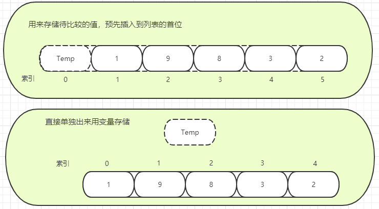

<!-- TOC -->

- [1 直接插入排序](#1-直接插入排序)
- [2 分析过程](#2-分析过程)
- [3 关于存储中间变量](#3-关于存储中间变量)
- [4 代码编写](#4-代码编写)
- [5 总结](#5-总结)

<!-- /TOC -->
# 1 直接插入排序
直接插入排序属于比较简单的排序算法，基本原理：
- 在未排序序列中，构建一个子排序序列，直至全部数据排列完成。
- 将待排序的数，插入到已经排序的序列中合适的位置。
- 增加一个哨兵(中间变量)，放入待比较的值，让它和后面已经排好序的序列比较，找到合适的插入点。

# 2 分析过程
&nbsp;&nbsp;&nbsp;&nbsp;&nbsp;&nbsp;&nbsp;&nbsp;看上面的定义可能不是特别清楚其原理，那么请看来自维基百科的动态演示图：  
&nbsp;&nbsp;&nbsp;&nbsp;&nbsp;&nbsp;&nbsp;&nbsp;&nbsp;&nbsp;&nbsp;&nbsp;&nbsp;&nbsp;&nbsp;&nbsp;  
以图中列表为例，下面是分析过程：
```python
[6，5，3，1，8，7，2，4]
```
- 假定已排序序列在列表的最左边初始为空。
- 第一趟循环将第一个元素6，赋值给中间变量，然后在已排序区一一比较，由于已排序区初始为空，所以元素6被直接放入已排序区
- 第二趟循环将第二个元素5，赋值给中间变量，然后在已排序中开始比较，循环开始，由于已排序区中只有1个元素，所以只需要比对1次，5比6小，先将元素6向右移动一位，然后将5赋值给6的原位上。此时排序后的元素排列如下：
```python
[5，6，3，1，8，7，2，4]
```
- 第三趟循环将第三个元素3，赋值给中间变量，然后在已排序中开始比较，循环开始，由于已排序区中有2个元素，所以需要比对2次，3比6小，将6向右移动一位，继续循环，3比5小，将5向右移动一位，然后把3放在原来5的位置上。此时排序后的元素排列如下：
```python
[3, 5, 6, 1, 8, 7，2，4]
```
- 第四趟循环将第四个元素1，赋值给中间变量，然后在已排序中开始比较，循环开始，最后把1放在原来3的位置上。此时排序后的元素排列如下：
```python
[1，3，5，6，8, 7，2，4]
```
- 第五趟循环将第五个元素8，赋值给中间变量，然后在已排序中开始比较，循环开始，由于8大于6，会直接将8赋给当前已排序区最大值的右边。此时排序后的元素排列如下：
```python
[1，3，5，6，8, 7，2，4]
```
以此类推。直到排序完成
# 3 关于存储中间变量
&nbsp;&nbsp;&nbsp;&nbsp;&nbsp;&nbsp;&nbsp;&nbsp;我们可以单独使用一个中间变量来存储待排序的元素，也可以在列表的首部插入一个变量用来存储待排序的元素。因为代码量以及索引计算方便等原因，这里使用在列表的首部插入一个元素一个变量用来存储待排序的元素的方式编写代码。  
&nbsp;&nbsp;&nbsp;&nbsp;&nbsp;&nbsp;&nbsp;&nbsp;&nbsp;&nbsp;&nbsp;&nbsp;&nbsp;&nbsp;&nbsp;&nbsp;
# 4 代码编写
```python
lst = [6, 5, 3, 1, 8, 7, 2, 4]
lst = [0] + lst  # [0, 6, 5, 3, 1, 8, 7, 2, 4]
length = len(lst)

for i in range(2, length):  #
    lst[0] = lst[i]
    j = i - 1
    if lst[j] > lst[0]:
        while lst[j] > lst[0]:
            lst[j+1] = lst[j]
            lst[j] = lst[0]
            j -= 1
print(lst[1:])
```
- 因为在列表头部添加了一个元素用于记录待交换元素，所以应该从索引为2的元素，开始，拿来和已经排序好的序列进行比较(认为6已经在排序空间了)
- 由于无法判断已排序区到底排了几次，所以只能使用while循环，直到排序区的某个元素比待排序元素小时，表示在上一次插入过后，排序区已经排序完毕，这时就可以退出循环了。
```python
附上使用单个变量的方法：
lst = [6, 5, 3, 1, 8, 7, 2, 4]
length = len(lst)
temp = 0
for i in range(1, length): # 7
    temp = lst[i]
    j = i - 1  # 6
    if lst[j] > temp:
        while lst[j] > temp:
            lst[j+1], lst[j] = lst[j], temp
            j -= 1
            if j < 0:     # 不限制j的索引时，j会取到-1..-n，这样就乱了，因为索引为-1的元素，还没有被排序
                break
print(lst)
```
# 5 总结
- `最好`情况，正好是升序排列，比较迭代次`n-1`次
- `最差`情况，正好是降序排列，比较迭代1，2，... n - 1 次即`n(n-1)/2`，数据移动会非常多
- 使用两层嵌套循环，时间复杂度为`O(n^2)`
- 属于稳定的排序算法
- 使用在小规模数据比较时
- 如果比较操作耗时大的话，可以采用二分查找来提高效率，即二分查找插入排序(由于每次比较还是要进行插入，所以优化效率不是那么高)