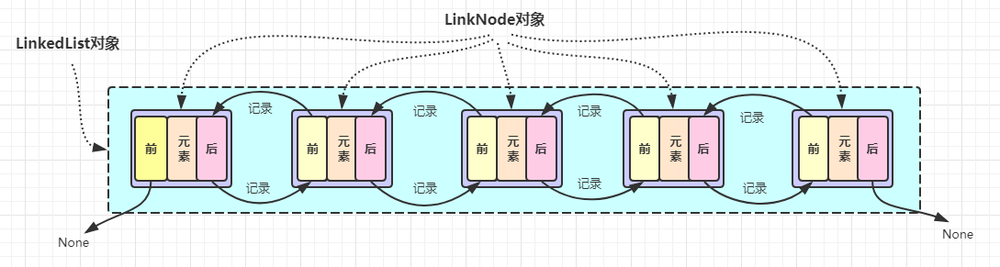

# 用面向对象实现LinkedList链表
(1)单向链表实现append，iternodes方法

(2)双向链表实现append、pop、insert、remove、iternodes方法


# (1) 分析需求
1. 链表存放数据，那么链表肯定需要一个类，那么数据呢？链表的特质，访问一个对象才能知道下一个对象在哪，那么如果每个元素是一个对象就很方便了
2. 单向链表的话，针对元素对象来说只需要前一个元素记住后一个元素就可以了，所以需要一个next属性来记录
3. 因为迭代是要从起始位开始的，所以我们的链表对象需要一个变量来记录起始位置，那是否要结尾呢？仔细想一下，append的方法就是在链表的结尾处追加一个元素，所以记录结尾元素可以方便追加操作。

下面我们来实现一下单向链表
```python
class LinkNode:

    def __init__(self, value, next=None):
        self.item = value
        self.next = next

    def __str__(self):  # 打印时的输出
        return '{} ==> {}'.format(self.item, self.next.item if self.next else None)


class LinkedList:

    def __init__(self, head=None, tail=None):
        self.head = head   # 链表首位
        self.tail = tail   # 链表末位

    # 追加方法
    def append(self, value):    
        # 实例化一个LinkNode 对象
        node = LinkNode(value) 
        
        if self.head is None: # 当链表首位为None,表示当前列表为空
            self.head = node  # 只需要把元素加入，并且标记当前元素为首位
        else:                 # 否则表示链表不为空，需要在尾部追加
            self.tail.next = node  # 为当前处于尾部的实力，添加next属性为新的LinkNode对象
        self.tail = node      # 将链表的尾部指向新添加的LinkNode对象上

    # 迭代方法
    def iternodes(self):
        current = self.head if self.head else None  # 如果链表为空不会迭代
        
        # 从第一个元素开始迭代，通过next对象来控制，当到达链表末尾时，next的属性为None，会退出循环
        while current:  
            yield current
            current = current.next


daxin = LinkedList()
daxin.append(1)
daxin.append(3)
daxin.append(4)

for i in daxin.iternodes():
    print(i)
```
# (2) 分析需求
1. 双向链表还需要记录前面的的元素，需要添加一个prev属性来记录
2. append、iternodes，可以沿用单向链表的方法。
3. pop 从尾部弹出一个元素并返回其值
4. insert、remove 则需要考虑在首部、尾部、中间等插入删除操作的情况


下面我们来实现一下单向链表
