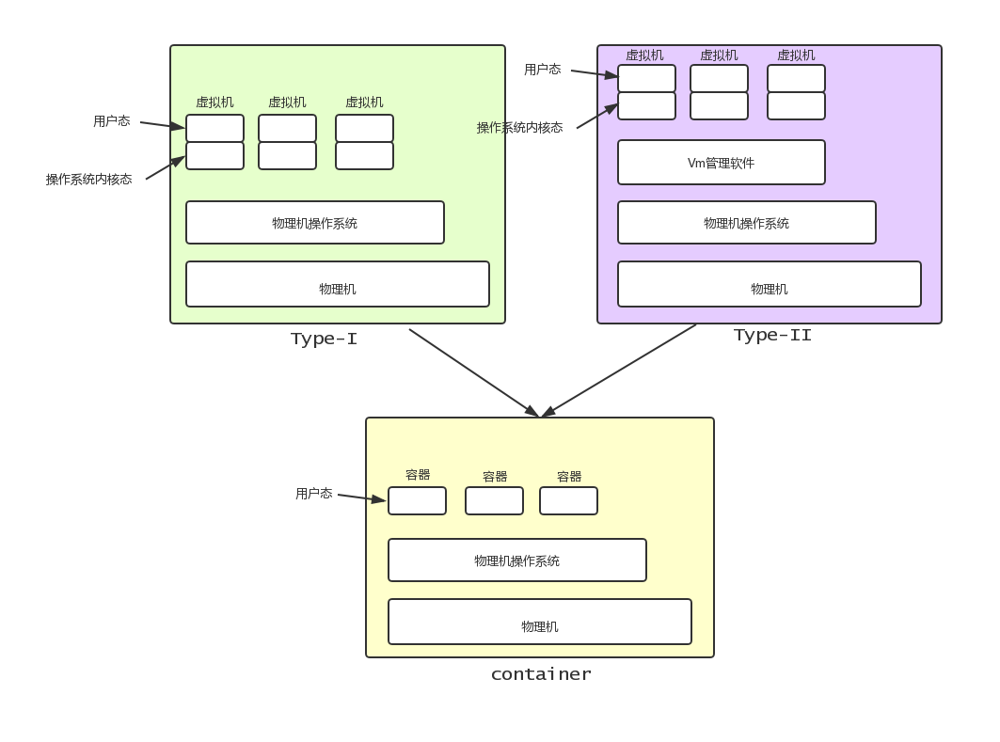

# 1 虚拟化介绍
主流的虚拟机化方式：
- `主机级虚拟化`：虚拟化的是整个完整的物理硬件平台(VMware workstation)
- `容器级虚拟化`：虚拟化的是一个个的用户空间

主机虚拟化两种类型的实现：
- `Type-I`:直接在硬件设备上安装虚拟机管理器一般叫hypervisor，然后再来创建虚拟机
- `Type-II`:在宿主机上安装一个宿主机操作系统，再装一个VMM(viurtul Machine Manage) 虚拟机管理器，然后再来创建虚拟机（WMware、virtualbox等) 

没有一个虚拟机是直接跑在硬件设备之上的。所以减少中间层，中间环境，就可以有效的提高效率。

&nbsp;&nbsp;&nbsp;&nbsp;&nbsp;&nbsp;&nbsp;&nbsp;由图可知，去掉虚拟机的内核以后，就需要直接在主机的用户空间内进行分割，形成多个用户态，在这些独立分割的用户空间内去运行应用程序。
  
# 2 容器技术
&nbsp;&nbsp;&nbsp;&nbsp;&nbsp;&nbsp;&nbsp;&nbsp;不同用户空间内，主机名肯定需要不相同、并且PID号、文件系统等，都应该相对隔离，所以每一个用户空间都应该存在以下七个部分：
- 主机名/域名（UTS）
- 文件系统（Mount） - `树形结构`
- 进程间通讯（IPC） 
- 进程(PID) - `树形结构`（归属与init或者本身就是init)
- 用户(User)
- 网络(Network)

&nbsp;&nbsp;&nbsp;&nbsp;&nbsp;&nbsp;&nbsp;&nbsp;Linux在内合层面通过使用名称空间(namespace)对以上六种资源进行的隔离进行直接支持，并通过系统调用直接输出。但是不同的内核版本对名称空间的支持不同，下面是六大资源实现的内核版本

|namespace|系统调用参数|隔离内容|内核版本|
|---|---|---|---|
|UTS|CLONE_NEWUTS|主机和域名|2.6.19|
|IPC|CLONE_NEWIPC|信号量、消息队列和共享内存|2.6.19|
|PID|CLONE_NEWPID|进程编号|2.6.24|
|Network|CLONE_NEWNET|网络设备、网络栈、端口等|2.6.29|
|Mount|CLONE_NEWNS|挂在点(文件系统)|2.4.19|
|User|CLONE_NEWUSER|用户和用户组|3.8|

PS：没有User也可以用，但是在某些特殊的地方是有缺失的，所以 CentOS 6 2.6+内核，天生被排除在外。

## 2.1 资源如何分配
&nbsp;&nbsp;&nbsp;&nbsp;&nbsp;&nbsp;&nbsp;&nbsp;每个名称空间所需要的资源，都是由宿主机提供的，那么该如何限制不同的名称空间的资源配额？内核通过CGroups (Control Groups) 来对资源进行分组，然后将不同的组分配到指定的名称空间中去使用.

&nbsp;&nbsp;&nbsp;&nbsp;&nbsp;&nbsp;&nbsp;&nbsp;一个cgroups分组中一般包含如下资源：
- blkio：块设备IO
- cpu：CPU
- cpuacct：CPUT资源使用报告
- cpuset: 多处理器平台上的CPU集合
- devices: 设备访问
- freezer: 挂起或恢复任务
- memory: 内存用量及报告
- perf_event: 对cgroup中的任务进行统一性能测试
- net_cls: cgroup中的任务创建的数据报文的类别标识符

所以内核实现容器虚拟化，最重要的三种技术就是 `chroot`、`namespace`、`cgroups`

LXC(LinuX Container): 把完整的容器技术用一组简易使用的工具和模版来极大的简化了容器技术使用的方案
- lxc-create: 快速创建一个容器(用户空间)
- template: 自动的实现安装过程(你所指向的系统发行版的仓库)，把所需要的包下载到本地来安装。
- other：比如chroot来切换等。 
 

 docker是lxc的一个增强版，可以理解为容器的一个易用工具。

docker是什么？
&nbsp;&nbsp;&nbsp;&nbsp;&nbsp;&nbsp;&nbsp;&nbsp;docker：直译成中文是码头工人的意思
&nbsp;&nbsp;&nbsp;&nbsp;&nbsp;&nbsp;&nbsp;&nbsp;早期的docker就是lxc的一个封装发行版，利用lxc做管理容器引擎，在创建用户空间时，不通过templates去下载所需要的所有文件，而是使用一种镜像技术（ 比如把那些创建一个用户空间需要的文件事先编排好，然后打包成一个文件(镜像文件)),镜像文件一般放在一个大家都能访问到的仓库中。docker会连到仓库中去搜索匹配你创建容器时需求的镜像文件，然后下载到本地，并基于镜像来启动容器.

docker为了使整个容器的使用更加便于管理，采用一种更精巧的方式，在一个容器内只运行一个进程，不同进程归属与不同的容器，二者通信时使用容器间的通讯方式来交互。

所以docker和lxc最主要的区别是：lxc虚拟出来的容器是当一个虚拟机来使用的，里面可以存在N个进程，而docker中仅仅存在一个进程。
这种方式有几个特点：
1. 每一个进程只运行在自己单独的容器中。
2. 容器只为了运行这一个进程，所以如果进程没有用到哪个目录，就不会去创建。
3. 相同的文件，需要多份存在与不同的容器内，会浪费空间，但是每个容器内的进程对文件的操作不会影响其他容器
4. 每一个程序都运行在自己空间内，那么就需要在不同的容器内准备多份调试工具。
5. 运行第二个进程是必然的，但是仅仅是在需要的使用来使用（排查工具等)

镜像的运行简述：
- 分层构建，联合挂载的方式。
PS: 包含读写层

成熟以后，抛弃LXC，自建容器引擎：
- libcontainer -> runContainer(runC) 目前新版的容器引擎。（容器运行时的环境标准）
- 镜像文件标准 -> OCF(开放容器标准)

docker的基本使用：
- 容纳容器镜像的站点：dockerhub(hub.docker.com)

dokcer架构：
- Client端  --> docker client
- DOCKER_HOST(Server端)  --> docker daemon
- Registry  --> docker registries

C/S结构的应用程序。 运行docker daemon 就把这台主机变成了Server端，通过监听socket来接受client端的请求，服务器端支持三种类型套接字(IPv4，IPv6，unix socket)，默认是unix socket套接字文件

PS：docker client到 docker Host 使用的是也是HTTPS（docker HOST 遵循Restful风格）

DOCKER_HOST主机：
- Containers:
- Images:来自于registry，镜像仓库，默认为docker hub，初始化是空的从远端下载(HTTP,HTTPS),默认为HTTPS，除非明确确认安全。

为什么不不叫repository，而叫registry包含
- 镜像存储
- 用户认证
- 可用镜像的索引(搜索索引)
不仅仅是一个仓库，而是一个应用程序，包含多个仓库(repository)，一个仓库用于存放一个应用程序的镜像(一般仓库名就是应用程序名)，单个仓库加标签，唯一标示一个镜像(图)，如果没有执行标签，那么就是最新版,当然还有稳定版的标签(stable)指向对应的版本。

镜像是静态的(文件)，容器是动态的，包含生命周期（类似进程）

docker中的资源和对象：（restful中的资源是可以支持增删改查的操作)
- images
- containers
- networks
- volumes
- plugins

安装及使用docker:
- 64bits CPU
- Linux Kernel 3.10+
- Linux Kernel cgroups and namespaces

Centos 7:
- Extras repository(包含)

docker默认配置文件是json格式的
- /etc/docker/daemon.json
PS:第一次启动前是不存在的，可以手动创建

配置docker 镜像仓库（加速下载）
vim /etc/docker/daemon.json
{
    "registry-mirrors:["https://xxx.com"]"
}

启动docker: systemctl start docker.service

命令主要分两类：
- 杂乱无章的(早期) 
- 分类管理(后期)

docker info: 
- storage Driver: overlay2 ,7.4及以前的docker早期版本是DM(基于LVM的实现，性能很弱，还不稳定)

常用操作：
docker image 系列包含如下命令：
- docker search: 在docker Hub中搜索镜像(docker image search)
- docker pull: 从仓库中拉取镜像(下载到本地)(docker image pill)
- docker images: 显示本地images列表(docker image ls)
- docker rmi: 删除一个或多个镜像(docker image rm)

docker container 系列命令包含如下命令
- docker create: 创建一个新的容器
- docker start: 启动一个容器
- docker run: 在一个新的容器中运行一个命令（创建并启动容器)
- docker attach: 
- docker ps: 列出容器
- docker logs: 列出容器日志(输出到控制台的日志)
- docker restart: 重启容器
- docker stop: 停止一个或多个运行的容器
- docker kill: 杀掉一个或多个运行的容器
- docker rm: 删除一个或多个容器

在容器中执行命令：
- docker exec -it ContainerName /bin/bash: 在容器内执行一个shell

docker容器状态转换机制命令：
    图 docker event state

# docker image 镜像
&nbsp;&nbsp;&nbsp;&nbsp;&nbsp;&nbsp;&nbsp;&nbsp;docker host 从docker registries 中获取镜像并存入到本地，所以要求docker host本地能够存储这种镜像，这种存储空间要求是一种特殊而且专用的文件系统(1.18 overlay2存储驱动)
&nbsp;&nbsp;&nbsp;&nbsp;&nbsp;&nbsp;&nbsp;&nbsp;镜像可以理解为应用程序的集装箱(docker(码头工人)负责转配这些集装箱)
&nbsp;&nbsp;&nbsp;&nbsp;&nbsp;&nbsp;&nbsp;&nbsp;Docker镜像含有启动容器所需要的文件系统及其内容，因此，其用于创建并启动Docker容器
- 采用分层构建机制，大体上分为两部分：最底层为bootfs，其之上为rootfs(图，rootfs层(/etc,/bin,/sbin等)，bootfs层)
    - bootfs：用于系统引导的文件系统，包括bootloader和kernel，容器启动完成后会被卸载以节约内存资源（从内存中移除)
        底层为aufs/btrfs/overlay文件系统，来确保能够引导并启动一个用户空间
    - rootfs：位于bootfs之上，表现为docker容器的根 文件系统
        - 传统模式中，系统启动之时，内核挂载rootfs时会首先将其挂载为“只读”模式，完整性自检完成后将其重新挂载为读写模式；
        - docker中，rootfs由内核挂载为“只读”模式，而后通过“联合挂载”技术额外挂载一个“可写”层。 
    - 位于下层的镜像称为父镜像(parent image)，最底层的称为基础镜像(base image)
    - 最上层为“可读写”层，其下的均为“只读”层。(图，可写层，http层，vim层，base image层，bootfs层)

## 专有文件系统
&nbsp;&nbsp;&nbsp;&nbsp;&nbsp;&nbsp;&nbsp;&nbsp;docker的这种分层构建，联合挂载，需要的是专有的文件系统的支持，比如Aufs、overlay2，brtfs等。

### Aufs文件系统
&nbsp;&nbsp;&nbsp;&nbsp;&nbsp;&nbsp;&nbsp;&nbsp;Aufs：advanced multi-layered unification filesystem：高级多层统一文件系统
- 用于为Linux文件系统实现”联合挂载“
- aufs是之前的UnionFS的重新实现，2006年由Junjiro Okajima开发；
- Docker最初使用aufs作为容器文件系统层，它目前仍作为存储后端之一来支持；
- aufs的竞争产品是overlayfs，后者自从3.18版本开始被合并到Linux内核；
- docker的分层镜像，除了aufs、docker还支持btrfs，devicemapper和vfs等
    - 在Ubuntu系统下，docker默认Ubuntu的aufs；而在Centos7上，用的是devicemapper(DM)；

### devicemapper文件系统

### overlay2文件系统
overlay2是一个抽象的二级文件系统，它需要构建在一个本地文件系统之上，这个文件系统就是xfs(extfs)
## docker registry
启动容器时，docker daemon会视图从本地获取相关的镜像；本地镜像不存在时，其将从registry中下载该镜像并保存到本地；(图，docker Client ,http/https, Docker Daemon(stroage Driver, aufs,dm), Public Docker registry DockerHub, Private Docker Registry,Storage Driver)

PS: docker distribution：docker提供的一个镜像服务，但是不完成，默认不支持HTTPS服务，在安全情况下，docker daemon要求 docker registry必须是HTTPS服务的，如果不是，需要配置docker daemon来明确指示其使用不安全的镜像仓库(现在更流行使用vmware开源的harbor)

分类：
- Registry用于保存docker镜像，包括镜像的层次结构和元数据
- 用户可自建Registry，也可以使用官方的Docker Hub
- 分类：
    - Sponsor Registry：第三方的registry，供客户和Docker社区使用
    - Mirror Registry：第三方的registry，只让客户使用(加速器，比如阿里云)
    - Vendor Registry：由发布docker镜像的供应商提供的registry（比如红帽提供的供购买它服务的客户使用)
    - Privage Registry：通过设有防火墙和额外安全层的私有实体提供的registry

组成：
一般由两部分组成：Repository、Index
- Repository
    - 有特定的docker镜像的所以迭代版本组成的镜像仓库
    - 一个Registory中可以存在多个Repository
        - Repository可以分为”顶层仓库”和“用户仓库“
        - 顶层仓库名称格式为“仓库名”
        - 用户仓库名称格式为”用户名/仓库名“
    - 每个仓库可以包含多个Tag(标签),每个标签对应一个镜像，但一个镜像可以对应多个标签

- Index
    - 维护用户账户、镜像的校验以及公共命名空间的信息
    - 相当于为Registry提供了一个完成用户认证等功能的检索接口

docker registry中的镜像来自于何处？
&nbsp;&nbsp;&nbsp;&nbsp;&nbsp;&nbsp;&nbsp;&nbsp;通常由镜像开发人员制作，而后推送至“公共”或“私有”Registry上保存，供其他人员使用，例如“部署”到生产环境；

docker hub
