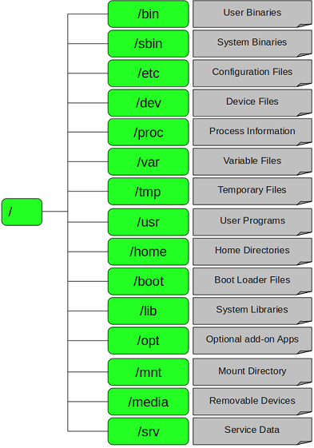
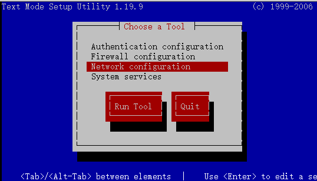
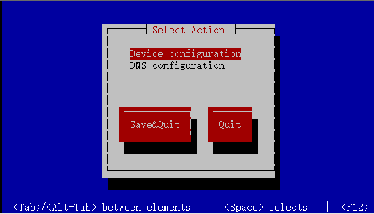
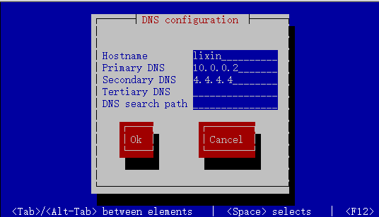

# 1 概述
## 1.1 疑问1
&nbsp;&nbsp;&nbsp;&nbsp;&nbsp;&nbsp;&nbsp;&nbsp;为什么某些程序位于/bin下，或者/sbin，或者/usr/bin，或/usr/sbin目录下吗？例如，less命令位于/usr/bin目录下。为什么没在/bin中，或/sbin，或/usr/sbin目录中？所有这些目录之间有什么不同？ 
## 1.2 疑问2
&nbsp;&nbsp;&nbsp;&nbsp;&nbsp;&nbsp;&nbsp;&nbsp;为什么很多发行版本，比如Centos、Red hat、SuSE。它们的/（根）目录下都有相同的目录结构？比如/etc、/home、/dev、/var、/tmp。为什么叫这些名字，这些目录下放的都是什么东西？
## 1.3 文件系统目录标准
&nbsp;&nbsp;&nbsp;&nbsp;&nbsp;&nbsp;&nbsp;&nbsp;由于Linux家喻户晓，开发人员众多，目录也越来越多，如果没有一个统一的标准，那么不同的发行版文件放置位置也不同，相同文件的名称也不同，这样看起来会非常的杂乱无章，在这种情况下FHS的出现就是必然的了。  
&nbsp;&nbsp;&nbsp;&nbsp;&nbsp;&nbsp;&nbsp;&nbsp;Filesystem Hierarchy Standard（文件系统目录标准）的缩写，多数Linux版本采用这种文件组织形式，类似于Windows操作系统中c盘的文件目录，FHS采用树形结构组织文件。FHS定义了系统中每个区域的用途、所需要的最小构成的文件和目录，同时还给出了例外处理与矛盾处理。  
&nbsp;&nbsp;&nbsp;&nbsp;&nbsp;&nbsp;&nbsp;&nbsp;FHS定义了两层规范，第一层是/目录下要放置哪些文件数据。第二层则是针对/usr和/var这两个目录的子目录定义。

# 2 目录说明
## 2.1 目录特点
1.  /（根）是所有目录的顶点。
2.  目录结构像一颗倒挂的树。
3.  目录和磁盘分区，默认是没有关联的。
4.  /（根）下不同的目录可能会对应不同的分区或磁盘。
5.  所有的目录都是按照一定的类别和规律组成的。
## 2.2 目录结构
FHS规定的/(根)目录下各目录结构，如下图  

## 2.3 目录说明
### 2.3.1 /(根)目录
每一个文件和目录从根开始，/下的目录有：
```bash
[root@lixin /]# ls
bin data etc lib   lost+found  mnt   opt   root  selinux  sys  usr
boot dev home lib64 media  oldboy  proc  sbin  srv   tmp  var
```
### 2.3.2 /bin目录
用来存放二进制可执行命令的目录，用户常用的命令都存在该目录下。例如：mkdir（创建目录）、cat（查看文件）、find（查找文件）等。
```bash
[root@lixin bin]# ls
alsaunmute            egrep               mkdir          sh
arch                  env                 mknod          sleep
awk                   ex                  mktemp         sort
basename              false               more           stty
bash                  fgrep               mount          su
cat                   find                mountpoint     sync
chgrp                 findmnt             mv             tar
……
[root@lixin bin]#
```
### 2.3.3 /sbin目录
同样用来存放二进制可执行文件，只是这里面的命令只供系统管理员，管理系统使用(root用户)。例如：iptables（防护墙）、ifconfig（查看网卡信息）、init（设置启动级别）等。
```bash
[root@lixin sbin]# ls
accton           ip                       partx
addpart          ip6tables                pccardctl
agetty           ip6tables-1.4.7          pidof
……
init             nologin                  vgscan
initctl          pam_console_apply        vgsplit
insmod           pam_tally2               vmcore-dmesg
insmod.static    pam_timestamp_check      weak-modules
install-info     parted                   wipefs
installkernel    partprobe
[root@lixin sbin]#
```
### 2.3.4 /dev目录
设备文件存放的目录，因为linux中一切皆文件，所以就像鼠标、键盘、光驱，对linux来说也都是一个个的文件。例如/dev/cdrom(光驱)、/dev/sda1（硬盘）等。
```bash
[root@lixin dev]# ls
agpgart          lp0                 rfkill    tty24  tty57
block            lp1                 root      tty25  tty58
bsg              lp2                 rtc       tty26  tty59
btrfs-control    lp3                 rtc0      tty27  tty6
bus              MAKEDEV             scd0      tty28  tty60
……
loop5            ram9                tty21     tty54  vga_arbiter
loop6            random              tty22     tty55  zero
loop7            raw                 tty23     tty56
[root@lixin dev]#
```
### 2.3.5 /tmp
临时文件存放的地方，由于这个目录的权限为1777，所有用户对这个目录都有可读可写可执行的权限，所以其他人也可以删除你的文件。(可以当作windows的回收站来用，不用的东西先放这里)。
```bash
[root@lixin tmp]# ls
1.txt  2.txt  3.txt  4  5  6
[root@lixin tmp]#
```
### 2.3.6 /home
普通用户的家目录，用来存放普通用户的文件。比如我们新建一个用户（useradd）会在/home下创建和这个用户同名的家目录。
```bash
[root@lixin home]# ls -l
total 4
drwx------. 3 lixin lixin 4096 Mar 10 19:05 lixin
[root@lixin home]#
# 说明我们系统中有一个用户名字是linux，他的家目录在/home/lixin。
```
### 2.3.7 /boot目录
存放内核文件和系统引导程序
```bash
[root@lixin boot]# ls
config-2.6.32-573.el6.x86_64
efi
grub
initramfs-2.6.32-573.el6.x86_64.img
lost+found
symvers-2.6.32-573.el6.x86_64.gz
System.map-2.6.32-573.el6.x86_64
vmlinuz-2.6.32-573.el6.x86_64
[root@lixin boot]# 
```
### 2.3.8 /lib目录
存放二进制库文件,库文件一般以.so|lib*|ld*。
```bash
[root@lixin lib]# ls
alsa                          libnsl.so.1
cpp                           libnss_compat-2.12.so
crda                          libnss_compat.so.2
firmware                      libnss_dns-2.12.so
i686                          libnss_dns.so.2
…
[root@lixin lib]#
```
### 2.3.9 /mnt目录
一般用来临时挂载临时存储设备的目录
```bash
[root@lixin /]# ls -ld /mnt
drwxr-xr-x. 2 root root 4096 Sep 23  2011 /mnt
```
### 2.3.10 /opt目录
该目录是可选的，一般是给第三方厂家开发的程序的安装目录。现在一般不用了。
```bash
[root@lixin /]# cd /opt
[root@lixin opt]# ls
rh
[root@lixin opt]#
```
### 2.3.11 /media目录
用于挂载可移动设备的临时目录。
```bash
[root@lixin /]# ls -ld /mnt
drwxr-xr-x. 2 root root 4096 Sep 23  2011 /mnt
[root@lixin /]#
```
2.3.12 /root目录
系统管理员的家目录。
```bash
[root@lixin ~]# ls -a
.                .bash_logout   install.log         .tcshrc
..               .bash_profile  install.log.syslog  .viminfo
anaconda-ks.cfg  .bashrc        ipaddress
.bash_history    .cshrc         .lesshst
[root@lixin ~]#
```
### 2.3.13 /sys目录
与/proc一样，存放系统运行过程中的信息文件。
```bash
[root@lixin sys]# ls
block  class  devices   fs          kernel  power
bus    dev    firmware  hypervisor  module
[root@lixin sys]#
```
### 2.3.14 /etc目录
yum/rpm安装的软件配置文件所在的目录。
```bash
[root@lixin etc]# ls 
abrt                       mtab
acpi                       my.cnf
adjtime                    nanorc
……
mime.types                 xinetd.d
mke2fs.conf                xml
modprobe.d                 yum
modulefiles                yum.conf
motd                       yum.repos.d
[root@lixin etc]#
```
### 2.3.15 /usr目录
安装除操作系统本身外的一些应用程序或组件的目录，一般可以认为是linux系统上安装的应用程序默认都安装在此目录中；
```bash
[root@lixin etc]# cd /usr
[root@lixin usr]# ls
bin  games    lib    libexec  sbin   src
etc  include  lib64  local    share  tmp
[root@lixin usr]#
```
# 3 特殊文件说明

## 3.1 网卡配置文件
文件位置为：/etc/sysconfig/network-scripts/ifcfg-eth0，该文件控制网卡的配置信息，网卡的配置文件统一放在network-scripts中，eth1表示第二块网卡，依次累加。
```bash
[root@lixin usr]# cat /etc/sysconfig/network-scripts/ifcfg-eth0 
DEVICE=eth0                  #设备名称
TYPE=Ethernet                        #设备类型为Ethernet
ONBOOT=yes                                  #开机启动
NM_CONTROLLED=yes            
BOOTPROTO=none               #IP获取方式
IPADDR=10.0.0.8                             #IP地址
NETMASK=255.255.255.0        #网络掩码
DNS2=4.4.4.4                                #备用DNS地址
GATEWAY=10.0.0.2                            #网关地址
DNS1=10.0.0.2                        #主用DNS地址
[root@lixin usr]#
```
__特殊字段说明：__  
1. NM_CONTROLLED表示是否启用NetworkManager管理，NetworkManager是一个图形管理工具，没有装图形界面该选项可以改为no。
2. BOOTPROTO 表示获取IP的方式，动态获取（dhcp），静态配置（static），无（none）。
## 3.2 DNS解析配置文件
文件位置为：/etc/resolv.conf，该文件用来指定DNS服务器地址（DNS:网络地址解析）
```bash
[root@lixin tmp]# more /etc/resolv.conf

nameserver 10.0.0.2       #DNS服务器地址
nameserver 4.4.4.4
```
>设置DNS方式：  
__方法1、使用setup进入图形界面（需要安装setup包）__  
  
选择Network configuration  
  
选择 DNS configuration  
  
填入DNS地址即可。  
>__方法2、__  
直接编辑/etc/sysconfig/network-scripts/ifcfg-eth0
>```bash
>[root@centos7 ~]#cat /etc/sysconfig/network-scripts/ifcfg-eth0 
>TYPE=Ethernet
>PROXY_METHOD=none
>BROWSER_ONLY=no
>BOOTPROTO=none
>DEFROUTE=yes
>IPV4_FAILURE_FATAL=no
>IPV6INIT=yes
>IPV6_AUTOCONF=yes
>IPV6_DEFROUTE=yes
>IPV6_FAILURE_FATAL=no
>IPV6_ADDR_GEN_MODE=stable-privacy
>NAME=eth0
>UUID=8a8ffc84-3b73-4da3-9562-6101037ad60d
>DEVICE=eth0
>ONBOOT=yes                # 开机启动
>IPADDR=10.0.0.13          # IP地址
>PREFIX=24                 # 掩码前缀
>GATEWAY=10.0.0.2          # 网关
>DNS1=223.5.5.5            # 添加DNS1配置
>IPV6_PRIVACY=no
>```  
> __方法3__
>
>```bash
>echo 'DNS=4.4.4.4' >> /etc/sysconfig/network-scripts/ifcfg-eth0
>```
>注意：
>1. 修改完DNS、IP之后需要重启网络生效。
>       + /etc/init.d/network restart
>       + Service network restart
>       + Ifdown eth0 && ifup eth0    (重启网卡)
>2. ifcfg-eth0的配置文件优先级高于/etc/resolv.conf文件。
>3. 系统默认会从/etc/resolv.conf中读取DNS地址，可以直接更改该文件达到临时修改的目的。
## 3.3 局域网DNS解析文件
文件位置为：/etc/hosts，一般用来进行局域网DNS重定向。
```bash
[root@lixin tmp]# cat /etc/hosts
cat /etc/hosts
127.0.0.1   localhost localhost.localdomain localhost4 localhost4.localdomain4
::1         localhost localhost.localdomain localhost6 localhost6.localdomain6
192.168.1.1 www.baidu.com    #IP地址  域名
```
注意：  
&nbsp;&nbsp;&nbsp;&nbsp;&nbsp;&nbsp;&nbsp;&nbsp;我们可以手动的设置局内的DNS解析，一般用来做测试，比如我们配置了Apache或者nginx提供网络服务，我们可以把域名在本地直接解析到我们的本地地址，方便测试。  
&nbsp;&nbsp;&nbsp;&nbsp;&nbsp;&nbsp;&nbsp;&nbsp;windows下的路径为：C:\WINDOWS\system32\drivers\etc\hosts，可以直接在运行中输入drivers。
## 3.4 主机名配置文件
文件位置为：/etc/sysconfig/network
```bash
[root@lixin tmp]# more /etc/sysconfig/network
NETWORKING=yes                     #是否启用网络
HOSTNAME=lixin           #主机名
[root@lixin tmp]#
```
设置方法：
1. hostname  hostname     (临时设置主机名)
2. sed -i 's@HOSTNAME=lixin@HOSTNAME=XXX@g' /etc/sysconfig/network   (永久更改，需要重启，一般搭配hostname使用)

## 3.5 开机自动挂载文件系统配置文件
文件位置为：/etc/fstab，主要存放开机自动挂载信息.  
__各段说明：__
- 第一段，表示文件系统的名称（或者UUID，系统唯一识别码）,Blkid 可以查看。
- 第二段，表示文件系统的挂载点。
- 第三段，表示文件系统的类型。
- 第四段，表示挂载文件系统时的属性。
- 第五段，第一列表示是否进行dump备份,第二列表示开机是否对磁盘进行fsck检查。    

小技巧：  
&nbsp;&nbsp;&nbsp;&nbsp;&nbsp;&nbsp;&nbsp;&nbsp;当有一些外置磁盘需要开机挂载的时候，我们可以把该磁盘信息添加到该文件中，但要注意的是，如果这块外置磁盘在开机的时候报错，那我们整个系统就起不来了，所以要慎用，如果确实需要开机挂载，可以在/etc/rc.local中写入挂载命令即可。
## 3.6 启动命令存放文件
文件位置：/etc/rc.local
```bash
[root@lixin etc]# more rc.local 
#!/bin/sh
#
# This script will be executed *after* all the other init scripts.
# You can put your own initialization stuff in here if you don't
# want to do the full Sys V style init stuff.

touch /var/lock/subsys/local
[root@lixin etc]#
```
注释：
&nbsp;&nbsp;&nbsp;&nbsp;&nbsp;&nbsp;&nbsp;&nbsp;该文件是一个软连接文件，链接到/etc/rc.d/rc.local文件中。该文件是登陆shell 之前最后调用的一个文件，一般用来存放需要开机启动的软件的命令。
## 3.7 启动级别配置文件
文件位置：/etc/inittab
```bash
[root@lixin rc.d]# cat /etc/inittab
……
# Default runlevel. The runlevels used are:
#   0 - halt (Do NOT set initdefault to this)
#   1 - Single user mode
#   2 - Multiuser, without NFS (The same as 3, if you do not have networking)
#   3 - Full multiuser mode
#   4 - unused
#   5 - X11
#   6 - reboot (Do NOT set initdefault to this)
# 
id:3:initdefault:
[root@lixin rc.d]#
```
启动级别说明：
- 0:表示关机
- 1:表示单用户模式
- 2:表示多用户模式，但没有NFS服务（NFS:网络文件系统）
- 3:表示完整的多用户模式（命令行模式）
- 4:保留不用
- 5:图形界面
- 6:表示重启  

__我们日常使用的界面为3，可以使用init 来设置启动级别。__

## 3.8 启动脚本目录
文件位置：/etc/init.d/，所有服务的默认启动脚本都存放在这里，是一个链接文件，链接到/etc/rc.d/init.d目录。
```bash
[root@lixin etc]# ls -l init.d
lrwxrwxrwx. 1 root root 11 Mar  3 23:25 init.d -> rc.d/init.d
[root@lixin etc]# ls  init.d
abrt-ccpp      functions     lvm2-monitor  postfix      saslauthd
abrtd          haldaemon     mdmonitor     psacct       single
abrt-oops     halt          messagebus    quota_nld    smartd
acpid         ip6tables     netconsole    rdisc        sshd
atd            iptables      netfs         rdma         svnserve
auditd          irqbalance    network       restorecond  sysstat
blk-availability  kdump      nfs-rdma      rngd         udev-post
cpuspeed        killall       ntpd          rsyslog
crond            lvm2-lvmetad  ntpdate       sandbox
[root@lixin etc]#
```
设置开机启动：
```bash
# 查看系统启动服务（chkconfig）
[root@lixin ~]# chkconfig --list
crond       0:off   1:off   2:on    3:on    4:on    5:on    6:off
iptables    0:off   1:off   2:off   3:off   4:off   5:off   6:off
network     0:off   1:off   2:on    3:on    4:on    5:on    6:off
ntpd        0:off   1:off   2:off   3:off   4:off   5:off   6:off
rsyslog     0:off   1:off   2:on    3:on    4:on    5:on    6:off
sshd        0:off   1:off   2:on    3:on    4:on    5:on    6:off
sysstat     0:off   1:on    2:on    3:on    4:on    5:on    6:off
……
[root@lixin ~]#

# 修改某个启动服务为开机启动
[root@lixin init.d]# chkconfig --level 2345 iptables on
[root@lixin init.d]# chkconfig --list | grep iptables
iptables      0:off   1:off   2:on    3:on    4:on    5:on    6:off
[root@lixin init.d]#

# 添加/删除某个服务到开机启动
[root@lixin init.d]# chkconfig --add xiaoming
[root@lixin init.d]# chkconfig --del xiaoming
注意：由于chkconfig启动服务有严格的格式，所以我们需要调整启动脚本在脚本头部添加如下字段：

#!/bin/sh      #表示shell脚本
#chkconfig 2345 99 99   # 这是固定格式，2345表示运行级别，之后为开机执行顺序和关机执行顺序
#description：this is apache start script   # 必须的描述文件
```
## 3.9 环境变量配置文件
&nbsp;&nbsp;&nbsp;&nbsp;&nbsp;&nbsp;&nbsp;&nbsp;文件目录：/etc/profile，用来存放用户的环境变量配置（例如umask等）在登陆shell设置环境变量的时候，该文件会调用/etc/profile.d目录下的文件，我们定义别名，或者其他变量的时候，可以在/etc/profile.d下创建文件即可。
```bash
[root@lixin ~]# ls !$
ls /etc/profile.d/
colorls.csh  cvs.sh     lang.csh  less.sh      vim.csh
colorls.sh   glib2.csh  lang.sh   modules.csh  vim.sh
cvs.csh      glib2.sh   less.csh  modules.sh   which2.sh
[root@lixin ~]#
```
## 3.10 登录之前提示信息
文件位置：/etc/issue，主要存放的是我们还没有登陆系统的时候的提示信息。（CRT或者Xshell可能会看不到）
```bash
[root@lixin ~]# cat /etc/issue
CentOS release 6.7 (Final)
Kernel \r on an \m
[root@lixin ~]#
```
字段说明:
- 第一行显示的是系统版本信息
- 第二行显示的是内核版本。
- 为了安全起见可以清空该文件，这样其他用户登陆系统之前，就不会预先获得系统的版本和内核版本信息了。

## 3.11 登陆之后显示的欢迎信息
文件位置：/etc/motd，主要存放的是我们登陆系统之后的欢迎信息。
```bash
[root@lixin ~]# cat !$  （!$表示上一个命令的最后一个参数）
cat /etc/motd
welcome to my home
[root@lixin ~]#
```
## 3.12 源码包目录
文件位置：/usr/local，一般存放用户上传的文件的目录。
```bash
[root@lixin ~]# cd /usr/local/
[root@lixin local]# ls
bin  etc  games  include  lib  lib64  libexec  sbin  share  src
[root@lixin local]#
```
## 3.13 用户上传软件的目录
文件位置：/usr/src，一般存放自己编译的源码包的目录。
```bash
[root@lixin usr]# cd src
[root@lixin src]# ls
debug  kernels
[root@lixin src]#
```
## 3.15 系统日志文件
文件目录：/var/log/messages，记录系统日志文件。
```bash
[root@lixin src]# head -5 /var/log/messages
Mar  7 18:50:02 Beyond rsyslogd: [origin software="rsyslogd" swVersion="5.8.10" x-pid="1327" x-info="http://www.rsyslog.com"] rsyslogd was HUPed
Mar  7 20:46:36 Beyond kernel: e1000: eth0 NIC Link is Down
Mar  7 20:46:43 Beyond kernel: e1000: eth0 NIC Link is Up 1000 Mbps Full Duplex, Flow Control: None
Mar  7 20:46:45 Beyond kernel: e1000: eth0 NIC Link is Down
Mar  7 20:46:51 Beyond kernel: e1000: eth0 NIC Link is Up 1000 Mbps Full Duplex, Flow Control: None
[root@lixin src]#
```
注意：
&nbsp;&nbsp;&nbsp;&nbsp;&nbsp;&nbsp;&nbsp;&nbsp;/var/log/message，是由rsyslog来进行写入的，所以如果查看该文件没有内容，请确认rsyslog进程状态是否正常。  
__使用dmesg命令查看系统的故障信息__
## 3.16 系统安全日志文件
&nbsp;&nbsp;&nbsp;&nbsp;&nbsp;&nbsp;&nbsp;&nbsp;文件位置：/var/log/secure，主要存放用户验证，鉴权等信息的文件，像ssh远程登陆的信息包括验证成功，验证失败都会记录在这里。
```bash
[root@lixin src]# head -5 /var/log/secure
Mar  7 20:39:18 Beyond sshd[1792]: pam_unix(sshd:session): session closed for user root
Mar  7 20:39:27 Beyond sshd[2358]: Address 10.0.0.1 maps to bogon, but this does not map back to the address - POSSIBLE BREAK-IN ATTEMPT!
Mar  7 20:39:27 Beyond sshd[2358]: Accepted password for root from 10.0.0.1 port 53376 ssh2
Mar  7 20:39:28 Beyond sshd[2358]: pam_unix(sshd:session): session opened for user root by (uid=0)
Mar  7 20:47:52 Beyond sshd[2391]: Address 10.0.0.1 maps to bogon, but this does not map back to the address - POSSIBLE BREAK-IN ATTEMPT!
[root@lixin src]#
```
注意：
&nbsp;&nbsp;&nbsp;&nbsp;&nbsp;&nbsp;&nbsp;&nbsp;没事查看一下该文件，因为ssh链接失败的日志会记录在这里，可以防止别人暴力破解我们的密码。

## 3.17 定时任务配置目录
文件位置：/var/spool/cron/，所有用户的crontab配置文件都会写入/var/spool/cron下，以用户名为文件中。
```bash
[root@lixin spool]# cd cron/
[root@lixin cron]# ls
root
[root@lixin cron]#

# Crontab，计划任务，用来周期的执行某些命令，常用来定期删除日志，或者定期执行某些脚本，由crond进程守护。使用crontab –l来查看当前用户的计划任务。

[root@lixin cron]# crontab -l
* * * * * echo '123' >/dev/null 2>&1
[root@lixin cron]#
```
crontab中的分段解释  
- 前面的5个星分别表示，分、时、日、月、周，*表示任意，所以上面的命令意思是任何时间都要执行 echo “123” >/dev/null这条命令。
- /dev/null文件可以理解为黑洞，所有数据到这个文件中，都会消失的无影无踪。
- 使用crontab –e 设置计划任务，编辑完毕后输入：wq退出
```bash
[root@lixin cron]# crontab -e
* * * * * echo '123' >/dev/null 2>&1
~                                                                          
[root@lixin cron]# 
```

## 3.18 CPU配置信息
文件位置：/proc/cpuinfo，伪文件系统，不占用磁盘空间，主要显示cpu的配置信息
```bash
[root@lixin cron]# cat /proc/cpuinfo 
processor       : 0
vendor_id       : GenuineIntel
cpu family      : 6
model           : 58
model name      : Intel(R) Core(TM) i7-3630QM CPU @ 2.40GHz
stepping        : 9
microcode       : 27
cpu MHz         : 2394.566
cache size      : 6144 KB
physical id     : 0
siblings        : 1
core id         : 0
cpu cores       : 1
apicid          : 0
initial apicid  : 0
fpu             : yes
fpu_exception   : yes
cpuid level     : 13
wp              : yes
……
```
## 3.19 内存配置信息
文件位置：/proc/meminfo，伪文件系统，不占用磁盘空间，主要显示内存的配置信息。
```bash
[root@lixin cron]# cat /proc/meminfo 
MemTotal:         486644 kB
MemFree:          390444 kB
Buffers:           12532 kB
Cached:            29184 kB
SwapCached:            0 kB
Active:            17792 kB
Inactive:          29068 kB
Active(anon):       5160 kB
Inactive(anon):      168 kB
Active(file):      12632 kB
/proc/loadavg
/proc/mounts
……
```
注意：使用free –m（设置单位为Mb）也可以查看内存的使用情况
```bash
[root@lixin cron]# free -m
total       used       free     shared    buffers     cached
Mem:     475         94        381          0         12         28
-/+ buffers/cache:   53        421 
Swap:    767          0        767 
[root@lixin cron]#
```
## 3.20 系统平均负载信息
文件位置：/proc/loadavg，存放系统平衡负载等相关信息，比如我们使用的uptime、top、w命令都会显示系统的平均负载。
```bash
[root@lixin cron]# cat /proc/loadavg 
0.00 0.00 0.00 1/73 1633
[root@lixin cron]#
```
注意：  
&nbsp;&nbsp;&nbsp;&nbsp;&nbsp;&nbsp;&nbsp;&nbsp;各字段表示，1分钟内平均负载、5分钟内平均负载、15分钟内平均负载，1/73分子是正在运行的进程数，分母是总进程数。1633表示最近运行的进程进程号。
&nbsp;&nbsp;&nbsp;&nbsp;&nbsp;&nbsp;&nbsp;&nbsp;1分钟内平均负载，建议每个CPU不要超过3，具体计算公式为(1分钟内平均负载)/（cpu核数）<3，超过5的话，要进行优化了。

## 3.21 系统挂载信息
文件目录：/proc/mounts，显示当前系统的所有磁盘挂载信息，包括文件系统名称，挂载点，文件系统类型，挂载属性 等信息。
```bash
[root@lixin cron]# cat /proc/mounts 
rootfs / rootfs rw 0 0
proc /proc proc rw,relatime 0 0
sysfs /sys sysfs rw,relatime 0 0
devtmpfs /dev devtmpfs rw,relatime,size=228024k,nr_inodes=57006,mode=755 0 0
devpts /dev/pts devpts rw,relatime,gid=5,mode=620,ptmxmode=000 0 0
tmpfs /dev/shm tmpfs rw,relatime 0 0
/dev/sda3 / ext4 rw,relatime,barrier=1,data=ordered 0 0
/proc/bus/usb /proc/bus/usb usbfs rw,relatime 0 0
/dev/sda1 /boot ext4 rw,relatime,barrier=1,data=ordered 0 0
none /proc/sys/fs/binfmt_misc binfmt_misc rw,relatime 0 0
[root@lixin cron]#
```
