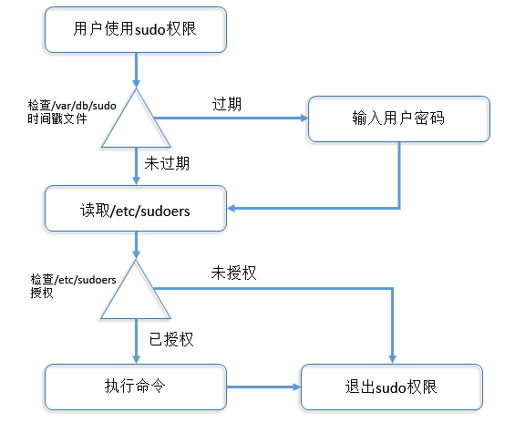

# 1 小知识点回顾
- Linux 是一个多用户多任务操作系统。
- 每个文件和进程，都需要对应一个用户和用户组。
- Linux系统是通过UID和GID来识别用户和组的。
- 用户名相当于人名（给人看的）,UID，GID相当于身份证号（系统用的）
- Linux管理员：root
- 用户和组的关系：1对1、1对多、多对1、多对多
- Linux系统用户的分类：
    * 超级用户：UID为0，代表皇帝。
    * 普通用户：UID为500-65535，由皇帝创建的普通用户，大臣。
    * 虚拟用户：UID为1-499，，为了满足程序启动的需要。
- 和用户关联的四个文件:`/etc/passwd,/etc/shadow,/etc/group,/etc/gshadow`
# 2 环境变量配置文件 /etc/skel
&nbsp;&nbsp;&nbsp;&nbsp;&nbsp;&nbsp;&nbsp;&nbsp;当我们创建一个用户的时候，他的家目录下面默认会有一些隐藏文件，比如`.bashrc、.bash_histoy、.bash_profile`这些文件从哪来的?
```bash
[root@lixin ~]# ls -la
dr-xr-x---.  3 root root  4096 Apr  1 22:39 .
dr-xr-xr-x. 25 root root  4096 Apr  1 21:51 ..
-rw-------.  1 root root 20481 Apr  1 20:08 .bash_history
-rw-r--r--.  1 root root    18 May 20  2009 .bash_logout
-rw-r--r--.  1 root root   176 May 20  2009 .bash_profile
-rw-r--r--.  1 root root   176 Sep 23  2004 .bashrc
[root@lixin ~]# ls -la /etc/skel
total 24
drwxr-xr-x.  3 root root 4096 Mar  3 23:26 .
drwxr-xr-x. 91 root root 4096 Apr  1 21:51 ..
-rw-r--r--.  1 root root   18 Jul 24  2015 .bash_logout
-rw-r--r--.  1 root root  176 Jul 24  2015 .bash_profile
-rw-r--r--.  1 root root  124 Jul 24  2015 .bashrc
drwxr-xr-x.  2 root root 4096 Nov 12  2010 .gnome2
[root@lixin ~]#
```
__对了，其实当我们执行`useradd`命令的时候，就相当于把`/etc/skel/`下的文件拷贝到了用户的家目录下。__
## 2.1 异常例子
某日用户反馈，他的账号登陆上来有如下提示，如何解决?
```bash
-bash-4.1$ 
-bash-4.1$ 
-bash-4.1$ 
-bash-4.1$
```
1.由于shell提示符是由PS1变量来提供的，查看PS1变量内容
```bash
-bash-4.1$ echo $PS1
\s-\v\$
-bash-4.1$
```
2.发现PS1环境变量错误，使用env后发现用户的环境变量错误，查看用户家目录下的环境变量发现没有。解决方法，把`/etc/skel`目录下的环境变量复制到用户的家目录下即可。
```bash
-bash-4.1$ cp /etc/skel/.bash* ~/
-bash-4.1$ cd ~/
-bash-4.1$ ls -la
drwxr-xr-x   3 stu1 stu1 4096 Apr  1 23:16 .
drwxr-xr-x. 14 root root 4096 Apr  1 16:06 ..
-rw-------   1 stu1 stu1   44 Apr  1 23:09 .bash_history
-rw-r--r--   1 stu1 stu1   18 Apr  1 23:16 .bash_logout
-rw-r--r--   1 stu1 stu1  176 Apr  1 23:16 .bash_profile
-rw-r--r--   1 stu1 stu1  124 Apr  1 23:16 .bashrc
drwxr-xr-x   2 root root 4096 Mar 31 16:29 .gnome2
```
重新登陆后，正常！
## 2.2. 小技巧
&nbsp;&nbsp;&nbsp;&nbsp;&nbsp;&nbsp;&nbsp;&nbsp;把一些说明性的文件，放在该目录下，创建用户的时候会直接复制到用户的家目录初始化用户的环境变量(可以把环境变量写入到`/etc/skel/.bash_profile`中。这样再创建用户后，就会统一使用该环境变量，达到初始化的目的
# 3 用户配置信息文件
## 3.1 设置用户账号限制的文件
__`/etc/login.defs`__  
当我们创建用户时，用户默认的UID为500以上，默认会创建用户的邮箱文件`/var/spool/mail`,那么这些信息是由谁来定义的呢。
```bash
[root@lixin etc]# grep "^[^#]" login.defs 
MAIL_DIR        /var/spool/mail  #创建用户是，在/var/spool/mail下创建邮件目录
PASS_MAX_DAYS   99999      #创建用户的默认密码最大有效期
PASS_MIN_DAYS   0        #两次修改密码的最小间隔时间
PASS_MIN_LEN    5        #密码的最小长度
PASS_WARN_AGE   7        #密码过期前的提醒时间
UID_MIN                   500    #创建用户时，最小UID
UID_MAX                 60000  #创建用户时，最大UID
GID_MIN                   500   #创建用户时，最小GID
GID_MAX                 60000  #创建用户时，最大GID
CREATE_HOME     yes        #同时创建用户的家目录
UMASK           077      #用户家目录的umask，（用户家目录权限700）
USERGROUPS_ENAB yes       #创建用户时，并创建同名用户组
ENCRYPT_METHOD SHA512       #密码使用SHA512加密
[root@lixin etc]#
```
## 3.2 创建用户的默认配置文件
__`/etc/defualt/useradd`__  
当我们创建用户的时候，为什么会去`/etc/skel`下复制变量文件？为什么会在home下创建用户的家目录？为什么会指定用户的shell为`/bin/bash`?
```bash
[root@lixin default]# cat useradd 
# useradd defaults file
GROUP=100 #创建用户时的默认组GID，如果login.defs创建同名组，则login.defs优先
HOME=/home     #在home下创建用户的家目录
INACTIVE=-1     #是否使用账号过期停权，-1表示不启动
EXPIRE=       #账号终止日期，不设置表示不启用
SHELL=/bin/bash   #设置用户的默认shell为/bin/shell
SKEL=/etc/skel      #用户环境变量目录
CREATE_MAIL_SPOOL=yes #创建用户mail目录，目录在login.defs中定义
[root@lixin default]#
```
当我们使用命令`useradd`，来创建用户的时候，它默认会按照该文件中定义的去执行，比如环境变量在`/etc/skel`下，家目录路在`/home`下。生产环境下一般不去修改该文件内容。
## 3.3 小结
- `/etc/skel`：存放用户的环境变量文件。
- `/etc/login.defs`：用来设置用户账号限制的文件。
- `/etc/default/useradd`：创建用户的默认配置文件。
# 4 用户管理相关命令
## 4.1 useradd
用于创建Linux系统中的账户  
语法格式
```bash
useradd [选项] [参数]

常用选项
-c：创建用户时，添加账户说明信息。
-d：指定用户的家目录。
-e：指定用户的终止期限，日期格式为‘mm/yy/dd’。
-g：指定用户的所属组，可以是组名，或者GID。（必须已存在）
-G：指定用户的附加组，可以是组名，或者是GID。（必须已存在）
-s：指定用户的shell，默认情况下系统会根据/etc/default/useradd设定用户的shell。
-u：指定用户的UID，不存在，且唯一。
-M：不创建用户家目录。（默认为-m，创建用户家目录）
-n：取消建立同名的用户组名。

参数
    要创建的用户名
```
实例
```bash
[root@lixin home]# useradd -c 'this is boy' -d /home/handsomeboy/ -e '2016/11/11' -g handsomeboy -G root -s /sbin/nologin -u 800 -M -n lixin
[root@lixin home]# tail -1 /etc/passwd    #用户UID，GID，描述，家目录，shell均已更改
lixin:x:800:513:this is boy:/home/handsomeboy/:/sbin/nologin
[root@lixin home]# id lixin   #所属组，和附加组也以更改
uid=800(lixin) gid=513(handsomeboy) groups=513(handsomeboy),0(root)
[root@lixin home]# ls -l /home
total 44        #没有创建同名家目录
drwxr-xr-x 2 root  root  4096 Apr  2 14:32 handsomeboy
drwxr-xr-x 3 stu1  stu1  4096 Apr  1 23:16 stu1
drwx------ 3 stu10 stu10 4096 Mar 30 18:13 stu10
drwx------ 3 stu2  stu2  4096 Mar 30 18:13 stu2
drwx------ 3 stu3  stu3  4096 Mar 30 18:13 stu3
drwx------ 3 stu4  stu4  4096 Mar 30 18:13 stu4
drwx------ 3 stu5  stu5  4096 Mar 30 18:13 stu5
drwx------ 3 stu6  stu6  4096 Mar 30 18:13 stu6
drwx------ 3 stu7  stu7  4096 Mar 30 18:13 stu7
drwx------ 3 stu8  stu8  4096 Mar 30 18:13 stu8
drwx------ 3 stu9  stu9  4096 Mar 30 18:13 stu9
[root@lixin home]# tail -1 /etc/group
handsomeboy:x:513:    #没有创建同名用户组
[root@lixin home]# chage -l lixin
Last password change                                    : Apr 02, 2016
Password expires                                        : never
Password inactive                                       : never
Account expires                                         : Nov 11, 2016 #账号期限
Minimum number of days between password change          : 0
Maximum number of days between password change          : 99999
Number of days of warning before password expires       : 7
[root@lixin home]
4.1.1 /etc/passwd文件
# 当我们创建一个用户之后，它会把用户的信息存放在/etc/passwd文件中，如图：
```
各字段含义：
- 第一段：表示用户的名称
- 第二段：表示用户的密码
- 第三段：表示用户的UID
- 第四段：表示用户的GID
- 第五段：表示用户的描述信息
- 第六段：表示用户的家目录
- 第七段：表示用户的shell信息  

小结：
- a)  用户UID范围是0-65535，root用户的UID为0，1-499表示虚拟用户的UID，500-65535表示普通用户的UID，默认在`/etc/login.defs`文件中定义的范围是500-60000
- b)  用户的密码信息，已经被定义到了`/etc/shadow`文件中，这里用x表示
- c)  指定的家目录必须是已存在的
- d)  系统支持的shell有：sh、bash、nologin、dash、tcsh、csh存放在`/etc/shells`文件中
- e)  当我们创建用户时，系统会同时更改`/etc/passwd、/etc/shadown、/etc/group、/etc/gshadow`四个文件

## 4.2 groupadd
用户创建Linux系统中的用户组
```bash
语法格式
groupadd [选项] [参数]

常用选项
-g：指定用户的GID，不存在，且唯一。

参数
要创建的用户组的组名
```
实例
```bash
[root@lixin home]# groupadd -g 1000 xiaoming
[root@lixin home]# tail -1 /etc/group
xiaoming:x:1000:
[root@lixin home]#
```
### 4.2.1 /etc/group文件
当我们创建一个用户组之后，Linux会把组相关信息存放在/etc/group文件中，如图：  
各字段含义：
- 第一段：表示用户组的名称
- 第二段：表示用户组的密码
- 第三段：表示用户组的GID
- 第四段：表示用户组内的成员  

小结：
- a)  用户组密码存放位置已经改为/etc/gshadow，这里用x表示，用户组密码现在已经很少使用。
- b)  用户组的ID，范围是0-65535，其中0是root的用户组，1-499是虚拟用户对应的用户组，500-65535，才是普通用户对应的用户组，默认在/etc/login.defs中定义了范围是500-60000。
- c)  当组中只存在和组同名的用户名时，组内成员这一列可以省略。
- d)  当我们创建用户组的时候会更改/etc/group、/etc/gshadow文件。
## 4.3 groupdel
删除Linux系统中的用户组，前提该用户组中没有成员。
```bash
语法格式
groupdel [参数]

参数
要删除的用户组的组名
```
实例
```bash
[root@lixin home]# groupdel xiaoming  #删除用户组
groupdel: cannot remove the primary group of user 'lixin'  #提示该组下存在用户lixin
[root@lixin home]# userdel -r lixin     #删除用户lixin
[root@lixin home]# groupdel xiaoming    #成功删除xiaoming用户组
[root@lixin home]#
```
## 4.4 passwd
修改Linux系统中的用户密码，以及密码相关信息，root用户可以修改任何人密码，普通用户只能修改自己的密码。
```bash
语法格式
passwd [选项] [参数]

常用选项
--stdin：接受标准输入作为用户的密码（非交互式修改密码）。
-d：删除用户密码，仅管理员有权限执行。
-l：锁住密码
-u：解开上锁的账户

参数
要修改信息的账户名，省略表示修改当前用户
```
实例
```bash
[root@lixin ~]# useradd lixin   #使用123456，为用户lixin的密码
[root@lixin ~]# echo '123456' | passwd --stdin lixin
Changing password for user lixin.
passwd: all authentication tokens updated successfully.
[root@lixin ~]#   #此方法多用户脚本中
```
## 4.5 chage
用来修改用户密码到期相关信息
```bash
语法格式
chage [选项] 用户名

常用选项
-m：密码可更改的最小天数。为零时代表任何时候都可以更改密码
-M：密码保持有效的最大天数。 
-w：用户密码到期前，提前收到警告信息的天数。 
-E：帐号到期的日期。过了这天，此帐号将不可用。 
-I：停滞时期。如果一个密码已过期这些天，那么此帐号将不可用。 
-L(小写)：例出当前的设置。
```
实例  
查看当前用户密码信息
```bash
[root@lixin ~]# chage -l root
Last password change                                    : Mar 03, 2016
Password expires                                        : never
Password inactive                                       : never
Account expires                                         : never
Minimum number of days between password change          : 0
Maximum number of days between password change          : 99999
Number of days of warning before password expires       : 7
```
各字段含义：
- Last password change：最后一次修改密码的时间
- Password expires：密码过期时间
- Password inactive：密码禁用时间
- Account expires：账号停用时间
- Minimum number of days between password change：最小修改密码时间
- Maximum number of days between password change：最大修改密码时间
- Number of days of warning before password expires：密码过期前多久开始提醒

修改用户密码相关信息
```bash
[root@lixin ~]# chage -d '2020/01/01' -E '2020/02/01' -I 60  -m 7 -M 30 -W 15 stu1
[root@lixin ~]# chage -l stu1
Last password change          : Jan 01, 2020
Password expires          : Jan 31, 2020
Password inactive         : Mar 31, 2020
Account expires           : Feb 01, 2020
Minimum number of days between password change    : 7
Maximum number of days between password change    : 30
Number of days of warning before password expires : 15
[root@lixin ~]#
```
小技巧  
- 使用passwd和chage等均可以设置或更改指定帐户密码的安全信息，我们也可以通过/etc/login.defs配置文件或/etc/defaule/useradd针对所有帐户全局生效。  
- 设置用户密码的时效有利有弊：优点是可以防止运维人员离职一段时间后发现用户还可以登陆（也可能不是自己的用户），如果设置了帐户有效期，即使用户未被清理，那么一段时间内也会因为密码失效而被自动锁定。密码时效还可以强制系统管理人员定期修改密码，提示系统安全性。缺点是有一些本来应该保留的用户也因为过期而无法登陆了，另外，在服务器数量很多的情况下唉，更改密码也是很大的工作量。在大规模的运维环境中，使用LDAP（微软活动目录）对Linux帐户统一认证，批量管理，也是不错的方法。
## 4.6 userdel
删除Linux系统中的用户
```bash
语法格式
userdel [选项] [参数]

常用选项
-r：删除用户，同时删除用户的家目录

参数
要删除的用户名
```
实例
```bash
[root@lixin ~]# userdel -r lixin  #删除用户，同时删除用户的家目录
[root@lixin ~]# ls -l /home
total 44
drwxr-xr-x 2 root  root  4096 Apr  2 14:32 handsomeboy
drwxr-xr-x 3 stu1  stu1  4096 Apr  1 23:16 stu1
drwx------ 3 stu4  stu4  4096 Mar 30 18:13 stu4
drwx------ 3 stu5  stu5  4096 Mar 30 18:13 stu5
drwx------ 3 stu6  stu6  4096 Mar 30 18:13 stu6
drwx------ 3 stu7  stu7  4096 Mar 30 18:13 stu7
drwx------ 3 stu8  stu8  4096 Mar 30 18:13 stu8
drwx------ 3 stu9  stu9  4096 Mar 30 18:13 stu9
[root@lixin ~]#
```
>小技巧  
>一般不能确认用户相关目录有没有重要数据就不能用-r。  
>vi `/etc/passwd`，注释掉用户，观察一个月，这样出问题就可以恢复  
>把登陆shell改为`/sbin/nologin`  
>ladp（类似活动目录）帐号同意管理，库里干掉用户，全部都没了。
## 4.7 usermod
该命令用于修改用户的相关信息
```bash
语法格式
usermod [选项] [参数]

常用参数
-d:修改用户的家目录。
-s:修改用户的shell。
-u：修改用户的UID
-g：修改用户的所属组
-G：修改用户的附加组
-c：修改用户的描述信息。
-e：修改用户的过期时间。
```
实例
```bash
[root@lixin ~]# tail -1 /etc/passwd
stu10:x:510:510::/home/stu10:/bin/bash
[root@lixin ~]# usermod -u 1000 -d /tmp -c 'i am boy' -g root -s /sbin/nologin stu10
[root@lixin ~]# tail -1 /etc/passwd
stu10:x:1000:0:i am boy:/tmp:/sbin/nologin
[root@lixin ~]#
```
## 4.8 su
用来切换当前用户到其他用户
```bash
语法格式
su [选项] [参数]

常用选项
-：表示切换用户，同时切换用户的环境变量。
-c <command>:表示以某个用户的身份执行一条命令。

参数
要切换的用户名
```
实例
```bash
[root@lixin ~]# su - stu1 -c whoami  #以stu1用户执行whoami命令
stu1
[root@lixin ~]#
```
小技巧  
当我们开机需要用某个身份运行某个服务的时候
```bash
[root@lixin ~]# su - apache -c /etc/init.d/apache restart
[root@lixin ~]# #该命令写入rc.local中就可以了
```
>扩展：  
>&nbsp;&nbsp;&nbsp;&nbsp;&nbsp;&nbsp;&nbsp;&nbsp;切换用户身份的su命令为我们管理Linux系统带来了很多方便，通过切换到root下，可以完成各种系统管理工作，只要任何一个普通用户知道了root用户的密码，都能以普通用户的身份切换到root下来完成无法完成的系统管理的工作。  
>&nbsp;&nbsp;&nbsp;&nbsp;&nbsp;&nbsp;&nbsp;&nbsp;但是，这样通过su命令切换到root后，也带来了很大安全管理问题：比如系统有8个用户，都可以通过切换到root身份进行系统管理，甚至还可以改掉root密码，让其他的普通用户无法再实现系统管理，还有，这么多用户中，有任何一人对系统操作的重大失误，都可能导致整个系统崩溃或数据损失。这样的非集中权式管理，在一定程度上就对系统的安全造成了较大的威胁。在工作中几乎有一般的问题来自于内部。  
>&nbsp;&nbsp;&nbsp;&nbsp;&nbsp;&nbsp;&nbsp;&nbsp;所以使用su命令切换身份在多个系统管理员共同管理的场合，并不是最好的选择,我们可以用sudo命令解决该问题。
## 4.9 newgrp
更改当前用户的属组信息，类似于su，su是切换当前用户到目标用户，newgrp是切换当前用户组到目标用户组。
```bash
语法格式
newgrp [参数]

参数
要切换到的目标用户组的组名
```
实例
```bash
[root@lixin tmp]# newgrp stu01  #切换用户的属组
[root@lixin tmp]# id 
uid=0(root) gid=1001(stu01) groups=1001(stu01),0(root)
[root@lixin tmp]# touch 12  #创建文件后发现文件的属组已更改
[root@lixin tmp]# ls -l 12
-rw-r--r-- 1 root stu01 0 Apr  3 16:16 12
[root@lixin tmp]#
```
# 5 sudu命令详解
&nbsp;&nbsp;&nbsp;&nbsp;&nbsp;&nbsp;&nbsp;&nbsp;普通用户必须知道root密码才可以切换到root，这样root密码就泄露了。相当于把“枪”交给了别人。  
&nbsp;&nbsp;&nbsp;&nbsp;&nbsp;&nbsp;&nbsp;&nbsp;使用su命令切换身份，无法对切换后的身份做精细的控制，拿到超级权限的人可以为所欲为。甚至可以改掉root密码，让真正的管理员无法拥有root权限。  
&nbsp;&nbsp;&nbsp;&nbsp;&nbsp;&nbsp;&nbsp;&nbsp;通过sudo命令，我们可以把某些超级用户权限分类有针对性的授权给指定用户，并且普通用户不需要知道root密码就可以使用得到的授权（管理员真正允许的root权限）。因此sudo命令比su命令在权限管理上来说更精细，更安全。
## 5.1 sudu原理
&nbsp;&nbsp;&nbsp;&nbsp;&nbsp;&nbsp;&nbsp;&nbsp;普通用户通过在要执行的命令前加sudo来启动sudo权限，系统首先检测/var/db/sudo/username（对应的用户名）的时间戳文件，默认是5分钟，若过期则需要输入当前用户的密码，若没有过期则直接进入/etc/visudo文件中，查找该用户是否被sudo授权了该命令，若授权，则返回结果后退出sudo权限，若没有授权，则直接退出sudo权限。  
如下图：  
  

## 5.2 配置文件解析
`/etc/sudoers`  
该文件主要定义用户权限的语法是：  
  
各字段含义：
- 第一段：表示可以使用sudo权限的用户或用户组或者用户集合的别名
- 第二段：主机名（或主机别名，可以定义多个主机）=（要切换到的用户，一般是root）可以省略，默认是root。
- 第三段：表示可以执行的权限(注意多个命令用，隔开。如果执行sudo不想输入密码可以在命令前加入`NOPASSWD`：，也可以用/bin/*表示/bin下的所有命令)
## 5.3 配置方法
&nbsp;&nbsp;&nbsp;&nbsp;&nbsp;&nbsp;&nbsp;&nbsp;用visudo命令直接对`/etc/sudoers`文件进行编辑，效果等同于vi `/etc/sudoers`，但是visudo默认带语法检查，如果我们使用vi `/etc/sudoers`对文件进行编辑的时候，需要使用visudo –c 来检查该文件的正确性。
### 5.3.1 visudo
编辑sudo配置文件
```bash
语法格式
visudo [选项]

常用选项
-c：检查/etc/sudoers文件的语法是否正确
```
实例
```bash
[root@lixin etc]# visudo -c
/etc/sudoers: parsed OK
[root@lixin etc]#
```
### 5.3.2 sudo
使用其他用户执行命令
```bash
语法格式
sudo [选项] [参数]

常用选项
-l：列出当前用户可以执行的sudo权限
-k：清除用户的时间戳文件（下一次执行sudo将要输入密码）

参数
要执行的命令
```
实例：
```bash
[root@lixin etc]# sudo -l
Matching Defaults entries for root on this host:
requiretty, !visiblepw, always_set_home, env_reset, env_keep=\"COLORS DISPLAY HOSTNAME HISTSIZE INPUTRC KDEDIR LS_COLORS\", env_keep+\"MAIL PS1
secure_path=/sbin\:/bin\:/usr/sbin\:/usr/bin
……
User root may run the following commands on this host:
(ALL) ALL       #说明我可以切换到任何用户下执行任何命令
[root@lixin etc]#
```
## 5.4实例
1. 使stu1用户可以使用rm命令删除属于root的文件
```bash
##第一部分，测试时候可以删除root用户文件
[root@lixin home]# ls -l
drwxr-xr-x 2 root  root  4096 Apr  2 14:32 handsomeboy
[stu1@lixin home]$ rm -rf handsomeboy   
rm: cannot remove 'handsomeboy': Permission denied   #被拒绝
[stu1@lixin home]$ sudo rm -rf handsomeboy
[sudo] password for stu1: 
stu1 is not in the sudoers file.  This incident will be reported.
[stu1@lixin home]$

##第二部分root用户授权stu1用户rm命令的sudo权限
[root@lixin home]# echo 'stu1     ALL=(root)     /bin/rm' >> /etc/sudoers
[root@lixin home]# visudo –c  # 检查语法
/etc/sudoers: parsed OK
[root@lixin home]# tail -1 /etc/sudoers
stu1     ALL=(root)     /bin/rm
[root@lixin home]#

##第三部分测试stu1用户sudo 权限
[stu1@lixin home]$ ls -l
drwxr-xr-x 2 root  root  4096 Apr  2 14:32 handsomeboy
[stu1@lixin home]$ rm -rf handsomeboy
rm: cannot remove 'handsomeboy': Permission denied
[stu1@lixin home]$ sudo rm -rf handsomeboy
[sudo] password for stu1: 
[stu1@lixin home]$ ls -l
[stu1@lixin home]$    #使用sudo权限后，删除root文件成功！

注意：
正常编写sudoers文件需要使用visudo命令进入sudoers文件中进行编写，不要使用echo 的方式追加，避免出现问题
扩展
使用别名定义多个用户多个命令集合
##定义用户、主机、命令别名
visudo；
Host_Alias LOCALHOST = lixin 
User_Alias TESTUSER = stu1, stu2
Cmnd_Alias NETWORK = /bin/rm
TESTUSER     LOCALHOST=(root) NOPASSWD: NETWORK  #不需要输入密码

##查看用户的sudo权限
[root@lixin home]# su - stu1
[stu1@lixin ~]$ sudo -l
Matching Defaults entries for stu1 on this host:
……
LC_NAME LC_NUMERIC LC_PAPER LC_TELEPHONE\", env_keep+=\"LC_TIME LC_ALL LANGUAGE LINGUAS _XKB_CHARSET XAUTHORITY\",
secure_path=/sbin\:/bin\:/usr/sbin\:/usr/bin

User stu1 may run the following commands on this host:
(root) NOPASSWD: /bin/rm  #stu1已经具有/bin/rm权限，并且没有输入密码
[stu1@lixin ~]$
[root@lixin home]# su - stu2
[stu2@lixin ~]$ sudo -l
Matching Defaults entries for stu2 on this host:
……
LC_NAME LC_NUMERIC LC_PAPER LC_TELEPHONE\", env_keep+=\"LC_TIME LC_ALL LANGUAGE LINGUAS _XKB_CHARSET XAUTHORITY\",
secure_path=/sbin\:/bin\:/usr/sbin\:/usr/bin

User stu2 may run the following commands on this host:
(root) NOPASSWD: /bin/rm  #stu2已经具有/bin/rm权限，并且没有输入密码
[stu2@lixin ~]$
```
小结:  
|用户|主机|角色|命令|
|:---:|:---:|:---:|:---:|
|TESTUSER|LOCALHOST|root|NOPASSWD|
|stu1,stu2|lixin|| /bin/rm|
## 5.5注意事项
- 授权规则中的所有ALL字符串必须为大写字母。
- 允许执行的命令是有顺序的。命令的顺序是从后向前的，编写的时候要把禁止的命令放在允许的命令的后面。
- 一行内容超长可以用“\”斜线表示换行。
- '！'叹号表示非，就是命令取反的意思，既禁止使用的命令。（例如/bin/*, ！/bin/rm 允许使用/bin下所有命令，但不允许使用rm命令）
## 5.6远程执行sudo命令
默认情况下我们是无法通过ssh远程执行sudo命令的
```bash
[root@lixin home]# ssh stu1@10.0.0.8 sudo rm -rf /home/home      
stu1@10.0.0.8\'s password: 
sudo: sorry, you must have a tty to run sudo   #由于sudo是交互式的输入密码执行，提示需[root@lixin home]#                         要一个tty（虚拟终端）来执行sudo
```
查看visudo配置文件后发现如下内容：
```bash
# Disable "ssh hostname sudo <cmd>", because it will show the password in clear. 
#         You have to run "ssh -t hostname sudo <cmd>".
#
Defaults    requiretty    #原来是sudoers禁止了ssh hostname sudo<cmd>这种方式，因为可能会泄露密码，但它提示我们可以使用ssh –t hostname sudo <cmd>来执行
```
查看了ssh 的-t参数，表示指定一个伪终端来迫使shell以交互的模式来工作。
```bash
[root@lixin home]# ssh -t stu1@10.0.0.8 sudo rm -rf /home/home
stu1@10.0.0.8\'s password: 
Connection to 10.0.0.8 closed.
[root@lixin home]# ls –l      #删除成功
```
## 5.7sudo审计功能
通过配置`sudo`的审计功能，来查看用户使用`sudo`权限都进行了哪些操作  
配置日志审计功能：
```bash
# 1.确认sudo 和rsyslog这两个包是否存在
[root@lixin home]# rpm -qa sudo rsyslog
rsyslog-5.8.10-10.el6_6.x86_64
sudo-1.8.6p3-19.el6.x86_64
[root@lixin home]#
# 2.配置/etc/sudoers
[root@lixin home]# echo "Defaults     logfile=/var/log/sudo.log" >>/etc/sudoers
[root@lixin home]# tail -1 /etc/sudoers
Defaults     logfile=/var/log/sudo.log
[root@lixin home]#
## 在配置文件中添加sudo日记记录（Defaults loginfile=/var/log/sudo.log）
# 3.测试是否记录
##使用stu1用户执行sudo权限
[stu1@lixin home]$ rm -rf stu10
rm: cannot remove 'stu10': Permission denied
[stu1@lixin home]$ sudo rm -rf stu10
[stu1@lixin home]$ ls -l
[stu1@lixin home]$

##查看sudo日志信息，确认是否记录
[root@lixin home]# cat /var/log/sudo.log 
Apr  2 23:44:55 : stu1 : TTY=pts/0 ; PWD=/home/stu1 ; USER=root ;
COMMAND=/bin/rm -rf test.txt
Apr  2 23:45:15 : stu1 : TTY=pts/0 ; PWD=/home ; USER=root ; COMMAND=/bin/rm -rf
stu10
[root@lixin home]#  #已成功记录sudo日志
```