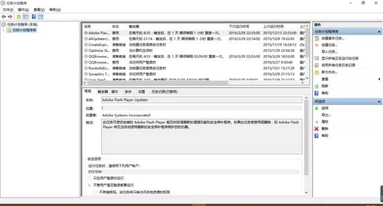

# 1 什么是定时任务
&nbsp;&nbsp;&nbsp;&nbsp;&nbsp;&nbsp;&nbsp;&nbsp;我们的服务器存放的都是非常重要的数据，为了安全起见，我们每晚都会进行备份把数据备份到其他服务器上防止数据丢失，那么我们每天晚上都要手动的去备份吗？
&nbsp;&nbsp;&nbsp;&nbsp;&nbsp;&nbsp;&nbsp;&nbsp;服务器上运行的服务都会有日志文件，它会记录程序运行运行时的输出信息，服务器运行久了这些文件就会非常大，那么我们要定期的进行手动删除吗？
&nbsp;&nbsp;&nbsp;&nbsp;&nbsp;&nbsp;&nbsp;&nbsp;如果我们需要定时执行一些周期性重复性的任务，我们就会用到定时执行任务功能来帮我们自动执行每天、每周等周期性重复性的任务而不需要人为干预即可实现。    
# 2 Windows的定时任务
作为使用者最多的操作系统，windows下也有定时任务。依次选择`开始`——>`所有程序`——>`附件`——>`系统工具`——>`任务计划程序`
  
# 3 Linux的定时任务
&nbsp;&nbsp;&nbsp;&nbsp;&nbsp;&nbsp;&nbsp;&nbsp;Linux中的定时任务主要分为两种:
1. 系统定时任务
2. 用户自定义定时任务
## 3.1 系统定时任务
&nbsp;&nbsp;&nbsp;&nbsp;&nbsp;&nbsp;&nbsp;&nbsp;系统周期自行执行的任务工作，如轮询系统日志、备份系统数据、清理系统缓存等，这些任务无需我们认为干涉。系统定时任务是由/etc/logrotate.conf文件中的定义的，它的文件定义内容为：
```bash
[root@lixin ~]# grep '^[^#]' /etc/logrotate.conf
weekly               #按周分隔
rotate 4             #最多分成4份，然后覆盖
create                #创建新的空文件，供记录
dateext             #分隔文件，用日期加后缀名
include /etc/logrotate.d           #包涵/etc/logrotato.d下的文件
/var/log/wtmp {
    monthly             #按月分隔
    create 0664 root utmp    #分隔后,创建权限为0644属主为root，名字为utmp的新文件
        minsize 1M      #最小1M
    rotate 1             #分1份
}
/var/log/btmp {
    missingok
    monthly
    create 0600 root utmp
    rotate 1
}
#        该文件定义的是系统定时任务，我们一般不更改其内容。
```
## 3.2 用户自定义任务
&nbsp;&nbsp;&nbsp;&nbsp;&nbsp;&nbsp;&nbsp;&nbsp;某个用户或系统管理员定期要做的任务，例如每隔5跟中和互联网上时间服务器进行时间同步（基础优化）每天晚上0点备份站点数据库及数据库数据，一般这些工作需要每个用户自行设置。  
&nbsp;&nbsp;&nbsp;&nbsp;&nbsp;&nbsp;&nbsp;&nbsp;用户自定义常用的有三种：`at`、`anacron`、`crontab`
### 1.2.3 自定义任务种类
__`at`__  
&nbsp;&nbsp;&nbsp;&nbsp;&nbsp;&nbsp;&nbsp;&nbsp;仅仅适合那些执行一次就结束的调度任务命令，例如：某天晚上需要处理一个任务，仅仅是这一天晚上，属于突发性的工作任务。由于at命令的是atd服务提供的，所以在我们使用at之前需要首先启动atd服务。由于at仅能执行一次，所以工作中并不常用。
```bash
[root@lixin ~]# chkconfig --list atd
atd             0:off   1:off   2:off   3:off   4:off   5:off   6:off
[root@lixin ~]#
```
__`anacron`__  
&nbsp;&nbsp;&nbsp;&nbsp;&nbsp;&nbsp;&nbsp;&nbsp;这个命令适合那些非7*24小时开机的服务器，anacron并不能指定具体时间执行任务工作，而是以天为周期或者在系统每次开机后执行的任务工作。它会检测服务器停机期间应该执行，但没有进行的任务工作，并将该任务执行一遍。由于网站服务器基本都是7*24小时开机的，所以该命令也不常用。
__`crontab`__  
这个命令可以周期性的执行任务工作，比如可以每5分钟同步一次服务器的时间。crontab这个命令时候crond服务提供的，所以想要使用crontab就必须开启crond服务，这个命令对我们非常有用！下面将详细说明
```bash
[root@lixin ~]# chkconfig --list crond
crond           0:off   1:off   2:on    3:on    4:on    5:on    6:off
[root@lixin ~]#
```
## 3.3 本章小结
&nbsp;&nbsp;&nbsp;&nbsp;&nbsp;&nbsp;&nbsp;&nbsp;我们所说的crond服务是运行的程序，而crontab命令是用户用来设置定时规则的命令。`crond`服务是企业生产工作中常用的重要服务，at和anacron很少用，可以忽略,几乎每个服务器都会用到crond服务。成百上千的服务器可以开发分布式定时任务项目方案。
# 4 crontab定时任务
&nbsp;&nbsp;&nbsp;&nbsp;&nbsp;&nbsp;&nbsp;&nbsp;crontab是一个命令，后台周期性按分钟检测的是crond服务，这个服务会周期性的检测`/var/spool/cron/username`(用户的定时任务配置文件)用来检测是否有定时任务要执行。它的配置及说明文件为`/etc/crontab`。
## 4.1 开启服务
&nbsp;&nbsp;&nbsp;&nbsp;&nbsp;&nbsp;&nbsp;&nbsp;确保crond服务开机自启动。
```bash
[root@lixin ~]# chkconfig --list | grep crond
crond           0:off   1:off   2:off    3:off    4:off    5:off    6:off
[root@lixin ~]#
[root@lixin ~]# chkconfig crond on #设置crond服务，2345级别自启动
[root@lixin ~]# chkconfig --list | grep crond
crond           0:off   1:off   2:on    3:on    4:on    5:on    6:off
[root@lixin ~]#
```
## 4.2 配置文件
```bash     
[root@lixin ~]# cat /etc/crontab
SHELL=/bin/bash
PATH=/sbin:/bin:/usr/sbin:/usr/bin
MAILTO=root
HOME=/
 
# For details see man 4 crontabs
 
# Example of job definition:
# .---------------- minute (0 - 59)
# |  .------------- hour (0 - 23)
# |  |  .---------- day of month (1 - 31)
# |  |  |  .------- month (1 - 12) OR jan,feb,mar,apr ...
# |  |  |  |  .---- day of week (0 - 6) (Sunday=0 or 7) OR sun,mon,tue,wed,thu,fri,sat
# |  |  |  |  |
# *  *  *  *  * user-name command to be executed
 
[root@lixin ~]#
```
其中各字段含义为：
- 第一段：表示分钟，取值范围是0-59
- 第二段：表示小时，取值范围是0-23
- 第三段：表示日，取值分为是1-31
- 第四段：表示月份，取值范围是1-12
- 第五段：表示周，取值范围是0-6(或1-7)
- 第六段：表示cmd（要执行的操作）  

__小提示：周和日最好不要同时用，可能达不到想要的效果。__
## 4.3 特殊符号
|名称|含义|实例|
|:--:|:---:|:---|
|\*|表示每(任意时间都)|* * * * * 表示分钟|
|-|表示范围区间|1-5 * * * *表示每小时的1、2、3、4、5分钟|
|,|表示分隔时段|1，3 * * * *表示每小时的第1，3分钟|
|/n|表示每隔n| */5 * * * * 表示每隔5分钟|
 
__小提示：分位上是* 表示每分钟（一般是不正常的）__
## 4.4 配置命令
__`crontab`__
|命令|参数|含义|
|:---:|:---:|:---:|
|crontab|-l(list)|查看crontab定时任务。功能等同于cat /var/spool/cron/username|
||-e(edit) |编辑crontab定时任务。功能等同于 vi /var/spool/cron/username|
||-u(user)|查看指定用户的crontab信息
```bash
格式：
       crontab –e 直接编辑crontab定时任务
```
例如：
```bash
[root@lixin ~]# crontab -l
###sync time server###
*/5 * * * * /usr/sbin/ntpdate cn.ntp.org.cn >/dev/null 2>&1
[root@lixin ~]#         #5分钟同步一次时间，把输出定义到空，错误输出等同于正确输出
```
小提示：
1. 使用crontab –e去编辑定时任务，因为它可以检查语法，比如时间格式是否正确
2. 该命令具有SUID权限，普通用户也可以执行
## 4.5 本章小结
- 使用`crontab –e`编辑定时任务的时，尽量添加注释。
- 如果使用echo类似的命令时，不要继续使用>>， 2>,等符号，一面达不到预期效果
- 定时任务中的路径一定要写绝对路径。
- `crond`服务必须开启
- 日志存放在`/var/log/cron`中
# 5 规范
1. 由于`crontab`的重要性，在编写时应该遵守一定的规范。
2. 添加一条`crontab`记录时，要添加备注。
3. 把要定期执行的命令放入脚本中。
4. 进入目标的上级目录打包（也可以全路径）。
5. 命令在命令行测试完毕后，再复制粘贴到脚本中，防止错误。
6. 脚本最好放在一个统一的目录下。
7. 有些命令测试时为了查看过程添加了-v参数，在`crontab`中需要取消该参数。
8. 脚本命名一般使用.sh为后缀,其他的还有.pl，表示perl脚本，.py表示python脚本。
9. 指定脚本的解释器，可以防止脚本没有x权限时导致无法执行，以bash为例，指定bash为解释器时，要加命令的全路径`/bin/bash`,脚本也要使用全路径。
10. 定时任务结尾要加上`>/dev/null 2>&1 `防止因为`sendmail`服务没开，造成的邮件过多，导致inode满的问题。
# 6 实例
&nbsp;&nbsp;&nbsp;&nbsp;&nbsp;&nbsp;&nbsp;&nbsp;每隔 2 个小时将/etc/services 文件打包备份到/tmp 下（最好每次备份成不同的备份包）  
```bash
# 1.使用命令行进行测试
[root@lixin tmp]# tar zcvf /tmp/backup_$(date +%F).tar.gz /etc/services
tar: Removing leading '/' from member names
/etc/services
[root@lixin tmp]# ls
123    backup_2016-03-30.tar.gz
[root@lixin tmp]#           # $()表示引用括号内命令的结果，可也可以使用反引号``。

# 2.编写脚本（把命令放入文件中），取消-v参数
[root@lixin ~]# vim backup.sh
tar zcf /tmp/backup_$(date +%F).tar.gz /etc/services

# 3.使用sh测试脚本
[root@lixin ~]# ls /tmp
123
[root@lixin ~]# sh backup.sh
tar: Removing leading '/' from member names
[root@lixin ~]# ls /tmp
123  backup_2016-03-30.tar.gz
[root@lixin ~]#

# 4.编写定时任务
[root@lixin ~]# crontab -e
###backup services data###
* */2 * * * /bin/sh /root/backup.sh >/dev/null 2>&1
```
在每周6的凌晨3：15分执行/home/shell/collect.pl 并将标准输出和标准错误输出到/dev/null设备，请写出crontab中的语句
```bash
[root@lixin ~]# crontab -e
###backup###
15 03 * * 6 /bin/perl /home/shell/collect.pl >/dev/null 2>&1
```
crontab在11月份内，每天的早上6点到12点钟，每2小时执行一次/usr/bin/httpd.sh怎么实现
```bash
[root@lixin ~]# crontab -e
###reboot httpd server###
00 6-12/2 * 11 * /bin/sh /usr/bin/httpd.sh >/dev/null 2>&1
```
每天晚上00：30点，打包站点目录，/etc/rc.local，/var/spool/cron，/etc/hosts，备份到/backup目录下，每次备份按时间生成不同的备份包，删除三天以前的备份包
```bash
# 1.使用命令行进行测试
[root@lixin ~]#cd /
[root@lixin /]# tar zcvf /backup/backup_$(date +%F).tar.gz etc/rc.local var/spool/cron/ etc/hosts
etc/rc.local
var/spool/cron/
var/spool/cron/root
etc/hosts
[root@lixin /]# cd /backup
[root@lixin backup]# ls
backup_2016-03-30.tar.gz
[root@lixin backup]#

# 2.编写脚本，取消输出参数-v
[root@lixin backup]#vim backup.sh
cd / && \
tar zcf /backup/backup_$(date +%F).tar.gz etc/rc.local var/spool/cron/ etc/hosts
####备份####
# &&表示且，只有cd /这条命令执行成功后，才会执行tar命令
# \回车，表示下一行和本行属于一行

# 3.使用sh测试脚本
[root@lixin backup]# sh backup.sh
[root@lixin backup]# ls /tmp
123  backup_2016-03-30.tar.gz
[root@lixin backup]#                 #测试成功

# 4.编写crontab内容
[root@lixin ~]#crontab -e
###backup web station###
30 00 * * * /bin/sh /backup/backup.sh >/dev/null 2>&1
```
# 7 注意
&nbsp;&nbsp;&nbsp;&nbsp;&nbsp;&nbsp;&nbsp;&nbsp;在`crontab –e`中，比如使用`date +%F`，这种命令时，由于`crontab` 默认不识别%，需要进行转意，即`\%`，当我们使用脚本进行定时任务时，而脚本中又使用系统环境变量，建议在脚本中再定义一遍，防止因为环境变量的问题导致定时任务失败。
# 8 inode被填埋的问题
问题：我们的服务器上发生了No space left on device，df –h发现没满，请问为什么？  
解答：默认定时任务执行时会给root发邮件，如果邮件服务不打开，就会把邮件存放在临时队列目录：
1. centos 5：/var/spool/clientmqueue
2. centos 6：/var/spool/postfix/maildrop  

&nbsp;&nbsp;&nbsp;&nbsp;&nbsp;&nbsp;&nbsp;&nbsp;当crontab的定时任务，结尾不加>/dev/null 2>&1的时候，定时任务执行后的邮件就会临时存放在上述目录，由于每个邮件占4K，所以很快会把inode号占满，就会造成这种情况。
解决方法有两种：
1.  开启postfix服务，让邮件成功发送。（不常用）
2. 在crontab定时任务的每一条目后添加 >/dev/null 2>&1，把通知丢弃。