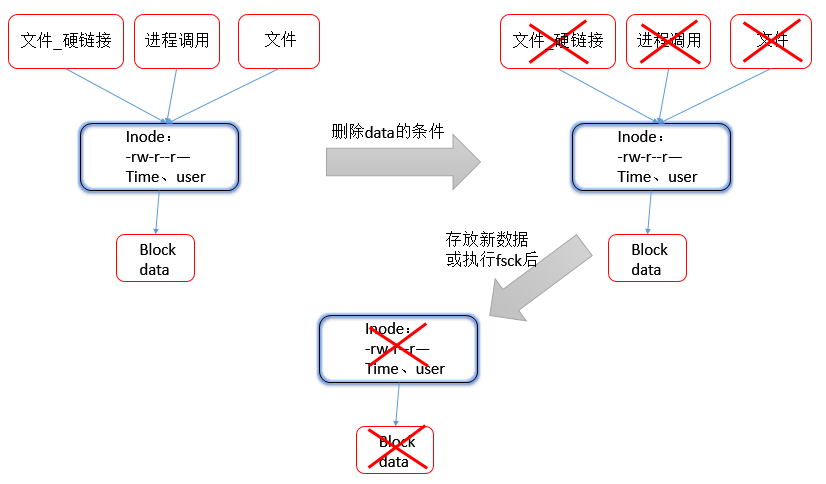

# 1 概述
&nbsp;&nbsp;&nbsp;&nbsp;&nbsp;&nbsp;&nbsp;&nbsp;我们使用ls –il命令查看的文件列表就是我们文件的简要属性信息。
```bash
[root@lixin ~]# ls –li       
total 80
26171 -rw-r--r--  1 root root    11 Mar 17 22:24 12345.txt
3545 lrwxrwxrwx  1 root root     6 Mar 16 23:24 1234.txt -> 10.txt
3581 -rw-r--r--  1 root root   149 Mar 16 23:03 123.tar.gz
3563 -rw-r--r--  1 root root   149 Mar 17 00:21 123.txt.bak
26197 -rw-r--r--  1 root root    11 Mar 18 00:01 1.txt
26181 -rw-r--r--  1 root root     0 Mar 16 19:46 2.txt
26182 -rw-r--r--  1 root root     0 Mar 16 19:46 3.txt
26191 -rw-r--r--  1 root root     0 Mar 16 19:46 7.txt
26192 -rw-r--r--  1 root root     0 Mar 16 19:46 8.txt
26193 -rw-r--r--  1 root root     0 Mar 16 19:46 9.txt
26195 lrwxrwxrwx  1 root root     5 Mar 17 22:51 abc -> 1.txt
3559 -rw-r--r--  1 root root   226 Mar 16 21:24 abc.tar.gz
26194 -rw-r--r--  1 root root    30 Mar 17 17:54 abc.txt
25745 -rw-------. 1 root root  1096 Mar  3 23:30 anaconda-ks.cfg
26199 -rw-r--r--  1 root root    11 Mar 16 20:27 bcd
……
[root@lixin ~]#    # -l长格式显示文件信息，-i显示文件inode号
```
其中文件的属性信息被分成了10列，每列具体信息如下:
- 第一列：表示文件的inode号码。
- 第二列：表示文件的类型和权限以及selinux。
- 第二列：表示文件或目录的硬链接数量。
- 第四列：表示文件的属主。
- 第五列：表示文件的属组。
- 第六列：表示文件的大小。
- 第七、八、九列：合起来表示文件的修改时间（mtime）。
- 第十列：表示文件的名称。
# 2 inode 
## 2.1 概念
&nbsp;&nbsp;&nbsp;&nbsp;&nbsp;&nbsp;&nbsp;&nbsp;硬盘要存储数据（房子助人），首先要分区（隔断），然后创建文件系统（装修），最后存储数据（住人）。  
&nbsp;&nbsp;&nbsp;&nbsp;&nbsp;&nbsp;&nbsp;&nbsp;inode 中文意思为索引节点（index node），在设备分区为ext4后（CentOS 6.7默认文件系统），一般生成两个部分：第一部分是inode（很多个），第二部分是block（很多个）它用来存放档案及目录的基本信息，包含时间、档名、使用者及群组等。
- block：是用来存储实际数据
- inode：是用来存储数据属性的。  

&nbsp;&nbsp;&nbsp;&nbsp;&nbsp;&nbsp;&nbsp;&nbsp;我们ls -l查出来的文件属性信息，存放在inode中，包涵不限于（文件大小，属主，属组，文件的权限，文件类型，修改时间），还包涵一个指针，用来指向真实的数据部分，但是inode中不包含文件名。严格来说文件的名称不属于文件的属性。  
&nbsp;&nbsp;&nbsp;&nbsp;&nbsp;&nbsp;&nbsp;&nbsp;Inode除了记录文件属性的信息外，还会为每个文件进行信息索引，所以就有了inode的系统根据指令，即可通过inode的值最快的找到相应的文件实体，文件，inode,block之间的关系图下：

## 2.2 如何查看inode
使用ls –i即可查看文件的inode节点号。
```bash
[root@lixin ~]# ls -i
26171 12345.txt    26190 6.txt            26185 file10.log  26184 file9.log
3545 1234.txt     26191 7.txt            25401 file1.log      15 install.log
3581 123.tar.gz   26192 8.txt            26172 file2.log      17 install.log.syslog
3563 123.txt.bak  26193 9.txt            26173 file3.log   26187 oldboy.txt
26197 1.txt        26195 abc              26174 file4.log    3561 paichu.txt
26181 2.txt         3559 abc.tar.gz       26176 file5.log    3535 test.txt
26182 3.txt        26194 abc.txt          26178 file6.log
26188 4.txt        25745 anaconda-ks.cfg  26179 file7.log
26189 5.txt        26199 bcd              26183 file8.log
[root@lixin ~]#
```
使用stat 查看文件完整的inode信息
```bash
[root@lixin ~]# stat 1.txt 
File: '1.txt'
Size: 11              Blocks: 8          IO Block: 4096   regular file
Device: 803h/2051d      Inode: 26197       Links: 1
Access: (0644/-rw-r--r--)  Uid: (    0/    root)   Gid: (    0/    root)
Access: 2016-03-18 00:01:40.459890430 +0800
Modify: 2016-03-18 00:01:40.459890430 +0800
Change: 2016-03-18 00:01:40.459890430 +0800
[root@lixin ~]#
```
## 2.3 Inode容量
&nbsp;&nbsp;&nbsp;&nbsp;&nbsp;&nbsp;&nbsp;&nbsp;inode要储存文件信息，就会有大小。CentOS 5系列 inode默认大小为128字节，CentOS 6 系列大小是256字节。inode的数量在文件系统被格式化分区之后就固定的，格式化分区之后就无法更改了。格式化之前就应该指定大小，可以通过参数来指定，一般企业工作环境没这个需求。  
&nbsp;&nbsp;&nbsp;&nbsp;&nbsp;&nbsp;&nbsp;&nbsp;__使用dumpe2fs查看文件系统的inode或者block信息。__
```bash
[root@lixin ~]# dumpe2fs /dev/sda1 | grep -i "inode count" 
dumpe2fs 1.41.12 (17-May-2010)
Inode count:              51200
[root@lixin ~]# dumpe2fs /dev/sda1 | grep -i "block count"
dumpe2fs 1.41.12 (17-May-2010)
Block count:              204800
Reserved block count:     10240
[root@lixin ~]# dumpe2fs /dev/sda1 | grep -i "block size" 
dumpe2fs 1.41.12 (17-May-2010)
Block size:               1024
[root@lixin ~]# dumpe2fs /dev/sda1 | grep -i "inode size"
dumpe2fs 1.41.12 (17-May-2010)
Inode size:               128
[root@lixin ~]#
```
使用df查看inode使用情况
```bash
[root@lixin ~]# df -i
Filesystem     Inodes IUsed  IFree IUse% Mounted on
/dev/sda3      462384 69826 392558   16% /
tmpfs           60830     1  60829    1% /dev/shm
/dev/sda1       51200    38  51162    1% /boot
[root@lixin ~]#
```
各字段含义如下：
- inode也属于磁盘的空间，inode也有满的时候。inode满了，就算block还有空间也不能存放数据了。
- 空间是否满了，是由两项参数决定的：
- inode是否满了。
- block是否满了。  

__磁盘满的一个特征（no space left on device )。__
## 2.4 inode小结
- 磁盘分区并格式化为ext4会生成一定量的inode和block
- Inode成为索引节点，它的作用是存放文件的属性信息以及作为文件的索引，指向文件的实体（block）。
- Ext3/ext4文件系统的block存放的是文件的实际内容
- Inode是一块存储空间，CentOS6非启动分区inode默认大小256字节，CentOS 5是128字节。
- Inode是一串数字，不同的文件对应的inode在同一个文件系统里是唯一的。
- Inode相同的文件，互为硬链接文件。（可以理解为相同文件的不同入口）
- Ext3/ext4文件系统下，一个文件被创建后至少要占用一个inode和一个block。
- Block的大小一般有1K，2K，4K，等几种，其中引导分区等为1K，普通分区为4K(CentOS 6)
- 如果一个文件很大，可能占用多个block，如果文件很小，至少占一个block，剩下的空间，也就浪费了。
- 正常情况下一个文件占用有且只能占用1个inode（硬链接不算）。  

注：只能在格式化磁盘的时候指定inode的大小:
`mkfs.ext4 -b 2048 -l 256 /dev/sdb (-b指定了block的大小，-l可以指定inode的大小)`

## 2.5 block小结
- 磁盘读取数据是按block为单位读取的。
- 一个文件可能占用多个block。但是每读取一个block就会消耗一次磁盘I/O。
- 如果要提升磁盘IO性能，那么就要尽可能一次性读取数据尽量的多。
- 一个block只能存放一个文件的内容，无论内容有多小(如果block为4K，那么存放1K，的文件后，剩下的3K就浪费了。
- Block并非越大越好。Block太大对于小文件存放就会浪费磁盘空间，例如1000K的文件。Block为4K，占用250个block，blcok为1K，占1000个block访问效率谁更高？ 消耗IO分别为250次和1000次。
- 根据业务需求确定默认的block大小，比如环境中大文件（大于16K）一般设置block大一点，小文件（小于1K）一般，block小一点。
- Block太大，例如4K，文件都是0.1K，则会大量浪费磁盘空间。
- Block太小，例如1K，文件都是1000K,则会大量耗费磁盘IO。
- Block的设置也是在格式化分区的时候:mkfs.ext4 –b 2048 /dev/sdb。
- 文件较大时，block设置大一些会提升磁盘访问效率。
- Ext3/ext4文件系统（CentOS5和6）一般设置为4K，CentOS 7，一般是xfs文件系统
## 2.6 本章小结
- Inode存放文件的属性以及指向文件实体的指针，文件名不在inode里，一般上级目录的block里。
- 访问文件，原理通过文件名inodeblock。
- Inode一般情况下默认为256B，block大小为1K，2K，4K默认是4K，引导分区等特殊除外。
- 通过df –i查看inode的数量及使用情况，dumpe2fs /dev/sda3查看inode及block大小。
- 一个文件至少要占用一个inode以及一个block，多个文件可以占用同一个inode(硬链接)。
- 一个block只能被一个文件使用，如果文件很小block很大，剩余空间浪费，无法继续被其他文件使用。
# 3 权限信息
&nbsp;&nbsp;&nbsp;&nbsp;&nbsp;&nbsp;&nbsp;&nbsp;包涵文件的类型和文件的权限。
## 3.1 文件类型
&nbsp;&nbsp;&nbsp;&nbsp;&nbsp;&nbsp;&nbsp;&nbsp;windows 中是以扩展名区分的，Linux中文件类型和扩展名是没有关系的，文件类型为了让我们看起来方便，我们标记了扩展名。（比如a.txt)  
在linux中扩展名的分类：
- tar、tar.gz、tgz、zip、tar.bz表示压缩文件，创建命令一般为tar,gzip,zip等
- sh表示shell脚本文件。
- pl表示perl语言文件。
- py表示python语言文件。
- html、htm、php、jsp、do表示网页语言文件。
- conf表示系统配置文件。
- rpm表示rpm安装包文件。  

__Linux中的文件类型主要观察第一列：__  
  
__Linux中文件的类型有如下几种：__
- -：表示普通文件（比如/etc/profile、/bin/cp、/var/log/wtmp）
- d：表示目录文件 (比如/etc目录)
- l：表示软连接文件 (比如 /etc/init.d)
- c：表示字符设备 (比如/dev/tty)
- b：表示块设备（比如/dev/sda）
- s：sock文件，主要用来做进程通讯。
- p：管道文件（pipa）。
## 3.2 普通文件
&nbsp;&nbsp;&nbsp;&nbsp;&nbsp;&nbsp;&nbsp;&nbsp;在linux中表示普通文件，而普通文件又分为三种。
- 二进制文件（例如：命令，脚本）
- 数据文件（例如/var/log/wtmp、/var/log/btmp）
- 纯文本文件(例如/etc/profile)

使用file命令查看文件的类型：
```bash
[root@lixin dev]# file /etc/profile
/etc/profile: ASCII English text     # 表示纯文本文件
[root@lixin dev]# file /bin/cp
/bin/cp: ELF 64-bit LSB executable, x86-64, version 1 (SYSV), dynamically linked (uses shared libs), for GNU/Linux 2.6.18, stripped    # 表示二进制文件
[root@lixin dev]# file /var/log/wtmp
/var/log/wtmp: data          # 表示数据文件
[root@lixin dev]#
# 二进制文件：我们使用的命令就是这种格式个文件，这种格式的文件，不能通过cat、more等命令查看。
# 纯文本文件：程序的配置文件，文本文件等。
# 数据文件：这类文件属于某个命令的数据库文件，只能使用对应的命令去读取这些文件，比如：last命令的数据库文件为/var/log/wtmp。
```
## 3.3 链接文件
链接文件分为: 
- 软连接：文件的快捷方式，指向文件的实体。
- 硬链接：是指通过索引节点（inode）来进行链接。

### 3.3.1 软链接
&nbsp;&nbsp;&nbsp;&nbsp;&nbsp;&nbsp;&nbsp;&nbsp;一般称之为符号链接，类似与windows平台上的快捷方式。它实际上是一个特殊的文件。在符号连接中，文件实际上是一个文本文件，其中包含的有另一文件的位置信息。  软链接与源文件属于不同的文件，不共用属性、文件类别，所以inode号不同。   
软链接的特点有：
- 依赖于源文件，源文件被删除，符号链接将失效。
- 可以夸分区创建软链接。
### 3.3.2 软链接小结
- 软链接类似windows的快捷方式（可以通过readlink来查看指向）
- 软链接类似一个文件文件，里面存放的是源文件的路径，指向源文件的位置。
- 删除源文件，软链接文件依然存在，但是无法访问源文件内容了。
- 失效的时候一般是白字红底闪烁提示。
- 执行'ln –s  sou-file dest-file'创建软链接文件(目标文件可以不存在)。
- 软链接和源文件是不同类型的文件，也是不同的文件，所以inode号不同。
- 可以使用rm命令直接删除软链接文件。
### 3.3.3 硬链接
&nbsp;&nbsp;&nbsp;&nbsp;&nbsp;&nbsp;&nbsp;&nbsp;硬链接文件就相当于文件的另一个入口。硬链接的作用之一是允许一个文件拥有多个有效路径（多个入口），这样用户就可以建立硬链接到重要的文件，以防止“误删”源数据。  
&nbsp;&nbsp;&nbsp;&nbsp;&nbsp;&nbsp;&nbsp;&nbsp;硬链接和源文件使用相同的inode，相同的文件类型及属性。  
&nbsp;&nbsp;&nbsp;&nbsp;&nbsp;&nbsp;&nbsp;&nbsp;硬链接的特点：__不能针对目录创建硬链接。不能跨越分区（文件系统）__。
### 3.3.4 硬链接小结
- 具有相同inode节点号的多个文件是互为硬链接文件。
- 删除硬链接文件或删除源文件任意之一，文件实体并未被删除。
- 只有删除了源文件以及所有的硬链接文件之后，文件实体才会被删除。
- 当所有的硬链接文件及源文件被删除后，再存放新的数据才会占用这个文件的空间，或者磁盘fsck（主机重启时会也会自动执行fsck命令），删除的数据空间会被系统回收。
- 硬链接文件就是文件的另一个入口（比如超市的前面后门一样）。
- 可以通过给文件设置硬链接，来防止重要文件被误删。
- 通过执行命令“ln sou-file dst-file”，来创建硬链接文件。
- 硬链接文件可以用rm命令来删除。
- 对于静态文件(没有进程正在调用的文件)来讲，当对应硬链接数为0（i_link）,文件就会被删除。（i_link,就是ls –l结果的第三列）
- 很多软件中的快照，就是利用了硬链接的功能。
### 3.3.5 本节小结
- 对于目录，不能创建硬链接，只能创建软链接。
- 对目录创建软链接是生产场景运维中常用的技巧。
- 目录的硬链接不能跨越文件系统
- 每个目录下面都有一个硬链接”.”，和对应上一级目录的”..”。
- 再父目录里创建一个子目录，父目录的链接数增加1（因为子目录里面的..都指向父目录）但是在父目录里面创建文件，父目录的链接数不会增加。
###　3.3.6 查找链接文件
问题1：我创建了一个硬链接文件，但是我不知道放在那里了，请问怎么办？　　
思路：　　
1. 查找文件可以利用find命令。
2. 硬链接的特性，不会跨文件系统，所以源文件在哪个文件系统中，就在那里找
3. 硬链接文件和源文件具有相同的inode号，可以利用find的-inum参数和-samefile参数来查找。
4. -inum参数表示按照inode号去查找，首先要查看文件的inode号
5. -samefile参数表示查找和某个文件相同的inode的文件，不用查看文件的inode号
```bash
[root@lixin oldboy]# stat oldboy.txt  #获取文件的inode号码
File: `oldboy.txt'
Size: 55              Blocks: 8          IO Block: 4096   regular file
Device: 803h/2051d      Inode: 148677      Links: 2
Access: (0644/-rw-r--r--)  Uid: (    0/    root)   Gid: (    0/    root)
Access: 2016-04-17 15:32:13.861206307 +0800
Modify: 2016-04-17 14:20:13.246213893 +0800
Change: 2016-04-17 16:04:17.023206128 +0800
[root@lixin oldboy]# find / -inum 148677 2>/dev/null # 根据Inode号码查找，把错误提示丢弃
/usr/local/xiaoming
/data/oldboy/oldboy.txt
[root@lixin oldboy]#
```
问题2：我对文件n创建了一个软连接文件，但是我不知道放在哪里了，也不知道叫什么名字，请问怎么办？  
思路：
1. 软链接可以跨文件系统，并且inode、属性都和源文件的不同没有规律可以寻
2. 当我们使用ls –l命令查看链接文件的时候，它都会以：filename -> link filename方式显示。
3. 我们寻找当前系统内所有的链接文件，然后过滤我们要找的源文件名n，就能查看有哪些文件指向了源文件。
```bash
[root@lixin oldboy]# find -type l -exec ls -l {} \; 
lrwxrwxrwx 1 root root 1 Apr 17 16:21 ./xiaohong -> 1
lrwxrwxrwx 1 root root 10 Apr 17 16:16 ./oldgirl.txt -> oldboy.txt
[root@lixin oldboy]#    # 找到文件后，长格式显示，然后过滤源文件名
[root@lixin oldboy]# find -type l -exec ls -l {} \;| grep 'oldboy.txt'
lrwxrwxrwx 1 root root 10 Apr 17 16:16 ./oldgirl.txt -> oldboy.txt
```
## 3.4 文件的权限信息
我们使用ls –l查看的文件信息中，包涵文件的权限信息。如图  
  
- 第一组（rwx）表示的是文件的属主信息
- 第二组（rwx）表示的是文件的属组信息
- 第三组（rwx）表示的是其他人对文件的权限信息  

其中的字母含义如下：
- r：read，表示的是读权限，数字方式表示为4。
- w：write，表示的是写权限，数字方式表示为2。
- x：execute，表示的是执行权限，数字方式表示为1。
### 3.4.1 r（读）权限
r权限表示文件或目录是否可读。  
- 对于文件来说，文件具有r权限，表示我们可以使用cat、more等命令查看一个文件。  
- 对于目录来书，目录具有r权限，表示我们可以使用ls查看目录中的内容。
### 3.4.2 w（写）权限
W权限表示文件或目录是否可写。  
- 对于文件来说，文件具有w权限，表示我们可以使用vi、vim命令编辑一个文件。  
- 对于目录来说，目录具有w权限，表示我们可以在目录中对目录中的文件进行创建、删除、改名等操作。
### 3.4.3 x（执行）权限
X权限表示文件或目录是否可执行。  
- 对于文件来说，文件具有x权限，表示我们可以直接运行这个文件得到一定的结果。  
- 对于目录来说，目录具有x权限，表示我们可以使用cd命令进入这个目录中。
### 3.4.4 修改权限
我们使用chmod命令对文件的权限进行修改
```bash
[root@lixin tmp]# touch test.txt
[root@lixin tmp]# ls
test.txt
[root@lixin tmp]# ls -l
total 0
-rw-r--r-- 1 root root 0 Mar 19 21:30 test.txt
[root@lixin tmp]# chmod 777 test.txt     # 设置test的属性为777
[root@lixin tmp]# ls -l
total 0
-rwxrwxrwx 1 root root 0 Mar 19 21:30 test.txt
[root@lixin tmp]# chmod u=rw,g=rx,o=r test.txt   # u=User，g=group，o=other，=号叫做赋值
[root@lixin tmp]# ls -l
total 0
-rw-r-xr-- 1 root root 0 Mar 19 21:30 test.txt
[root@lixin tmp]# chmod a=rw test.txt     # a=ugo，a表示all，所有权限
[root@lixin tmp]# ls -l
total 0
-rw-rw-rw- 1 root root 0 Mar 19 21:30 test.txt
[root@lixin tmp]#
```
# 4 Linux下文件删除原理
&nbsp;&nbsp;&nbsp;&nbsp;&nbsp;&nbsp;&nbsp;&nbsp;因为文件系统（extX）的原理是，只要文件的索引节点（Inode Index）还有一个以上的硬链接，只删除了其中一个硬链接（其实仅仅删除了该文件的链接指向）并不会影响索引节点（inode）和其他链接（因为数据实体并没有被删除）。只有当文件的最后一个硬链接被删除后，此时如果有新的数据存储到硬盘上或者系统通过类似fsck（磁盘检查，比如重启会执行）对磁盘进行检查的时候，被删除文件的数据块及目录的链接才会被释放，空间被新数据占用并覆盖。此时，数据就无法找回了。  
&nbsp;&nbsp;&nbsp;&nbsp;&nbsp;&nbsp;&nbsp;&nbsp;在linux系统中，删除静态文件的条件是：
1. 该目录或文件的硬链接数为0
2. 没有进程调用该文件或目录  

如下图所示：  
  
__注意：没有程序调用时：i_link（硬链接数量）为0，文件就被删除。__   
__当有程序调用时：i_count（进程的引用计数），为0（当进程调用一个文件，那么这个文件的i_count 加1）和i_link同时为0的时候文件才会被删除。__
# 5 文件归属信息
&nbsp;&nbsp;&nbsp;&nbsp;&nbsp;&nbsp;&nbsp;&nbsp;在linux中根据一个文件或目录的权限归属，定义了三个类别，属主、属组、其他人。
## 5.1 属主（owner）
&nbsp;&nbsp;&nbsp;&nbsp;&nbsp;&nbsp;&nbsp;&nbsp;属主顾名思义，就是文件的主人。系统安装完毕后，就会存在一部分的用户，存放在/etc/passwd文件中。  
&nbsp;&nbsp;&nbsp;&nbsp;&nbsp;&nbsp;&nbsp;&nbsp;用户分为三类：
-   超级用户（root）；UID=0。
-   虚拟用户（mail、shutdown）；UID=1-499。
-   普通用户（自己创建的用户）；UID=500-65535。
### 5.1.1 超级用户
&nbsp;&nbsp;&nbsp;&nbsp;&nbsp;&nbsp;&nbsp;&nbsp;在linux中有一个至高无上的用户这个用户就是root。他的UID为0，他拥有皇帝般的权限，他可以对任何文件、目录，进行操作(不用理会是否具有权限)，甚至可以自杀。所以在生产环境中，由于这个用户权利过大，一般我们是不用的，会赋予一些普通用户权限进行管理。
### 5.1.2 虚拟用户
&nbsp;&nbsp;&nbsp;&nbsp;&nbsp;&nbsp;&nbsp;&nbsp;Linux系统中一个程序的执行、运行、关闭都需要归属一个用户，这些用户不是用来登陆系统的，只是用来运行程序的，它们叫做虚拟用户。比如apache、tomcat、mysql等用户。__它们的UID为1-499。__
由于系统默认会创建多个虚拟用户保证一些程序的运行，如果我们不需要某些程序，我们可以把该用户取消掉（注释），提高系统的安全性。
### 5.1.3 普通用户
&nbsp;&nbsp;&nbsp;&nbsp;&nbsp;&nbsp;&nbsp;&nbsp;我们使用root命令创建的用户系统日常管理的用户称之为普通用户，这类用户主要对系统进行操作，比如创建文件，修改日志等等。__它们的UID为500-65535。__
### 5.1.4 用户配置文件
Root用户使用useradd可以创建普通用户：
```bash
[root@lixin ~]# useradd oldgirl
[root@lixin ~]# tail -1 /etc/passwd
oldgirl:x:503:504::/home/oldgirl:/bin/bash
[root@lixin ~]#
# 用户的配置文件存放在/etc/passwd中，由于属于纯文本文件，所以我们可以直接使用cat命令查看
[root@lixin ~]# cat /etc/passwd
root:x:0:0:root:/root:/bin/bash
bin:x:1:1:bin:/bin:/sbin/nologin
daemon:x:2:2:daemon:/sbin:/sbin/nologin
adm:x:3:4:adm:/var/adm:/sbin/nologin
lp:x:4:7:lp:/var/spool/lpd:/sbin/nologin
sync:x:5:0:sync:/sbin:/bin/sync
shutdown:x:6:0:shutdown:/sbin:/sbin/shutdown
halt:x:7:0:halt:/sbin:/sbin/halt
mail:x:8:12:mail:/var/spool/mail:/sbin/nologin
uucp:x:10:14:uucp:/var/spool/uucp:/sbin/nologin
operator:x:11:0:operator:/root:/sbin/nologin
……
[root@lixin ~]#
```
以冒号分隔后内容被均匀的分成七列：
- 第一列：表示用户的用户名
- 第二列：表示用户的密码（现在已经存放在shadow文件中）
- 第三列：表示用户的UID
- 第四列：表示用户的GID
- 第五列：表示用户的别名
- 第六列：表示用户的家目录
- 第七列：表示用户的shell类型

小结：  
- 使用useradd创建一个用户时，默认会更改/etc/passwd、/etc/group、/etc/shadow、/etc/gshadow文件。  
- 修改用户的密码会更改/etc/shadow文件。
## 5.2 属组(group)  
文件或目录所属的组别。默认情况下，我们创建一个用户，系统会同时创建一个默认的组与之匹配。组信息存放在/etc/group中:
```bash
[root@lixin ~]# more /etc/group
root:x:0:
bin:x:1:bin,daemon
daemon:x:2:bin,daemon
sys:x:3:bin,adm
adm:x:4:adm,daemon
……
[root@lixin ~]#
```
以冒号为分隔符后内容被均分成4列：
- 第一字段：用户组名称；
- 第二字段：用户组密码（以存放在/etc/gshadow中，现在以基本不用）；
- 第三字段：GID
- 第四字段：用户列表，每个用户之间用,号分割；本字段可以为空；如果字段为空表示用户组为GID的用户名；  

小结：  
&nbsp;&nbsp;&nbsp;&nbsp;&nbsp;&nbsp;&nbsp;&nbsp;使用id命令即可查看用户的UID和GID情况。
```bash
[root@lixin ~]# id
uid=0(root) gid=0(root) groups=0(root)
[root@lixin ~]# id lixin1
uid=501(lixin1) gid=501(lixin1) groups=501(lixin1),502(sysadmins)
[root@lixin ~]#     # 一个用户可以属于多个组
```
## 5.3 修改归属信息
&nbsp;&nbsp;&nbsp;&nbsp;&nbsp;&nbsp;&nbsp;&nbsp;我们使用chown命令更改文件或目录的权限
```bash
[root@lixin tmp]# ls -l
total 0
-rw-rw-rw- 1 root root 0 Mar 19 21:30 test.txt
[root@lixin tmp]# chown lixin1:lixin1 test.txt 
[root@lixin tmp]# ls -l
total 0
-rw-rw-rw- 1 lixin1 lixin1 0 Mar 19 21:30 test.txt
[root@lixin tmp]#   # 格式为chown  用户：组  目标文件。如果只修改组，可以把用户空着（chown  :组 目标文件）
```
# 6 文件大小和修改时间
&nbsp;&nbsp;&nbsp;&nbsp;&nbsp;&nbsp;&nbsp;&nbsp;文件的大小根据文件的内容来计算，而目录的大小一般为4K，因为目录的block只存放了子目录或目录下的文件名，所以并不会太大，一般为一个block的大小。使用`ls –l`可以查看，-h参数可以转换单位。
```bash
[root@lixin /]# ls -lh
total 106K
drwxr-xr-x   3 root root 4.0K Mar 15 12:32 app
dr-xr-xr-x.  2 root root 4.0K Mar 13 01:51 bin
dr-xr-xr-x.  5 root root 1.0K Mar  3 23:29 boot
drwxr-xr-x.  8 root root 4.0K Mar 19 20:02 home
dr-xr-xr-x. 12 root root 4.0K Mar  4 17:17 lib
dr-xr-xr-x.  9 root root  12K Mar  4 17:17 lib64
drwx------.  2 root root  16K Mar  3 23:08 lost+found
drwxr-xr-x.  2 root root 4.0K Sep 23  2011 media
[root@lixin ~]#
```
## 6.1 文件的时间
Linux中表示文件的时间参数有三个，即atime、ctime、mtime。
- Access time: 当“该文件的内容被取用”时，就会更新这个读取时间(access)。举例来说，我们使用cat去读取/etc/man.config，就会更新该文件的atime了。
- Change time: 当该文件的“状态”(status)改变时，就会更新这个时间。举例来说，像是权限与属性被更改了，都会更新这个时间。
- Modification time: 当该文件的“内容数据”更改时，就会更新这个时间。 内容数据指的是文件的内容，而不是文件的属性或权限。
__我们使用`stat`可以查看文件的三个时间：__
```bash
[root@lixin ~]# stat 123
File: '123'
Size: 255             Blocks: 8          IO Block: 4096   regular file
Device: 803h/2051d      Inode: 17          Links: 2
Access: (0644/-rw-r--r--)  Uid: (    0/    root)   Gid: (    0/    root)
Access: 2016-03-18 23:02:58.692622133 +0800
Modify: 2016-03-18 23:02:55.143621010 +0800
Change: 2016-03-19 18:26:50.296049949 +0800
[root@lixin ~]#
# 我们使用ls –l查看的时间其实是mtime文件的修改时间
[root@lixin ~]# ls -l
total 8
-rw-r--r-- 2 root root 255 Mar 18 23:02 123
-rw-r--r-- 2 root root 255 Mar 18 23:02 oldboy.txt
[root@lixin ~]#
[root@lixin ~]# ls -l --time-style=iso    # iso格式显示时间
total 8
-rw-r--r-- 2 root root 255 03-18 23:02 123
-rw-r--r-- 2 root root 255 03-18 23:02 oldboy.txt
[root@lixin ~]#
```
# 7 文件名
&nbsp;&nbsp;&nbsp;&nbsp;&nbsp;&nbsp;&nbsp;&nbsp;Linux中不以后缀名来表示文件的类型，但是为了方便，我们会给文件加上后缀名，这样我们就会很容易识别文件的类型。  
&nbsp;&nbsp;&nbsp;&nbsp;&nbsp;&nbsp;&nbsp;&nbsp;Linux下一般的文件和后缀名标识关系：
- Tar、tar.gz、tgz、zip、tar.bz表示压缩文件（tar、gz、bz命令创建）
- .sh 表示shell脚本文件，通过shell语言开发的程序。
- .pl 表示perl语言文件，通过perl语言开发的程序。
- .py 表示python语言文件，通过python语言开发的程序。
- .conf 表示系统服务的配置文件。
- .html、htm、php、jsp、do表示网页语言的文件。
