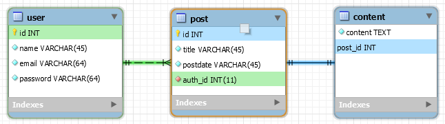

<font size=5 face='微软雅黑'>__文章目录__</font>
<!-- TOC -->

- [1 目标](#1-目标)
- [2 表结构设计](#2-表结构设计)
    - [2.1 表结构](#21-表结构)
        - [2.1.1 用户表](#211-用户表)
        - [2.1.2 博文表](#212-博文表)
        - [2.1.3 内容表](#213-内容表)
        - [2.1.4 关系整理](#214-关系整理)
- [3 创建django项目](#3-创建django项目)
- [4 基础配置](#4-基础配置)
    - [4.1 构建实体类](#41-构建实体类)
        - [4.1.1 user应用](#411-user应用)
        - [4.1.2 post应用](#412-post应用)
    - [4.2 装载应用](#42-装载应用)
    - [4.3 配置数据库](#43-配置数据库)
- [5 数据库表迁移](#5-数据库表迁移)

<!-- /TOC -->
# 1 目标
利用django完成简单个人博客的开发，主要的功能有
- 用户
    1. 登录
    2. 注册
- 博文
    1. 发布博文
    2. 查询博文

环境情况：
- django 1.11.20 
- Python 3.6.8
- pycharm 2017.3
- MySQL 5.5.27

# 2 表结构设计
根据博客的功能分析，最少要有两个表：
- `用户表`：存放用户的id，账户，密码，邮箱等相关信息
- `博文表`：存放博文的名称，发布时间，作者，内容等信息

&nbsp;&nbsp;&nbsp;&nbsp;&nbsp;&nbsp;&nbsp;&nbsp;但是仔细一分析，用户的博文信息可能不止几个字，并且很多时候，我们查找博文的同时，如果不访问详细信息，那么是不会看博文内容的，所以这里将博文和内容表分开设计。
- `内容表`：存放博文的内容，与博文形成一对一关系

## 2.1 表结构
这里使用workbench来对数据库进行建模设计

### 2.1.1 用户表
由于业务简单，针对用户表设计的表结构如下：

字段|数据类型|是否为空|是否为主键|是否唯一|描述
---|-----|----|----|----|--|
id|int|FALSE|TRUE|TRUE|用户id
name|varchar(48)|FALSE|FALSE|FALSE|用户名称(作者名称)
email|varchar(64)|FALSE|FALSE|TRUE|用户的邮箱(登录名)
password|varchar(128)|FALSE|FALSE|FALSE|用户登录密码

对应的表结构SQL代码：
```sql
CREATE TABLE `user` (
  `id` int(11) NOT NULL AUTO_INCREMENT,
  `name` varchar(48) NOT NULL,
  `email` varchar(64) NOT NULL,
  `password` varchar(128) NOT NULL,
  PRIMARY KEY (`id`),
  UNIQUE KEY `email` (`email`)
) ENGINE=InnoDB AUTO_INCREMENT=2 DEFAULT CHARSET=utf8mb4;
```

### 2.1.2 博文表
由于业务简单，针对博文表设计的表结构如下：

字段|数据类型|是否为空|是否为主键|是否唯一|是否为外键|外键关联|描述
--|---|---|---|---|---|---|---|
id|int|FALSE|TRUE|TRUE|FALSE||博文id
title|varchar(120)|FALSE|FALSE|FALSE|FALSE||博文的title
postdate|date|FALSE|FALSE|FALSE|FALSE||博文提交的日期
author_id|varchar(128)|FALSE|FALSE|FALSE|TRUE|user.id|作者的id

对应的表结构SQL代码：
```sql
CREATE TABLE `post` (
  `id` int(11) NOT NULL AUTO_INCREMENT,
  `title` varchar(120) NOT NULL,
  `postdate` date NOT NULL,
  `author_id` int(11) NOT NULL,
  PRIMARY KEY (`id`),
  KEY `post_author_id_2343ddae_fk_user_id` (`author_id`),
  CONSTRAINT `post_author_id_2343ddae_fk_user_id` FOREIGN KEY (`author_id`) REFERENCES `user` (`id`)
) ENGINE=InnoDB AUTO_INCREMENT=6 DEFAULT CHARSET=utf8mb4;
```
### 2.1.3 内容表
由于业务简单，针对内容表设计的表结构如下：

字段|数据类型|是否为空|是否为主键|是否唯一|是否为外键|外键关联|描述
--|---|---|---|---|---|---|---|
id|int|FALSE|TRUE|TRUE|FALSE||内容id
content|longtext|FALSE|FALSE|FALSE|FALSE||博文内容
post_id|int(11)|FALSE|FALSE|FALSE|TRUE|post.id|作者的id

对应的表结构SQL代码：
```sql
CREATE TABLE `content` (
  `id` int(11) NOT NULL AUTO_INCREMENT,
  `content` longtext NOT NULL,
  `post_id` int(11) NOT NULL,
  PRIMARY KEY (`id`),
  UNIQUE KEY `post_id` (`post_id`),
  CONSTRAINT `content_post_id_c6de7cfd_fk_post_id` FOREIGN KEY (`post_id`) REFERENCES `post` (`id`)
) ENGINE=InnoDB AUTO_INCREMENT=6 DEFAULT CHARSET=utf8mb4;
```

### 2.1.4 关系整理
&nbsp;&nbsp;&nbsp;&nbsp;&nbsp;&nbsp;&nbsp;&nbsp;一个用户可以写任意篇博文，所以用户表和博文表是一对多关系。一个博文只能有一个内容，一个内容也只能归属一篇博文，所以他们是一对一关系。利用workbeach完成的逻辑关系图如下：


# 3 创建django项目
创建项目名为blog，并创建user用户应用和post博文应用。安装django请参考django部分文档。
```bash
# 创建blog项目
mkdir blog && cd blog
django-admin startproject blog .

# 创建user和post应用
python manage.py startapp user
python manage.py startapp post
```
上面是通过命令行创建app的方式，如果你用的是专业版的pycharm，可以直接通过pycharm来创建django项目和app（它可以帮你装载app）

# 4 基础配置
下面首先进行实体类的编写，以及数据库的配置工作。

## 4.1 构建实体类
在user和post两个应用中构建，他们的对应的实体类

### 4.1.1 user应用
在user应用下的models.py中编写user表的映射类
```python
# models.py
from django.db import models

class User(models.Model):
    class Meta:
        db_table = 'user'

    id = models.AutoField(primary_key=True)
    name = models.CharField(max_length=48, null=False)
    email = models.CharField(max_length=64, unique=True, null=False)
    password = models.CharField(max_length=128, null=False)

    def __repr__(self):
        return '<User {} {}>'.format(self.id, self.name)

    __str__ = __repr__
```

### 4.1.2 post应用
博文应用包含post博文表和content内容表，在post应用下的models.py中编写他们的映射类
```python
# models.py
from django.db import models
from user.models import User

class Post(models.Model):
    class Meta:
        db_table = 'post'

    id = models.AutoField(primary_key=True)
    title = models.CharField(max_length=120, null=False)
    postdate = models.DateField(null=False)

    # 作者
    author = models.ForeignKey(User)  # 外键关联user表，不指定字段的情况下，会自动关联主键

    def __repr__(self):
        return '<Post {} {} {} {}>'.format(
            self.pk, self.title, self.postdate, self.author
        )

    __str__ = __repr__

class Content(models.Model):
    class Meta:
        db_table = 'content'

    id = models.AutoField(primary_key=True)
    post = models.OneToOneField(Post)   # 一对一关联博文表的主键
    content = models.TextField(null=False)

    def __repr__(self):
        return '<Content {} {}>'.format(
            self.post, self.content[1:20]
        )

    __str__ = __repr__
```

## 4.2 装载应用
上面实体类编写完成以后，要先初始化还需要先装载我们的app，即在项目的配置文件settings.py中添加我们的app
```python
# settings.py
INSTALLED_APPS = [
    'django.contrib.admin',
    'django.contrib.auth',
    'django.contrib.contenttypes',
    'django.contrib.sessions',
    'django.contrib.messages',
    'django.contrib.staticfiles',
    'user',
    'post'
]
```

## 4.3 配置数据库
本次blog使用的数据库为MySQL 5.5.27,这里不再说明部署。需要在settings.py中添加如下数据库配置
```python
# settings.py
DATABASES = {
    'default': {
        'ENGINE': 'django.db.backends.mysql',  # 引擎
        'NAME': 'blog',  # 库名
        'USER': 'dahl',  # 数据库用户名
        'PASSWORD': '123456',  # 数据库密码
        'HOST': '10.0.0.13',  # 数据库地址
        'PORT': '3306',  # 数据库端口
    }
}
```

# 5 数据库表迁移
当完成上面配置以后，我们就可以生成对应的数据库表文件了。需要在项目的根目录下执行如下命令
```bash
# 创建实体类映射SQL的过程文件
python manage.py makemigrations

# 将过程文件应用到数据库中
python manage.py migrate
```
> 以上过程如果出错并且自己无法搞定，请发送问题至 daxin.li@foxmail.com