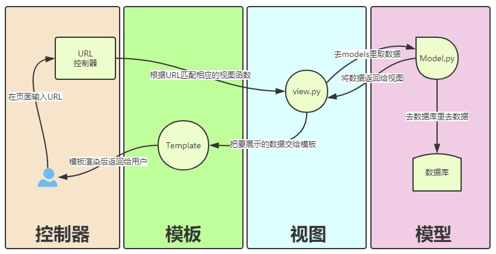

<font size=5 face='微软雅黑'>__文章目录__</font>
<!-- TOC -->

- [1 什么是web框架](#1-什么是web框架)
- [2 WSGI](#2-wsgi)
- [3 MVC与MTV模式](#3-mvc与mtv模式)
    - [3.1 MVC框架](#31-mvc框架)
    - [3.2 MTV框架](#32-mtv框架)
    - [3.3 区别](#33-区别)
- [4 django介绍](#4-django介绍)
    - [4.1 Django处理顺序](#41-django处理顺序)
    - [4.2 创建django站点](#42-创建django站点)
        - [4.2.1 安装Django](#421-安装django)
        - [4.2.2 创建一个project](#422-创建一个project)
        - [4.2.3 创建一个app](#423-创建一个app)
        - [4.2.3 启动Django项目](#423-启动django项目)
    - [4.3 Django 版的 hello world](#43-django-版的-hello-world)
        - [4.3.1 定义URL选择器](#431-定义url选择器)
        - [4.3.2 定义views函数](#432-定义views函数)
        - [4.3.3 启动服务](#433-启动服务)
    - [4.4 基础配置](#44-基础配置)
        - [4.4.1 配置静态文件存放路径](#441-配置静态文件存放路径)
        - [4.4.2 配置模板路径](#442-配置模板路径)
        - [4.4.3 关闭csrftoken](#443-关闭csrftoken)
        - [4.4.4 连接数据库](#444-连接数据库)
        - [4.4.5 加载静态文件](#445-加载静态文件)
    - [4.5 django admin配置](#45-django-admin配置)
        - [4.5.1 创建django-admin用户](#451-创建django-admin用户)
        - [4.5.2 初始化django-admin需要的表](#452-初始化django-admin需要的表)
        - [4.5.3 本地化配置(可选)](#453-本地化配置可选)
        - [4.5.4 注册应用模块](#454-注册应用模块)
        - [4.5.5 启动django](#455-启动django)

<!-- /TOC -->
# 1 什么是web框架
&nbsp;&nbsp;&nbsp;&nbsp;&nbsp;&nbsp;&nbsp;&nbsp;众所周知，所有的Web应用基本都是基于B/S结构，其本质上其实就是一个socket服务端(web服务器)，一个socket客户端(用户浏览器)。下面的代码就是一个简单的web端，运行后，使用浏览器访问，会打印hello world
```python
#!/usr/bin/env python
#_*_coding:utf-8_*_
    
import socket
    
def handle_request(client):
    buf = client.recv(1024)
    client.send(b"HTTP/1.1 200 OK\r\n\r\n")
    client.send(b"Hello, world")
    
def main():
    sock = socket.socket(socket.AF_INET, socket.SOCK_STREAM)
    sock.bind(('localhost',8000))
    sock.listen(5)
    
    while True:
        connection, address = sock.accept()
        handle_request(connection)
        connection.close()
    
if __name__ == '__main__':
    main()
```
&nbsp;&nbsp;&nbsp;&nbsp;&nbsp;&nbsp;&nbsp;&nbsp;上述代码通过socket实现了web服务端的本质，而对于真实开发中的Python Web程序来说，一般会分为两部分：服务器程序和应用程序。
- 服务器程序负责对socket服务器进行封装，并在请求到来时，对请求的各种数据进行整理。
- 应用程序则负责具体的逻辑处理。  

&nbsp;&nbsp;&nbsp;&nbsp;&nbsp;&nbsp;&nbsp;&nbsp;为了方便应用程序的开发，就出现了众多的Web框架，例如：Django、Flask、web.py 等。不同的框架有不同的开发方式，但是无论如何，开发出的应用程序都要和服务器程序配合，才能为用户提供服务。这样，服务器程序就需要为不同的框架提供不同的支持。这样混乱的局面无论对于服务器还是框架，都是不好的。对服务器来说，需要支持各种不同框架，对框架来说，只有支持它的服务器才能被开发出的应用使用。这时候，标准化就变得尤为重要。我们可以设立一个标准，只要服务器程序支持这个标准，框架也支持这个标准，那么他们就可以配合使用。一旦标准确定，双方各自实现。这样，服务器可以支持更多支持标准的框架，框架也可以使用更多支持标准的服务器。

# 2 WSGI
&nbsp;&nbsp;&nbsp;&nbsp;&nbsp;&nbsp;&nbsp;&nbsp;WSGI全称为：The Python Web Server Gateway Interface，单从名字来看就是一种网关，而网关的作用就是在协议之间进行转换。  
&nbsp;&nbsp;&nbsp;&nbsp;&nbsp;&nbsp;&nbsp;&nbsp;WSGI是为 Python 语言定义的 Web 服务器和 Web 应用程序或框架之间的一种简单而通用的接口，是一种规范，定义了使用Python编写的Web app与Web server之间接口格式，实现web app与web server间的解耦。
> Python标准库提供的独立WSGI服务器称为wsgiref。
```python
# 利用wsgiref完成上面简单的web服务程序
 
from wsgiref.simple_server import make_server
  
def RunServer(environ, start_response):                         # environ 存放的是用户访问时提交的信息，包涵http header等
    start_response('200 OK', [('Content-Type', 'text/html')])   # 构建http response头部信息
    return [bytes('<h1>Hello, web!</h1>', encoding='utf-8'), ]  # 返回给用户的信息，注意是 bytes 格式。
  
if __name__ == '__main__':
    httpd = make_server('', 8000, RunServer)       # 启动一个服务，监听8000端口，请求进来交给RunServer函数处理
    print("Serving HTTP on port 8000...")
    httpd.serve_forever()                          # 启动服务开始接受请求
```

# 3 MVC与MTV模式
说到web开发，就需要遵循一定的开发模式。著名的MVC/MTV模式，其本质是使各组件之间保持松耦合关系。

## 3.1 MVC框架
MVC 是一种使用 MVC（Model View Controller 模型-视图-控制器）设计创建 Web 应用程序的模式
- Model（模型）表示应用程序核心（比如数据库记录列表）
- View（视图）显示数据（数据库记录）
- Controller（控制器）处理输入（写入数据库记录)

MVC 模式同时提供了对 HTML、CSS 和 JavaScript 的完全控制。
- Model（模型）是应用程序中用于处理应用程序数据逻辑的部分。通常模型对象负责在数据库中存取数据。
- View（视图）是应用程序中处理数据显示的部分。通常视图是依据模型数据创建的前端网页。
- Controller（控制器）是应用程序中处理用户交互的部分。通常控制器负责从视图读取数据，控制用户输入，并向模型发送数据映射，模式渲染等。

## 3.2 MTV框架
MTV是一种使用MTV（Model Templates Views 模型-模版-视图）设计创建 Web 应用程序的模式

- Model(模型)：负责业务对象与数据库的对象(ORM)
- Template(模版)：负责如何把页面展示给用户
- View(视图)：负责业务逻辑，并在适当的时候调用Model和Template  

此外，Django还有一个url分发器，它的作用是将一个个URL的页面请求分发给不同的view处理，view再调用相应的Model和Template，逻辑处理如下：  
  

## 3.3 区别
&nbsp;&nbsp;&nbsp;&nbsp;&nbsp;&nbsp;&nbsp;&nbsp;MVC即模型－视图－控制器模式，就是为那些需要为同样的数据提供多个视图的应用程序而设计的。它很好地实现了数据层与表示层的分离，特别适用于开发与用户图形界面有关的应用程序。控制器用来处理用户命令以及程序事件；模型维护数据并提供数据访问方法；视图用于数据的显示。  
&nbsp;&nbsp;&nbsp;&nbsp;&nbsp;&nbsp;&nbsp;&nbsp;MTV即模型-模版-视图模式，其标准名称是有争议的。在MVC的解释中，视图描述了展现给用户的数据，是指所看到的数据，而不是如何看见它。在python中视图是指对某一特定URL的回调函数，因为回调函数描述了所要展现的数据。模版用于将内容与展现分离。在django中，视图描述了要展现的数据，而视图一般转交给模版。模版描述了数据如何展现。控制器则是指django框架本身，通过URL配置，系统将一个请求发送到一个合适的视图。

# 4 django介绍
&nbsp;&nbsp;&nbsp;&nbsp;&nbsp;&nbsp;&nbsp;&nbsp;Django是重量级选手中最有代表性的一位。许多成功的网站和APP都基于Django。是一个开放源代码的Web应用框架，由Python写成。遵守BSD版权，初次发布于2005年7月, 并于2008年9月发布了第一个正式版本1.0 。
> 本次选择djang 1.11.20 版本，进行学习

## 4.1 Django处理顺序
Django是标准的MTV框架。
- wsgi：socket请求处理
- 控制器（django框架本身）：控制用户输入，url匹配，通过映射列表将一个请求发送到一个合适的视图；
- views --Views：python程序，向模型和模板发送（或获取）数据；
- 模型绑定 --Model：数据库存取数据
- 模板引擎 --Templates：用于将内容与展现分离，描述了数据如何展现（如网页模板）；
- 模式渲染 --Views：将模板和数据整合，形成最终网页；
- 控制器（django框架本身）：返回用户展示。

## 4.2 创建django站点
下面使用django创建服务端站点，并显示hello world页面信息。

### 4.2.1 安装Django
使用命令行执行如下命令进行安装
```bash
pip3 install Django==1.11.20
```
注意：会安装在python安装目录的scripts目录下。针对多环境的情况下，使用哪个解释器安装，那么就会安装在哪个版本下。安装完毕后会在scripts下产生一个django-admin.py文件，利用该文件可以在命令行下创建一个Django项目。

### 4.2.2 创建一个project
```bash
django-admin.py startproject PEOJECTNAME
```
创建完毕后：会产生PROJECTNAME命名的文件夹，里面包含 PROJECTNAME 目录 和 manager.py文件。
其中：
- manager.py  用来管理我们项目相关的所有命令的文件（比如应用创建、数据库迁移等)
- PROJECTNAME：存放此项目全局的相关文件
    - settings.py：项目的配置信息文件
    - urls.py：把用户发过来的url通过urls文件来过滤(控制),交给某个view函数来处理  -->控制器
    - wsgi.py：处理socket相关的任务(类nginx/apache的功能)  -->  一个 WSGI 兼容的 Web 服务器的入口，以便运行你的项目。 生产上一般不会使用wsgi（第三方模块），一般会使用uwsgi + nginx 来运行。

### 4.2.3 创建一个app
```python
python manage.py startapp APPNAME
```
&nbsp;&nbsp;&nbsp;&nbsp;&nbsp;&nbsp;&nbsp;&nbsp;为什么一个项目里要创建一个应用？举个例子：微信是一个项目，那么通讯录，钱包，朋友圈就是一个个相互独立功能，这里叫做应用。一个项目是所有应用的集合。
&nbsp;&nbsp;&nbsp;&nbsp;&nbsp;&nbsp;&nbsp;&nbsp;创建一个应用之后会产生同名目录，目录下的主要文件功能如下：
- models.py：MTV框架，存放和数据进行操作的代码
- admin.py：django的数据库后台管理工具
- views.py：MTV框架，包含所有的视图函数，由urls.py 来选择发送给具体哪个view函数
- test.py：用来测试的

&nbsp;&nbsp;&nbsp;&nbsp;&nbsp;&nbsp;&nbsp;&nbsp;views.py 中的函数：一定是来根据用户输入的内容来返回一个具体的页面，wsgi模块用来负责HTTP协议的解析，然后放在views视图函数中，作为一个固定的参数(request)使用。

### 4.2.3 启动Django项目
```bash
python manage.py runserver PORT
```
启动一个web应用服务，并监听8800端口，这样就启动了一个django项目了，但这是我们测试时的启动方式，生产上不会这么用。

## 4.3 Django 版的 hello world
下面来实现一个站点，当我们访问时，输出hello world信息

### 4.3.1 定义URL选择器
&nbsp;&nbsp;&nbsp;&nbsp;&nbsp;&nbsp;&nbsp;&nbsp;定义url选择器是为了能在用户输入url的时候把对应的url映射到指定的views函数中去处理，所以urls.py会存放在项目全局的目录下。
```python
# urls.py文件

from blog import views   # blog为项目名，导入views模块
 
urlpatterns = [
    url(r'^admin/', admin.site.urls),
    url(r'^$',views.index),          # 就可以表示首页
]
```
url的参数：
- 第一个参数是正则表达式
- 第二个参数表示匹配后，要触发的函数或者类

### 4.3.2 定义views函数
&nbsp;&nbsp;&nbsp;&nbsp;&nbsp;&nbsp;&nbsp;&nbsp;经过项目的urls控制，那么请求将会分配给具体的应用(函数)来处理，所以需要在应用的目录中的views.py文件中进行添加。由于我们返回的是静态页面，不需要进行数据库相关的处理，所以在index函数内，可以直接返回页面给客户端。
这里有两种方式：
- 直接返回html标签
- 返回html文件

返回html标签：
```python
# blog/models.py

from django.shortcuts import HttpResponse
 
def index(request):
 
    return HttpResponse('<h1>hello world</h1>')<br>
 
# 注意：用户的请求经由wsgi处理后，会返回一个对象标识，一般这里使用request来接受这个对象。
 
# HttpResponse 用户对客户的相应
```
- request:请求信息对象 
- HttpResponse：响应信息对象

返回html文件：
所有的html文件是由Templates来进行处理的，所以需要现在Templates目录下创建要返回的html文件
```html
<!DOCTYPE html>
<html lang="en">
<head>
    <meta charset="UTF-8">
    <title>Title</title>
</head>
<body>
<h1>hello world</h1>
</body>
</html>
```
对应的models.py修改为
```python
from django.shortcuts import render,HttpResponse
 
def index(request):
 
    return render(request,'index.html')
 
# render,的第一个参数就是request，标识把后面的index文件返回给这个request
```
答复的html文件，render会去Templates下寻找，因为在setting.py文件中已经定义了Templates的路径

### 4.3.3 启动服务
在项目目录下执行
```bash
python manage.py runserver 8080
```
启动完毕后，使用浏览器访问。
```bash
http://127.0.0.1:8080
```

## 4.4 基础配置
为了使我们的项目依赖的文件放在特定的地方提供访问，那么我们在创建完项目还需要做一些基础的配置。

### 4.4.1 配置静态文件存放路径
&nbsp;&nbsp;&nbsp;&nbsp;&nbsp;&nbsp;&nbsp;&nbsp;静态文件：比如css，js文件都是要提供给用户进行下载的，所以我们一般规定静态文件，存放在django项目的一级子目录static中，需要手动创建这个目录，然后做如下配置。
```python
# 修改settings.py文件
STATICFILES_DIRS = (
    os.path.join(BASE_DIR,'static'),    # 添加静态文件路径
)
```
> 这样配置以后，我们还可以为每个应用创建自己的static目录，在前端渲染方式是相同的（django会为我们优先查找项目下的static目录来加载)

### 4.4.2 配置模板路径
&nbsp;&nbsp;&nbsp;&nbsp;&nbsp;&nbsp;&nbsp;&nbsp;用来集中存放用于返回给用户的模板文件（如果是利用pycharm创建的项目，它会自动帮我们创建template目录，并自动进行关联）,创建templates目录（同样存放在django项目的一级子目录下）。
```python
# 修改settings.py文件
TEMPLATES = [
    {
        'BACKEND': 'django.template.backends.django.DjangoTemplates',
        'DIRS': [os.path.join(BASE_DIR, 'templates')]     # 添加templates文件的路径
        ,
        'APP_DIRS': True,
        'OPTIONS': {
            'context_processors': [
                'django.template.context_processors.debug',
                'django.template.context_processors.request',
                'django.contrib.auth.context_processors.auth',
                'django.contrib.messages.context_processors.messages',
            ],
        },
    },
]
```
> 这样配置以后，我们还可以为每个应用创建自己的templates目录，在前端渲染方式是相同的（django会为我们优先查找项目下的templates目录来加载)

### 4.4.3 关闭csrftoken
csrftoken用于防止csrf攻击，csrf的相关配置将在后面进行说明，所以这里可以先关闭csrftoken。
```python
# 修改settings.py文件
MIDDLEWARE = [
    'django.middleware.security.SecurityMiddleware',
    'django.contrib.sessions.middleware.SessionMiddleware',
    'django.middleware.common.CommonMiddleware',
    # 'django.middleware.csrf.CsrfViewMiddleware',      #  注释掉csrf中间件即可(需要重启django项目)
    'django.contrib.auth.middleware.AuthenticationMiddleware',
    'django.contrib.messages.middleware.MessageMiddleware',
    'django.middleware.clickjacking.XFrameOptionsMiddleware',
]
```

### 4.4.4 连接数据库
django支持MySQL 5.5+ 官方建议使用mysqlclient 1.3.7+ 来驱动，所以这里需要先安装
```bash
pip install myclient
```
web站点最重要的数据库连接配置，需要在settings.py中设置所连接的数据库。
```python
DATABASES = {
    'default': {
        'ENGINE': 'django.db.backends.mysql',  # 引擎
        'NAME': 'blog',    # 库名
        'USER': 'dahl',    # 数据库用户名
        'PASSWORD': '123456',  # 数据库密码
        'HOST': '127.0.0.1',   # 数据库地址
        'PORT': '3306',        # 数据库端口
    }
}
```
支持的数据库引擎有:
```python
'django.db.backends.postgresql'
'django.db.backends.mysql'
'django.db.backends.sqlite3'
'django.db.backends.oracle'
```
更多的配置方法参考：https://docs.djangoproject.com/en/1.11/ref/settings/#databases

> 如果安装mysqlclient失败，提示缺少C++，那么不建议安装所有的编译环境，因为即便是安装所以，可能无法编译成功，所以可以在一下网站中直接查找现成的whl包。https://www.lfd.uci.edu/~gohlke/pythonlibs/

### 4.4.5 加载静态文件
配置模版文件加载静态文件，比如css,js文件
1. 首先加载静态文件配置（需要先完成4.4.1）
```html

```

2. 动态获取配置文件的路径
```html
<link rel="stylesheet" href="">
```
这里的static关键字，标示的就是，当前项目static目录的路径，这样做的好处是，当你修改了static目录在前台的显示路径时，这里的static会自动关联到新的url上。无需修改

## 4.5 django admin配置
Django 提供了基于 web 的管理工具即django-admin，它可以通过web页面来管理我们项目中的表，但前提是你已经把表注册给admin管辖了。  

默认情况下，django-admin是随django一起安装的，要使用它，还需要经过以下步骤：

### 4.5.1 创建django-admin用户
在项目根目录下执行
```bash
python manage.py createsuperuser
```
按照提示创建django-admin的管理用户

### 4.5.2 初始化django-admin需要的表
django-admin需要一些表来处理admin后台的登录、认证等信息，所以我们需要在数据库中把这些表创建。django的自带的orm可以帮我们完成这项操作，如果你的项目需要创建表，那么请首先确保项目的配置文件settings.py中的INSTALLAPP列表中包含你的应用名称
```python
INSTALLED_APPS = [
    'django.contrib.admin',
    'django.contrib.auth',
    'django.contrib.contenttypes',
    'django.contrib.sessions',
    'django.contrib.messages',
    'django.contrib.staticfiles',
    'user'  # 这个就是我们的应用名称，注意它的路径是从项目的顶级目录开始的
]
```
> 项目自己的models中需要自行编写数据库表的映射类，django-admin的映射类已经内置。

执行如下命令生成迁移文件
```bash
python manage.py makemigrations
```
执行完毕后，会在项目目录下生成migrations目录，里面存放的是所以的迁移记录，不要随意删除。

执行如下命令完成表迁移(在数据库中创建)
```python
python manage.py migrate
```
`当我们对models.py中的映射类结构进行修改时，那么每次都需要进行上述两步操作`

注意：
1. 要创建的表的应用必须在INSTALLED_APPS中注册。
2. 不要随便删除migrations下的迁移文件。

### 4.5.3 本地化配置(可选)
默认情况下django-admin的后台管理是英文的，可以在settings.py文件中修改为中文显示
```python
# LANGUAGE_CODE = 'en-us'
LANGUAGE_CODE = 'zh-Hans'

# TIME_ZONE = 'UTC'
TIME_ZONE = 'Asia/Shanghai'
```

### 4.5.4 注册应用模块
如果想要django-admin管理项目自己的表信息，那么需要将表注册给django-admin，那么就需要在应用目录下的admin.py中进行如下操作
```python
from django.contrib import admin
from user.models import User  # 导入models.py中要被管理的类

# Register your models here.

admin.site.register(User) # 注册给amdin
```
附User表:(models.py中)
```python
class User(models.Model):
    class Meta:
        db_table = 'user'

    id = models.AutoField(primary_key=True)
    name = models.CharField(max_length=48, null=False)
    email = models.CharField(max_length=64, unique=True, null=False)
    password = models.CharField(max_length=128, null=False)

    def __repr__(self):
        return '<User {} {}>'.format(self.id, self.name)
```

### 4.5.5 启动django
这时，重新启动django，那么就可以访问admin了。(项目根目录下)
```bash
python manage.py runserver 8080
```
在浏览器中输入127.0.0.1:8080/admim 输入刚刚创建的superuser即可。