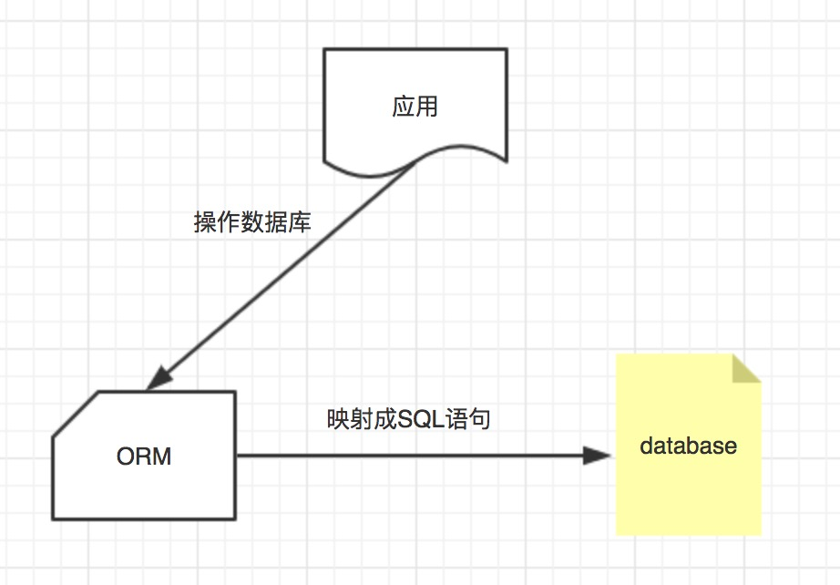
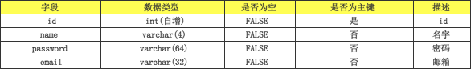

<font size=5 face='微软雅黑'>__文章目录__</font>
<!-- TOC -->

- [1 数据库与ORM](#1-数据库与orm)
- [2 orm的配置](#2-orm的配置)
    - [2.1 引擎和配置](#21-引擎和配置)
    - [2.2 mysql驱动程序](#22-mysql驱动程序)
- [3 orm 表模型](#3-orm-表模型)
    - [3.1 创建表对象](#31-创建表对象)
    - [3.2 Django字段类型](#32-django字段类型)
    - [3.3 常用字段参数说明](#33-常用字段参数说明)
    - [3.4 特殊类型字段参数说明](#34-特殊类型字段参数说明)
    - [3.5 Meta信息](#35-meta信息)
    - [3.6 生成表](#36-生成表)
        - [3.6.1 注册app](#361-注册app)
        - [3.6.2 修改表结构遇到的问题](#362-修改表结构遇到的问题)
- [4 利用orm完成数据库的增删改查](#4-利用orm完成数据库的增删改查)
    - [4.1 orm之增加](#41-orm之增加)
    - [4.2 orm之删除](#42-orm之删除)
    - [4.3 orm之修改](#43-orm之修改)
    - [4.4 orm之查询](#44-orm之查询)
        - [4.4.1 限制查询集（切片）](#441-限制查询集切片)
        - [4.4.2 获取结果集](#442-获取结果集)

<!-- /TOC -->
# 1 数据库与ORM
对象关系映射（英语：(Object Relational Mapping，简称ORM，或O/RM，或O/R mapping），是一种程序技术，用于实现面向对象编程语言里不同类型系统的数据之间的转换 。从效果上说，它其实是创建了一个可在编程语言里使用的--“虚拟对象数据库”。  

简单一句话来说：就是把数据库的表映射为一个个对象，对对象的操作会被映射成SQL语句，在数据库执行。  


# 2 orm的配置
django默认支持sqlite，mysql, oracle,postgresql数据库。
- sqllit: django默认使用sqlite的数据库，默认自带sqlite的数据库驱动 , 引擎名称：django.db.backends.sqlite3
- mysql: 引擎名称：django.db.backends.mysql

## 2.1 引擎和配置
在django的项目中会默认使用sqlite数据库，在settings里有如下设置：
```python
DATABASES = {
    'default': {
- 'ENGINE': 'django.db.backends.sqlite3',
- 'NAME': os.path.join(BASE_DIR, 'db.sqlite3'),
    }
}
```
下面是MySQL的配置
```python
DATABASES = {
    'default': {
- 'ENGINE': 'django.db.backends.mysql', 
- 'NAME': 'books',    # 你的数据库名称
- 'USER': 'root',     # 你的数据库用户名
- 'PASSWORD': '',     # 你的数据库密码
- 'HOST': '',-  # 你的数据库主机，留空默认为localhost
- 'PORT': '3306',     # 你的数据库端口
    }
}
```
参数如下：
- NAME即数据库的名字，在mysql连接前该数据库必须已经创建，而上面的sqlite数据库下的db.sqlite3则是项目自动创建
- USER和PASSWORD分别是数据库的用户名和密码。

## 2.2 mysql驱动程序
django可以使用如下mysql的驱动程序：
```python
MySQLdb（不完美支持Python3） 
mysqlclient (官方建议)
PyMySQL(纯python的mysql驱动程序)
```
建议使用：
- mysqlclient
- PyMySQL

django基础配置部分已经描述了mysqlclient的安装，这里介绍如何使用pymysql，首先需要安装
```python
pip install pymysql
```
下一步只需要找到项目名文件下的__init__,在里面写入：
```python
import pymysql
pymysql.install_as_MySQLdb()
```
即可完成配置

# 3 orm 表模型
我们所说的ORM主要分为两种：
- `DB First` 数据库里先创建数据库表结构，根据表结构生成类，根据类操作数据库
- `Code First` 先写代码，执行代码创建数据库表结构

主流的orm都是code first。django 的orm也是code first，所以本质上分为两部分：
- 根据类自动创建数据库表
- 根据类对数据库表中的数据进行各种操作

## 3.1 创建表对象
现在有一张表，主要字段如下:  
  
对应的models中的映射类为：
```python
from django.db import models     # 导入models,django提供的对象包含很多建表的方法
 
# Create your models here.
 
class UserInfo(models.Model):    # 需要继承models.Model
    class Meta:
- db_table = 'userinfo'  # 在数据库中生成的表明

    id = models.AutoField(primary_key=True,null=False,verbose_name='ID')
    name = models.CharField(max_length=4,null=False,verbose_name='用户名')
    password = models.CharField(max_length=64,null=False,verbose_name='密码')
    email = models.EmailField(null=False,verbose_name='邮箱')
 
 
# AutoField : 自增字段，类似于mysql的int字段加auto_increment属性
# CharField：可变长字段，类似于mysql的varchar类型，需要指定长度
# EmailField：邮件字段，仅仅提供给 django admin进行约束使用，映射到MySQL上，根本上也是字符串类型
# null：是否为空，通用参数，默认为否。
# verbose_name：django admin上对表操作时，显示的字段名称
# primary_key：主键
# max_length：针对于CharField字段，标示其长度
```

## 3.2 Django字段类型
部分字段类型及说明如下：

|字段名称|含义|
-----|------|
AutoField(Field)| int自增列，必须填入参数 primary_key=True
BigAutoField(AutoField)|bigint自增列，必须填入参数 primary_key=True<br>注：当model中如果没有自增列，则自动会创建一个列名为id的列
SmallIntegerField(IntegerField)|小整数 -32768 ～ 32767
PositiveSmallIntegerField(PositiveIntegerRelDbTypeMixin, IntegerField)|正小整数 0 ～ 32767
IntegerField(Field)|整数列(有符号的) -2147483648 ～ 2147483647
PositiveIntegerField(PositiveIntegerRelDbTypeMixin, IntegerField)|正整数 0 ～ 2147483647
BigIntegerField(IntegerField)|长整型(有符号的) -9223372036854775808 ～ 9223372036854775807
BooleanField(Field)|布尔值类型
NullBooleanField(Field)|可以为空的布尔值
CharField(Field)|字符类型,必须提供max_length参数， max_length表示字符长度
TextField(Field)|文本类型
EmailField(CharField)|字符串类型，Django Admin以及ModelForm中提供验证机制
IPAddressField(Field)|字符串类型，Django Admin以及ModelForm中提供验证 IPV4 机制
GenericIPAddressField(Field)|字符串类型，Django Admin以及ModelForm中提供验证 Ipv4和Ipv6
URLField(CharField)|字符串类型，Django Admin以及ModelForm中提供验证 URL
SlugField(CharField)|字符串类型，Django Admin以及ModelForm中提供验证支持 字母、数字、下划线、连接符（减号）
CommaSeparatedIntegerField(CharField)|字符串类型，格式必须为逗号分割的数字
UUIDField(Field)|字符串类型，Django Admin以及ModelForm中提供对UUID格式的验证
FilePathField(Field)|字符串，Django Admin以及ModelForm中提供读取文件夹下文件的功
FileField(Field)|字符串，路径保存在数据库，文件上传到指定目录
ImageField(FileField)|字符串，路径保存在数据库，文件上传到指定目录
DateTimeField(DateField)|日期+时间格式 YYYY-MM-DD HH:MM[:ss[.uuuuuu]][TZ]
DateField(DateTimeCheckMixin, Field)|日期格式      YYYY-MM-DD
TimeField(DateTimeCheckMixin, Field)|时间格式      HH:MM[:ss[.uuuuuu]]
DurationField(Field)|长整数，时间间隔，数据库中按照bigint存储，ORM中获取的值为datetime.timedelta类型
FloatField(Field)|浮点型
DecimalField(Field)|10进制小数
BinaryField(Field)|二进制类型

## 3.3 常用字段参数说明
django中提供了很多参数对字段进行控制

通用类：
属性|含义
---|----|
null|是否可以为空
default|默认值
primary_key|主键
db_column|列名
db_index|索引(bool)
unique|唯一索引
 
时间日期类：
属性|含义
---|----|
unique_for_date|对日期字段来说，表示只对时间做索引
unique_for_month|对日期字段来说，表示只对月份做索引
unique_for_year|对日期字段来说，表示只对年做索引
auto_now|无论是你添加还是修改对象，时间为你添加或者修改的时间。
auto_now_add|为添加时的时间，更新对象时不会有变动。
 
django admin相关：
属性|含义
---|----|
choices|在django admin中显示下拉框，避免连表查询(比如用户类型，可以在存在内存中)
blank|在django admin中是否可以为空
verbose_name|字段在django admin中显示的名称
editable|在django admin中是否可以进行编辑，默认是true
error_message|当在django admin中输入的信息不匹配时，字段的提示信息
help_text|在django admin中输入框旁边进行提示
validators|在django admin中自定义规则限制

django中提供了很多的字段类型，大部分都是提供给django admin 来做验证的，实际体现在数据库中的，大部分都是字符串类型。

## 3.4 特殊类型字段参数说明

`GenericIPAddressField(Field)`：字符串类型，Django Admin以及ModelForm中提供验证 Ipv4和Ipv6  
参数：
- protocol，用于指定Ipv4或Ipv6， 'both',"ipv4","ipv6"
- unpack_ipv4， 如果指定为True，则输入::ffff:192.0.2.1时候，可解析为192.0.2.1，开启刺功能，需要protocol="both"

`FilePathField(Field)`:字符串，Django Admin以及ModelForm中提供读取文件夹下文件的功能  
参数：
- path:文件夹路径
- match=None:正则匹配
- recursive=False:递归下面的文件夹
- allow_files=True:允许文件
- allow_folders=False:允许文件夹

`FileField(Field)`:字符串，路径保存在数据库，文件上传到指定目录  
参数：
- upload_to = "":上传文件的保存路径
- storage = None:存储组件，默认django.core.files.storage.FileSystemStorage

`ImageField(FileField)`:字符串，路径保存在数据库，文件上传到指定目录  
参数：
- upload_to = ""      上传文件的保存路径
- storage = None      存储组件，默认django.core.files.storage.FileSystemStorage
- width_field=None,   上传图片的高度保存的数据库字段名（字符串）
- height_field=None   上传图片的宽度保存的数据库字段名（字符串）

`DecimalField(Field)`:10进制小数  
参数：
- max_digits，小数总长度
- decimal_places，小数位长度

## 3.5 Meta信息
在类内部定义内部类Meta，由于设置映射的表的元数据信息，
```python
class User(models.Model):
    class Meta:
        db_name = 'user'
    
    id...
    name...
```
这里的Meta的类属性db_name，表示生成的数据库表名称为'user',更多的参数有：

属性信息|含义
-----|----|
db_tablespace|有些数据库有数据库表空间，比如Oracle。你可以通过db_tablespace来指定这个模型对应的数据库表放在哪个数据库表空间。
managed|默认值为True,Django可以对数据库表进行 migrate或migrations、删除等操作，如果为False的时候，不会对数据库表进行创建、删除等操作。可以用于现有表、数据库视图等，其他操作是一样的。
ordering|告诉Django模型对象返回的记录结果集是按照哪个字段排序的
unique_together|设置两个字段保持唯一性时使用
verbose_name|给模型类起一个更可读的名字

> 常用的就是db_table，用于指定生成的表的名称

## 3.6 生成表
&nbsp;&nbsp;&nbsp;&nbsp;&nbsp;&nbsp;&nbsp;&nbsp;前面我们已经编写了对应数据库表的类，这里我们将进行实例化(创建数据库对应的表)。利用django提供的命令进行数据库的初始化工作.(以及其他对数据库表进行修改的动作，比如修改表结构，字段属性等，都需要执行如下步骤)
```python
# 进入项目目录下执行
python manage.py makemigrations
# 大致含义是：把类转换成对应格式的sql语句。
 
# 创建表
python manage.py migrate
# 在数据库中执行生成的sql语句
```

注意：
- 执行makemigrations后生成的文件，存放在应用目录下的migrations目录下，一般以0001_initial.py为文件名并且依次递增。
- 0001_initial.py存放的是 django 根据我们写的 class 生成的相关代码，执行migrate后，会根据这些代码生成对应的数据库表。
- 如果我们执行migrate后没有生成我们创建的表格，那么需要确认在django配置文件中，是否加载了我们的应用(因为django会加载setting里面的install_app中查找对应的modules.py)
- 表名默认是：应用名_class类名,可以在映射类内部定义内部类Meta，设置db_table='表名'，来修改在数据库中生存的表名

### 3.6.1 注册app
如果没有生成对应的表文件，那么需要在settings.py中，注册你的app
```python
# settings.py
INSTALLED_APPS = [
    'django.contrib.admin',
    'django.contrib.auth',
    'django.contrib.contenttypes',
    'django.contrib.sessions',
    'django.contrib.messages',
    'django.contrib.staticfiles',
    'app01.apps.App01Config',
    '你的app名称'       
]
```

### 3.6.2 修改表结构遇到的问题

当我们对已生成的表添加新字段时，会出现如下情况
```python
ou are trying to add a non-nullable field 'code' to business without a default; we can't do that (the database needs something to populate existing rows).
Please select a fix:
 1) Provide a one-off default now (will be set on all existing rows with a null value for this column)
 2) Quit, and let me add a default in models.py
Select an option:
```
&nbsp;&nbsp;&nbsp;&nbsp;&nbsp;&nbsp;&nbsp;&nbsp;由于我们添加字段会影响之前的数据，所以这时django提醒我们，不能只是单纯的添加一个字段，还需要为该字段指定对应的值，当然有几种解决办法：

- 设置新增字段default属性，表示其默认值
- 设置新增字段null属性，表示其默认可以为空
- 根据上面的提示，选择1，手动输入默认值即可(注意默认值需要用引号引起来，不然django认为输入的数据是个变量)

# 4 利用orm完成数据库的增删改查
接下来就需要利用orm来对数据库的表数据进行增删改查等基本操作了。

## 4.1 orm之增加
&nbsp;&nbsp;&nbsp;&nbsp;&nbsp;&nbsp;&nbsp;&nbsp;根据django的MTV架构，业务的处理是在views中完成的，那么对数据库的查询逻辑也应该在views中编写，而我们定义的数据库对象在model.py中，那么在导入之后，才能进行表操作。

django提供了两种增加数据的方式：1、create，2、save

```python
#------------------------------------- create -------------------------------------
from app01 import models      # 从自己的应用中导入models模块
 
username = 'daxin'
password = 'abc.123'
email = 'daixin@qq.com'
models.UserInfo.objects.create(name=username,password=password,email=email)
 
# 表对象.objects.create() 用来新增数据
# name,password,email 表示表的字段
# 等号右边的表示数据
# 传递的key也可以是字典利用**dic进行传递，在后面利用form的时候会经常使用这种方式。
dict = {'usernane':'daxin','password':'abc.123',email='daxin@qq.com'}
models.UserInfo.objects.create(**dict)
 


#------------------------------------- save -------------------------------------
from app01 import models      # 从自己的应用中导入models模块
 
username = 'daxin'
password = 'abc.123'
email = 'daixin@qq.com'
userobj = models.UserInfo(name=username,password=password,email=email)
userobj.save()
 
# save的方式是利用对象实例化的传递参数后，调用save方法进行保存的
# 利用对象，我们可以方便的进行数据修改后，再进行save
# 比如 userobj.name = 'dahuaidan'
# userobj.save()
```
注意：利用create新增数据时，会默认返回新增加的数据对象，我们可以接受该对象来进行其他的操作，比如添加多对多关系等
> 比较常用的方式是 利用create进行数据的增加

## 4.2 orm之删除
想要对数据进行删除，首先需要匹配到数据，然后执行删除操作，那么就涉及两部分：查找，删除
```python
models.UserInfo.objects.filter(id=1).delete()
 
# 利用filter对数据唯一的字段进行过滤，匹配到删除的行，也可以用all()匹配所有数据，进行删除
# 利用delete方法进行删除操作
```

## 4.3 orm之修改
整体思路和删除是相同的，首先查找到数据，然后对字段进行修改
```python
models.UserInfo.objects.filter(id=1).update(name='dachenzi')
 
# 利用filter过滤到要修改的数据，然后更新它的name字段的值
```

## 4.4 orm之查询
查询会返回结果的集，它是django.db.models.query.QuerySet类型。是惰性求值，和sqlalchemy一样。结果就是查询的集。同时它也是一个可迭代对象。
- 创建查询集不会带来任何数据库的访问，直到调用方法使用数据时，才会访问数据库。在迭代、序列化、if语句中
都会立即求值。
- 每一个查询集都包含一个缓存，来最小化对数据库的访问。

### 4.4.1 限制查询集（切片）
查询集对象可以直接使用索引下标的方式（不支持负索引），相当于SQL语句中的limit和offset子句。
注意使用索引返回的新的结果集，依然是惰性求值，不会立即查询。
```python
qs = User.objects.all()[20:40]
# LIMIT 20 OFFSET 20
qs = User.objects.all()[20:30]
# LIMIT 10 OFFSET 20
```

### 4.4.2 获取结果集
