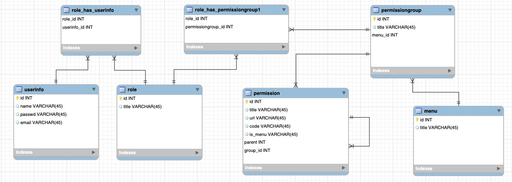

<font size=5 face='微软雅黑'>__文章目录__</font>
<!-- TOC -->

- [1 rbac](#1-rbac)
- [2 表结构设计](#2-表结构设计)
- [3 初始化权限结构](#3-初始化权限结构)
- [4 中间件验证](#4-中间件验证)
- [5 生成菜单显示](#5-生成菜单显示)

<!-- /TOC -->
# 1 rbac
基于角色的权限管理系统，可以独立成为一个组建，来引入各个项目。主要具有两个功能：
- 权限验证
- 菜单生成

通过将权限信息写入到session中，每次访问时，使用中间件来匹配访问的URL与session中权限列表中的url是否匹配，如果匹配准入，否则提示无权访问，针对菜单的显示功能，通过inclusion_tag渲染的方式，构造一个菜单列表，进行渲染，可以在任何使用的地方，使用templatetags的方式进入，并渲染（样式需要自行调整）。

# 2 表结构设计
分析业务逻辑，创建五张表:
- 用户表：存放用户相关信息，并关联角色表（一个人有多个角色，一个角色可以包含多个人）
- 角色表：角色信息，关联权限组（一个角色可以关联多个角色组，一个角色组可以关联多个角色）
- 权限表：存放权限信息，存储带正则表达式的url（一个权限只能关联一个权限组）
- 权限组表：将权限进行分类，并关联到所属的菜单中（一个组只能关联一个菜单）
- 菜单表：菜单信息

表关系如下：



下面是字段代码设计：字段可以自行增减。
```python
from django.db import models

class UserInfo(models.Model):

    name = models.CharField(verbose_name='用户名', max_length=8)
    passwd = models.CharField(verbose_name='密码', max_length=32)
    email = models.CharField(verbose_name='邮箱', max_length=32, null=True, blank=True)
    roles = models.ManyToManyField(verbose_name='角色', to='Role', related_name='users', blank=True, null=True)

    class Meta:
        db_table = 'rbac_userinfo'
        verbose_name_plural = '用户表'

    def __str__(self):
        return self.name

class Role(models.Model):

    title = models.CharField(verbose_name='角色名称', max_length=16)
    permissions = models.ManyToManyField(to='Permission', related_name='roles', blank=True)

    class Meta:
        db_table = 'rbac_role'
        verbose_name_plural = '角色表'

    def __str__(self):
        return self.title

class Permission(models.Model):

    title = models.CharField(verbose_name='权限名称', max_length=16)
    url = models.CharField(verbose_name='带正则的url', max_length=128)
    code = models.CharField(verbose_name='权限代码', max_length=16)
    groups = models.ForeignKey(verbose_name='权限组', to='PermissionGroup', related_name='permissions', blank=True, null=True)
    is_menu = models.BooleanField(verbose_name='是否是菜单')
    parent = models.ForeignKey(verbose_name='归属菜单', to='Permission', related_name='parents', blank=True, null=True)

    class Meta:
        db_table = 'rbac_permission'
        verbose_name_plural = '权限表'

    def __str__(self):
        return self.title

class PermissionGroup(models.Model):

    title = models.CharField(verbose_name='权限组名称', max_length=32)
    menu = models.ForeignKey(verbose_name='所属菜单', to='Menu', related_name='permissiongroups', null=True, blank=True)

    class Meta:
        db_table = 'rbac_permissiongroup'
        verbose_name_plural = '权限组表'

    def __str__(self):
        return self.title

class Menu(models.Model):

    title = models.CharField(verbose_name='菜单名称', max_length=16)

    class Meta:
        db_table = 'rbac_menu'
        verbose_name_plural = '菜单表'

    def __str__(self):
        return self.title
```

# 3 初始化权限结构
用户请求进来，首先为其初始化个人权限信息：
```python
from django.conf import settings


def init_permission(obj, request):
    # 初始化权限
    """
    1. 获取这个人的所有权限
    2. 组建权限结构
    3. 组建菜单结构
    """

    # 1. 获取这个人的所有权限（角色权限重叠，要去重）
    permissions_dict = obj.roles.values('permissions__id', 'permissions__parent__id',
                                        'permissions__groups__id',
                                        'permissions__groups__title', 'permissions__code',
                                        'permissions__url', 'permissions__groups__menu__id',
                                        'permissions__groups__menu__title', 'permissions__title').distinct()
    # 修改名称
    """
    [
        {'id': 1, 'parent_id': None, 'group_id': 1, 'group_title': '用户组', 'code': 'list', 'url': '/changelist', 'menu_id': 1, 'menu_title': '用户管理'}, 
        {'id': 2, 'parent_id': 1, 'group_id': 1, 'group_title': '用户组', 'code': 'add', 'url': '/add', 'menu_id': 1, 'menu_title': '用户管理'}, 
        {'id': 3, 'parent_id': 1, 'group_id': 1, 'group_title': '用户组', 'code': 'delete', 'url': '/(\\d+)/delete', 'menu_id': 1, 'menu_title': '用户管理'}
    ]
    """
    permissions_list = []
    for permissions in permissions_dict:
        tmp = {
            'id': permissions['permissions__id'],
            'title': permissions['permissions__title'],
            'parent_id': permissions['permissions__parent__id'],
            'group_id': permissions['permissions__groups__id'],
            'group_title': permissions['permissions__groups__title'],
            'code': permissions['permissions__code'],
            'url': permissions['permissions__url'],
            'menu_id': permissions['permissions__groups__menu__id'],
            'menu_title': permissions['permissions__groups__menu__title']
        }

        permissions_list.append(tmp)

    # 写入session 中
    request.session[settings.PERMISSION_MENU_KEY] = permissions_list

    # 构建权限结构
    """
        {
            1: {'code': ['list', 'add', 'delete', 'edit'], 'url': ['/changelist', '/add', '/(\\d+)/delete', '/(\\d+)/change']}, 
            3: {'code': ['list', 'add', 'delete', 'edit'], 'url': ['/changelist', '/add', '/(\\d+)/delete', '/(\\d+)/change']}, 
            2: {'code': ['list', 'add', 'edit', 'delete'], 'url': ['/changelist', '/add', '/(\\d+)/change', '/(\\d+)/delete']}
        }
    """
    permissions_code_url = {}
    for item in permissions_dict:
        id = item['permissions__groups__id']
        code = item['permissions__code']
        url = item['permissions__url']
        if id in permissions_code_url.keys():
            permissions_code_url[id]['code'].append(code)
            permissions_code_url[id]['url'].append(url)
        else:
            permissions_code_url[id] = {
                'code': [code, ],
                'url': [url, ]
            }

    # 写入session中
    request.session[settings.PERMISSION_KEY] = permissions_code_url
```
注意：这里为了配置化，把一些key放在了settings.py文件中定义,可以在配置文件中进行如下配置：
```python
########### rbac权限 ############
PERMISSION_KEY = 'permission_keys'
PERMISSION_MENU_KEY = 'menu_keys'
WHITE_LIST = [   # 白名单配置
    '/login/',
    '/admin.*'
]
```

# 4 中间件验证
编写中间件，用于对请求url的权限验证，注意要配置白名单。
```python
import re
from django.conf import settings
from django.shortcuts import HttpResponse, redirect

class RbacMiddleWare(MiddlewareMixin):

    def process_request(self, request):
        current_path = request.path_info

        # 白名单验证
        for url in settings.WHITE_LIST:
            url = '^{}$'.format(url)   # 使用正则进行验证
            if re.match(url, current_path):
                return None

        # 权限验证
        permission_list = request.session.get(settings.PERMISSION_KEY, None)

        if not permission_list:
            return redirect('/login/')

        flag = False
        for _, permission_info in permission_list.items():
            for url in permission_info['url']:
                url = '^{}$'.format(url)
                if re.match(url, current_path):
                    flag = True
                    break
            if flag:
                break

        if not flag:
            return HttpResponse('Permission Deny')
```
返回None或者无明确返回，则表示验证通过。

# 5 生成菜单显示
这里利用inclusion_tag来完成菜单的渲染，注意，需要存放在templagetags目录下
```python
import re

from django.conf import settings
from django.template import Library

register = Library()


@register.inclusion_tag('menu/menu.html')
def menu_html(request):
    current_path = request.path_info
    menu_list = request.session.get(settings.PERMISSION_MENU_KEY)

    """
    [
        {'id': 1, 'parent_id': None, 'group_id': 1, 'group_title': '用户组', 'code': 'list', 'url': '/changelist', 'menu_id': 1, 'menu_title': '用户管理'}, 
        {'id': 2, 'parent_id': 1, 'group_id': 1, 'group_title': '用户组', 'code': 'add', 'url': '/add', 'menu_id': 1, 'menu_title': '用户管理'}, 
        {'id': 3, 'parent_id': 1, 'group_id': 1, 'group_title': '用户组', 'code': 'delete', 'url': '/(\\d+)/delete', 'menu_id': 1, 'menu_title': '用户管理'}
    ]

    """

    # 菜单
    menu_dict = {}
    for menu in menu_list:
        if not menu['parent_id']:
            menu_dict[menu['id']] = menu

    """
        {
            1: {'id': 1, 'parent_id': None, 'group_id': 1, 'group_title': '用户组', 'code': 'list', 'url': '/changelist', 'menu_id': 1, 'menu_title': '用户管理'}, 
            5: {'id': 5, 'parent_id': None, 'group_id': 3, 'group_title': '成绩组', 'code': 'list', 'url': '/changelist', 'menu_id': 3, 'menu_title': '成绩管理'}
        }
    """

    # 处理菜单选择信息，如果当前访问的链接是菜单，那么则添加active属性，如果不是菜单，那么找到它所在的菜单，为其添加active属性
    for item in menu_list:
        url = '^{}$'.format(item['url'])
        if re.match(url, current_path):
            if item['parent_id']:
                menu_dict[item['parent_id']]['active'] = True
            else:
                menu_dict[item['id']]['active'] = True

    """
        {
            1: {'id': 1, 'parent_id': None, 'group_id': 1, 'group_title': '用户组', 'code': 'list', 'url': '/changelist', 'menu_id': 1, 'menu_title': '用户管理'}
            13: {'id': 13, 'parent_id': None, 'group_id': 4, 'group_title': '首页组', 'code': 'list', 'url': '/index/', 'menu_id': 4, 'menu_title': '首页', 'active':True}
        }

    """

    # 构建显示的菜单结构
    """
    {
        1: {'menu_title': '用户管理', 'menu_id': 1, 'active': None, 'children': [{'id': 1, 'title': '用户列表', 'url': '/changelist'}, {'id': 2, 'title': '添加用户', 'url': '/add'}]}, 
        3: {'menu_title': '成绩管理', 'menu_id': 3, 'active': None, 'children': [{'id': 5, 'title': '成绩列表', 'url': '/changelist'}, {'id': 6, 'title': '添加成绩', 'url': '/add'}]}, 
        2: {'menu_title': '课程管理', 'menu_id': 2, 'active': None, 'children': [{'id': 9, 'title': '课程列表', 'url': '/changelist'}, {'id': 10, 'title': '添加课程', 'url': '/add'}]}, 
        4: {'menu_title': '首页', 'menu_id': 4, 'active': True, 'children': [{'id': 13, 'title': '首页', 'url': '/index/'}]}
    }
    """

    result = {}
    for item in menu_dict.values():
        active = item.get('active', None)
        if item['menu_id'] in result:
            result[item['menu_id']]['active'] = active
            result[item['menu_id']]['children'].append(
                {'id': item['id'], 'title': item['title'], 'url': item['url'], 'active':active}
            )

        else:
            result[item['menu_id']] = {
                'menu_title': item['menu_title'],
                'menu_id': item['menu_id'],
                'active': active,
                'children': [{'id': item['id'], 'title': item['title'], 'url': item['url'], 'active':active}]
            }

    return {'menu_dict': result}
```
inclusion_tag会把函数的返回值，使用模版渲染后，当作返回值，返回到前端页面，所以这里定制menu/menu.html
```python

    <div class="item">
        <div class="item-title">{{ item.menu_title }}</div>
        
            <div class="item-permission">
        
            <div class="item-permission hide">
        
        

            
                <a href="{{ child.url }}" class="active">{{ child.title }}</a>
            
                <a href="{{ child.url }}">{{ child.title }}</a>
            

        
        </div>
        </div>
    </div>

```
样式可以自定调整。在页面中渲染时，可以比如
```python

   # 加载inclusion_tag所在的文件名
<!DOCTYPE html>
<html lang="en">
<head>
    <meta charset="UTF-8">
    <title>Title</title>
    <link rel="stylesheet" href="">
</head>
<body>
   # 调用inclusion_tag并传递参数
<script src=""></script>
<script src=""></script>
</body>
</html>

```
