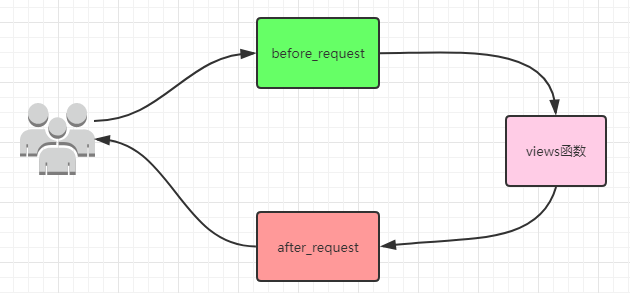
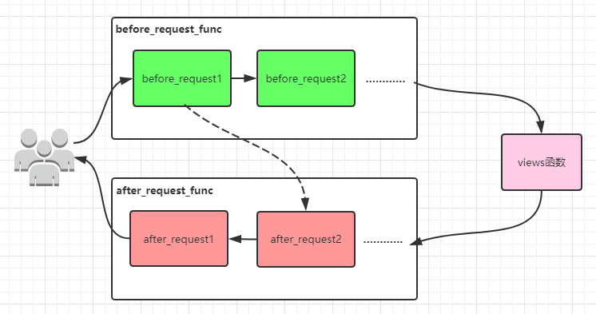

# 1 werkzeug
&nbsp;&nbsp;&nbsp;&nbsp;&nbsp;&nbsp;&nbsp;&nbsp;Werkzeug是一个全面的WSGI Web应用程序库。它最初是作为WSGI应用程序的各种实用程序的简单集合开始的，并且已经成为最先进的WSGI实用程序库之一。
```python
from werkzeug.wrappers import Request, Response
from werkzeug.serving import run_simple

@Request.application
def application(request):
    return Response("Hello, World!")

if __name__ == "__main__":
    |启动一个简单的web服务器，监听localhost:5000端口，并绑定给应用程序application
    run_simple("localhost", 5000, application)
```
Flask依赖werkzeug提供的WSGI套件，来提供服务。
# 2 hello world
下面用flask来实现一个hello world服务器
```python
from flask import Flask

|创建一个flask应用
app = Flask(__name__)


@app.route('/')   |设置url与视图函数的映射
def index():
    return 'hello world!'

if __name__ == '__main__':
    app.run('localhost',8000)   |启动服务
```

# 3 静态文件和模板文件配置
django使用模板语言来渲染页面，flask使用的jinja2来渲染页面的，默认情况下是在templates目录下寻找渲染的html文件，当然它也可以配置应用或站点的静态文件所在的路径。
```python
app = Flask(__name__, template_folder='templates', static_folder='static')
```
> 创建应用的时候，就可以指定上述文件，其中template_folder='templates', static_folder='static'都为默认参数

# 4 用户登录
下面使用flask来实现一个用户登录的小程序，你会发现其中有很多和django类似的地方，需要注意的是，`flask和其他web框架不一样的地方是，它的request并不是通过参数诸如的，而是通过requst类封装的，想要使用就要先导入`
- render_template：类似于django的render函数，进行模板的渲染
- methods：表示视图函数支持的request请求方法，默认情况下仅支持get请求
- request.method：获取请求的方法
- request.form: 获取form表单提交的数据
- redirect：跳转

```python
from flask import Flask, request, render_template, redirect

app = Flask(__name__, template_folder='templates', static_folder='static')

@app.route('/index', methods=['GET', 'POST'])
def index():
    return render_template('index.html')

@app.route('/login', methods=['GET', "POST"])
def login():
    if request.method == 'GET':
        return render_template('login.html')
    if request.method == 'POST':
        user = request.form.get('username')
        password = request.form.get('password')
        if user == 'daxin' and password == '123':
            return redirect('/index')
        return render_template('login.html', msg='密码或用户名错误')

if __name__ == '__main__':
    app.run()
```
# 5 session使用
&nbsp;&nbsp;&nbsp;&nbsp;&nbsp;&nbsp;&nbsp;&nbsp;我们知道有些页面需要登录以后才可以查看，那么就需要用到session了，session在flask中也是以对象的方式提供的，但是如果要使用session，那么还需要`配置一个app.secret_key`，因为flask会使用这个key，对发往client的cookie和session进行加密。
```python
from flask import Flask, request, render_template, redirect, session

app = Flask(__name__, template_folder='templates', static_folder='static')
app.secret_key = 'adsasd23oy48932yqodqoidh'

@app.route('/index', methods=['GET', 'POST'])
def index():
    if session.get('user'):  |获取session
        return render_template('index.html')
    return redirect('/login')

@app.route('/login', methods=['GET', "POST"])
def login():
    if request.method == 'GET':
        return render_template('login.html')
    if request.method == 'POST':
        user = request.form.get('username')
        password = request.form.get('password')
        if user == 'daxin' and password == '123':
            session['user'] = 'daxin'   |设置session
            return redirect('/index')
        return render_template('login.html', msg='密码或用户名错误')

if __name__ == '__main__':
    app.run()
```

## 5.1 基于装饰器的用户认证
如果有很多页面都需要验证，一个个函数去判断比较麻烦，所以这里也可以使用装饰器的方式来进行是否登录的判断。
```python
from flask import Flask, request, render_template, redirect, session

app = Flask(__name__, template_folder='templates', static_folder='static')
app.secret_key = 'adsasd23oy48932yqodqoidh'

def auth(func):
    def wrapper(*args, **kwargs):
        if session.get('user'):
            return func(*args, **kwargs)
        else:
            return redirect('/login')
    return wrapper

@app.route('/index', methods=['GET', 'POST'])
@auth
def index():
    return render_template('index.html')

@app.route('/login', methods=['GET', "POST"])
def login():
    if request.method == 'GET':
        return render_template('login.html')
    if request.method == 'POST':
        user = request.form.get('username')
        password = request.form.get('password')
        if user == 'daxin' and password == '123':
            session['user'] = 'daxin'
            return redirect('/index')
        return render_template('login.html', msg='密码或用户名错误')


if __name__ == '__main__':
    app.run()
```
> 需要注意的是auth必须放在app.route下面才行，否则无法形成url到views函数的映射关系。

多个页面利用装饰器产生的问题：
```python
from flask import Flask, request, render_template, redirect, session

app = Flask(__name__, template_folder='templates', static_folder='static')
app.secret_key = 'adsasd23oy48932yqodqoidh'


def auth(func):
    def wrapper(*args, **kwargs):
        if session.get('user'):
            return func(*args, **kwargs)
        else:
            return redirect('/login')
    return wrapper


@app.route('/order',methods=['GET', 'POST'])
@auth
def order():
    return render_template('order.html')

@app.route('/index', methods=['GET', 'POST'])
@auth
def index():
    return render_template('index.html')

@app.route('/login', methods=['GET', "POST"])
def login():
    if request.method == 'GET':
        return render_template('login.html')
    if request.method == 'POST':
        user = request.form.get('username')
        password = request.form.get('password')
        if user == 'daxin' and password == '123':
            session['user'] = 'daxin'
            return redirect('/index')
        return render_template('login.html', msg='密码或用户名错误')


if __name__ == '__main__':
    app.run()
```
直接运行会提示：`AssertionError: View function mapping is overwriting an existing endpoint function: wrapper`为什么呢？因为@auth等于把下面的函数替换为了wrapper函数，在flask中，同样存在和django相同的通过某些关键字来反推URL的功能，比如reverse，但在flask中，它是通过`函数的名称`（默认）来反推url的，如果函数名称相同，那么将会冲突，这样是不行的，通过以下两个方法可以解决：
1. endpoint参数：修改反推规则
2. functools.wraps()：拷贝包装的函数名称

## 5.2 endpoint
endpoint:用于指定生成的url的名称
```python
from flask import Flask, request, render_template, redirect, session

app = Flask(__name__, template_folder='templates', static_folder='static')
app.secret_key = 'adsasd23oy48932yqodqoidh'

def auth(func):
    def wrapper(*args, **kwargs):
        if session.get('user'):
            return func(*args, **kwargs)
        else:
            return redirect('/login')
    return wrapper

@app.route('/order',methods=['GET', 'POST'],endpoint='order')
@auth
def order():
    return render_template('order.html')

@app.route('/index', methods=['GET', 'POST'])
@auth
def index():
    return render_template('index.html')


@app.route('/login', methods=['GET', "POST"],endpoint='login')
def login():
    if request.method == 'GET':
        return render_template('login.html')
    if request.method == 'POST':
        user = request.form.get('username')
        password = request.form.get('password')
        if user == 'daxin' and password == '123':
            session['user'] = 'daxin'
            return redirect('/index')
        return render_template('login.html', msg='密码或用户名错误')


if __name__ == '__main__':
    app.run()
```
在每个路由系统上添加endpoint关键字来约束反推URL的规则，但在大量视图函数的场景下不太适用。

## 5.3 functools.wraps
functools.wraps装饰器它可以将被包装的函数信息拷贝到新函数中去，这样，我们就可以不用修改flask默认的反推url的规则了。它只需要在我们的装饰器函数中，对内层嵌套函数进行装饰即可。
```python
import functools

def auth(func):
    @functools.wraps(func)
    def wrapper(*args, **kwargs):
        if session.get('user'):
            return func(*args, **kwargs)
        return redirect('/login')
    return wrapper
```
> 在生产上一般会利用中间件来批量处理

# 6 配置基础
config 实际上继承于字典，并且可以像修改字典一样修改它:
```python
app = Flask(__name__)
app.config['DEBUG'] = True
```
给定的配置值会被推送到 Flask 对象中，由于是字典，也可以是用 dict.update() 方法来一次性更新多个键:
```python
app.config.update(
    DEBUG=True,
    SECRET_KEY='...'
)
```
> 更多的配置文件信息 ： https://dormousehole.readthedocs.io/en/latest/config.html#id7
## 6.1 内置的配置值
下列配置值是 Flask 内部使用的:

|key|含义|
---|----|
DEBUG|启用/禁用调试模式
TESTING|启用/禁用测试模式
PROPAGATE_EXCEPTIONS|显式地允许或禁用异常的传播。如果没有设置或显式地设置为 None ，当 TESTING 或 DEBUG 为真时，这个值隐式地为 true.
PRESERVE_CONTEXT_ON_EXCEPTION|默认情况下，如果应用工作在调试模式，请求上下文不会在异常时出栈来允许调试器内省。 这可以通过这个键来禁用。你同样可以用这个设定来强制启用它，即使没有调试执行，这对调试生产应用很有用（但风险也很大）
SECRET_KEY|密钥
SESSION_COOKIE_NAME|会话 cookie 的名称。
SESSION_COOKIE_DOMAIN|会话 cookie 的域。如果不设置这个值，则 cookie 对 SERVER_NAME 的全部子域名有效
SESSION_COOKIE_PATH|会话 cookie 的路径。如果不设置这个值，且没有给 '/' 设置过，则 cookie 对 APPLICATION_ROOT 下的所有路径有效。
SESSION_COOKIE_HTTPONLY|控制 cookie 是否应被设置 httponly 的标志， 默认为 True
SESSION_COOKIE_SECURE|控制 cookie 是否应被设置安全标志，默认为 False
PERMANENT_SESSION_LIFETIME|以 datetime.timedelta 对象控制长期会话的生存时间。从 Flask 0.8 开始，也可以用整数来表示秒。
SESSION_REFRESH_EACH_REQUEST|这个标志控制永久会话如何刷新。如果被设置为 True （这是默认值），每一个请求 cookie 都会被刷新。如果设置为 False ，只有当 cookie 被修改后才会发送一个 set-cookie 的标头。非永久会话不会受到这个配置项的影响 。
USE_X_SENDFILE|启用/禁用 x-sendfile
LOGGER_NAME|日志记录器的名称
SERVER_NAME|服务器名和端口。需要这个选项来支持子域名 （例如： 'myapp.dev:5000' ）。注意 localhost 不支持子域名，所以把这个选项设置为 “localhost” 没有意义。设置 SERVER_NAME 默认会允许在没有请求上下文而仅有应用上下文时生成 URL
APPLICATION_ROOT|如果应用不占用完整的域名或子域名，这个选项可以被设置为应用所在的路径。这个路径也会用于会话 cookie 的路径值。如果直接使用域名，则留作 None
MAX_CONTENT_LENGTH|如果设置为字节数， Flask 会拒绝内容长度大于此值的请求进入，并返回一个 413 状态码
SEND_FILE_MAX_AGE_DEFAULT:|默认缓存控制的最大期限，以秒计，在 flask.Flask.send_static_file() (默认的静态文件处理器)中使用。对于单个文件分别在 Flask 或 Blueprint 上使用 get_send_file_max_age() 来覆盖这个值。默认为 43200（12小时）。
TRAP_HTTP_EXCEPTIONS|如果这个值被设置为 True ，Flask不会执行 HTTP 异常的错误处理，而是像对待其它异常一样， 通过异常栈让它冒泡地抛出。这对于需要找出 HTTP 异常源头的可怕调试情形是有用的。
TRAP_BAD_REQUEST_ERRORS|Werkzeug 处理请求中的特定数据的内部数据结构会抛出同样也是“错误的请求”异常的特殊的 key errors 。同样地，为了保持一致，许多操作可以显式地抛出 BadRequest 异常。因为在调试中，你希望准确地找出异常的原因，这个设置用于在这些情形下调试。如果这个值被设置为 True ，你只会得到常规的回溯。
PREFERRED_URL_SCHEME|生成URL的时候如果没有可用的 URL 模式话将使用这个值。默认为 http
JSON_AS_ASCII|默认情况下 Flask 使用 ascii 编码来序列化对象。如果这个值被设置为 False ， Flask不会将其编码为 ASCII，并且按原样输出，返回它的 unicode 字符串。比如 jsonfiy 会自动地采用 utf-8 来编码它然后才进行传输。
JSON_SORT_KEYS|默认情况下 Flask 按照 JSON 对象的键的顺序来序来序列化它。这样做是为了确保键的顺序不会受到字典的哈希种子的影响，从而返回的值每次都是一致的，不会造成无用的额外 HTTP 缓存。你可以通过修改这个配置的值来覆盖默认的操作。但这是不被推荐的做法因为这个默认的行为可能会给你在性能的代价上带来改善。
JSONIFY_PRETTYPRINT_REGULAR|如果这个配置项被 True （默认值）， 如果不是 XMLHttpRequest 请求的话（由 X-Requested-With 标头控制） json 字符串的返回值会被漂亮地打印出来。

## 6.2 Flask的默认配置
```python
'ENV':                                  None,
'DEBUG':                                None,
'TESTING':                              False,
'PROPAGATE_EXCEPTIONS':                 None,
'PRESERVE_CONTEXT_ON_EXCEPTION':        None,
'SECRET_KEY':                           None,
'PERMANENT_SESSION_LIFETIME':           timedelta(days=31),
'USE_X_SENDFILE':                       False,
'SERVER_NAME':                          None,
'APPLICATION_ROOT':                     '/',
'SESSION_COOKIE_NAME':                  'session',
'SESSION_COOKIE_DOMAIN':                None,
'SESSION_COOKIE_PATH':                  None,
'SESSION_COOKIE_HTTPONLY':              True,
'SESSION_COOKIE_SECURE':                False,
'SESSION_COOKIE_SAMESITE':              None,
'SESSION_REFRESH_EACH_REQUEST':         True,
'MAX_CONTENT_LENGTH':                   None,
'SEND_FILE_MAX_AGE_DEFAULT':            timedelta(hours=12),
'TRAP_BAD_REQUEST_ERRORS':              None,
'TRAP_HTTP_EXCEPTIONS':                 False,
'EXPLAIN_TEMPLATE_LOADING':             False,
'PREFERRED_URL_SCHEME':                 'http',
'JSON_AS_ASCII':                        True,
'JSON_SORT_KEYS':                       True,
'JSONIFY_PRETTYPRINT_REGULAR':          False,
'JSONIFY_MIMETYPE':                     'application/json',
'TEMPLATES_AUTO_RELOAD':                None,
'MAX_COOKIE_SIZE': 4093,
```

## 6.3 最佳实践
一个有意思的模式是在配置中使用类和继承:
```python
class Config(object):
    DEBUG = False
    SECRET_KEY = '123'

class ProdConfig(Config):
    pass

class TestConfig(Config):
    DEBUG = True

class DevConfig(Config):
    DEBUG = True
```
针对不同的环境定义不同的配置文件，而在调用的时候就需要使用app.config.from_object了，比如('configmodule.ProductionConfig')，它接受字符串的格式的路径，来导入类的配置信息。
```python
app = Flask(__name__, template_folder='templates', static_folder='static')
app.secret_key = 'adsasd23oy48932yqodqoidh'
app.config.from_object('settings.Config')   |通过object来调用
print(app.secret_key)  |覆盖前面的同名配置
```

## 6.4 动态加载的思想
我们看到，在flask的配置方法中，我们指定的是一个字符串，而flask就就可以加载对应的类，读取对应的配置文件。这一点非常方便，想一想在如下场景下是否可以使用这种思想？
1. 监控平台的报警
2. 监控平台的监控项

普通来看的话，一般都会每个报警类型来定义一个函数，进行处理，也会为每一个监控项来定义一个收集处理的函数，如果运用这种动态的加载的思想，该怎么做？

下面是目录结构
```bash
flask
├─monitor
│  └─__init__.py
|  └─cpu.py
|  └─memory.py
├─notify
├─run.py 
└─settings.py
```
settings.py的文件如下
```python
monitors = [
    'monitor.cpu.Cpu',
    'monitor.memory.Memory'
]
```
monitor模块的__init__.py文件如下：通过反射以及动态加载，来调用指定的字符串类的方法。
```python
import importlib
import settings

def host():
    if isinstance(settings.monitors, list):
        for item in settings.monitors:
            module, detail = item.rsplit('.', 1)
            m = importlib.import_module(module)
            if hasattr(m, detail):
                cls = getattr(m, detail)
                cls().check()
```
当我们使用run.py来执行的时候
```python
from monitor import host

if __name__ == '__main__':
    host()
```
hosts方法，通过读取settings.py中，指定的监控内容来动态的加载并启动监控，这样做的好处时，如果需要添加其他健康项，那只需要编写对应的类并实现check方法，然后在配置文件中添加即可。非常便于扩展。


# 7 路由系统

## 7.1 路由系统的本质
flask是怎么通过装饰器来完成路由的映射的呢，观察flask的原码，我们知道
```python
def route(self, rule, **options):
    def decorator(f):
        endpoint = options.pop('endpoint', None)
        self.add_url_rule(rule, endpoint, f, **options)
        return f
    return decorator
```
实际上，在flask内部，它是通过`add_url_rule`来给app添加路由信息的，所以我们也可以不使用装饰器，直接使用add_url_rule来添加路由映射
```python
def logout():
    del session['user']
    return redirect('/login')

app.add_url_rule('/logout', None, logout)
```

## 7.2 FBV和CBV
我们之前写的都是FBV(function base view)，当然flask和django一样，也支持CBV的方式
```python
from flask import Flask, views

app = Flask(__name__, template_folder='templates', static_folder='static')

class TestView(views.MethodView):   |最好从views.MethodView继承。
    methods = ['get', 'post']

    def get(self):
        print('get 请求')
        return 'get hello world'

    def post(self):
        print('post 请求')
        return 'Post hello world'

app.add_url_rule('/test', view_func=TestView.as_view(name='test'))  |这里的name，和endpoint 是一样的效果

if __name__ == '__main__':
    app.run()
```
views.MethodView使用dispath方法，通过反射可以让我们更直观的定义get/post方法，如果从views.View来继承，那么我们只能使用`dispatch_request`方法来接受处理请求
```python
class NewView(views.View):
    methods = ['get','post']

    def dispatch_request(self):
        print('请求进来了')
        return 'ok'

app.add_url_rule('/new', view_func=NewView.as_view(name='new'))
```
如果要使用装饰器添加认证，那么就需要使用`decorators属性`来指定了，比如前面的auth认证
```python
class NewView(views.View):
    methods = ['get','post']
    decorators = [auth,]

    def dispatch_request(self):
        print('请求进来了')
        return 'ok'

app.add_url_rule('/new', view_func=NewView.as_view(name='new'))
```
> CBV比较适合restful风格的API接口编写，因为可以根据不同的请求类型，来访问不同的函数，不用像FBV那样，需要额外判断request.method的类型，来做出相应的逻辑


# 8 flask中的before/after
flask中提供了，两个装饰器用于对进来的请求和返回的请求进行统一处理，和django中的中间件是一个含义。
1. 在每次请求之前， before_request()函数都会被调用。如果其中一个函数返回了一个值，则其他函数将被跳过。返回值被视为响应，并且视图 函数不会被调用。
2. 如果 before_request() 函数没有返回响应，则调用匹配路由的 视图函数并返回响应。
3. 视图的返回值被转换为实际的响应对象并传递给 after_request()函数。每个函数都返回一个修改过的或新的响应对象。
4. 返回响应后，将弹出情境，该情境调用 teardown_request() 和 teardown_appcontext()函数。即使在上面任何一处引发了未处 理的异常，也会调用这些函数。


```python
from flask import *

app = Flask(__name__)


@app.route('/index')
def index():
    return 'index'


@app.before_request
def before():
    return 'Gun'


@app.after_request
def after(response):
    return Response('maliude')


if __name__ == '__main__':
    app.run()
```
上面代码：
- 先经过before，由于return了非None，则进入after阶段
- after又改写了response，所以最后会显示'maliude'

当然before和after都可以有多个，他们的顺序如下：


需要注意的是：
- before_request和after_request都可以有多个，按照定义的先后顺序的。
- before_request_funcs是一个列表存放所有的before_request函数
- after_request_funcs是一个列表存放所有的after_request的列表(内部使用了reverse进行反转)
- 当任意一个before_request返回了非None，那么将会从最后一个after_request函数开始执行

# 9 请求和响应相关
下面是部分请求的方法

|名称|含义|
---|----|
|request.method|请求的方法|
|request.args|get请求传递的参数|
|request.form|post请求传递的参数|
|request.values|包含get/post请求传递的参数|
|request.cookies|cookies信息|
|request.headers|http Header请求头信息|
|request.path|HTTP path信息|
|request.full_path|包含查询字符串的path信息|
|request.script_root|
|request.url|完成的请求的url，包含查询字符串|
|request.base_url|完成的请求的url|
|request.url_root|不包含二级目录的URL，主机URL|
|request.host_url|不包含二级目录的URL，主机URL|
|request.host|host:port|
|request.files|上传的文件|


下面是部分响应的方式

|方式|含义|
|---|----|
|return "字符串"|返回一个字符串|
|return render_template('html模板路径',**{})|返回渲染后的HTML文本信息
|return redirect('/index.html')|跳转|

## 9.1 上传及保存文件
上传文件需要用到request.files属性，它里面保存了所有上传的文件对象。
```python
@app.route('/upload',methods=['get','post'])
def upload():
    print(request.files)  # ImmutableMultiDict([('upload_file', <FileStorage: 'footer.png' ('image/png')>)])
    file_obj = request.files['upload_file']
    print(type(file_obj))  # <class 'werkzeug.datastructures.FileStorage'>
    file_obj.save(file_obj.filename)  # 保存文件
```
注意：
html中，使用form上传文件时，那么需要设置form的`enctype="multipart/form-data"`
下面是一个完整的例子：


|response = make_response(render_template('index.html'))
|response是flask.wrappers.Response类型
|response.delete_cookie('key')
|response.set_cookie('key', 'value')
|response.headers['X-Something'] = 'A value'
|return response

        |响应相关信息