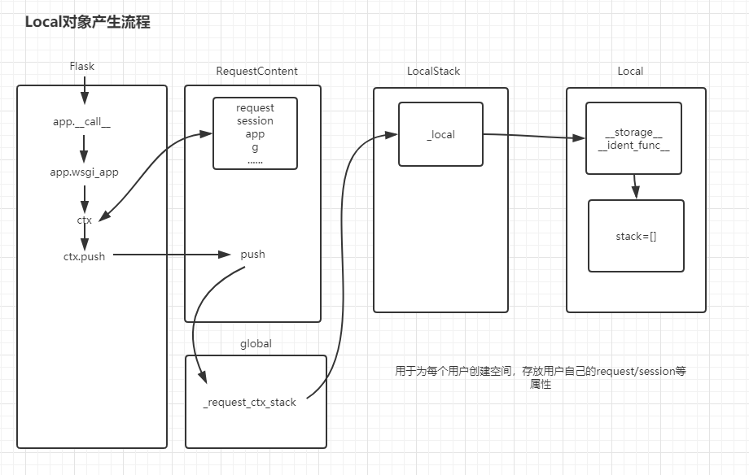
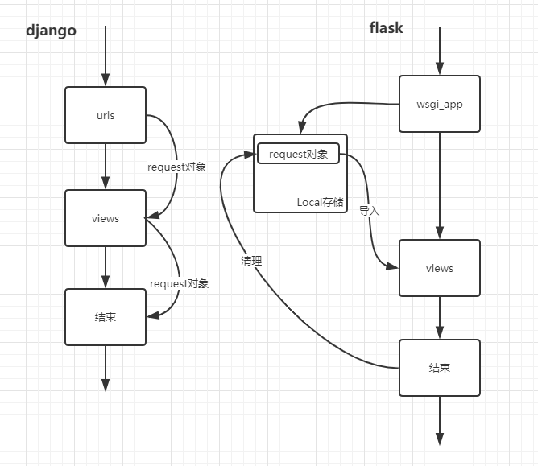

<font size=5 face='微软雅黑'>__文章目录__</font>
<!-- TOC -->

- [1 上下文管理](#1-上下文管理)
    - [1.1 threading.local](#11-threadinglocal)
    - [1.2 partial偏函数](#12-partial偏函数)
    - [1.3 __setattr__ 魔术方法](#13-__setattr__-魔术方法)
    - [1.4 localproxy代理](#14-localproxy代理)
    - [1.5 真实原码流程](#15-真实原码流程)
    - [1.6 django传参与flask的对比](#16-django传参与flask的对比)
    - [1.7 总结](#17-总结)
- [2 多app应用](#2-多app应用)

<!-- /TOC -->
# 1 上下文管理
&nbsp;&nbsp;&nbsp;&nbsp;&nbsp;&nbsp;&nbsp;&nbsp;flask的上下文管理非常巧妙，先来说一下前导知识，flask内部实现的方式和threading.local很像，但其内部做了精妙的设置，如果支持协程(greenlet),那么还会使用协程的方式实现。

## 1.1 threading.local
&nbsp;&nbsp;&nbsp;&nbsp;&nbsp;&nbsp;&nbsp;&nbsp;在多线程环境下，每个线程都有自己的数据。一个线程使用自己的局部变量比使用全局变量好，因为局部变量只有线程自己能看见，不会影响其他线程，而全局变量的修改必须加锁(锁住资源，否则一旦在多个线程中修改，会产生无法预期的结果)。但是局部变量也有问题，就是在函数调用的时候，每次都要传递，感觉很麻烦。  
&nbsp;&nbsp;&nbsp;&nbsp;&nbsp;&nbsp;&nbsp;&nbsp;在主进程中创建ThreadLocal对象，每个Thread对它都可以读写属性，但互不影响。你可以把ThreadLocal看成全局变量，但每个属性都是线程的局部变量，可以任意读写而互不干扰，也不用管理锁的问题，ThreadLocal内部会处理。即：一个ThreadLocal变量虽然是全局变量，但每个线程都只能读写自己线程的独立副本，互不干扰。ThreadLocal解决了参数在一个线程中各个函数之间互相传递的问题。
```python
import threading

local = threading.local()
local.x = 200

def worker():
    for i in range(100):
        local.x += 1
    print('{} {}'.format(threading.current_thread().name,local.x))

for i in range(10):
    t = threading.Thread(target=worker)
    t.start()

print(local.x)
```
上面的执行结果是互补不干扰的。为什么local对象可以安全使用？  
&nbsp;&nbsp;&nbsp;&nbsp;&nbsp;&nbsp;&nbsp;&nbsp;通过分析原码，我们看到：在主线程中创建后local后，threading.local会为实例初始化一个字典管理器，创建一个大字典，用于嵌套每一个线程创建的它自己线程相关的字典。当开启了新的线程时，查找local对象的某个属性时，首先会被__getattribute__方法捕获，在内部又调用了包装为上下文管理器的_path(打补丁)，首先它通过local初始化时构建的key(prefix+id(当前线程))来查找它嵌套的字典。如果不存在说明线程第一次运行，为它初始化一个__dict__属性字典，替换local的属性，如果存在，则把字典管理器拿出来，直接替换local的属性。所以在不同线程内，每个local对象在调用时都会切换到它对应的__dict__上。线程执行完毕后，回到主线程，在_path中重新切换到主线程的小字典，然后继续把local对象的__dict__进行切换。  
&nbsp;&nbsp;&nbsp;&nbsp;&nbsp;&nbsp;&nbsp;&nbsp;一句话总结：__`运行时，threading.local实例处在不同的线程中，就从大字典中找到当前线程相关键值对中的字典，覆盖threading.local实例的 __dict__ 。这样就可以在不同的线程中，安全地使用线程独有的数据，做到了线程间数据隔离，如同本地变量一样安全。`__

简单的模拟thread_local的实现：
```python
import threading
import time


class Mylocal(object):
    def __init__(self):
        self.storage = {}

    def __getitem__(self, item):
        process_ident = threading.get_ident()
        return self.storage[process_ident][item]

    def __setitem__(self, key, value):
        process_ident = threading.get_ident()
        if self.storage.get(process_ident, None):
            self.storage[process_ident][key] = value
        else:
            self.storage[process_ident] = {key: value}

data = Mylocal()

def sum():
    data['value'] = 1
    while True:
        if data['value'] < 10:
            data['value'] += 1
            time.sleep(1)
            print(data['value'])
        else:
            print(data['value'])
            break

if __name__ == '__main__':
    threads = []
    for i in range(10):
        t = threading.Thread(target=sum, name=i)
        threads.append(t)
        t.start()

    for thread in threads:
        thread.join()

    print(data.storage)  # {18900: {'value': 10}, 22140: {'value': 10}, 25816: {'value': 10}, 17784: {'value': 10}, 20588: {'value': 10}, 3744: {'value': 10}, 10448: {'value': 10}, 15896: {'value': 10}, 18016: {'value': 10}, 16824: {'value': 10}}
```

## 1.2 partial偏函数
&nbsp;&nbsp;&nbsp;&nbsp;&nbsp;&nbsp;&nbsp;&nbsp;funtools模块中的partial方法就是将函数的`部分参数固定下来`，相当于为部分的参数添加了一个固定的默认值，形成一个`新的函数并返回`。从partial方法返回的函数，是对原函数的封装，是一个全新的函数。它的一般结构为：

```python
functools.partial(func, *args, **keywords) - 返回一个新的被partial函数包装过的func，并带有默认值的新函数
```

下面是一个基本的例子
```python
In [27]: import functools
    ...: import inspect
    ...:
    ...:
    ...: def add(x, y):
    ...:     return x + y
    ...:
    ...:
    ...: new_add = functools.partial(add,1)
    ...: print(new_add)
    ...:
functools.partial(<function add at 0x000002798C757840>, 1)

In [28]:
In [28]: new_add(1,2)
---------------------------------------------------------------------------
TypeError                                 Traceback (most recent call last)
<ipython-input-28-2d6520b7602a> in <module>
----> 1 new_add(1,2)

TypeError: add() takes 2 positional arguments but 3 were given

In [29]: new_add(1)
Out[29]: 2
```
- 由于我们包装了函数add，并指定了一个默认参数1，这个参数会按照位置参数，当作默认值赋给x了
- 所以当我们再次调用new_add,只需要传入y的值就行了。
- 如果再传递两个，那么连同包装前传入的1，一起传给add函数，而add函数只接受两个参数，所以会报异常。

> 获取一个函数的参数列表，可以使用前面学习的inspect模块
```python
In [30]: inspect.signature(new_add)
Out[30]: <Signature (y)>
```
查看new_add的签名信息，发现，它的确只需要传入一个y就可以了。  

## 1.3 __setattr__ 魔术方法
上面我们举的类threading.Local的写法，用到了__setitem__，并没有使用__setattr__，为的是避免一个坑，现在我们来说看一下是为什么。

```python
from threading import get_ident


class Local(object):

    def __init__(self):
        self.__storage__ = {}
        
    def __setattr__(self, key, value):
        ident = get_ident()
        try:
            self.__storage__[ident][key] = value
        except KeyError as e:
            self.__storage__[ident] = {key: value}

    def __getattr__(self, item):
        ident = get_ident()
        return self.__storage__[ident].get(item)
```
这个类会引发的问题：
1. 类在实例化的时候会执行 self.__storage__ = {}
2. 使用点来设置对象的属性的的时候，都会触发__setattr__方法
3. 然而在__setattr__内部又通过.设置了__storage__属性
4. 产生递归不说，__storage__ 属性还没有创建。

如何解决呢？只需要成功创建__storage__即可，那么该如何创建呢，自己不能，那就掉父类解决
```python
# self.__storage__ = {} 
	|
	| 
object.__setattr__(self,'__storage__',{})
```

## 1.4 localproxy代理
上面的Local对象仅仅是存储用户数据，那么对于操作Local对象的方法集，我们可以抽象出一个proxy(代理类)，来专门用于操作。

```python
from threading import get_ident
import functools


class Local(object):

    def __init__(self):
        object.__setattr__(self, '__storage__', {})
        # self.__storage__ = {}

    def __setattr__(self, key, value):
        ident = get_ident()
        try:
            self.__storage__[ident][key] = value
        except KeyError as e:
            self.__storage__[ident] = {key: value}

    def __getattr__(self, item):
        ident = get_ident()
        try:
            return self.__storage__[ident].get(item)
        except:
            return None

# 操作Local类
class LocalStack(object):
    def __init__(self):
        self._local = Local()

    def push(self, data):
        stack = self._local.stack
        if not stack:
            self._local.stack = []
        self._local.stack.append(data)

# 存储的对象信息
class RequestContent(object):
    def __init__(self):
        self.session = 'session'
        self.request = 'request'


a = LocalStack()
a.push(RequestContent())


# 操作方法
def _get_req_object(name):
    ident = get_ident()
    obj = a._local.__storage__.get(ident)['stack'][0]
    return getattr(obj, name)


# 操作接口
class LocalProxy(object):
    def __init__(self, func):
        self.func = func

    def get_obj(self):
        return self.func()

# 通过偏函数固定属性
session = LocalProxy(functools.partial(_get_req_object,'session'))
request = LocalProxy(functools.partial(_get_req_object,'request'))

print(session.get_obj())
print(request.get_obj())
```

## 1.5 真实原码流程
基本上综合了上面的所有前导知识，我们看来一下flask的原码流程，代码我就不贴了，下面是根据代码绘制的逻辑图。



## 1.6 django传参与flask的对比
这里主要说明的是传参方式：
- django的request/session等用户信息都是封装在request对象中，通过参数传递的
- flask的request/session，是请求到来时，先一步取出，然后放在用户相关的空间中，需要的话就可以去取

他们俩是不同的设计模式；（简图对比）



## 1.7 总结
flask中存在两个上下文：(早期都放在1个上下文中)
- 请求上下文：request/session
- app上下文： app,g

关于g，它的主要作用是在`一个请求周期内`帮我们传递当前请求的相关的值信息。
```python
@app.before_request
def check():
    g.permisstion_list = ['add', 'update']


@app.route('/index', methods=['GET', 'POST'])
def index():
    print('-->', g.permisstion_list)
    if session.get('user'):
        return render_template('index.html')
    return redirect('/login')
```
> g就是一个请求周期内的`全局变量`

# 2 多app应用
老版本DispatcherMiddleware存放在werkzeug.wsgi中，新版本已经移至werkzeug.middleware.dispatcher中

```python
from flask import Flask
# from werkzeug.wsgi import DispatcherMiddleware
from werkzeug.middleware.dispatcher import DispatcherMiddleware
from werkzeug.serving import run_simple

app01 = Flask('app01')
app02 = Flask('app02')
app03 = Flask('app03')


@app01.route('/')
def index():
    return 'app01 index'


@app02.route('/')
def index():
    return 'app02 index'


@app03.route('/')
def index():
    return 'app03 index'


dm = DispatcherMiddleware(
    app01,
    {'/app02': app02,
     '/app03': app03}
)

if __name__ == '__main__':
    run_simple('localhost', 5000, dm)
```
通过DispatcherMiddleware来组织app的结构。
- 当直接访问/时，匹配的是app01
- 当前缀包含app02时，就匹配给app02
- 当前缀包含app03时，就匹配给app03

> 根据前缀的不同来分发路由，和蓝图有异曲同工之处