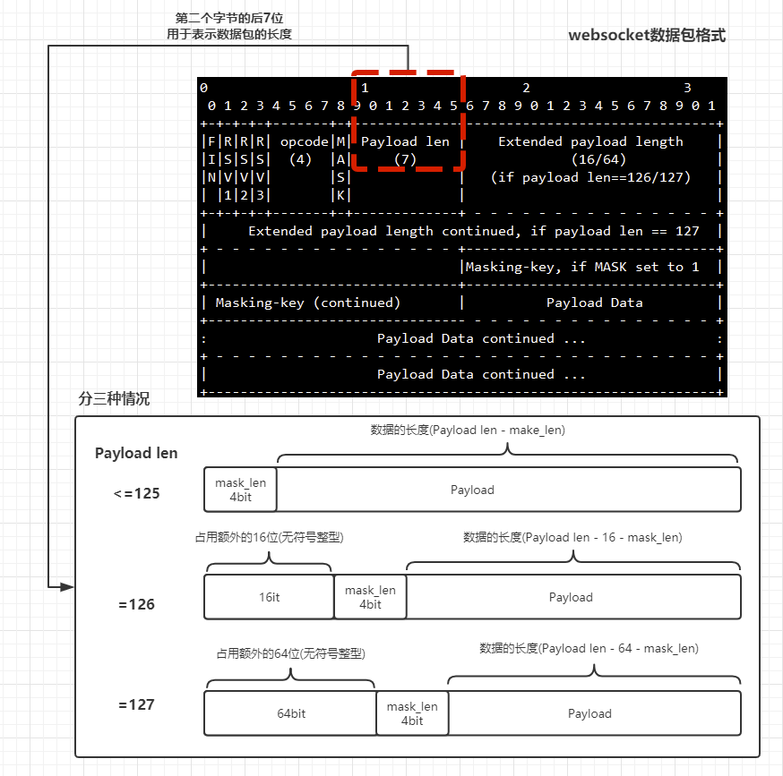

<font size=5 face='微软雅黑'>__文章目录__</font>
<!-- TOC -->

- [1 websocket](#1-websocket)
- [2 协议](#2-协议)
- [3 websocket协议简单实现](#3-websocket协议简单实现)
    - [3.1 server与client](#31-server与client)
    - [2.2 加密与握手](#22-加密与握手)
    - [2.3 websocket数据包格式](#23-websocket数据包格式)
    - [2.4 解包](#24-解包)
    - [2.5 交互](#25-交互)
    - [2.6 完整的代码](#26-完整的代码)
- [3 利用flask提供websocket服务](#3-利用flask提供websocket服务)

<!-- /TOC -->
# 1 websocket
&nbsp;&nbsp;&nbsp;&nbsp;&nbsp;&nbsp;&nbsp;&nbsp;WebSocket是HTML5新增的协议，它的目的是在浏览器和服务器之间建立一个不受限的双向通信的通道，比如说，服务器可以在任意时刻发送消息给浏览器。为什么传统的HTTP协议不能做到WebSocket实现的功能？这是因为HTTP协议是一个`请求-响应`协议，请求必须先由浏览器发给服务器，服务器才能响应这个请求，再把数据发送给浏览器。换句话说，浏览器不主动请求，服务器是没法主动发数据给浏览器的。这样一来，要在浏览器中搞一个实时聊天，或者在线多人游戏的话就没法实现了，只能借助Flash这些插件。也有人说，HTTP协议其实也能实现啊，比如用轮询或者Comet(长轮询)。
- `轮询`是指浏览器通过JavaScript启动一个定时器，然后以固定的间隔给服务器发请求，询问服务器有没有新消息。这个机制的缺点一是实时性不够，二是频繁的请求会给服务器带来极大的压力。
- `Comet(长轮询)`本质上也是轮询，但是在没有消息的情况下，服务器先拖一段时间，等到有消息了再回复。这个机制暂时地解决了实时性问题，但是它带来了新的问题：以多线程模式运行的服务器会让大部分线程大部分时间都处于挂起状态，极大地浪费服务器资源。另外，一个HTTP连接在长时间没有数据传输的情况下，链路上的任何一个网关都可能关闭这个连接，而网关是我们不可控的，这就要求Comet连接必须定期发一些ping数据表示连接'正常工作'。  

以上两种机制都治标不治本，所以，HTML5推出了WebSocket标准，让浏览器和服务器之间可以建立无限制的全双工通信，任何一方都可以主动发消息给对方。

# 2 协议
WebSocket协议是基于TCP的一种新的协议。WebSocket最初在HTML5规范中被引用为TCP连接，作为基于TCP的套接字API的占位符。它实现了浏览器与服务器全双工(full-duplex)通信。其本质是保持TCP连接，在浏览器和服务端通过Socket进行通信。
它的主要特点有：
- 数据格式：和html的结构类似
- 连接：创建连接后不断开
- 校验：第一次连接时，需要进行校验(魔法字符串)
- 加密：每次发送/接受的数据都需要一个加密解密的过程

# 3 websocket协议简单实现
下面我们来一步一步的用代码实现websocket协议的数据交互，基本交互逻辑如下：
1. 客户端发起websocket连接
2. 服务段根据WebSocket-Key与magic_string通过加密计算出结果，发送给客户端。
3. 客户端验证通过连接建立完毕
4. 进入收发数据阶段
5. 客户端加密发送数据
6. 服务段解密接受数据，然后再加密返回数据
7. 客户端解密接受数据，然后循环5-7这个过程

## 3.1 server与client
首先编写一个socket server，利用浏览器发送websocket协议的数据，看看发送的到底是什么东西

```python
import socket

server_ip = ('127.0.0.1', 8080)
server = socket.socket()
server.bind(server_ip)
server.listen(5)

sock, client_addr = server.accept()

while True:
    data = sock.recv(4 * 1024, 0)
    print(data)

```

客户端使用js，来发送一个websocket请求，它的代码如下

```java
<script type="application/javascript">
    var socket = new WebSocket("ws://127.0.0.1:8080"); /* socket server的地址 */
</script>
```

这样页面在加载的时候，就会发起一个websocket协议的请求。服务端收到的数据格式为

```bash
b'GET / HTTP/1.1\r\n
Host: 127.0.0.1:8080\r\n
Connection: Upgrade\r\n
Pragma: no-cache\r\n
Cache-Control: no-cache\r\n
Upgrade: websocket\r\n
Origin: http://localhost:63342\r\n
Sec-WebSocket-Version: 13\r\n
User-Agent: Mozilla/5.0 (Windows NT 10.0; WOW64) AppleWebKit/537.36 (KHTML, like Gecko) Chrome/72.0.3626.121 Safari/537.36\r\nAccept-Encoding: gzip, deflate, br\r\n
Accept-Language: zh-CN,zh;q=0.9,en-US;q=0.8,en;q=0.7\r\n
Cookie: csrftoken=NpT8aNHLFDMaxdtPS6dMkaxkcH9mt3JZaPzxdgGwwDGrusH6TI18yq29Za5DZLTx\r\n
Sec-WebSocket-Key: 6Ahi+8kfm0TBVFrFRshROw==\r\n
Sec-WebSocket-Extensions: permessage-deflate; client_max_window_bits\r\n
\r\n'
```
重要的头部信息：
- Connection: Upgrade：表示要升级协议
- Upgrade: websocket：表示要升级到 websocket 协议。
- Sec-WebSocket-Key：与后面服务端响应首部的Sec-WebSocket-Accept是配套的，提供基本的防护，比如恶意的连接，或者无意的连接。

数据格式和html的报文格式相同，最主要的其实是`Sec-WebSocket-Key`，它就是客户端发送的用于握手的密钥串

## 2.2 加密与握手
websocket的加密与握手，主要分为三个步骤：
- 获取客户端传递的Sec-WebSocket-Key
- 组合Sec-WebSocket-Key与magic_string成新的字符串，然后使用sha1,加密后，然后使用base64继续加密。
- 通过websocket特有的HTTP头部信息返回加密后的数据

> magic_string是websocket协议规定的一套指定字符串，`258EAFA5-E914-47DA-95CA-C5AB0DC85B11`,必须使用它与Sec-WebSocket-Key进行拼接才可以，因为客户端会通过magic_string同样做一遍加密运算，并将结果与服务段返回的信息进行比对，如果相同，表示服务端支持websocket协议，并建立连接。
将的得到的秘闻信息进行返回

```python
import base64
import socket
import hashlib

# 用于首次发送信息时，将header转换为字典，便于提取数据
def get_header(data):
    res = {}
    request_data = data.decode('utf-8')
    header, body = request_data.split('\r\n\r\n')
    header_list = header.split('\r\n')
    for i in range(0, len(header_list)):
        if i == 0:
            if len(header_list[i].split()) == 3:
                res['method'], res['url'], res['protocol'] = header_list[i].split()
        else:
            key, value = header_list[i].split(':', 1)
            res[key] = value.strip()
    return res

server_ip = ('127.0.0.1', 8080)
server = socket.socket()
server.bind(server_ip)
server.listen(5)

sock, client_addr = server.accept()
data = sock.recv(4 * 1024, 0)
header = get_header(data)

# magic_string 及加密方法
magic_string = '258EAFA5-E914-47DA-95CA-C5AB0DC85B11'   # 协议规定的值,无法修改
res_str = header['Sec-WebSocket-Key'] + magic_string
res_data = base64.b64encode(hashlib.sha1(res_str.encode('utf-8')).digest())  # 这里需要使用二进制，十六进制无法握手

# 固定的头部信息
response_tpl = "HTTP/1.1 101 Switching Protocols\r\n" \
               "Upgrade:websocket\r\n" \
               "Connection: Upgrade\r\n" \
               "Sec-WebSocket-Accept: {}\r\n" \  
               "WebSocket-Location: ws://{}:{}\r\n\r\n".format(res_data.decode('utf-8'), *server_ip)

print(response_tpl)
sock.sendall(response_tpl.encode('utf-8'))

```
Sec-WebSocket-Accept表示加密后的信息。

## 2.3 websocket数据包格式
下面是websocket的数据包的格式，其中第二个字节的后7位表示数据包信息的大小，但也分三种情况：
1. 当Payload len等于127时，需要额外占用64位(8个字节)
2. 当Payload len等于126时，需要额外占用16位(2个字节)
3. 当Payload len小于等于125时，不需要额外占位

如果mask bit设置了，那么还需要额外的4位用于存放mask key(默认是设置的)  



解密时需要遵循websocket协议的规定格式，否则无法解密出数据格式。

## 2.4 解包
知道了数据包的长度，那么我们就可以通过位运算来解析websocket包了
```python
while True:
	info = conn.recv(8096)
	if not info:break
    payload_len = info[1] & 127   # 通过位运算得到payload_len长度
    if payload_len == 126:
        extend_payload_len = info[2:4]
        mask = info[4:8]
        decoded = info[8:]
    elif payload_len == 127:
        extend_payload_len = info[2:10]
        mask = info[10:14]
        decoded = info[14:]
    else:
        extend_payload_len = None
        mask = info[2:6]
        decoded = info[6:]

    bytes_list = bytearray()
    for i in range(len(decoded)):
        chunk = decoded[i] ^ mask[i % 4]
        bytes_list.append(chunk)
     print(bytes_list.decode('utf-8'))
```

## 2.5 交互
数据包是解析出来了，想要回复，那么还需要构建websocket应答包才行
```python
def send_msg(conn, msg_bytes):
    import struct
 
    token = b"\x81"
    length = len(msg_bytes)
    if length < 126:
        token += struct.pack("B", length)
    elif length <= 0xFFFF:
        token += struct.pack("!BH", 126, length)
    else:
        token += struct.pack("!BQ", 127, length)
 
    msg = token + msg_bytes
    conn.send(msg)
    return True
```
同样是也根据Payload len来构建，那么客户端如何接受呢？(仅为了理解过程)
```java
<script type="application/javascript">
    var socket = new WebSocket("ws://127.0.0.1:8080");
    socket.onmessage = function (ev) {   /* ev.data就是返回的数据 */
        console.log(ev.data)
    }
</script>
```

## 2.6 完整的代码
```python
import base64
import socket
import hashlib

# 将header转换成字典
def get_header(data):
    res = {}
    request_data = data.decode('utf-8')
    header, body = request_data.split('\r\n\r\n')
    header_list = header.split('\r\n')
    for i in range(0, len(header_list)):
        if i == 0:
            if len(header_list[i].split()) == 3:
                res['method'], res['url'], res['protocol'] = header_list[i].split()
        else:
            key, value = header_list[i].split(':', 1)
            res[key] = value.strip()
    return res

# 发送数据时构建websocket包
def send_msg(conn, msg_bytes):
    import struct

    token = b"\x81"
    length = len(msg_bytes)
    if length < 126:
        token += struct.pack("B", length)
    elif length <= 0xFFFF:
        token += struct.pack("!BH", 126, length)
    else:
        token += struct.pack("!BQ", 127, length)

    msg = token + msg_bytes
    conn.send(msg)
    return True


server_ip = ('127.0.0.1', 8080)
server = socket.socket()
server.bind(server_ip)
server.listen(5)

sock, client_addr = server.accept()
data = sock.recv(4 * 1024, 0)
header = get_header(data)

# magic_string 及加密
magic_string = '258EAFA5-E914-47DA-95CA-C5AB0DC85B11'
res_str = header['Sec-WebSocket-Key'] + magic_string
print()
res_data = base64.b64encode(hashlib.sha1(res_str.encode('utf-8')).digest())

# 固定的头部信息
response_tpl = "HTTP/1.1 101 Switching Protocols\r\n" \
               "Upgrade:websocket\r\n" \
               "Connection: Upgrade\r\n" \
               "Sec-WebSocket-Accept: {}\r\n" \
               "WebSocket-Location: ws://{}:{}\r\n\r\n".format(res_data.decode('utf-8'), *server_ip)
# 发送握手信息
sock.sendall(response_tpl.encode('utf-8'))


# 收发数据阶段
while True:
    info = sock.recv(8096)
    if not info: break
    payload_len = info[1] & 127  # 通过位运算得到payload_len长度
    if payload_len == 126:
        extend_payload_len = info[2:4]
        mask = info[4:8]
        decoded = info[8:]
    elif payload_len == 127:
        extend_payload_len = info[2:10]
        mask = info[10:14]
        decoded = info[14:]
    else:
        extend_payload_len = None
        mask = info[2:6]
        decoded = info[6:]

    bytes_list = bytearray()
    for i in range(len(decoded)):
        chunk = decoded[i] ^ mask[i % 4]
        bytes_list.append(chunk)
    send_msg(sock, bytes_list.upper())
```

# 3 利用flask提供websocket服务
flask使用的werkzeug是无法解析websocket协议的，所以如果要使用flask来处理websocket请求，需要更换wsgi，这里使用`gevent-websocket`。使用前需要先安装

```python
pip install gevent-websocket 
```

gevent-websocket主要提供了两个工具类
- `geventwebsocket.handler.WebSocketHandler`：处理websocket的引擎
- `gevent.pywsgi.WSGIServer`：wsgi，可以同时处理http请求和websocket请求

使用方式：
```python
http_server = WSGIServer(('0.0.0.0', 5000), app, handler_class=WebSocketHandler)  # 绑定监听地址，应用，处理请求的类
http_server.serve_forever()   # 启动服务
```

如果客户端使用websocket协议请求时，WebSocketHandler会帮我们处理，并封装在request对象的`wsgi.websocket`中，如果我们通过request['wsgi.websocket']获取到None，那么表示当前请求非websocket请求，否则就是websocket的连接对象。我们可以通过这个对象与客户端进行收发数据。
- ws_obj.reveice()：接受数据
- ws_obj.send(): 发送数据

通过websocket实现在线投票显示代码：
```python
import json
import uuid

from flask import Flask, request, render_template, session, redirect, jsonify
from gevent.pywsgi import WSGIServer
from geventwebsocket.handler import WebSocketHandler

app = Flask(__name__)
app.secret_key = 'asas1212asa'
USER_LIST = {
    '1': {'name': '宝哥', 'count': 0},
    '2': {'name': '史哥', 'count': 0},
    '3': {'name': '可欣', 'count': 0}
}

CLIENT_LIST = {}


@app.before_request
def auth():
    if request.path == '/login' or request.path == '/alert':
        return None
    if not session.get('user_id'):
        return redirect('/login')


@app.route('/login', methods=['get', 'post'])
def login():
    if request.method == 'GET':
        return render_template('login.html')
    else:
        user_id = str(uuid.uuid4())
        session['user_id'] = user_id
        return redirect('/index')


@app.route('/index')
def index():
    return render_template('index.html', user_list=USER_LIST)


@app.route('/message')
def message():
    res = {'type': 'vote', 'data': None}
    ws = request.environ.get('wsgi.websocket')
    if not ws:
        return '请使用WebSocket协议访问'
    user = session.get('user_id')
    CLIENT_LIST[user] = ws
    while True:
        user_id = ws.receive()
        if not user_id:
            del CLIENT_LIST[user]
            break
        old_count = USER_LIST[user_id]['count']
        new_count = old_count + 1
        USER_LIST[user_id]['count'] = new_count
        res['data'] = {'user_id': user_id, 'count': new_count}
        for ws in CLIENT_LIST.values():
            ws.send(json.dumps(res))
    return 'close'


@app.route('/alert')
def alert():
    ret = {'type': 'alert'}
    for ws in CLIENT_LIST.values():
        ws.send(json.dumps(ret))
    return 'ok'


if __name__ == '__main__':
    server_ip = ('172.16.104.139', 8080)
    http_server = WSGIServer(server_ip, app, handler_class=WebSocketHandler)
    http_server.serve_forever()

```

前端代码：
```python
<!DOCTYPE html>
<html lang="en">
<head>
    <meta charset="UTF-8">
    <title>基于websocket投票系统</title>
</head>
<body>

<h1>西三旗最帅的男人</h1>
<ul>
    
        <li style="margin-top: 10px" id="user_{{ id }}">候选人：{{ user.name }} - 票数：<span> {{ user.count }}</span>
            <button onclick="vote('{{ id }}')">点击投票</button>
        </li>
    
</ul>

<h2>当前在线用户</h2>
<ul id="client">
    
        <li> {{ client }}</li>
    
</ul>


<script src="{{ url_for('static',filename='jquery-3.3.1.min.js') }}"></script>
<script>
    var socket = new WebSocket('ws://172.16.104.139:8080/message');

    socket.onmessage = function (ev) {
        var res = JSON.parse(ev.data);
        if (res.type == 'vote') {
            var liid = '#user_' + res.data.user_id;
            $(liid).find('span').text(res.data.count);
        } else {
            alert('弹窗走一波......')
        }

    };

    function vote(user_id) {
        socket.send(user_id)
    }
</script>

</body>
</html>
```


